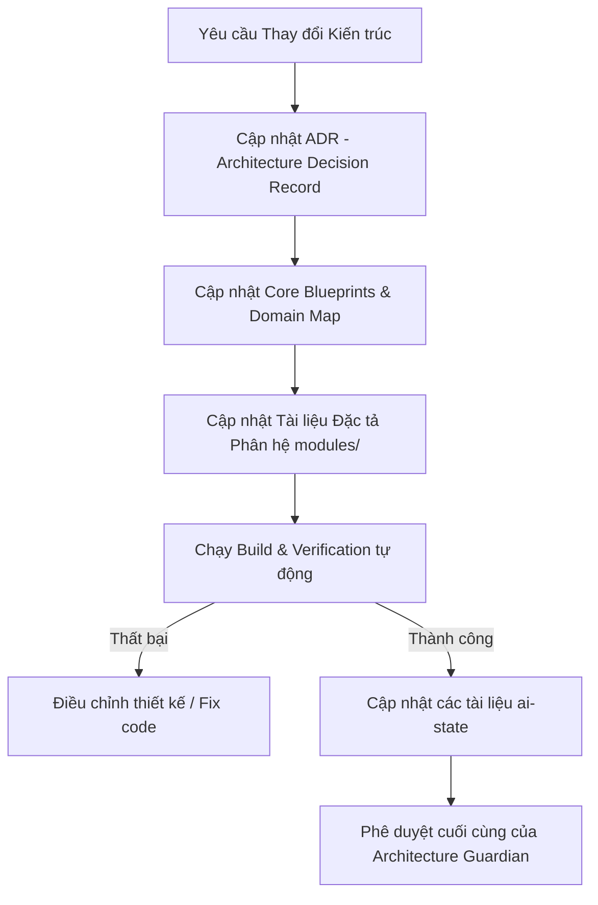

# Cẩm Nang Hướng Dẫn Enterprise Knowledge Base (Human Developers)

Tài liệu này đóng vai trò là cẩm nang chính thức hướng dẫn cách quản lý, cập nhật và lưu trữ tài liệu trong hệ thống Enterprise Knowledge Base của SteelTrack Core Platform. Tài liệu được thiết kế riêng cho lập trình viên con người (Humans) nhằm bảo đảm tính toàn vẹn của thông tin kiến trúc và ngăn ngừa hiện tượng trôi lệch tài liệu (Documentation Drift).

---

## 1. Nguyên Tắc Đóng Băng Tài Liệu (Document Freezing Principles)

Hệ thống SteelTrack Modular Monolith duy trì một tập hợp các tài liệu kiến trúc nền tảng và đặc tả phân hệ (Blueprints). Để tránh việc sửa đổi tùy tiện làm sai lệch các cam kết thiết kế, tài liệu được phân lớp trạng thái nghiêm ngặt.

### 1.1. Các Trạng Thái Vòng Đời Tài Liệu
* **DRAFT (Nháp)**: Tài liệu đang trong quá trình soạn thảo bởi AI hoặc Human. Chưa có tính ràng buộc pháp lý về kiến trúc.
* **PROPOSED (Đề xuất)**: Tài liệu thiết kế mới hoặc đề xuất sửa đổi đã hoàn thành, đang chờ Hội đồng Kiến trúc (Architecture Board) đánh giá.
* **ACTIVE (Đang hoạt động)**: Tài liệu kiến trúc hiện tại của các module đang trong quá trình phát triển (ví dụ: Production, QC). Cho phép cập nhật các chi tiết kỹ thuật nhỏ nhưng không được thay đổi thiết kế tổng thể mà không có phê duyệt.
* **FROZEN (Đóng băng)**: Tài liệu đặc tả của các module đã đạt trạng thái **Architecture Freeze v1.0** (ví dụ: Inventory, Projects). Các tài liệu tiêu chuẩn chung (Standards), ADRs, và sơ đồ ranh giới hệ thống (Domain Boundaries) cũng mặc định ở trạng thái này.

### 1.2. Tiêu Chuẩn Đóng Băng Kiến Trúc
Một tài liệu hoặc module sẽ được đánh dấu `FROZEN` khi đáp ứng đủ các tiêu chuẩn sau:
1. **Schema Compliant**: Cấu trúc cơ sở dữ liệu liên quan trong [schema.prisma](file:///opt/projects/steeltrack/apps/backend-api/prisma/schema.prisma) đã ổn định, không có migrations phát sinh mới trong ít nhất 1 Sprint.
2. **Repository Layer Routing**: Toàn bộ luồng truy cập dữ liệu đã được định tuyến qua các Repositories chuyên biệt (ví dụ: [InventoryRepository](file:///opt/projects/steeltrack/apps/backend-api/src/modules/inventory/inventory.repository.ts)), loại bỏ hoàn toàn việc gọi trực tiếp Prisma Client tại Controller.
3. **Outbox Events Integrated**: Đã tích hợp đầy đủ Outbox Events cho mọi hành vi đột biến dữ liệu (Mutations).
4. **Telemetry & Observability Checked**: Đã đăng ký đầy đủ các số liệu hiệu năng (freshness, lag, cache hit ratio) vào [Operations Center](file:///opt/projects/steeltrack/apps/backend-api/src/modules/operations-center/).

### 1.3. Quy Định Về Quyền Hạn
* **Quyền sửa đổi tài liệu FROZEN**: Tuyệt đối **chỉ có** Hội đồng Kiến trúc (Architecture Board) hoặc **Architecture Guardian** mới có quyền gỡ băng (unfreeze) và phê duyệt sửa đổi.
* **AI Agents**: Tuyệt đối không được tự ý sửa đổi bất kỳ nội dung nào trong tài liệu có đánh dấu `STATUS: FROZEN` ở phần header. AI chỉ được phép đọc và tuân thủ.

---

## 2. Quy Trình Cập Nhật Tài Liệu Khi Kiến Trúc Thay Đổi (Architecture Change Flow)

Khi có thay đổi về mặt kiến trúc hệ thống (ví dụ: thay đổi schema database, cấu trúc sự kiện Outbox, hoặc phương thức đồng bộ hóa dữ liệu giữa các module), quy trình cập nhật tài liệu bắt buộc phải tuân thủ luồng sau để ngăn ngừa Documentation Drift:

### 2.2. Các Bước Thực Hiện Chi Tiết

#### Bước 1: Khai báo Quyết định Kiến trúc (ADR)
Mọi thay đổi kiến trúc nền tảng phải được ghi nhận trước tiên dưới dạng một bản ghi quyết định tại [enterprise-architecture-decision-records.md](file:///opt/projects/steeltrack/docs/architecture/enterprise-architecture-decision-records.md). Mỗi bản ghi phải ghi rõ: bối cảnh, các giải pháp được xem xét, giải pháp được chọn, và hệ quả.

#### Bước 2: Cập nhật Blueprints và Sơ đồ Ranh giới Domain
Cập nhật trực tiếp các tài liệu thiết kế hệ thống tương ứng:
* Bản đồ phụ thuộc: [enterprise-module-dependency-map.md](file:///opt/projects/steeltrack/docs/architecture/enterprise-module-dependency-map.md)
* Thiết kế phân hệ: ví dụ [production-blueprint.md](file:///opt/projects/steeltrack/docs/architecture/production-blueprint.md)
* Hợp đồng API: [enterprise-api-contracts.md](file:///opt/projects/steeltrack/docs/architecture/enterprise-api-contracts.md)

#### Bước 3: Cập nhật Đặc tả Phân hệ (Module Docs)
Sửa đổi tài liệu hướng dẫn phát triển của module tại thư mục `docs/ai-state/modules/` (ví dụ: [production.md](file:///opt/projects/steeltrack/docs/ai-state/modules/production.md)) để phản ánh đúng cấu trúc API và Database mới nhất.

#### Bước 4: Cập nhật Trạng thái AI (AI State Files)
Cập nhật đồng bộ 4 file điều phối AI cốt lõi:
1. [CURRENT_STATE.md](file:///opt/projects/steeltrack/docs/ai-state/CURRENT_STATE.md): Ghi nhận cấu trúc/tính năng mới vừa được tích hợp vào hệ thống.
2. [PROJECT_STATUS.md](file:///opt/projects/steeltrack/docs/ai-state/PROJECT_STATUS.md): Cập nhật phần trăm hoàn thành thực tế của module.
3. [NEXT_TASKS.md](file:///opt/projects/steeltrack/docs/ai-state/NEXT_TASKS.md): Loại bỏ các tác vụ đã hoàn thành, bổ sung các tác vụ phát sinh.
4. [CHANGELOG_AI.md](file:///opt/projects/steeltrack/docs/ai-state/CHANGELOG_AI.md): Ghi nhận lịch sử thay đổi chi tiết theo ngày.

---

## 3. Chính Sách Lưu Trữ Tài Liệu Cũ (Archive Strategy)

Hệ thống tài liệu tích lũy qua nhiều Sprint chứa rất nhiều báo cáo chạy thử (runtime reports), kết quả kiểm toán (audits), và hướng dẫn tạm thời. Việc để quá nhiều file rác trong các thư mục làm việc chính sẽ làm tràn cửa sổ ngữ cảnh (context window) của AI, gây lãng phí tài nguyên và làm giảm độ chính xác của mô hình.

### 3.1. Phân Loại Tài Liệu Lưu Trữ (Archive Classification)
* **Tài liệu thuộc diện Lưu trữ (Archived)**: Là các tài liệu lịch sử, không còn giá trị định hướng phát triển hiện tại nhưng cần giữ lại làm bằng chứng đối chiếu.
* **Thời gian giữ lại (Retention Period)**:
  * *Báo cáo kiểm thử hiệu năng / Benchmark*: Lưu trữ tối đa 3 tháng hoặc 2 Sprint gần nhất. Các bản cũ hơn sẽ được di chuyển sang `docs/archive/`.
  * *Báo cáo khắc phục lỗi (Hotfix/Remediation)*: Sau khi lỗi đã được sửa đổi trên môi trường Production và mã nguồn được kiểm chứng chạy ổn định, báo cáo hotfix sẽ được lưu trữ ngay lập tức.
  * *Tài liệu phân tích UI/UX cục bộ*: Lưu trữ sau khi UI tương ứng đã được thống nhất cấu trúc và polish xong.

### 3.2. Quy Trình Lưu Trữ Hàng Tuần (Weekly Archiving Run)
Vào cuối mỗi Sprint (hoặc hàng tuần), Vệ binh Kiến trúc sẽ quét thư mục `docs/` và thực hiện:
1. Di chuyển các tệp tin đủ điều kiện lưu trữ vào thư mục [docs/archive/](file:///opt/projects/steeltrack/docs/archive/).
2. Nếu tệp tin bị di chuyển có liên kết (link) đến các tài liệu khác, phải cập nhật lại đường dẫn để trỏ về vị trí mới trong [docs/archive/](file:///opt/projects/steeltrack/docs/archive/).
3. Tuyệt đối không xóa hoàn toàn tệp tin nếu không được yêu cầu cụ thể, tránh mất mát dữ liệu đối soát.

---

## 4. Kế Hoạch Chuyển Tài Liệu Lịch Sử Vào `docs/archive/`

Dưới đây là danh sách chi tiết các tài liệu lịch sử hiện có trong các thư mục `docs/audit/`, `docs/runtime/`, `docs/bugs/`, `docs/dev/`, và `docs/ui/` cần được lập kế hoạch chuyển ngay vào [docs/archive/](file:///opt/projects/steeltrack/docs/archive/) để làm sạch ngữ cảnh làm việc:

### 4.1. Tài Liệu Kiểm Toán (Audit Reports) Cần Di Chuyển
Các báo cáo này đã hoàn thành vai trò đánh giá ở các giai đoạn trước và các khuyến nghị của chúng đã được triển khai hoàn chỉnh vào mã nguồn hoặc tài liệu kiến trúc chính thức:

| Đường dẫn hiện tại | Lý do lưu trữ |
| --- | --- |
| [inventory-workspace-audit.md](file:///opt/projects/steeltrack/docs/audit/inventory-workspace-audit.md) | Kiểm toán workspace cũ của Inventory từ chu kỳ ổn định ban đầu. Đã lỗi thời do Inventory đã freeze. |
| [inventory-workspace-recovery-report.md](file:///opt/projects/steeltrack/docs/audit/inventory-workspace-recovery-report.md) | Báo cáo phục hồi workspace Inventory sau sự cố. Sự cố đã được xử lý triệt để. |
| [epic-100-repository-layer-audit.md](file:///opt/projects/steeltrack/docs/audit/epic-100-repository-layer-audit.md) | Kiểm toán tầng Repository của EPIC 100. Mã nguồn đã được tái cấu trúc thành công theo chuẩn này. |
| [perf-foundation-report.md](file:///opt/projects/steeltrack/docs/audit/perf-foundation-report.md) | Báo cáo cơ sở hiệu năng ban đầu của Sprint PERF. Đã có telemetry runtime thay thế. |
| [performance-readiness-report.md](file:///opt/projects/steeltrack/docs/audit/performance-readiness-report.md) | Đánh giá mức độ sẵn sàng hiệu năng trước khi nâng cấp. Hệ thống đã hoạt động ổn định trên production. |
| [realtime-readiness-report.md](file:///opt/projects/steeltrack/docs/audit/realtime-readiness-report.md) | Báo cáo sẵn sàng cho Event Bus và Websockets. Đã được hiện thực hóa trong Core Platform. |
| [workflow-readiness-report.md](file:///opt/projects/steeltrack/docs/audit/workflow-readiness-report.md) | Đánh giá công cụ quản lý quy trình. Hiện tại quy trình đã được chuẩn hóa trong các module. |
| [import-readiness-report.md](file:///opt/projects/steeltrack/docs/audit/import-readiness-report.md) | Kiểm tra sự sẵn sàng của hệ thống nhập dữ liệu. Hệ thống nhập liệu đã hoạt động ổn định. |
| [costing-readiness-report.md](file:///opt/projects/steeltrack/docs/audit/costing-readiness-report.md) | Kiểm toán tính toán giá thành nguyên vật liệu. Đã được tích hợp vào core costing logic. |
| [dashboard-api-performance-audit.md](file:///opt/projects/steeltrack/docs/audit/dashboard-api-performance-audit.md) | Kiểm toán hiệu năng API dashboard cũ. Hiện tại Dashboard đã chuyển sang mô hình Snapshot-First. |
| [query-budget-audit.md](file:///opt/projects/steeltrack/docs/audit/query-budget-audit.md) | Báo cáo kiểm toán query budget đầu tiên. Thay thế hoàn toàn bởi công cụ đo lường tự động của Operations Center. |
| [query-segmentation-report.md](file:///opt/projects/steeltrack/docs/audit/query-segmentation-report.md) | Phân mảnh và phân loại câu lệnh SQL cũ. Đã tối ưu hóa qua index migration EPIC 104. |
| [module-maturity-matrix.md](file:///opt/projects/steeltrack/docs/audit/module-maturity-matrix.md) | Ma trận đánh giá độ chín muồi của các module tính đến tháng 06/2026. Sẽ được cập nhật tự động qua Operations Center. |
| [next-roadmap-recommendations.md](file:///opt/projects/steeltrack/docs/audit/next-roadmap-recommendations.md) | Đề xuất lộ trình phát triển cũ. Lộ trình thực tế hiện tại đã được chốt trong `NEXT_TASKS.md`. |
| [technical-debt-report.md](file:///opt/projects/steeltrack/docs/audit/technical-debt-report.md) | Báo cáo nợ kỹ thuật cũ. Nợ kỹ thuật hiện tại đã được phân rã thành các task cụ thể. |

### 4.2. Báo Cáo Vận Hành (Runtime Reports) Cần Di Chuyển
Các báo cáo runtime ghi lại trạng thái thực thi tạm thời của các bản build hoặc bản vá cũ, không còn phản ánh đúng trạng thái runtime hiện tại của hệ thống:

| Đường dẫn hiện tại | Lý do lưu trữ |
| --- | --- |
| [project-runtime-report.md](file:///opt/projects/steeltrack/docs/runtime/project-runtime-report.md) | Báo cáo trạng thái runtime của Project từ Sprint trước. Đã có báo cáo freeze v1.0 thay thế. |
| [inventory-location-snapshot-report.md](file:///opt/projects/steeltrack/docs/runtime/inventory-location-snapshot-report.md) | Kiểm chứng chạy thử snapshot vị trí kho hàng. Logic snapshot đã hoạt động ổn định trên môi trường thật. |
| [inventory-material-snapshot-report.md](file:///opt/projects/steeltrack/docs/runtime/inventory-material-snapshot-report.md) | Báo cáo snapshot nguyên vật liệu Inventory. Đã freeze. |
| [inventory-operations-center-report.md](file:///opt/projects/steeltrack/docs/runtime/inventory-operations-center-report.md) | Đo lường tích hợp Inventory vào Operations Center ban đầu. |
| [inventory-read-model-report.md](file:///opt/projects/steeltrack/docs/runtime/inventory-read-model-report.md) | Đánh giá hiệu năng read model của Inventory trước khi freeze. |
| [inventory-repository-coverage-report.md](file:///opt/projects/steeltrack/docs/runtime/inventory-repository-coverage-report.md) | Báo cáo độ bao phủ của Repository của Inventory. |
| [inventory-snapshot-cutover-report.md](file:///opt/projects/steeltrack/docs/runtime/inventory-snapshot-cutover-report.md) | Báo cáo cắt chuyển sang dùng snapshot cho Inventory. Đã hoàn tất cắt chuyển. |
| [project-detail-cutover-report.md](file:///opt/projects/steeltrack/docs/runtime/project-detail-cutover-report.md) | Báo cáo cắt chuyển snapshot tab chi tiết dự án. Đã hoàn tất. |
| [project-detail-parity-report.md](file:///opt/projects/steeltrack/docs/runtime/project-detail-parity-report.md) | Đánh giá tính nhất quán dữ liệu tab chi tiết dự án. |
| [project-detail-snapshot-report.md](file:///opt/projects/steeltrack/docs/runtime/project-detail-snapshot-report.md) | Báo cáo snapshot dự án cũ. |
| [project-read-model-report.md](file:///opt/projects/steeltrack/docs/runtime/project-read-model-report.md) | Phân tích hiệu năng đọc của Project. |
| [project-repository-report.md](file:///opt/projects/steeltrack/docs/runtime/project-repository-report.md) | Đánh giá tầng repository của Projects. |
| [project-snapshot-report.md](file:///opt/projects/steeltrack/docs/runtime/project-snapshot-report.md) | Trạng thái snapshot dự án cũ. |
| [snapshot-cutover-report.md](file:///opt/projects/steeltrack/docs/runtime/snapshot-cutover-report.md) | Báo cáo tổng hợp cắt chuyển snapshot. |
| [snapshot-fallback-report.md](file:///opt/projects/steeltrack/docs/runtime/snapshot-fallback-report.md) | Kiểm thử tính năng fallback khi snapshot stale. Logic fallback đã chạy ổn định. |
| [snapshot-migration-report.md](file:///opt/projects/steeltrack/docs/runtime/snapshot-migration-report.md) | Báo cáo di chuyển dữ liệu snapshot cũ. |
| [snapshot-parity-validation.md](file:///opt/projects/steeltrack/docs/runtime/snapshot-parity-validation.md) | Báo cáo kiểm định tính toàn vẹn dữ liệu snapshot. |
| [snapshot-reader-report.md](file:///opt/projects/steeltrack/docs/runtime/snapshot-reader-report.md) | Báo cáo hiệu năng bộ đọc snapshot. |
| [snapshot-rebuild-report.md](file:///opt/projects/steeltrack/docs/runtime/snapshot-rebuild-report.md) | Báo cáo hiệu năng job rebuild snapshot. |
| [snapshot-validator-report.md](file:///opt/projects/steeltrack/docs/runtime/snapshot-validator-report.md) | Kiểm tra tính chính xác của bộ kiểm tra snapshot. |
| [snapshot-writer-report.md](file:///opt/projects/steeltrack/docs/runtime/snapshot-writer-report.md) | Hiệu năng ghi snapshot nền của Background Engine. |
| [backend-startup-fix-report.md](file:///opt/projects/steeltrack/docs/runtime/backend-startup-fix-report.md) | Báo cáo xử lý sự cố khởi động backend. Lỗi DI đã được sửa đổi triệt để. |
| [backend-startup-audit.md](file:///opt/projects/steeltrack/docs/runtime/backend-startup-audit.md) | Đánh giá thời gian khởi động backend ban đầu. |
| [background-recovery-report.md](file:///opt/projects/steeltrack/docs/runtime/background-recovery-report.md) | Báo cáo khả năng tự phục hồi của Background Engine khi sập worker. |
| [dashboard-reader-report.md](file:///opt/projects/steeltrack/docs/runtime/dashboard-reader-report.md) | Báo cáo kiểm định DashboardReader cũ. |
| [performance-benchmark-report.md](file:///opt/projects/steeltrack/docs/runtime/performance-benchmark-report.md) | Báo cáo benchmark hiệu năng hệ thống cũ. |
| [performance-score-report.md](file:///opt/projects/steeltrack/docs/runtime/performance-score-report.md) | Điểm số hiệu năng cũ của hệ thống. |
| [architecture-score-report.md](file:///opt/projects/steeltrack/docs/runtime/architecture-score-report.md) | Điểm số kiến trúc cũ của hệ thống. |
| [query-profiler-report.md](file:///opt/projects/steeltrack/docs/runtime/query-profiler-report.md) | Nhật ký hoạt động của Prisma Profiler từ các đợt tối ưu hóa trước. |
| [read-model-effectiveness-report.md](file:///opt/projects/steeltrack/docs/runtime/read-model-effectiveness-report.md) | Báo cáo đo lường hiệu năng của cached read models. |
| [runtime-analytics-report.md](file:///opt/projects/steeltrack/docs/runtime/runtime-analytics-report.md) | Phân tích telemetry cũ. |
| [runtime-metrics-report.md](file:///opt/projects/steeltrack/docs/runtime/runtime-metrics-report.md) | Chỉ số runtime cũ. |
| [runtime-health-report.md](file:///opt/projects/steeltrack/docs/runtime/runtime-health-report.md) | Báo cáo sức khỏe tiến trình cũ. |
| [runtime-recommendation-report.md](file:///opt/projects/steeltrack/docs/runtime/runtime-recommendation-report.md) | Báo cáo khuyến nghị tối ưu hóa từ hệ thống giám sát tự động cũ. |
| [slow-query-report.md](file:///opt/projects/steeltrack/docs/runtime/slow-query-report.md) | Nhật ký các câu truy vấn chậm ban đầu trước khi tối ưu. |
| [stress-test-foundation.md](file:///opt/projects/steeltrack/docs/runtime/stress-test-foundation.md) | Kết quả kiểm thử chịu tải (stress test) thời kỳ đầu. |

### 4.3. Báo Cáo Sửa Lỗi (Bug/Hotfix Reports) Cần Di Chuyển
Các lỗi này đã được vá và kiểm nghiệm thành công. Tài liệu về chúng chỉ mang tính chất lưu trữ lịch sử sửa lỗi:

| Đường dẫn hiện tại | Lý do lưu trữ |
| --- | --- |
| [project-material-return-api-404-report.md](file:///opt/projects/steeltrack/docs/bugs/project-material-return-api-404-report.md) | Vá lỗi API 404 khi trả lại nguyên vật liệu của dự án. Lỗi đã được khắc phục hoàn toàn. |
| [project-material-return-reconciliation-report.md](file:///opt/projects/steeltrack/docs/bugs/project-material-return-reconciliation-report.md) | Đối soát chênh lệch trả vật tư. Logic đối soát đã hoạt động chính xác. |
| [projects-rbac-di-hotfix-report.md](file:///opt/projects/steeltrack/docs/bugs/projects-rbac-di-hotfix-report.md) | Vá lỗi Dependency Injection và Phân quyền trong module Projects. |
| [projects-runtime-recovery-report.md](file:///opt/projects/steeltrack/docs/bugs/projects-runtime-recovery-report.md) | Báo cáo khôi phục hoạt động của Project sau khi sửa lỗi DI. |
| [projects-template-api-report.md](file:///opt/projects/steeltrack/docs/bugs/projects-template-api-report.md) | Báo cáo lỗi API template dự án đã được xử lý. |
| [material-analytics-timeline-validation-report.md](file:///opt/projects/steeltrack/docs/bugs/material-analytics-timeline-validation-report.md) | Xác minh timeline phân tích vật tư bị lệch múi giờ. |
| [material-detail-analytics-staleness-report.md](file:///opt/projects/steeltrack/docs/bugs/material-detail-analytics-staleness-report.md) | Lỗi cache dữ liệu phân tích vật tư bị cũ. |
| [watchers-diagnostics-report.md](file:///opt/projects/steeltrack/docs/dev/watchers-diagnostics-report.md) | Lỗi hệ thống watcher file code bị quá tải sự kiện. |
| [watchers-remediation-plan.md](file:///opt/projects/steeltrack/docs/dev/watchers-remediation-plan.md) | Phương án khắc phục lỗi watcher file code. |

### 4.4. Báo Cáo Thiết Kế Và Giao Diện (UI Reports) Cần Di Chuyển
Các báo cáo này mô tả tiến độ polish UI và các thay đổi giao diện nhỏ đã được tích hợp đầy đủ vào mã nguồn frontend:

| Đường dẫn hiện tại | Lý do lưu trữ |
| --- | --- |
| [drawer-standardization-report.md](file:///opt/projects/steeltrack/docs/ui/drawer-standardization-report.md) | Báo cáo chuẩn hóa thanh kéo (Drawer) UI. Toàn bộ các Drawer đã được viết theo chuẩn mới. |
| [navigation-audit-report.md](file:///opt/projects/steeltrack/docs/ui/navigation-audit-report.md) | Kiểm toán hệ thống menu điều hướng. Menu đã hoạt động đúng thiết kế. |
| [navigation-yard-logistics-fix-report.md](file:///opt/projects/steeltrack/docs/ui/navigation-yard-logistics-fix-report.md) | Vá menu điều hướng cho Yard và Logistics. |
| [navigation-completion-report.md](file:///opt/projects/steeltrack/docs/ui/navigation-completion-report.md) | Báo cáo hoàn tất tích hợp điều hướng hệ thống. |
| [components-final-polish-report.md](file:///opt/projects/steeltrack/docs/ui/components-final-polish-report.md) | Đợt polish cuối cùng cho module Components. |
| [components-final-unification-report.md](file:///opt/projects/steeltrack/docs/ui/components-final-unification-report.md) | Hợp nhất mã nguồn UI của Components. |
| [production-final-polish-report.md](file:///opt/projects/steeltrack/docs/ui/production-final-polish-report.md) | Đợt polish cuối cùng cho giao diện Production. |
| [production-workspace-unification-report.md](file:///opt/projects/steeltrack/docs/ui/production-workspace-unification-report.md) | Hợp nhất không gian làm việc Production UI. |
| [executive-insights-report.md](file:///opt/projects/steeltrack/docs/ui/executive-insights-report.md) | Báo cáo thiết kế widget chỉ số của ban giám đốc. |
| [dashboard-kpi-rationalization-report.md](file:///opt/projects/steeltrack/docs/ui/dashboard-kpi-rationalization-report.md) | Báo cáo làm sạch các chỉ số KPI trùng lặp trên Dashboard. |
| [project-baseline-report.md](file:///opt/projects/steeltrack/docs/ui/project-baseline-report.md) | Thiết kế baseline kế hoạch dự án. |
| [project-wbs-report.md](file:///opt/projects/steeltrack/docs/ui/project-wbs-report.md) | Thiết kế giao diện Work Breakdown Structure (WBS). |
| [project-detail-layout-refactor-report.md](file:///opt/projects/steeltrack/docs/ui/project-detail-layout-refactor-report.md) | Báo cáo cấu trúc lại layout chi tiết dự án. |
| [project-detail-drawer-refactor-report.md](file:///opt/projects/steeltrack/docs/ui/project-detail-drawer-refactor-report.md) | Cấu trúc lại thanh kéo chi tiết dự án. |
| [project-detail-drawer-polish-report.md](file:///opt/projects/steeltrack/docs/ui/project-detail-drawer-polish-report.md) | Polish giao diện thanh kéo chi tiết dự án. |
| [project-return-drawer-polish-report.md](file:///opt/projects/steeltrack/docs/ui/project-return-drawer-polish-report.md) | Polish giao diện thanh kéo trả vật tư của dự án. |
| [project-site-mode-report.md](file:///opt/projects/steeltrack/docs/ui/project-site-mode-report.md) | Thiết kế chế độ công trường (Site Mode) cho mobile. |
| [project-execution-workspace-report.md](file:///opt/projects/steeltrack/docs/ui/project-execution-workspace-report.md) | Thiết kế không gian thực thi của dự án. |
| [projects-cockpit-refactor-report.md](file:///opt/projects/steeltrack/docs/ui/projects-cockpit-refactor-report.md) | Báo cáo tái cấu trúc cockpit quản lý dự án. |
