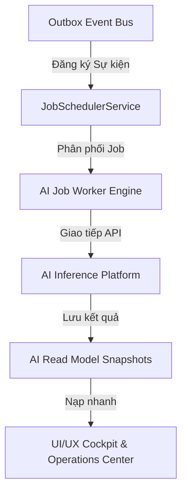
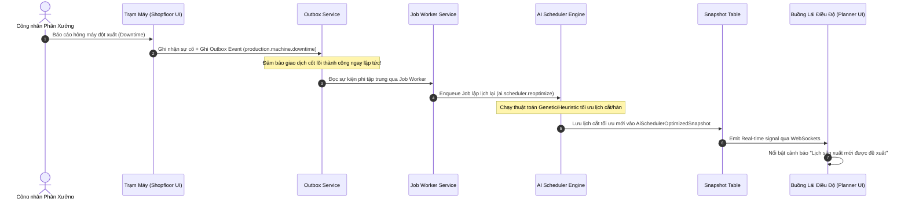

# EPIC208 – AI Enterprise Blueprint

Ngày: 2026-07-08
Trạng thái: ĐÃ PHÊ DUYỆT (Giai đoạn Thiết kế)

---

## 1. Tầm Nhìn Chiến Lược & Tổng Quan Hệ Sinh Thái AI
Hệ thống SteelTrack hướng tới việc trở thành một nền tảng điều hành sản xuất kết cấu thép thông minh. Thay vì chỉ ghi nhận dữ liệu giao dịch thụ động (ERP truyền thống), hệ sinh thái AI trong SteelTrack đóng vai trò là hạt nhân ra quyết định chủ động.

Hệ sinh thái AI được thiết kế như một lớp dịch vụ độc lập, tích hợp chặt chẽ vào **Core Platform** thông qua hàng đợi sự kiện bất đồng bộ (**Outbox Pattern** & **Background Engine**), đảm bảo không ảnh hưởng đến độ trễ giao dịch lõi và khả năng chịu tải của cơ sở dữ liệu OLTP.



---

## 2. Thiết Kế Chi Tiết 8 Phân Hệ AI (Domain Modules)

### 2.1. AI Assistant (Trợ Lý Nhà Xưởng - Hands-Free Shopfloor)
*   **Mục tiêu**: Giúp công nhân vận hành cầu trục, thợ hàn, thợ cắt và giám sát QC tương tác với hệ thống rảnh tay (Voice-to-Text & Text-to-Voice) ngay tại vị trí sản xuất để truy vấn bản vẽ, ghi nhận sản lượng, và báo cáo sự cố.
*   **Mô hình Domain & Cấu trúc Dữ liệu**:
    *   `AiAssistantSession`: Quản lý phiên làm việc, trạng thái hội thoại, thông tin định danh máy trạm và tài khoản công nhân.
    *   `AiAssistantIntent`: Kết quả phân tích ý định (NLU) bao gồm Intent Type (ví dụ: `QUERY_BOM`, `REPORT_DEFECT`, `REQUEST_MATERIAL`), Entity (ví dụ: mã cấu kiện `VAL-COMP-001`, số lượng `10`), và Confidence Score.
*   **Luồng Sự Kiện (Event Flow)**:
    1. Công nhân nhấn nút kích hoạt trên tai nghe Bluetooth công nghiệp hoặc máy tính bảng trạm máy.
    2. Thiết bị gửi luồng âm thanh qua WebSockets đến `apps/backend-api/src/modules/ai-assistant` ([ai-assistant](file:///opt/projects/steeltrack/apps/backend-api/src/modules/ai/)).
    3. Hệ thống xử lý Speech-to-Text (STT) -> Trích xuất Intent -> Thực thi Action thông qua đối tượng Command tương ứng.
    4. Trả về phản hồi bằng giọng nói Text-to-Speech (TTS) hoặc hiển thị tài liệu thiết kế trên màn hình trạm máy.

### 2.2. AI Planner (Hoạch Định Dự Án & Dự Báo Rủi Ro WBS)
*   **Mục tiêu**: Tự động phân rã cấu trúc công việc (WBS) từ bản vẽ thiết kế Tekla/BOM và dự báo rủi ro trễ tiến độ dựa trên dữ liệu lịch sử sản xuất của các cấu kiện tương đương.
*   **Mô hình Domain & Cấu trúc Dữ liệu**:
    *   `AiProjectForecast`: Lưu trữ dự báo ngày hoàn thành, xác suất trễ hạn, và danh sách các nhiệm vụ thắt nút cổ chai (Bottleneck Tasks).
    *   `AiWbsRecommendation`: Đề xuất phân rã tác vụ WBS tối ưu kèm theo định mức nhân công và vật tư ước tính.
*   **Luồng Sự Kiện (Event Flow)**:
    1. Khi dự án mới được tạo hoặc cập nhật bản vẽ bản thiết kế BOM (`projects.project.created` hoặc `projects.bom.imported`), Outbox Bus phát đi sự kiện.
    2. Background job `ai.planner.wbs_suggest` kích hoạt, phân tích đặc tính cấu kiện (kích thước, loại thép, độ phức tạp mối hàn).
    3. Hệ thống sinh Read Model `ProjectTaskHealthSnapshot` chứa các cảnh báo rủi ro tiến độ để hiển thị tại Project Command Center.

### 2.3. AI Scheduler (Tối Ưu Hóa Xếp Lịch Máy Cắt/Hàn)
*   **Mục tiêu**: Xếp lịch tự động cho các máy cắt CNC (Plates/Profiles) và robot hàn để tối thiểu hóa lượng phế liệu thép hình/thép tấm (Scrap Rate) và thời gian chờ của máy (Machine Idle Time).
*   **Mô hình Domain & Cấu trúc Dữ liệu**:
    *   `AiNestingPlan`: Kế hoạch xếp hình cắt thép tấm tối ưu (nhận diện phôi thừa thừa - Offcut).
    *   `AiScheduleSequence`: Thứ tự chạy các lệnh sản xuất (Manufacturing Orders - MO) tại từng máy cắt/hàn theo thuật toán tối ưu đa mục tiêu (Genetic Algorithm).
*   **Luồng Sự Kiện (Event Flow)**:
    1. Điều độ viên yêu cầu tối ưu lịch tuần hoặc ngày.
    2. Hệ thống thu thập trạng thái các máy (`equipment`), danh sách MO chờ chạy (`production`), và tồn kho vật tư thực tế (`inventory_items`).
    3. Chạy thuật toán tối ưu hóa trong Background Engine -> Tạo snapshot `AiSchedulerOptimizedSnapshot` để điều độ duyệt trước khi ban hành lệnh sản xuất chính thức.

### 2.4. AI Inventory (Dự Báo Vật Tư & Phát Hiện Bất Thường)
*   **Mục tiêu**: Dự báo điểm đặt hàng lại (Reorder Point) tối ưu cho từng mã thép tấm/thép hình dựa trên tiến độ dự án sắp triển khai và phát hiện các giao dịch xuất kho bất thường (Anomaly Detection).
*   **Mô hình Domain & Cấu trúc Dữ liệu**:
    *   `AiMaterialForecast`: Lưu trữ chuỗi thời gian nhu cầu vật tư dự báo (Demand Forecast Series) trong 30-60-90 ngày tới.
    *   `AiInventoryAnomaly`: Cảnh báo các giao dịch lệch chuẩn (ví dụ: công nhân xuất vật tư gấp 3 lần định mức BOM cho một MO mà không có lý do rework).
*   **Luồng Sự Kiện (Event Flow)**:
    1. Giao dịch xuất kho vật tư sản xuất (`inventory.transaction.created` loại `CONSUME`) phát sinh.
    2. Background job `ai.inventory.anomaly_check` đối chiếu trọng lượng thép thực tế xuất với định mức BOM của MO.
    3. Nếu sai số vượt quá ngưỡng 5% (có cấu hình theo nhóm vật tư), tạo bản ghi `AiInventoryAnomaly` và gửi cảnh báo thời gian thực về Operations Center.

### 2.5. AI Production (Dự Báo OEE & Bảo Trì Dự Đoán Máy Móc)
*   **Mục tiêu**: Giám sát hiệu suất tổng thể thiết bị (OEE), dự đoán hỏng hóc máy móc (Predictive Maintenance) dựa trên số giờ chạy máy và thông số vận hành thực tế từ cảm biến IoT (Nhiệt độ, Độ rung).
*   **Mô hình Domain & Cấu trúc Dữ liệu**:
    *   `AiEquipmentHealthScore`: Điểm sức khỏe thiết bị, xác suất hỏng hóc trong 7 ngày tới, và danh sách linh kiện cần kiểm tra/thay thế dự phòng.
    *   `AiOeeForecast`: Dự báo chỉ số OEE (Khả dụng - Availablity, Hiệu suất - Performance, Chất lượng - Quality) theo từng chuyền/tổ máy cắt-hàn.
*   **Luồng Sự Kiện (Event Flow)**:
    1. Dữ liệu vận hành máy được gửi định kỳ 5 phút một lần từ IoT Gateway hoặc ghi nhận thủ công tại phân xưởng.
    2. Background job `ai.production.maintenance_predict` phân tích dữ liệu tích lũy và cập nhật trạng thái hao mòn của lưỡi cắt, đầu cắt plasma hoặc súng hàn.
    3. Cập nhật `AiMachineMaintenanceSnapshot` kích hoạt thông báo bảo trì dự phòng gửi đến phân hệ Quản lý Thiết bị (CMMS).

### 2.6. AI QC (Phát Hiện Lỗi Bằng Hình Ảnh - Computer Vision QC)
*   **Mục tiêu**: Tự động nhận diện lỗi mối hàn (Welding Defects như rỗ khí, nứt, thiếu ngấu) và chất lượng bề mặt sơn (Coating Defects) thông qua camera giám sát tại trạm QC.
*   **Mô hình Domain & Cấu trúc Dữ liệu**:
    *   `AiQcImageAnalysis`: Lưu trữ tọa độ bounding box của lỗi trên hình ảnh, phân loại lỗi (`PORES`, `CRACKS`, `OVERFLOW`, `UNDERFILL`) và mức độ nghiêm trọng.
    *   `AiQcDecision`: Khuyến nghị phê duyệt (`PASS`), sửa chữa (`REWORK`), hoặc hủy bỏ (`SCRAP`) cho cấu kiện được chụp ảnh.
*   **Luồng Sự Kiện (Event Flow)**:
    1. Thanh tra QC chụp ảnh mối hàn cấu kiện tại trạm kiểm tra và upload lên Attachments Service ([attachments](file:///opt/projects/steeltrack/apps/backend-api/src/modules/attachments/)).
    2. Sự kiện `attachments.file.uploaded` kích hoạt background job `ai.qc.vision_inspect`.
    3. AI Worker phân tích hình ảnh và trả về kết quả lỗi mối hàn trong vòng dưới 3 giây.
    4. Cập nhật kết quả vào phiếu QC kiểm tra tương ứng (`QcInspection`) và tự động chuyển trạng thái cấu kiện sang chờ sửa chữa nếu phát hiện lỗi nặng.

### 2.7. AI Logistics (Tối Ưu Hóa Xe & Lộ Trình Giao Hàng)
*   **Mục tiêu**: Tối ưu hóa việc xếp cấu kiện lên xe tải (3D Bin Packing) để tận dụng tối đa tải trọng/thể tích xe, đồng thời định tuyến đường đi (Route Optimization) cho đội xe giao hàng đến các công trường.
*   **Mô hình Domain & Cấu trúc Dữ liệu**:
    *   `AiTruckLoadPlan`: Kế hoạch xếp dỡ 3D hiển thị vị trí đặt từng cấu kiện trên thùng xe tải để đảm bảo an toàn trọng tải.
    *   `AiRouteOptimization`: Danh sách các điểm dừng tối ưu kèm theo dự báo thời gian đến công trường (ETA) dựa trên tình hình giao thông thực tế.
*   **Luồng Sự Kiện (Event Flow)**:
    1. Khi điều độ viên Logistics tạo Lệnh Điều Xe (`dispatch_orders` trong [logistics](file:///opt/projects/steeltrack/apps/backend-api/src/modules/logistics/)).
    2. Job `ai.logistics.load_optimize` tự động tính toán cách sắp xếp cấu kiện dài/ngắn, nặng/nhẹ theo sơ đồ 3D để tránh lật xe hoặc quá tải trọng trục xe.
    3. Cập nhật snapshot lộ trình và sơ đồ tải trọng gửi trực tiếp cho tài xế qua ứng dụng mobile.

### 2.8. AI Operations Center (Tự Động Phân Tích Cảnh Báo Hệ Thống)
*   **Mục tiêu**: Giám sát hiệu năng hệ thống SteelTrack, phân tích log lỗi tập trung, phát hiện các tắc nghẽn hàng đợi xử lý nền (Background Job delays, Outbox lag) và tự động chỉ ra nguyên nhân gốc rễ (Root Cause Analysis - RCA).
*   **Mô hình Domain & Cấu trúc Dữ liệu**:
    *   `AiSystemHealthInsight`: Khuyến nghị khắc phục lỗi hệ thống (ví dụ: gợi ý tạo thêm chỉ mục database do phát hiện câu lệnh Prisma chạy chậm lệch chuẩn).
    *   `AiAlertGroup`: Gom nhóm hàng ngàn dòng log lỗi rời rạc thành một "Sự cố hệ thống" duy nhất để tránh bão cảnh báo (Alert Fatigue) cho quản trị viên.
*   **Luồng Sự Kiện (Event Flow)**:
    1. Module `operations-center` ghi nhận các số liệu hiệu năng (vòng lặp CPU, rò rỉ bộ nhớ, độ trễ truy vấn Prisma).
    2. Background job `ai.operations.log_analyse` định kỳ quét nhật ký lỗi.
    3. Phát hiện lỗi lặp lại liên tục -> Phân tích hành vi -> Đưa ra khuyến nghị cụ thể lên màn hình điều hành Operations Center.

---

## 3. Kiến Trúc Tích Hợp Hệ Thống AI (AI Integration & Aggregates)

Toàn bộ các phân hệ AI được quản lý nhất quán thông qua các Aggregates cốt lõi nằm trong module `ai-runtime`:

### 3.1. AI Agent Context Aggregate
Quản lý trạng thái thực thi của từng mô hình AI trong hệ thống:
```typescript
// Định nghĩa cấu trúc lưu trữ thông tin thực thi AI
export interface AiAgentContext {
  id: string;
  agentName: string;         // Tên tác nhân AI (ví dụ: 'AI-Inventory-Anomaly')
  modelName: string;         // Tên mô hình (ví dụ: 'isolation-forest-steel-v1')
  modelVersion: string;      // Phiên bản mô hình (ví dụ: '2026.07.01')
  accuracyMetric: number;    // Độ chính xác hiện tại của mô hình
  lastTrainedAt: Date;       // Lần huấn luyện cuối cùng
  inferenceStatus: 'ONLINE' | 'OFFLINE' | 'DEGRADED';
}
```

### 3.2. AI Recommendation Action Aggregate
Lưu trữ và theo dõi phản hồi của người dùng đối với các đề xuất của AI để cải thiện thuật toán (Reinforcement Learning from Feedback):
```typescript
export interface AiRecommendationAction {
  id: string;
  recommendationType: string;  // Loại đề xuất (ví dụ: 'REORDER_STEEL_PLATE')
  targetEntityId: string;      // ID đối tượng đích (ví dụ: 'material-id-001')
  suggestedValue: string;      // Giá trị AI đề xuất
  appliedValue: string;        // Giá trị người dùng thực tế áp dụng
  feedbackStatus: 'ACCEPTED' | 'REJECTED' | 'MODIFIED';
  feedbackNotes?: string;      // Lý do từ chối hoặc điều chỉnh của người dùng
  userId: string;              // Người duyệt quyết định
  createdAt: Date;
}
```

---

## 4. Thiết Kế Luồng Sự Kiện Tích Hợp AI (AI Event Flows)

Luồng sự kiện dưới đây minh họa cách AI Scheduler nhận diện biến động sản xuất thực tế để lập lịch lại trực quan không chặn luồng nghiệp vụ chính:



---

## 5. Danh Sách Read Models & Snapshots Của AI

Để đảm bảo hiệu năng tối ưu (phản hồi API dưới 50ms), các kết quả dự báo và đề xuất của AI được lưu dưới dạng các Snapshots JSON trong cơ sở dữ liệu:

| Tên Snapshot | Mô tả Payload JSON | Tần suất Cập nhật | API Endpoint Phục vụ |
| --- | --- | --- | --- |
| `AiInventoryForecastSnapshot` | Chuỗi dự báo nhập xuất tồn kho nguyên vật liệu chính (thép hình, thép tấm) trong 90 ngày tới. | Hàng đêm (Daily) hoặc khi có thay đổi BOM dự án lớn. | `GET /api/v1/ai/inventory/forecast` |
| `AiScheduleOptimizedSnapshot` | Thứ tự phân phối MO tối ưu đến từng tổ máy cắt CNC, máy hàn gá, máy hàn cổng, chuyền sơn. | Mỗi khi có sự cố Downtime hoặc 1 tiếng/lần. | `GET /api/v1/ai/scheduler/optimized-schedule` |
| `AiMachineMaintenanceSnapshot` | Điểm số sức khỏe máy móc, thời gian hoạt động tiếp theo cần bảo dưỡng, danh mục vật tư hao mòn dự phòng. | Định kỳ 1 giờ một lần dựa trên dữ liệu IoT. | `GET /api/v1/ai/production/maintenance-forecast` |
| `AiQcImageAnalysisSnapshot` | Tọa độ bounding box các lỗi hàn/sơn kèm theo độ tin cậy được phân tích từ hình ảnh cấu kiện. | Real-time ngay sau khi ảnh được upload tại trạm QC. | `GET /api/v1/ai/qc/image-analysis/:attachmentId` |

---

## 6. Thiết Kế UI/UX Dashboard Tích Hợp AI

### 6.1. Thiết Kế Trực Quan
Các cảnh báo và đề xuất từ AI phải tuân thủ nghiêm ngặt hệ thống thiết kế Dark Cockpit của SteelTrack:
*   Màu sắc chỉ định:
    *   `Emerald` (`#10b981`): Hệ thống hoạt động an toàn, dự báo tiến độ đạt 100%.
    *   `Amber` (`#f59e0b`): Cảnh báo rủi ro trễ tiến độ nhẹ (< 2 ngày), thiếu hụt vật tư tạm thời.
    *   `Red` (`#ef4444`): Cảnh báo khẩn cấp (Hỏng hóc máy móc nghiêm trọng, lệch chuẩn xuất kho nghiêm trọng).
*   Không sử dụng biểu đồ động dạng Sparkline hoặc Progress Bar chuyển động liên tục gây mệt mỏi cho mắt người vận hành.
*   Mọi đề xuất của AI (ví dụ: Đề xuất lập lịch lại của AI Scheduler) phải đi kèm một nút bấm hành động trực tiếp: `[Chấp nhận lịch AI]` hoặc `[Từ chối & Giữ lịch cũ]`.

### 6.2. Thiết Kế Module Trợ Lý Giọng Nói (AI Shopfloor Speech Widget)
Một widget nhỏ màu đen mờ (Backdrop-blur) nằm ở góc dưới bên phải màn hình trạm máy, hiển thị biểu tượng Micro nhấp nháy xanh dịu khi kích hoạt thu âm.
*   **Trạng thái Chờ (Idle)**: `Màu Slate-600` - "Nhấn để nói chuyện với Trợ lý SteelTrack".
*   **Trạng thái Đang lắng nghe (Listening)**: `Màu Cyan-500` kèm sóng âm dạng sóng sine chuyển động nhẹ.
*   **Trạng thái Xử lý (Processing)**: Vòng xoay vô cực mờ màu xanh dương.
*   **Trạng thái Hoàn thành (Success/Done)**: `Màu Emerald-500` - Hiển thị phản hồi dạng text tóm tắt trên màn hình.

---

## 7. Tích Hợp Operations Center & Giám Sát AI
Sức khỏe của hệ sinh thái AI được tích hợp trực tiếp vào màn hình điều hành hệ thống tại `/operations-center` ([OperationsCenterPage.tsx](file:///opt/projects/steeltrack/apps/frontend/src/modules/operations-center/pages/OperationsCenterPage.tsx)):

```text
+--------------------------------------------------------------------------+
|                       AI RUNTIME HEALTH MONITOR                          |
+--------------------------------------------------------------------------+
|  Model Name            | Status  | Accuracy | Latency | Last Rebuild     |
|  --------------------- | ------- | -------- | ------- | ---------------- |
|  AI-Scheduler-Optimizer| ONLINE  | 94.2%    | 450ms   | 10 phút trước    |
|  AI-Inventory-Anomaly  | ONLINE  | 98.1%    | 120ms   | 1 giờ trước      |
|  AI-QC-Welding-Vision  | ONLINE  | 91.5%    | 1250ms  | 2 ngày trước     |
|  AI-Logistics-Routing  | DEGRADED| 85.0%    | 850ms   | 5 phút trước (F) |
+--------------------------------------------------------------------------+
|  Alerts: ⚠ AI-Logistics-Routing có độ trễ tăng cao do sự cố kết nối API  |
|  Bản đồ giao thông thời gian thực bên thứ ba gặp sự cố. Đang tự động chuyển |
|  sang chế độ định tuyến ngoại tuyến (Offline routing fallback).         |
+--------------------------------------------------------------------------+
```

Các chỉ số giám sát bắt buộc phải thu thập:
1.  **AI Inference Latency (Độ trễ suy luận)**: Cảnh báo nếu thời gian phản hồi vượt quá 2000ms đối với Computer Vision hoặc 800ms đối với các tác vụ lập lịch khác.
2.  **Model Drift (Độ lệch mô hình)**: Theo dõi tỷ lệ phản hồi `REJECTED` từ người điều hành đối với các đề xuất của AI. Nếu tỷ lệ từ chối vượt quá 20% trong tuần, tự động đánh dấu mô hình cần tái huấn luyện (Re-train).
3.  **Inference Fallback Hit Ratio**: Đo lường tần suất hệ thống phải sử dụng thuật toán dự phòng cổ điển (ví dụ: tính toán định mức thép bằng Excel thuần thay vì thuật toán tối ưu phôi) khi dịch vụ AI Offline.

---

## 8. Rủi Ro Kỹ Thuật & Giải Pháp Khắc Phục (Technical Risks)

1.  **Rủi Ro Khóa Cổ Chai Cơ Sở Dữ Liệu (Database Lock Contention)**:
    *   *Nguyên nhân*: Thuật toán tối ưu hóa (Scheduler/Planner) cần đọc số lượng bản ghi khổng lồ từ các bảng vật tư và tác vụ.
    *   *Giải pháp*: Tuyệt đối không cho phép AI truy vấn trực tiếp vào các bảng giao dịch chính. AI chỉ được đọc dữ liệu từ các Read Model Snapshots đã được lưu trong Redis hoặc bảng Snapshot chuyên biệt có thiết lập chế độ Read-Uncommitted (Read-Only replica).
2.  **Mất Kết Nối Mạng Khi Đang Chạy (Inference Service Outage)**:
    *   *Nguyên nhân*: Dịch vụ AI đám mây hoặc máy chủ AI biên bị mất kết nối hoặc quá tải.
    *   *Giải pháp*: Triển khai mẫu thiết kế **Circuit Breaker** tại lớp `AiInferenceDispatcher`. Nếu dịch vụ AI lỗi liên tục 5 lần, tự động chuyển hướng sang chế độ tính toán heuristic cổ điển (chạy cục bộ bằng code Typescript đơn giản) để đảm bảo nhà máy không bị dừng hoạt động.
3.  **Sai Lệch Dữ Liệu Huấn Luyện (Data Drift & Poisoning)**:
    *   *Nguyên nhân*: Dữ liệu ghi nhận sản xuất bị sai lệch (ví dụ: nhập nhầm số lượng phế liệu tăng đột biến) dẫn đến mô hình AI học sai.
    *   *Giải pháp*: Áp dụng thuật toán lọc nhiễu ngoại lai (Outlier Filter) ở cấp độ tiền xử lý dữ liệu trước khi đẩy vào tập huấn luyện của AI.

---

## 9. Lộ Trình Triển Khai 8 Sprints (Sprint Roadmap)

*   **Sprint AI.1: Xây dựng Nền móng & Đăng ký Mô hình AI (AI Engine Foundation)**
    *   Thiết lập cấu trúc cơ sở dữ liệu cho các bảng cấu hình tác nhân AI, nhật ký đề xuất (`AiAgentContext`, `AiRecommendationAction`).
    *   Hoàn thiện lớp Dispatcher điều phối suy luận bất đồng bộ qua Outbox.
*   **Sprint AI.2: Triển khai Trợ lý Giọng nói Nhà xưởng (AI Assistant Shopfloor)**
    *   Tích hợp dịch vụ STT/TTS công nghiệp.
    *   Xây dựng Chatbot Engine xử lý Intent tìm kiếm bản vẽ thiết kế và ghi nhận sản xuất cơ bản.
*   **Sprint AI.3: Lập lịch và Tối ưu phôi Máy cắt CNC (AI Scheduler & Nesting)**
    *   Triển khai thuật toán sắp đặt thép tấm/thép hình tối ưu phế liệu.
    *   Sinh snapshot `AiScheduleSequence` gửi lệnh trực tiếp xuống máy cắt CNC.
*   **Sprint AI.4: Dự báo Vật tư & Cảnh báo Xuất kho Bất thường (AI Inventory)**
    *   Xây dựng mô hình chuỗi thời gian (Prophet/LSTM) dự báo nhu cầu vật tư phục vụ mua hàng.
    *   Triển khai kiểm tra bất thường (Isolation Forest) trên luồng xuất kho sản xuất.
*   **Sprint AI.5: Bảo trì Dự đoán Thiết bị (AI Production & Preventive Maintenance)**
    *   Tích hợp kết nối dữ liệu cảm biến rung/nhiệt độ của máy cắt plasma và robot hàn.
    *   Tạo lịch bảo trì tự động dựa trên dự báo hỏng hóc thiết bị.
*   **Sprint AI.6: Nhận diện Lỗi Mối hàn qua Hình ảnh (AI QC Vision)**
    *   Xây dựng đường ống (Pipeline) truyền tải ảnh từ trạm QC lên máy chủ suy luận Computer Vision.
    *   Thiết kế giao diện thanh tra lỗi mối hàn trực quan trên Web/Mobile.
*   **Sprint AI.7: Tối ưu hóa Sắp xếp Thùng xe & Lộ trình Giao hàng (AI Logistics)**
    *   Triển khai thuật toán xếp dỡ 3D Bin Packing cho cấu kiện kết cấu thép cồng kềnh.
    *   Tích hợp bản đồ giao thông để tối ưu hóa lộ trình giao hàng đa công trường.
*   **Sprint AI.8: Đóng gói và Tích hợp Buồng lái Operations Center (AI Center Integration)**
    *   Kết nối toàn bộ các chỉ số đo lường hiệu năng AI lên màn hình Operations Center.
    *   Kiểm thử kịch bản tự động chuyển đổi sang chế độ ngoại tuyến (Offline fallback test) trên toàn hệ thống.
