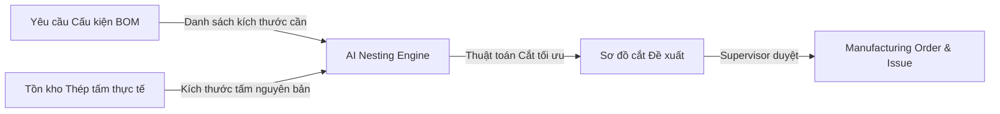

# Enterprise AI & Optimization Guidelines (EPIC210)

Hướng dẫn tích hợp các chức năng Trí tuệ Nhân tạo (AI Assistant) và động cơ tối ưu hóa (Optimization Engines) vào nền tảng SteelTrack. Các ứng dụng chính bao gồm Động cơ xếp hình thép tối ưu (Nesting Optimizer) và Trợ lý điều phối hàng đợi xưởng (Queue Advisor).

---

## 1. Nguyên tắc Thiết kế AI (AI Integration Principles)

1.  **Asynchronous Execution (Chạy không đồng bộ)**: Mọi tác vụ suy luận AI (Inference) hoặc chạy thuật toán tối ưu hóa sắp xếp có thời gian thực thi lâu (> 500ms) không được chạy trực tiếp trên luồng HTTP request chính. Bắt buộc phải đẩy vào Background Engine qua hàng đợi `ai-jobs` hoặc chạy thông qua worker riêng biệt.
2.  **Deterministic Fallback (Dự phòng xác định)**: Các thuật toán AI hoặc đề xuất xếp dỡ phải luôn có phương án dự phòng logic cổ điển (Heuristic/Deterministic rule-based). Hệ thống không bao giờ được phép dừng hoạt động hoặc báo lỗi nếu mô hình AI không phản hồi.
3.  **Human-in-the-loop (Người kiểm duyệt)**: Các gợi ý từ AI (như thứ tự ưu tiên gia công, sơ đồ cắt tấm thép) chỉ tồn tại ở dạng đề xuất (Draft/Suggested). Hệ thống bắt buộc phải hiển thị giao diện cho người vận hành xem xét, chỉnh sửa và bấm nút "Áp dụng gợi ý" (Apply suggestion) để xác nhận ghi nhận vào cơ sở dữ liệu.

---

## 2. Động cơ Tối ưu hóa Xếp hình (Nesting Optimizer)

Được áp dụng khi chuẩn bị lệnh sản xuất thép tấm (Plate Nesting) hoặc thép hình (Bar Nesting) để giảm thiểu tối đa tỷ lệ thép phế liệu (Scrap Ratio):

### 2.1. Luồng dữ liệu Nesting


### 2.2. Schema dữ liệu Đầu vào/Đầu ra (Nesting Contract)

#### Dữ liệu đầu vào (Input Payload):
```json
{
  "optimizerType": "2D_PLATE_NESTING",
  "sheetDimensions": {
    "width": 1500.0,
    "length": 6000.0,
    "thickness": 10.0
  },
  "availableInventoryItems": [
    { "inventoryItemId": "item_plate_10mm_01", "quantity": 10 }
  ],
  "requiredParts": [
    { "partId": "part_web_plate_01", "width": 400.0, "length": 5800.0, "quantity": 2 },
    { "partId": "part_flange_01", "width": 300.0, "length": 5800.0, "quantity": 4 }
  ]
}
```

#### Kết quả gợi ý đầu ra (Output Recommendation):
```json
{
  "sheetsRequired": 2,
  "utilizationRate": 92.4,
  "scrapPercentage": 7.6,
  "cuts": [
    {
      "sheetIndex": 0,
      "layout": [
        { "partId": "part_web_plate_01", "x": 0.0, "y": 0.0, "rotation": 0 },
        { "partId": "part_flange_01", "x": 405.0, "y": 0.0, "rotation": 0 }
      ]
    }
  ]
}
```

---

## 3. Trợ lý Điều phối Hàng đợi Xưởng (Queue Advisor)

Queue Advisor phân tích năng lực sản xuất thực tế tại [WorkCenter](file:///opt/projects/steeltrack/apps/backend-api/prisma/schema.prisma#L2484) dựa trên lịch sử dừng máy [MachineDowntime] và tiến độ WBS để đưa ra cảnh báo nghẽn cổ chai:

### 3.1. Các chỉ số phân tích AI
1.  **Dự báo trễ hạn (Delay Prediction)**: So sánh tiến độ thực tế với baseline kế hoạch để dự báo khả năng chậm tiến độ của `ProjectTask`.
2.  **Phát hiện quá tải máy (Machine Overload Detection)**: Cảnh báo nếu công việc xếp hàng tại một trạm máy (ví dụ: máy hàn tự động) vượt quá 120% năng lực thiết kế trong 3 ngày tới.

### 3.2. Cấu trúc Giao diện Trợ lý (UI Assistant Panel)
*   **sidebar Panel**: Thiết kế ngăn kéo phụ (flyout panel) chứa chatbot chuyên biệt hỗ trợ trả lời các câu hỏi kỹ thuật về tồn kho và tiến độ.
*   **Nút "Tự đề xuất" (Auto suggest WBS)**: Tích hợp trực tiếp tại màn hình lập kế hoạch WBS [ProjectsRepository](file:///opt/projects/steeltrack/apps/backend-api/src/modules/projects/repositories/projects.repository.ts) để tự sinh cấu trúc WBS dựa trên thư viện dự án mẫu.
*   **Trạng thái tin cậy (Confidence Score)**: Gợi ý của AI phải luôn đi kèm với điểm tin cậy phần trăm (ví dụ: *Độ tin cậy gợi ý: 89%*).
