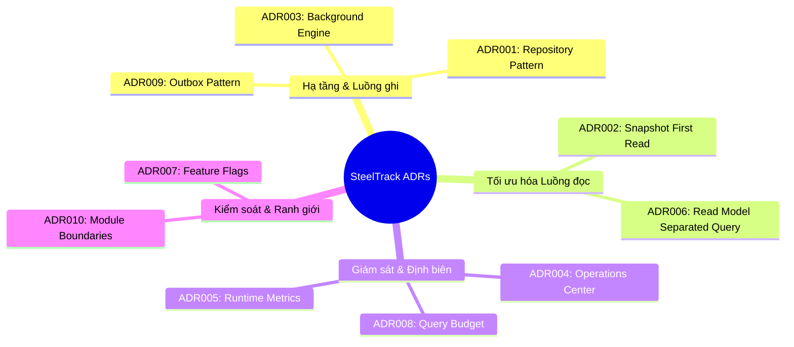

# Enterprise Architecture Decision Records (ADRs)

Tài liệu này tổng hợp 10 Hồ sơ Quyết định Thiết kế Kiến trúc (Architecture Decision Records - ADR) cốt lõi của hệ thống SteelTrack Core Platform. Mỗi ADR tuân thủ cấu trúc chuẩn nghiệp vụ bao gồm: **Bối cảnh & Vấn đề (Problem)**, **Quyết định (Decision)**, **Giải pháp thay thế (Alternatives Considered)** và **Hệ quả (Consequences)**.

---

## Danh Mục Quyết Định Thiết Kế



---

## ADR001: Repository Pattern

### Bối cảnh & Vấn đề (Problem)
Trong các giai đoạn phát triển ban đầu của SteelTrack, mã nguồn tại các tầng Controller hoặc Service thường xuyên gọi trực tiếp các phương thức của Prisma Client để truy vấn dữ liệu. Điều này dẫn đến các hệ quả:
1. **Lặp lại logic truy vấn**: Các điều kiện lọc phức tạp (ví dụ: chỉ lấy cấu kiện chưa bàn giao, vật tư thuộc kho staging) bị sao chép ở nhiều nơi.
2. **Khó khăn trong việc tối ưu hóa truy vấn**: Các kỹ sư cơ sở dữ liệu không thể dễ dàng định vị, tối ưu hóa các lệnh `select`, `include` hoặc join của Prisma vì chúng nằm rải rác.
3. **Phá vỡ biên giao dịch (Transaction Boundary)**: Việc thực thi các câu lệnh trong cùng một transaction của database giữa các service trở nên phức tạp và phụ thuộc vào cài đặt cụ thể của ORM.

### Quyết định (Decision)
Bắt buộc tách biệt hoàn toàn logic truy cập dữ liệu ra khỏi Controller và Service thông qua việc áp dụng **Repository Pattern** (xem hướng dẫn tại [enterprise-repository-guidelines.md](file:///opt/projects/steeltrack/docs/architecture/enterprise-repository-guidelines.md)):
1. Mọi truy vấn đọc ghi cơ sở dữ liệu phải được khai báo trong các lớp Repository tương ứng (ví dụ: [InventoryRepository](file:///opt/projects/steeltrack/apps/backend-api/src/modules/inventory/inventory.repository.ts), [ProjectsRepository](file:///opt/projects/steeltrack/apps/backend-api/src/modules/projects/repositories/projects.repository.ts)).
2. Các phương thức Repository phải hỗ trợ tham số `db` dùng chung có kiểu dữ liệu là `DbClient = PrismaService | Prisma.TransactionClient` (ví dụ tại [prisma.service.ts](file:///opt/projects/steeltrack/apps/backend-api/src/core/prisma/prisma.service.ts)). Nếu có tham số `db` được truyền vào từ Service, Repository sẽ thực thi câu lệnh SQL trong transaction đó; ngược lại sẽ dùng client mặc định.
3. Không import bất kỳ logic nghiệp vụ nào vào lớp Repository.

### Giải pháp thay thế (Alternatives Considered)
* **Direct Prisma in Services**: Giữ nguyên việc gọi Prisma trực tiếp trong Service. Giải pháp này bị từ chối vì làm tầng Service phình to, khó viết Unit Test (phải mock toàn bộ Prisma Client phức tạp) và cản trở việc tái sử dụng SQL.
* **Query Object Pattern**: Tạo các lớp Object riêng cho mỗi câu truy vấn. Giải pháp này bị đánh giá là quá phức tạp (over-engineered) đối với kiến trúc Monolith hiện tại của SteelTrack.

### Hệ quả (Consequences)
* **Tích cực**:
  * Tập trung hóa logic SQL/ORM giúp việc tối ưu chỉ mục (indexes) và rà soát lỗi N+1 trở nên dễ dàng.
  * Tầng Service tập trung hoàn toàn vào Business Logic và biên giao dịch.
  * Dễ dàng thay thế hoặc nâng cấp ORM/DB Client mà không ảnh hưởng tới logic nghiệp vụ.
* **Tiêu cực**:
  * Tăng số lượng tệp tin và mã nguồn boilerplate do phải tạo thêm Interface và Class Repository cho mỗi thực thể.

---

## ADR002: Snapshot First Read

### Bối cảnh & Vấn đề (Problem)
SteelTrack xử lý khối lượng lớn các giao dịch di biến động vật tư (kho bãi, sản xuất, lắp dựng công trình). Việc hiển thị thông tin tồn kho chi tiết hoặc biểu đồ xu hướng yêu cầu thực hiện các phép tính gộp (SUM, COUNT, GROUP BY) trên hàng triệu bản ghi của bảng nhật ký giao dịch. Nếu thực hiện tính toán động (Live Aggregations) mỗi khi người dùng truy cập:
1. Độ trễ phản hồi của API (API Latency) vượt ngưỡng SLO cho phép (> 200ms).
2. Gây nghẽn CPU của máy chủ PostgreSQL, ảnh hưởng trực tiếp đến luồng ghi giao dịch chính (Write Path).

### Quyết định (Decision)
Áp dụng chiến lược **Snapshot First Read** cho tất cả các luồng đọc dữ liệu tổng hợp và phân tích (xem danh mục tại [enterprise-snapshot-catalog.md](file:///opt/projects/steeltrack/docs/architecture/enterprise-snapshot-catalog.md)):
1. Dữ liệu tổng hợp phức tạp sẽ được tính toán trước (pre-computed) không đồng bộ và lưu trữ vật lý dưới dạng JSONB trong các bảng snapshot chuyên biệt (ví dụ: `inventory_material_snapshots`, `inventory_location_snapshots`).
2. Khi API yêu cầu dữ liệu, hệ thống sẽ thực hiện **đọc snapshot trước**. Nếu dữ liệu snapshot tồn tại và hợp lệ, trả về ngay lập tức.
3. Cơ chế **Fallback**: Nếu snapshot chưa được tạo hoặc bị đánh dấu lỗi (`stale = true`), hệ thống tự động chuyển hướng đọc tính toán trực tiếp từ cơ sở dữ liệu nguồn, đồng thời phát hành một tác vụ ngầm để rebuild lại snapshot.

### Giải pháp thay thế (Alternatives Considered)
* **PostgreSQL Materialized Views**: Sử dụng view vật lý của DB và làm mới định kỳ. Bị từ chối vì việc REFRESH MATERIALIZED VIEW khóa bảng dữ liệu, gây nghẽn luồng đọc ghi và khó tùy biến cấu trúc JSON lồng nhau phức tạp cho Frontend.
* **In-Memory Cache (Redis/Node Memory)**: Chỉ đệm dữ liệu trên Ram. Bị từ chối vì dữ liệu cache sẽ bị mất khi khởi động lại ứng dụng, dẫn đến hiện tượng nghẽn cổ chai đột ngột (Cache Stampede) khi DB phải chịu tải tính toán lại hàng loạt.

### Hệ quả (Consequences)
* **Tích cực**:
  * Tốc độ phản hồi API cực nhanh (thường dưới 10ms do chỉ truy vấn 1 bản ghi theo Primary Key).
  * Giải phóng tải tính toán cho PostgreSQL.
* **Tiêu cực**:
  * Chấp nhận tính nhất quán yếu (Eventual Consistency) - dữ liệu hiển thị có thể lệch vài giây đến vài phút so với thời gian thực.
  * Tăng dung lượng lưu trữ đĩa cứng cho các bảng Snapshot.

---

## ADR003: Background Engine

### Bối cảnh & Vấn đề (Problem)
Các tác vụ nặng như: xây dựng lại snapshot (Snapshot Rebuilding), gửi email thông báo, đồng bộ dữ liệu với hệ thống ngoài, hoặc kiểm tra chất lượng QC phức tạp thường tốn từ vài trăm mili-giây đến vài giây để hoàn thành. Nếu thực hiện các tác vụ này đồng bộ (Synchronously) trong luồng xử lý HTTP request:
1. Người dùng phải chờ đợi lâu trên giao diện (gây cảm giác ứng dụng bị treo).
2. Nguy cơ lỗi kết nối mạng (HTTP Timeout) làm gián đoạn giao dịch nghiệp vụ chính.
3. Rò rỉ tài nguyên luồng xử lý của Web Server khi lượng người dùng đồng thời tăng cao.

### Quyết định (Decision)
Xây dựng hạ tầng **Background Engine** hoạt động theo mô hình Pull-based lưu trữ trạng thái trong cơ sở dữ liệu (xem chi tiết tại [enterprise-background-guidelines.md](file:///opt/projects/steeltrack/docs/architecture/enterprise-background-guidelines.md)):
1. Các tác vụ ngầm được định nghĩa thành một bản ghi trong bảng `background_jobs` với trạng thái `PENDING` thông qua [JobSchedulerService](file:///opt/projects/steeltrack/apps/backend-api/src/core/jobs/job-scheduler.service.ts).
2. Một tiến trình chạy ngầm định kỳ ([JobWorkerService](file:///opt/projects/steeltrack/apps/backend-api/src/core/jobs/job-worker.service.ts)) quét bảng này mỗi 10 giây (`JOB_WORKER_POLL_MS`) bằng cơ chế khóa bản ghi ACID (`SELECT FOR UPDATE SKIP LOCKED`) để đảm bảo không có hai worker nào xử lý cùng một job.
3. Hỗ trợ cơ chế tự động thử lại (Retry Policy) với thuật toán Exponential Backoff và Dead-Letter Queue (DLQ) cho các tác vụ thất bại liên tiếp quá 5 lần.

### Giải pháp thay thế (Alternatives Considered)
* **BullMQ (Redis-based)**: Sử dụng hàng đợi chuyên dụng trên Redis. Bị từ chối vì phát sinh thêm một thành phần hạ tầng cần duy trì (Redis Server), tăng rủi ro lệch đồng bộ dữ liệu giữa Postgres (ghi nghiệp vụ) và Redis (ghi job) khi có sự cố mạng.
* **In-memory Task Queues (RxJS/Sinks)**: Chạy tác vụ ngầm bằng bộ nhớ tạm của Node.js. Bị từ chối vì các job sẽ biến mất hoàn toàn nếu tiến trình Server bị khởi động lại hoặc crash đột ngột.

### Hệ quả (Consequences)
* **Tích cực**:
  * Tăng độ tin cậy tuyệt đối của tác vụ: công việc không bao giờ bị mất mát, luôn được phục hồi sau sự cố.
  * Tách biệt tải xử lý nghiệp vụ chính khỏi các tác vụ phụ trợ.
* **Tiêu cực**:
  * Tác vụ có độ trễ thực thi nhất định (phụ thuộc vào chu kỳ quét 10 giây).
  * Làm tăng số lượng câu lệnh đọc ghi nhỏ lên bảng `background_jobs`.

---

## ADR004: Operations Center Integration

### Bối cảnh & Vấn đề (Problem)
Khi ứng dụng vận hành thực tế tại các nhà máy cơ khí thép, đội ngũ vận hành hệ thống (SRE/Admins) gặp khó khăn lớn trong việc giám sát sức khỏe kỹ thuật của hệ thống. Họ phải kiểm tra thủ công nhiều nguồn khác nhau (Server SSH, database logs, Node.js console logs). Việc không có một công cụ giám sát trực quan chuyên biệt dẫn đến:
1. Phát hiện chậm các sự cố nghẹt Outbox Pipe hoặc lỗi công việc trong hàng đợi ngầm.
2. Không đánh giá được mức độ trôi lệch (Lag) của các Snapshots dẫn đến thông tin hiển thị trên Dashboard bị stale quá lâu mà không rõ nguyên nhân.

### Quyết định (Decision)
Tích hợp trung tâm điều hành kỹ thuật **Operations Center** vào trực tiếp ứng dụng (xem hướng dẫn tại [enterprise-operations-center-guidelines.md](file:///opt/projects/steeltrack/docs/architecture/enterprise-operations-center-guidelines.md)):
1. Phát triển API tập hợp dữ liệu `/operations-center/overview` trong [operations-center.service.ts](file:///opt/projects/steeltrack/apps/backend-api/src/modules/operations-center/operations-center.service.ts) để thu thập thông tin từ 6 phân vùng: Hệ điều hành, Background Jobs, Outbox Pipe, Snapshot Health, Runtime Analytics và Database Health.
2. Thiết lập quy tắc phân ngưỡng cảnh báo tự động (Alert Threshold Rules) với các mức độ cảnh báo (Warning, Critical).
3. Bắt buộc mọi module mới (như QC, Logistics) phải đăng ký hàm tự kiểm tra sức khỏe (Health Check Probe) vào [RuntimeHealthService](file:///opt/projects/steeltrack/apps/backend-api/src/core/performance/runtime-health.service.ts).

### Giải pháp thay thế (Alternatives Considered)
* **Prometheus & Grafana**: Tích hợp bộ công cụ thu thập chỉ số ngoài. Bị từ chối sử dụng làm giải pháp duy nhất vì Grafana chỉ hiển thị chỉ số thụ động, không cho phép quản trị viên thực hiện các hành động can thiệp trực tiếp (như kích hoạt thủ công Rebuild một mã vật tư bị lỗi hoặc phục hồi Outbox event) ngay trên giao diện điều hành của ERP.

### Hệ quả (Consequences)
* **Tích cực**:
  * Cung cấp một màn hình giám sát tập trung duy nhất cho kỹ sư vận hành hệ thống.
  * Rút ngắn thời gian phát hiện và khắc phục sự cố hệ thống.
* **Tiêu cực**:
  * Gây thêm một lượng tải nhỏ khi định kỳ thu thập tài nguyên hệ thống và dung lượng bảng cơ sở dữ liệu.

---

## ADR005: Runtime Metrics

### Bối cảnh & Vấn đề (Problem)
Để tối ưu hóa hiệu năng, nhà phát triển cần biết chính xác endpoint nào đang phản hồi chậm nhất, câu truy vấn SQL nào chiếm nhiều thời gian chạy nhất, và module nào đang vi phạm nguyên tắc thiết kế nhiều nhất. Việc thiếu số liệu thực tế tại môi trường Runtime dẫn đến việc tối ưu hóa cảm tính, thiếu tập trung và không đo lường được hiệu quả trước/sau khi cải tiến.

### Quyết định (Decision)
Xây dựng hạ tầng thu thập số liệu vận hành thời gian thực **Runtime Metrics** tích hợp sẵn tại [core/performance](file:///opt/projects/steeltrack/apps/backend-api/src/core/performance/):
1. Cài đặt [RuntimeMetricsInterceptor](file:///opt/projects/steeltrack/apps/backend-api/src/core/performance/runtime-metrics.interceptor.ts) để tự động đo đếm thời gian phản hồi (latency) của mọi HTTP Request.
2. Đăng ký Query Profiler vào [PrismaService](file:///opt/projects/steeltrack/apps/backend-api/src/core/prisma/prisma.service.ts) để đo lường thời gian thực thi của từng câu lệnh SQL phát sinh.
3. Sử dụng [performance-metrics.service.ts](file:///opt/projects/steeltrack/apps/backend-api/src/core/performance/performance-metrics.service.ts) để phân nhóm chỉ số hiệu năng (Performance Score) và chỉ số tuân thủ kiến trúc (Architecture Score) theo từng module nghiệp vụ.

### Giải pháp thay thế (Alternatives Considered)
* **APM Dịch vụ ngoài (Datadog/NewRelic)**: Tốt nhưng bị từ chối vì chi phí bản quyền rất lớn đối với doanh nghiệp sản xuất thép và gặp rào cản bảo mật khi truyền dữ liệu vận hành nội bộ ra ngoài Internet.

### Hệ quả (Consequences)
* **Tích cực**:
  * Nhà phát triển có số liệu chính xác để tối ưu hóa hiệu năng.
  * Tự động phát hiện các câu truy vấn chậm và ghi nhận vào log để xử lý.
* **Tiêu cực**:
  * Tiêu tốn một lượng nhỏ RAM và CPU của Node.js để lưu giữ và gộp các chỉ số đo đạc trong bộ nhớ.

---

## ADR006: Read Model Separated Query

### Bối cảnh & Vấn đề (Problem)
Khi sử dụng chung một mô hình dữ liệu (Domain Model) cho cả hai nhiệm vụ Ghi (Write) và Đọc (Read), hệ thống gặp các xung đột:
1. **Payload phình to**: Luồng đọc danh sách chỉ cần một vài trường thông tin cơ bản nhưng Entity nguồn kéo theo toàn bộ các quan hệ phức tạp và các trường nhật ký lớn.
2. **Khó bảo trì**: Các thay đổi về cấu trúc logic nghiệp vụ ở luồng ghi vô tình làm hỏng (break) các API Contract phục vụ cho việc hiển thị của Frontend.

### Quyết định (Decision)
Áp dụng nguyên lý tách biệt luồng truy vấn thông qua **Read Model Separated Query** (tiền đề của CQRS):
1. Định nghĩa các mô hình đọc dữ liệu chuyên biệt (Read Models) độc lập hoàn toàn với Domain Models.
2. Các Read Models này được đóng gói trong các lớp Service đọc chuyên dụng (như `DashboardInventoryReadModelService` tại [inventory.repository.ts](file:///opt/projects/steeltrack/apps/backend-api/src/modules/inventory/inventory.repository.ts)).
3. Read Model không chứa logic kiểm tra nghiệp vụ hay thay đổi trạng thái, chỉ tập trung vào việc định dạng dữ liệu (Mapping/Projection) tối ưu nhất cho Frontend và áp dụng các chính sách đệm dữ liệu (Caching/TTL).

### Giải pháp thay thế (Alternatives Considered)
* **GraphQL**: Cho phép client tự định nghĩa cấu trúc dữ liệu cần lấy. Bị từ chối vì làm tăng độ phức tạp của hệ thống backend, khó khăn trong việc áp dụng phân quyền chi tiết (RBAC) cho từng trường dữ liệu và khó kiểm soát hiệu năng của các câu truy vấn động từ phía client.

### Hệ quả (Consequences)
* **Tích cực**:
  * Tách biệt hoàn toàn luồng đọc và ghi giúp hệ thống linh hoạt, dễ dàng tối ưu hóa độc lập.
  * Giảm thiểu đáng kể kích thước gói tin mạng (network payload) truyền tải về Frontend.
* **Tiêu cực**:
  * Tạo ra sự trùng lặp mã nguồn nhất định khi phải duy trì cả Domain Model DTOs và Read Model DTOs.

---

## ADR007: Feature Flags

### Bối cảnh & Vấn đề (Problem)
Khi triển khai nâng cấp một tính năng cốt lõi (ví dụ: chuyển đổi toàn bộ luồng đọc Vật tư chi tiết sang dùng Snapshot), việc phát hành đồng loạt cho toàn bộ nhà máy có rủi ro rất cao. Nếu có lỗi phát sinh trong công thức tính toán hoặc lỗi kết nối, toàn bộ hoạt động xuất nhập kho của nhà máy sẽ bị tê liệt, buộc hệ thống phải rollback toàn bộ bản build mã nguồn, làm mất nhiều thời gian và ảnh hưởng tới sản xuất.

### Quyết định (Decision)
Triển khai cơ chế kiểm soát ra mắt tính năng thông qua **Feature Flags**:
1. Sử dụng [SnapshotFeatureFlagService](file:///opt/projects/steeltrack/apps/backend-api/src/core/snapshots/snapshot-feature-flag.service.ts) để kiểm tra trạng thái bật/tắt của tính năng tại thời điểm Runtime mà không cần khởi động lại Server.
2. Hỗ trợ cấu hình Feature Flag theo nhiều cấp độ: tắt hoàn toàn, bật cho môi trường Staging/Dev, bật thử nghiệm cho một số mã vật tư cụ thể (Canary Release), hoặc bật hoàn toàn (Global Enable).
3. Đoạn mã mẫu sử dụng Feature Flag:
   ```typescript
   const isSnapshotEnabled = await this.featureFlagService.isEnabled('inventory.snapshot-read', materialId);
   if (isSnapshotEnabled) {
     return this.readFromSnapshot(materialId);
   }
   return this.readLiveFromDb(materialId);
   ```

### Giải pháp thay thế (Alternatives Considered)
* **Cấu hình Environment Variables (`.env`)**: Bật tắt qua biến môi trường. Bị từ chối vì mỗi lần thay đổi trạng thái bắt buộc phải cập nhật tệp tin `.env` và restart lại toàn bộ các Docker containers của ứng dụng, gây gián đoạn dịch vụ.

### Hệ quả (Consequences)
* **Tích cực**:
  * Cho phép phát hành tính năng an toàn, giảm thiểu rủi ro lỗi hệ thống diện rộng.
  * Hỗ trợ thử nghiệm hiệu năng (A/B testing) trực tiếp trên môi trường production.
* **Tiêu cực**:
  * Làm mã nguồn có nhiều nhánh điều kiện (`if/else`), tăng độ phức tạp khi kiểm thử và cần có kế hoạch dọn dẹp các flags cũ sau khi tính năng đã ổn định.

---

## ADR008: Query Budget

### Bối cảnh & Vấn đề (Problem)
Trong quá trình phát triển dự án, các lập trình viên dễ dàng mắc lỗi viết các vòng lặp thực hiện truy vấn cơ sở dữ liệu (lỗi N+1 queries) hoặc viết các câu truy vấn lấy quá nhiều bảng liên kết mà không phân trang. Trên môi trường phát triển (Local/Dev) với dữ liệu nhỏ, các lỗi này không biểu hiện rõ ràng. Tuy nhiên khi đưa lên Production với lượng dữ liệu thực tế lớn, chúng sẽ nhanh chóng chiếm dụng hết các kết nối (Connection Pool) của PostgreSQL, làm treo hệ thống.

### Quyết định (Decision)
Thiết lập và cưỡng chế định biên tài nguyên truy vấn cơ sở dữ liệu thông qua **Query Budget**:
1. Sử dụng decorator `@QueryBudget({ maxQueries: 10, maxDurationMs: 50 })` trên các API controller endpoints.
2. [QueryBudgetInterceptor](file:///opt/projects/steeltrack/apps/backend-api/src/core/performance/interceptors/query-budget.interceptor.ts) sẽ tự động theo dõi số lượng câu lệnh SQL được phát ra trong vòng đời của HTTP request đó.
3. Nếu số lượng câu truy vấn vượt quá ngân sách (`maxQueries`) hoặc tổng thời gian thực thi vượt quá giới hạn (`maxDurationMs`), hệ thống sẽ ghi nhận cảnh báo nguy cấp `queries.nPlusOneWarnings` lên trung tâm giám sát. Trên môi trường Dev/Staging, có thể cấu hình để ném ra lỗi ngoại lệ lập tức để ngăn cản việc viết code ẩu.

### Giải pháp thay thế (Alternatives Considered)
* **Rà soát code thủ công (Code Review)**: Dựa hoàn toàn vào việc con người phát hiện lỗi N+1 khi duyệt Pull Request. Bị từ chối vì tỷ lệ bỏ sót rất cao đối với các luồng logic nghiệp vụ có nhiều nhánh rẽ phức tạp.

### Hệ quả (Consequences)
* **Tích cực**:
  * Cưỡng chế kỷ luật lập trình Clean Code, ngăn chặn hoàn toàn lỗi N+1 tiếp cận môi trường Production.
  * Bảo vệ tính ổn định của Connection Pool cơ sở dữ liệu.
* **Tiêu cực**:
  * Cần điều chỉnh linh hoạt định biên đối với một số API đặc thù (như các API xuất bản báo cáo tổng hợp hoặc thực hiện tác vụ bulk import dữ liệu).

---

## ADR009: Outbox Pattern

### Bối cảnh & Vấn đề (Problem)
Khi một sự kiện nghiệp vụ xảy ra (ví dụ: tạo Lệnh sản xuất mới), hệ thống cần cập nhật cơ sở dữ liệu đồng thời gửi sự kiện `production.work-order.released` qua hàng đợi tin nhắn hoặc gọi API của phân hệ Kho để giữ vật tư. Nếu thực hiện gửi tin nhắn trực tiếp trong cùng luồng xử lý:
1. Nếu hệ thống tin nhắn hoặc mạng bị lỗi giữa chừng, giao dịch ghi DB đã thành công nhưng sự kiện không được gửi đi, dẫn đến mất đồng bộ dữ liệu giữa các module (Dual Write Problem).
2. Nếu cuộn ngược (rollback) giao dịch ghi DB vì lỗi gửi tin nhắn, hệ thống sẽ bị chậm và phụ thuộc vào tính sẵn sàng của các dịch vụ bên ngoài.

### Quyết định (Decision)
Áp dụng mẫu thiết kế **Transactional Outbox Pattern** để đảm bảo truyền tin cậy tuyệt đối (xem mẫu code tại [enterprise-repository-guidelines.md](file:///opt/projects/steeltrack/docs/architecture/enterprise-repository-guidelines.md)):
1. Mọi sự kiện phát ra từ nghiệp vụ không được gửi trực tiếp ra ngoài. Thay vào đó, nó được ghi nhận dưới dạng một dòng dữ liệu vào bảng `outbox_events` trong cơ sở dữ liệu.
2. Việc ghi dữ liệu nghiệp vụ và ghi bản ghi outbox này bắt buộc phải thực hiện trong cùng một **ACID Database Transaction** thông qua [OutboxService](file:///opt/projects/steeltrack/apps/backend-api/src/core/outbox/outbox.service.ts).
3. Một tiến trình quét ngầm (`EventPublisherService`) sẽ quét bảng `outbox_events` theo chu kỳ ngắn, gửi tin nhắn đến đích và cập nhật trạng thái sự kiện thành `DISPATCHED`. Nếu thất bại sẽ tiến hành thử lại theo chính sách đã cấu hình.

### Giải pháp thay thế (Alternatives Considered)
* **Immediate Publish**: Phát hành sự kiện lập tức ngay sau câu lệnh ghi DB. Bị từ chối vì không đảm bảo tính toàn vẹn dữ liệu khi mạng bị lỗi chập chờn.

### Hệ quả (Consequences)
* **Tích cực**:
  * Đảm bảo tính tin cậy truyền phát sự kiện tuyệt đối (At-least-once Delivery).
  * Giải phóng thời gian chờ kết nối mạng của người dùng trong luồng ghi chính.
* **Tiêu cực**:
  * Tăng độ phức tạp của mã nguồn do phải thiết lập bảng trung gian và xử lý trùng lặp tin nhắn ở phía nhận (Idempotent Consumer).

---

## ADR010: Module Boundaries

### Bối cảnh & Vấn đề (Problem)
Kiến trúc Modular Monolith của SteelTrack cho phép toàn bộ mã nguồn nằm chung trong một repository để dễ dàng triển khai. Tuy nhiên, nếu không kiểm soát chặt chẽ các ranh giới module, các kỹ sư phát triển sẽ dễ dàng thực hiện import trực tiếp các Service, Helper hoặc các Model nội bộ của module này sang module khác. Sau một thời gian, hệ thống sẽ trở thành một khối "mỳ Ý" (Spaghetti Code) liên kết chặt chẽ:
1. Không thể thay đổi logic nội bộ của một module mà không làm hỏng module khác.
2. Không thể tách riêng một phân hệ (ví dụ: bãi Yard hoặc Logistics) thành một microservice độc lập khi nhà máy có nhu cầu mở rộng quy mô hạ tầng.

### Quyết định (Decision)
Thiết lập ranh giới module nghiêm ngặt (**Module Boundaries**):
1. **Ngăn cấm Import chéo trực tiếp**: Tuyệt đối không cho phép import các Service nội bộ giữa các module (ví dụ: `ProductionService` không được phép import `InventoryService` trực tiếp).
2. **Giao tiếp qua Cổng Giao diện công khai (Public Interface/API Client)**: Các module chỉ được giao tiếp với nhau thông qua các Interface công khai được định nghĩa rõ ràng hoặc qua Event Bus sử dụng [OutboxService](file:///opt/projects/steeltrack/apps/backend-api/src/core/outbox/outbox.service.ts).
3. **Độc lập Cơ sở Dữ liệu (Database Isolation)**: Mặc dù dùng chung một Prisma Schema và cơ sở dữ liệu PostgreSQL vật lý, các bảng dữ liệu phải được phân nhóm rõ ràng theo tiền tố module (ví dụ: `inventory_*`, `production_*`). Nghiêm cấm các Repository của module này thực hiện các phép Join trực tiếp sang các bảng của module khác, thay vào đó hãy sử dụng Read Model hoặc gọi API tổng hợp.

### Giải pháp thay thế (Alternatives Considered)
* **Microservices Architecture**: Tách rời hoàn toàn các phân hệ thành các service độc lập từ đầu. Bị từ chối vì chi phí vận hành hạ tầng mạng, cấu hình Docker/Kubernetes quá lớn và phức tạp hóa việc duy trì các giao dịch phân tán (Distributed Transactions) trong khi đội ngũ phát triển còn mỏng.

### Hệ quả (Consequences)
* **Tích cực**:
  * Mã nguồn có tính module hóa cao, dễ đọc, dễ kiểm thử độc lập và bảo trì lâu dài.
  * Sẵn sàng cho việc tách thành các microservices độc lập trong tương lai mà không cần đập đi xây lại cấu trúc mã nguồn.
* **Tiêu cực**:
  * Đòi hỏi kỷ luật lập trình cực kỳ cao từ cả lập trình viên con người và AI Agents.
  * Tăng số lượng interface và data mapping classes để chuyển đổi dữ liệu qua lại giữa các module.
