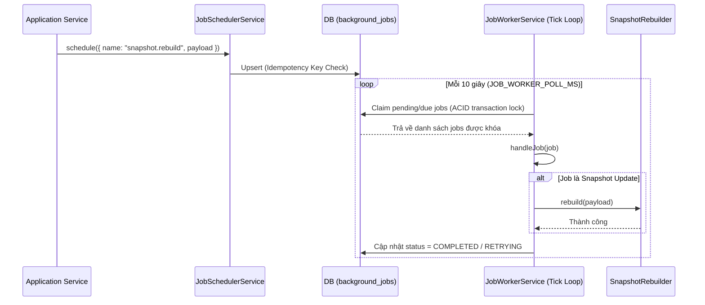

# Enterprise Background Engine Guidelines (EPIC210)

Hướng dẫn lập trình và vận hành hệ thống xử lý tác vụ ngầm (Background Engine), lập lịch công việc và xử lý lỗi tự động trong SteelTrack. Hệ thống được điều phối qua [BackgroundJobManager](file:///opt/projects/steeltrack/apps/backend-api/src/core/jobs/background-job-manager.service.ts), thực thi qua [JobWorkerService](file:///opt/projects/steeltrack/apps/backend-api/src/core/jobs/job-worker.service.ts), và giám sát thông qua Operations Center.

---

## 1. Kiến trúc Background Engine

Hệ thống xử lý ngầm hoạt động theo mô hình Pull-based trên cơ sở dữ liệu giao dịch:



---

## 2. Lập lịch & Ràng buộc Idempotency (Trùng lặp công việc)

Để tránh việc chạy trùng lặp một tác vụ nặng (ví dụ: tạo 2 tiến trình cùng rebuild một mã vật tư tại một thời điểm), mọi tác vụ bắt buộc phải khai báo khóa phân biệt duy nhất (`idempotencyKey`):

1.  **Thuật toán Tạo Khóa Idempotency**:
    Sử dụng hàm băm stable stringify có sắp xếp khóa để đảm bảo thứ tự tham số không làm thay đổi chuỗi khóa băm. Khóa sinh ra tuân thủ format: `[job_name]:[sorted_stringified_payload]`.
2.  **Khởi tạo Lập lịch**:
    ```typescript
    await this.scheduler.schedule({
      name: 'snapshot.inventory.rebuild',
      queue: 'snapshots',
      payload: { materialId: 'item_steel_001' },
      idempotencyKey: 'snapshot.inventory.rebuild:item_steel_001',
      priority: 10,       // Thứ tự ưu tiên chạy trước
      delaySeconds: 5,     // Chờ 5 giây trước khi thực thi
      maxRetries: 5,
    });
    ```

---

## 3. Chính sách Thử lại & Hộp thư Chết (Retry & Dead-Letter Queue)

Khi một background job bị lỗi trong quá trình handle, hệ thống tự động áp dụng chính sách Exponential Backoff để thử lại:

1.  **Công thức tính thời gian chờ (Backoff Math)**:
    Thời gian chờ giữa các lần thử lại tăng dần theo lũy thừa cơ số 2 để tránh làm quá tải hệ thống đang gặp lỗi (Database Lock, Mất kết nối mạng):
    $$\text{delaySeconds} = \text{baseSeconds} \times 2^{(\text{retryCount} - 1)}$$
    *Ví dụ với `baseSeconds = 10`*: Lần 1 chờ 10s, Lần 2 chờ 20s, Lần 3 chờ 40s, Lần 4 chờ 80s, Lần 5 chờ 160s.
2.  **Định nghĩa Dead-Letter Queue (DLQ)**:
    Nếu số lần thử lại vượt quá `maxRetries` (mặc định là 5), trạng thái công việc sẽ được cập nhật thành `DEAD_LETTER` trong bảng [BackgroundJob](file:///opt/projects/steeltrack/apps/backend-api/prisma/schema.prisma#L2431).
3.  **Tự động ngắt kết nối (Stale Job Isolation)**:
    Mỗi job đang chạy đều được cập nhật `heartbeatAt` định kỳ. Nếu quá 5 phút mà job không cập nhật heartbeat, hệ thống coi như tiến trình đã chết và tự động mở khóa (unlock) để worker khác nhận lại.

---

## 4. Hướng dẫn Viết Job Handler Chuẩn

Mọi Handler đăng ký trong [JobWorkerService](file:///opt/projects/steeltrack/apps/backend-api/src/core/jobs/job-worker.service.ts) phải tuân thủ nghiêm ngặt các quy tắc sau:

1.  **Tính Idempotent tự thân (Self-Idempotent)**:
    Handler phải được lập trình sao cho nếu chạy lại lần 2 với cùng payload thì không tạo ra tác dụng phụ (Side Effect) sai lệch. Ví dụ: Trước khi cập nhật balance, hãy check xem event ID đã được áp dụng vào bản ghi đích chưa.
2.  **Xử lý Lỗi & Cô lập Giao dịch**:
    Mọi ngoại lệ (Exceptions) trong handler phải được ném ra ngoài để hệ thống bắt được và cập nhật lịch sử lỗi `lastError` của Job.
3.  **Cập nhật Heartbeat cho tác vụ dài**:
    Nếu tác vụ chạy mất nhiều hơn 1 phút, handler phải định kỳ gọi hàm `updateHeartbeat()` để tránh bị hệ thống thu hồi sớm.
