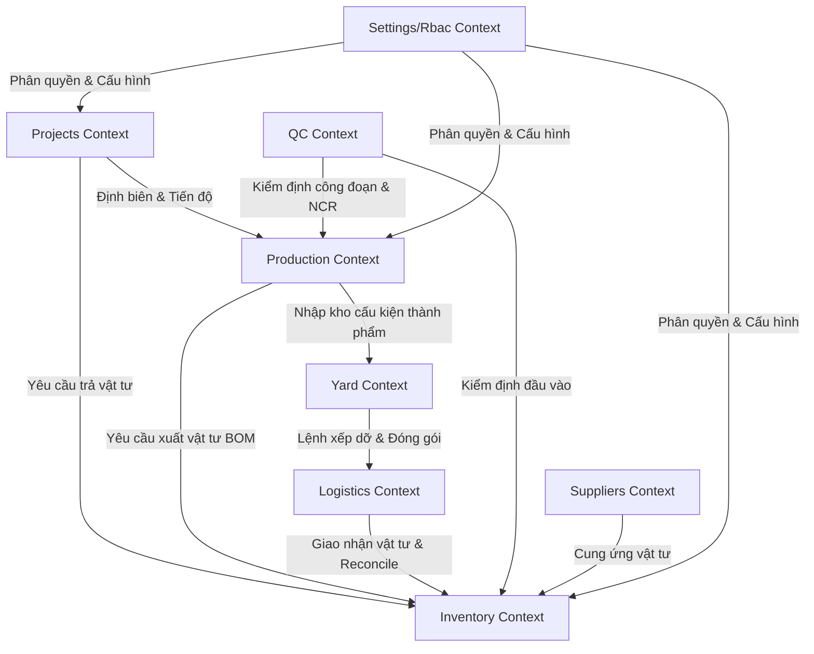

# Enterprise Domain Map & Bounded Contexts (EPIC210)

Bản vẽ kiến trúc phân vùng domain và ranh giới Context (Bounded Contexts) cho hệ thống SteelTrack ERP + MES + Yard Management.

## 1. Bản đồ Phân vùng Bounded Contexts

SteelTrack được chia thành các Bounded Contexts cốt lõi nhằm đảm bảo tính cô lập dữ liệu, tính tuần tự giao dịch và giảm thiểu tối đa coupling giữa các phân hệ:

### Phân vùng Chi tiết các Contexts:
1. **Inventory Context (`inventory`)**: Quản lý xuất, nhập, điều chuyển, kiểm kê vật tư thép hình, thép tấm, phụ kiện. Đơn vị lưu trữ chịu trách nhiệm chính về tính nhất quán của số dư tồn kho tại [InventoryLocationStock](file:///opt/projects/steeltrack/apps/backend-api/prisma/schema.prisma#L986) và [InventoryItem](file:///opt/projects/steeltrack/apps/backend-api/prisma/schema.prisma#L812).
2. **Production Context (`production`)**: Quản lý lệnh sản xuất (Manufacturing Order), tổ đội (Shifts), máy móc và thời gian dừng máy (Downtime), định mức vật tư sản xuất (BOM). Chịu trách nhiệm trực tiếp cho vòng đời của lệnh sản xuất thông qua [ProductionRepository](file:///opt/projects/steeltrack/apps/backend-api/src/modules/production/repositories/production.repository.ts).
3. **Yard Context (`yard`)**: Quản lý sơ đồ bãi xếp dỡ cấu kiện thép thành phẩm dạng 2D/3D, tọa độ vật lý của các slot lưu trữ, crane telemetry và lịch sử chuyển dịch nội bộ thông qua [YardRepository](file:///opt/projects/steeltrack/apps/backend-api/src/modules/yard/repositories/yard.repository.ts).
4. **Projects Context (`projects`)**: Quản lý tiến độ dự án (WBS - Work Breakdown Structure), phân cấp công việc [ProjectTask](file:///opt/projects/steeltrack/apps/backend-api/prisma/schema.prisma#L1186), phân bổ tài nguyên và kiểm soát chi phí thực tế so với kế hoạch thông qua [ProjectsRepository](file:///opt/projects/steeltrack/apps/backend-api/src/modules/projects/repositories/projects.repository.ts).
5. **Logistics Context (`logistics`)**: Điều hành vận chuyển xe cộ, lộ trình giao nhận cấu kiện từ bãi đến công trường dự án, xử lý sự kiện trung chuyển thông qua [LogisticsRepository](file:///opt/projects/steeltrack/apps/backend-api/src/modules/logistics/logistics.repository.ts).
6. **QC Context (`qc`)**: Thực hiện quy trình kiểm thử chất lượng (BTP, thành phẩm), quản lý NCR (Non-Conformance Reports) và cấp chứng chỉ phát hành sản phẩm trước khi chuyển bãi thông qua [QcRepository](file:///opt/projects/steeltrack/apps/backend-api/src/modules/qc/repositories/qc.repository.ts).
7. **Suppliers Context (`suppliers`)**: Hồ sơ nhà cung cấp, bảng giá, đơn mua hàng (PO).
8. **Settings & Rbac Context (`settings`/`rbac`)**: Cấu hình hệ thống toàn cục, bảo mật phân quyền RBAC dựa trên [RbacRepository](file:///opt/projects/steeltrack/apps/backend-api/src/modules/rbac/repositories/rbac.repository.ts).

---

## 2. Ranh giới Context (Context Boundaries) & Tương tác

Để tránh việc liên kết trực tiếp giữa các cơ sở dữ liệu làm phá vỡ ranh giới thiết kế, SteelTrack áp dụng các nguyên tắc tương tác nghiêm ngặt:

| Thượng nguồn (Upstream) | Hạ nguồn (Downstream) | Kiểu Mối Quan Hệ | Phương Thức Giao Tiếp | Chi Tiết Nghiệp Vụ |
| --- | --- | --- | --- | --- |
| `Inventory` | `Production` | Customer-Supplier | Transactional Outbox + Event Bus | Khi vật tư xuất xưởng phục vụ MO, Inventory phát hành `inventory.transaction.created`. Production lắng nghe để giảm trừ dự phòng BOM. |
| `Production` | `Yard` | Customer-Supplier | Outbox Events | Cấu kiện hoàn thành giai đoạn MES phát hành `production.work-order.completed`. Yard lắng nghe để tạo bản ghi cấu kiện sẵn sàng tiếp nhận tại bãi. |
| `Projects` | `Inventory` | Customer-Supplier | REST API (Repository Wrapper) | Yêu cầu trả vật tư từ công trường (`SITE_RETURN`) được gửi thông qua [POST /inventory/returns](file:///opt/projects/steeltrack/apps/backend-api/prisma/schema.prisma#L1003) tạo phiếu trả. |
| `QC` | `Production` | Upstream-Downstream | Event-driven | NCR được duyệt sẽ phát hành `qc.ncr.approved`, Production nhận tin để tự động kích hoạt Rework Order. |
| `Logistics` | `Inventory` | Conformist | REST API + Event Bus | Lệnh giao nhận hoàn tất `logistics.dispatch.completed` thực hiện tạo transaction xuất kho loại `LOGISTICS_EXPORT` thông qua [InventoryRepository](file:///opt/projects/steeltrack/apps/backend-api/src/modules/inventory/inventory.repository.ts). |

---

## 3. Quy tắc Ranh giới Dữ liệu (Anti-Corruption Layer - ACL)

1. **Không Truy vấn Chéo Database (Shared Database Avoidance)**:
   Không một Controller hay Service nào thuộc module này được phép trực tiếp import Prisma Model hoặc truy vấn bảng của module khác. Mọi thao tác đọc ghi chéo bắt buộc phải đi qua Service của module đích hoặc lắng nghe sự kiện Outbox không đồng bộ.
2. **Sử dụng DTO & Dịch thuật Mô hình (Model Translation)**:
   Khi truyền nhận dữ liệu giữa các context, bắt buộc sử dụng lớp ACL hoặc DTO để biên dịch mô hình nghiệp vụ nội bộ (Internal Domain Model) thành mô hình chia sẻ (Shared Data Contract). Ví dụ: [ProjectTaskMaterialAllocation](file:///opt/projects/steeltrack/apps/backend-api/prisma/schema.prisma#L1279) không được gửi trực tiếp sang Inventory, mà phải quy đổi thành DTO xuất kho vật tư.
3. **Tính Nhất Quán Giao Dịch (Transactional Consistency)**:
   - Trong cùng một Bounded Context: Cho phép giao dịch ACID đồng bộ sử dụng [Prisma Service Transaction](file:///opt/projects/steeltrack/apps/backend-api/src/core/prisma/prisma.service.ts).
   - Giữa các Bounded Context khác nhau: Bắt buộc sử dụng Eventual Consistency thông qua bảng [OutboxEvent](file:///opt/projects/steeltrack/apps/backend-api/prisma/schema.prisma#L2406) và Background Engine. Không chạy transaction phân tán (2PC) hay gọi REST đồng bộ lồng nhau làm tăng nguy cơ block luồng.
