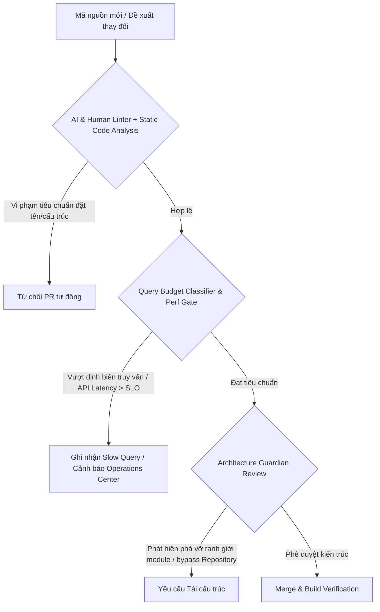
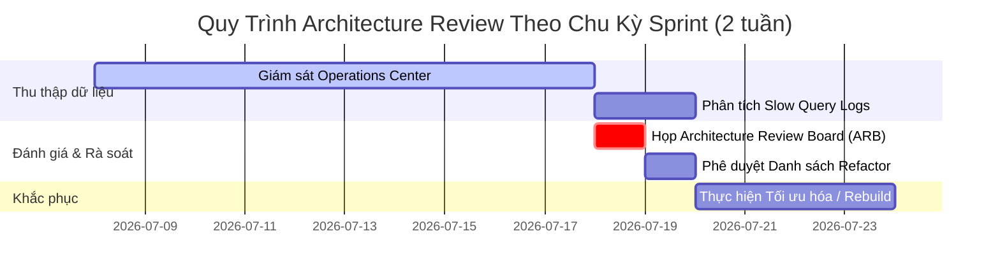

# Enterprise Architecture Governance & Quality Management

Tài liệu này đặc tả quy trình quản lý chất lượng kiến trúc phần mềm, vai trò của **Architecture Guardian** trong môi trường phát triển song hành giữa Trí tuệ Nhân tạo (AI Agents) và Lập trình viên Con người (Humans), cùng quy trình xem xét kiến trúc định kỳ (Architecture Review Process) nhằm bảo vệ tính toàn vẹn hệ thống của SteelTrack Core Platform.

---

## 1. Quy Trình Quản Lý Chất Lượng Kiến Trúc Phần Mềm (Software Architecture Quality Management)

Hệ thống SteelTrack được thiết kế dưới dạng một Modular Monolith có tính mở rộng cao và định hướng hiệu năng nghiêm ngặt. Để ngăn ngừa hiện tượng thoái hóa cấu trúc (Architecture Drift/Erosion) dưới sức ép của tiến độ phát triển nhanh, chất lượng kiến trúc được kiểm soát thông qua các cổng kiểm soát tự động và thủ công:

### 1.1. Các Trụ Cột Quản Lý Chất Lượng
1. **Tuân Thủ Ranh Giới Phân Lớp (Layer Compliance Gates)**:
   * Mọi mã nguồn xử lý nghiệp vụ mới bắt buộc phải tuân theo luồng luân chuyển dữ liệu:
     $$\text{Client} \rightarrow \text{Controller} \rightarrow \text{Service} \rightarrow \text{Repository} \rightarrow \text{Prisma ORM} \rightarrow \text{Database}$$
   * Tuyệt đối không cho phép các tầng Controller gọi trực tiếp [PrismaService](file:///opt/projects/steeltrack/apps/backend-api/src/core/prisma/prisma.service.ts) hoặc tự viết câu truy vấn thô không thông qua Repository chuyên biệt như [InventoryRepository](file:///opt/projects/steeltrack/apps/backend-api/src/modules/inventory/inventory.repository.ts) hay [ProjectsRepository](file:///opt/projects/steeltrack/apps/backend-api/src/modules/projects/repositories/projects.repository.ts).
2. **Kiểm Soát Định Biên Tài Nguyên (Query Budget Classifier)**:
   * Tích hợp decorator `@QueryBudget` (xem [query-budget.ts](file:///opt/projects/steeltrack/apps/backend-api/src/core/performance/query-budget.ts)) tại các endpoint mới để ngăn chặn truy vấn vượt mức.
   * Ngưỡng tối đa cho phép là **10 truy vấn SQL / HTTP request** và tổng thời gian truy vấn DB là **50ms**. Vượt quá ngưỡng này sẽ tự động bị đánh dấu lỗi và ghi vết vào `docs/runtime/slow-query.log`.
3. **Băng Thông Hiệu Năng API (API Latency SLO Gates)**:
   * Phải đảm bảo thời gian phản hồi (p95) dưới **200ms** cho mọi API Endpoint. Các màn hình tổng quan nặng phải chuyển dịch sang mô hình đọc Snapshot-First thông qua [SnapshotReaderService](file:///opt/projects/steeltrack/apps/backend-api/src/core/snapshots/snapshot-reader.service.ts).

---

## 2. Vai Trò Của Architecture Guardian Trong Đội Ngũ Phát Triển AI/Humans

Môi trường phát triển của SteelTrack vận hành theo cơ chế **AI-assisted & Human-guided**. Sự tham gia của các tác nhân AI (như Antigravity và các subagents) giúp đẩy nhanh tốc độ viết mã nhưng cũng tiềm ẩn rủi ro sinh mã dư thừa, vi phạm ranh giới rập khuôn, hoặc sử dụng các thư viện ngoài ý muốn. **Architecture Guardian (Vệ binh Kiến trúc)** là vai trò đảm bảo các quy tắc kiến trúc không bị vi phạm.

### 2.1. Phân Định Trách Nhiệm (Responsibility Matrix)

| Tác nhân (Actor) | Trách nhiệm phát triển / Vận hành | Giới hạn & Quyền hạn kiến trúc |
| --- | --- | --- |
| **AI Agents** | * Viết mã nguồn theo các Blueprint. * Thực hiện kiểm tra trùng lặp mã bằng Semble. * Cập nhật tài liệu trạng thái trong `docs/ai-state/`. | * **Không** tự ý thay đổi cấu trúc bảng cơ sở dữ liệu ([schema.prisma](file:///opt/projects/steeltrack/apps/backend-api/prisma/schema.prisma)) khi chưa có yêu cầu. * **Không** tự ý vượt qua các ranh giới Module. * Tuân thủ tuyệt đối [ARCHITECTURE_FREEZE.md](file:///opt/projects/steeltrack/docs/architecture/ARCHITECTURE_FREEZE.md). |
| **Human Developers** | * Triển khai logic nghiệp vụ phức tạp. * Kiểm định lại các suy luận mã của AI. * Viết các ca kiểm thử hồi quy (regression tests). | * Thực hiện review chéo mã nguồn do AI tạo. * Có quyền ghi đè (override) các quyết định thiết kế ở mức cục bộ. |
| **Architecture Guardian** | * Thiết lập tiêu chuẩn kiến trúc chung. * Giám sát việc tuân thủ các ADRs (Architecture Decision Records). * Thực hiện phê duyệt tối cao đối với các thay đổi hạ tầng cốt lõi. | * Quyền veto tuyệt đối đối với các thay đổi phá vỡ quy tắc Modular Monolith. * Chỉ định các vùng đóng băng kiến trúc. * Độc quyền phê duyệt việc cập nhật [schema.prisma](file:///opt/projects/steeltrack/apps/backend-api/prisma/schema.prisma) và tạo các tệp di cư cơ sở dữ liệu (migrations). |

### 2.2. Cơ Chế Giám Sát Chéo (Co-Piloting Safeguards)
1. **AI Checkpoint**: Trước khi triển khai các thay đổi lớn, AI Agent bắt buộc phải tạo git checkpoint (`git add .` và `git commit -m "checkpoint before task"`) và giải trình các tệp sẽ thay đổi cùng lý do thay đổi cụ thể cho Architecture Guardian duyệt.
2. **Bảo vệ Cấu trúc Cơ sở dữ liệu**: Bất kỳ sửa đổi nào đối với cấu trúc dữ liệu phải được thông báo trước. Nghiêm cấm AI Agent tự ý tạo migration trừ khi được yêu cầu tường minh trong mô tả task.
3. **Phân vùng Trách nhiệm Tác động (Scope Ownership)**:
   * Phạm vi Backend: `apps/backend-api/**`, `scripts/**`, `sql/**`, `docs/**`.
   * Phạm vi Frontend: `apps/frontend/**`, `docs/**`.
   * Tuyệt đối không thay đổi đồng thời cả mã nguồn Frontend và Backend trong cùng một lần chuyển tiếp trạng thái trừ khi có dependency giải trình rõ ràng được phê duyệt bởi Guardian.

---

## 3. Quy Trình Xem Xét Kiến Trúc Định Kỳ (Architecture Review Process)

Quy trình xem xét kiến trúc định kỳ ( định kỳ theo Sprint hoặc hàng tuần) nhằm phát hiện sớm các vấn đề về nợ kỹ thuật (Technical Debt), lệch kiến trúc, và các tắc nghẽn hiệu năng.

### 3.1. Các Bước Trong Quy Trình Review

#### Bước 1: Thu thập Dữ liệu Số liệu Kỹ thuật (Telemetry Gathering)
Mỗi tuần một lần, Architecture Guardian sẽ trích xuất dữ liệu từ các nguồn:
* Màn hình tổng quan của [Operations Center](file:///opt/projects/steeltrack/apps/backend-api/src/modules/operations-center/) qua API `/operations-center/overview` để kiểm tra độ lệch Freshness/Lag của các snapshots, tỷ lệ lỗi job, và tỷ lệ index scans.
* Tập tin logs truy vấn chậm: `docs/runtime/slow-query.log` để định vị các truy vấn SQL tốn nhiều tài nguyên.
* Điểm số kiến trúc thu thập từ [performance-metrics.service.ts](file:///opt/projects/steeltrack/apps/backend-api/src/core/performance/performance-metrics.service.ts) nhằm đánh giá mức độ vi phạm thiết kế Modular Monolith (ví dụ: các module import trực tiếp chéo nhau thay vì qua cổng giao tiếp).

#### Bước 2: Họp Duyệt Kiến Trúc (Architecture Review Board - ARB)
Thành phần tham gia bao gồm: Lead Architects, Core Guardians, đại diện Human Engineers, và AI Agent Lead (Antigravity). Các nội dung rà soát bắt buộc:
1. **Phân tích truy vấn N+1**: Rà soát các cảnh báo `queries.nPlusOneWarnings` trong logs để tối ưu hóa nạp dữ liệu (Eager Loading) hoặc chuyển sang dùng Snapshot.
2. **Đánh giá Chỉ mục (Index Audit)**: Kiểm tra các bảng có kích thước lớn (> 1,000,000 bản ghi) xem có bị tình trạng Quét tuần tự (Sequential Scan) hay không, đề xuất composite indexes theo tiêu chuẩn tại [enterprise-development-standards.md](file:///opt/projects/steeltrack/docs/architecture/enterprise-development-standards.md).
3. **Kiểm tra độ trôi lệch dữ liệu Snapshot (Parity Check)**: Đánh giá kết quả của [SnapshotValidatorService](file:///opt/projects/steeltrack/apps/backend-api/src/core/snapshots/snapshot-validator.service.ts) để phát hiện tình trạng dữ liệu Snapshot không khớp với DB giao dịch gốc.

#### Bước 3: Phê Duyệt Hành Động & Kế Hoạch Sửa Đổi
* Kết quả của phiên họp là danh sách các tác vụ tối ưu hóa được đưa vào `docs/ai-state/NEXT_TASKS.md` dưới nhóm ưu tiên cao.
* Cập nhật các quyết định kiến trúc mới (nếu có) vào [enterprise-architecture-decision-records.md](file:///opt/projects/steeltrack/docs/architecture/enterprise-architecture-decision-records.md) và tăng số hiệu phiên bản kiến trúc.
* Lên kế hoạch tái cấu trúc (Refactoring) các module có điểm kiến trúc thấp (Architecture Score < 80) trước khi bổ sung bất kỳ tính năng nghiệp vụ nào mới cho module đó.
