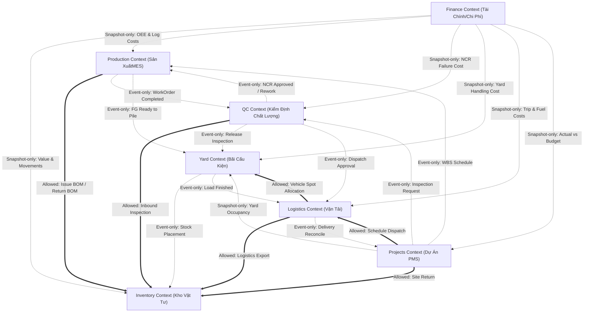

# Enterprise Module Dependency Map (SteelTrack Core Platform)

Tài liệu này định nghĩa bản đồ và ma trận ràng buộc phụ thuộc giữa các module cốt lõi trong hệ thống SteelTrack: **Inventory, Production, QC, Yard, Logistics, Projects, và Finance**.

Các quy tắc ràng buộc này nhằm đảm bảo tính toàn vẹn dữ liệu, giảm thiểu liên kết trực tiếp (low coupling), ngăn ngừa lỗi giao dịch vòng (circular transaction blocking) và đảm bảo khả năng mở rộng của hệ thống.

---

## 1. Sơ đồ Ràng buộc Phụ thuộc (Mermaid Map)

Sơ đồ dưới đây biểu diễn các liên kết giữa các module theo 4 loại ràng buộc:
*   **Allowed (Đồng bộ trực tiếp qua Repo/Service)**: Đường nét liền dày.
*   **Event-only (Bất đồng bộ qua Outbox Event)**: Đường nét đứt mảnh.
*   **Snapshot-only (Đọc precomputed snapshots)**: Đường nét chấm nét.
*   **Forbidden (Cấm hoàn toàn)**: Các liên kết không được vẽ hoặc được biểu diễn bằng ký hiệu khóa.

---

## 2. Ma trận Ràng buộc Phụ thuộc (Dependency Matrix)

Dưới đây là ma trận chi tiết quy định tương tác giữa Module Nguồn (Dòng) và Module Đích (Cột):

| Nguồn \ Đích | Inventory | Production | QC | Yard | Logistics | Projects | Finance |
| :--- | :--- | :--- | :--- | :--- | :--- | :--- | :--- |
| **Inventory** | — | **Forbidden** | **Forbidden** | **Forbidden** | **Forbidden** | **Forbidden** | **Forbidden** |
| **Production**| **Allowed** | — | **Event-only**| **Event-only**| **Forbidden** | **Forbidden** | **Forbidden** |
| **QC** | **Allowed** | **Event-only** | — | **Event-only**| **Event-only**| **Forbidden** | **Forbidden** |
| **Yard** | **Event-only**| **Forbidden** | **Forbidden** | — | **Event-only**| **Forbidden** | **Forbidden** |
| **Logistics** | **Allowed** | **Forbidden** | **Forbidden** | **Allowed** | — | **Event-only**| **Forbidden** |
| **Projects** | **Allowed** | **Event-only** | **Event-only**| **Snapshot-only**| **Allowed** | — | **Forbidden** |
| **Finance** | **Snapshot-only**| **Snapshot-only**| **Snapshot-only**| **Snapshot-only**| **Snapshot-only**| **Snapshot-only**| — |

---

## 3. Chi tiết và Định nghĩa các Ràng buộc (Constraint Definitions)

### 3.1. Ràng buộc Allowed (Đồng bộ trực tiếp)
*   **Định nghĩa**: Cho phép gọi Service trực tiếp hoặc đọc ghi thông qua Repository của module đích trong cùng một luồng giao dịch đồng bộ.
*   **Các trường hợp áp dụng**:
    1.  [ProductionRepository](file:///opt/projects/steeltrack/apps/backend-api/src/modules/production/repositories/production.repository.ts) -> [InventoryRepository](file:///opt/projects/steeltrack/apps/backend-api/src/modules/inventory/inventory.repository.ts): Yêu cầu xuất/trả vật tư theo BOM sản xuất.
    2.  [ProjectsRepository](file:///opt/projects/steeltrack/apps/backend-api/src/modules/projects/repositories/projects.repository.ts) -> [InventoryRepository](file:///opt/projects/steeltrack/apps/backend-api/src/modules/inventory/inventory.repository.ts): Dự án gửi yêu cầu trả vật tư thừa từ công trường (`SITE_RETURN`) về kho chính.
    3.  [QcRepository](file:///opt/projects/steeltrack/apps/backend-api/src/modules/qc/repositories/qc.repository.ts) -> [InventoryRepository](file:///opt/projects/steeltrack/apps/backend-api/src/modules/inventory/inventory.repository.ts): QC cập nhật trạng thái kiểm định chất lượng đầu vào của lô vật tư để mở khóa sử dụng.
    4.  [LogisticsRepository](file:///opt/projects/steeltrack/apps/backend-api/src/modules/logistics/logistics.repository.ts) -> [InventoryRepository](file:///opt/projects/steeltrack/apps/backend-api/src/modules/inventory/inventory.repository.ts): Ghi nhận giao dịch xuất kho thực tế (`LOGISTICS_EXPORT`) khi xe chở cấu kiện xuất xưởng.
    5.  [LogisticsRepository](file:///opt/projects/steeltrack/apps/backend-api/src/modules/logistics/logistics.repository.ts) -> [YardRepository](file:///opt/projects/steeltrack/apps/backend-api/src/modules/yard/repositories/yard.repository.ts): Gán slot bãi xếp dỡ tạm thời cho xe tải ra vào lấy hàng.

### 3.2. Ràng buộc Event-only (Bất đồng bộ)
*   **Định nghĩa**: Các module hoàn toàn cô lập về bộ nhớ và cơ sở dữ liệu. Mọi tương tác giao tiếp bắt buộc đi qua cơ chế xuất sự kiện bất đồng bộ qua [OutboxService](file:///opt/projects/steeltrack/apps/backend-api/src/core/outbox/outbox.service.ts) và xử lý qua [EventBusService](file:///opt/projects/steeltrack/apps/backend-api/src/core/events/event-bus.service.ts).
*   **Các trường hợp áp dụng**:
    1.  `production.work-order.completed` -> QC: Khi MES hoàn thành đơn sản xuất cấu kiện, QC tự động nhận tin để sinh checklist kiểm định bán thành phẩm.
    2.  `qc.ncr.approved` -> Production: Khi QC phê duyệt biên bản lỗi sản xuất (NCR), Production tự động sinh lệnh sản xuất lại (Rework order).
    3.  `qc.inspection.released` -> Yard: Khi QC ký duyệt chất lượng thành phẩm, Yard cập nhật trạng thái cấu kiện sẵn sàng cho xếp chồng lên bãi xuất hàng.
    4.  `yard.movement.completed` -> Inventory: Cập nhật vị trí lưu trữ thực tế của cấu kiện trên hệ thống định vị bãi.
    5.  `logistics.dispatch.completed` -> Projects: Khi đơn hàng được xác nhận giao nhận tại công trường, Projects tự động giảm trừ lượng vật tư đang phân bổ (`allocatedQuantity`) của Task và tăng lượng vật tư thực tế đã nhận.

### 3.3. Ràng buộc Snapshot-only (Đọc Snapshots)
*   **Định nghĩa**: Một module chỉ được phép đọc dữ liệu tổng hợp của module khác thông qua các bảng precomputed snapshot (lớp read-model). Nghiêm cấm gọi trực tiếp repository gốc của module đích nhằm bảo vệ hiệu năng hệ thống.
*   **Các trường hợp áp dụng**:
    1.  `Projects` -> `Yard`: Dự án hiển thị trực quan bãi Yard thông qua việc đọc snapshot sơ đồ bãi [YardRepository](file:///opt/projects/steeltrack/apps/backend-api/src/modules/yard/repositories/yard.repository.ts) thay vì quét realtime toàn bộ vị trí slot.
    2.  `Finance` -> Toàn bộ hệ thống: Module Finance thực hiện tính toán chi phí (Costing), giá thành sản phẩm và đối soát ngân sách dự án. Lớp Finance Service chỉ được phép đọc dữ liệu qua precomputed snapshots:
        *   Đọc hao hụt và tồn kho qua `InventoryDashboardSnapshot` và `MaterialDailyMovementSnapshot`.
        *   Đọc hiệu suất và thời gian downtime qua snapshot của Production.
        *   Đọc chi phí chuyến và nhiên liệu qua `LogisticsDispatchSnapshot`.

### 3.4. Ràng buộc Forbidden (Cấm)
*   **Định nghĩa**: Hành vi import trực tiếp hoặc truy vấn chéo schema của module đích bị cấm hoàn toàn.
*   **Các trường hợp điển hình**:
    1.  **Inventory gọi ngược lại Production/Yard/Logistics**: Inventory là module nền tảng, không được biết và phụ thuộc vào bất kỳ module nghiệp vụ cao cấp nào.
    2.  **Truy vấn chéo SQL**: Nghiêm cấm viết câu lệnh SQL JOIN chéo giữa bảng thuộc module này với bảng thuộc module khác (ví dụ: JOIN trực tiếp `inventory_transactions` với `project_tasks` trong SQL). Tất cả dữ liệu chéo phải được giải quyết thông qua phân rã API (API Composition) tại tầng Gateway hoặc dùng precomputed snapshots.
    3.  **Giao dịch phân tán đồng bộ (2PC)**: Không bọc các lệnh ghi của hai module khác nhau vào trong một Transaction giao dịch ACID đồng bộ. Nếu lệnh ghi của module hạ nguồn thất bại, nó phải được xử lý bù (compensation) thông qua cơ chế Eventual Consistency của Outbox.
