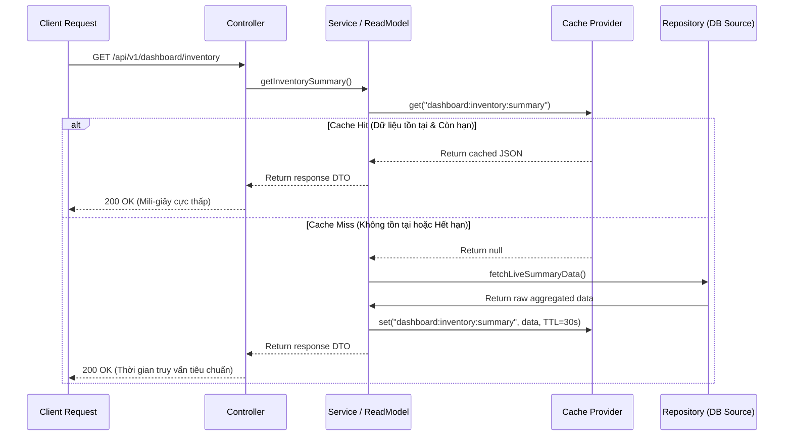

# Enterprise Read Model Catalog & Caching (EPIC210)

Danh mục các mô hình đọc dữ liệu tối ưu hóa (Read Models) và đệm dữ liệu (Caching) của hệ thống SteelTrack. Các Read Models này được thiết kế để loại bỏ các phép tính gộp (aggregations) nặng nề khỏi luồng xử lý giao dịch chính.

## 1. Chiến lược Đệm Dữ liệu (Caching & Read Model Strategy)

SteelTrack phân cấp mô hình đọc dữ liệu làm 2 loại chính:

1.  **In-Memory Cached Read Models**:
    *   **Cơ chế**: Dữ liệu được gộp động từ DB và lưu tạm vào bộ nhớ trong tiến trình (Process-Local Memory Cache) với thời gian sống ngắn (TTL - Time to Live).
    *   **Thích hợp**: Các màn hình tổng quan có tần suất xem cực cao nhưng dữ liệu thay đổi liên tục và chấp nhận độ trễ ngắn (ví dụ: dashboard tổng quan).
    *   **Tham chiếu**: [DashboardInventoryReadModelService](file:///opt/projects/steeltrack/apps/backend-api/src/modules/inventory/inventory.repository.ts) (TTL: 30 giây).
2.  **Persisted Read Models (Snapshots)**:
    *   **Cơ chế**: Dữ liệu gộp được tiền tính toán hoàn chỉnh (pre-computed) bởi các background workers và ghi trực tiếp vào các bảng cơ sở dữ liệu chuyên biệt.
    *   **Thích hợp**: Dữ liệu phân tích chi tiết, báo cáo xu hướng lịch sử, các phép gộp phức tạp qua nhiều bảng lớn (như WBS dự án hoặc biểu đồ di biến động vật tư).
    *   **Tham chiếu**: `InventoryMaterialSnapshot` và `InventoryLocationSnapshot`.

---

## 2. Danh mục Read Models & Chính sách Caching

| Tên Read Model | Phân Phối Nghiệp Vụ | Nguồn Bảng Dữ Liệu (Source Tables) | Cơ Chế Lưu Trữ & Phân Khóa (Key Format) | Chính Sách Invalidation / Cập Nhật |
| --- | --- | --- | --- | --- |
| **Dashboard Inventory Read Model** | Màn hình Dashboard Tổng quan và KPI kho chính | `inventory_items`, `inventory_location_stocks`, `inventory_transactions` | Bộ nhớ đệm (Process Memory): `dashboard:inventory:summary` | TTL 30 giây. Tự động xóa cache khi nhận sự kiện `inventory.transaction.created`. |
| **Material Detail Analytical Model** | Ngăn chi tiết vật tư, Sparklines di biến động & Forecast | `inventory_transactions`, `inventory_transaction_items`, `attachments` | Bảng DB Snapshot: `inventory_material_snapshots` Khóa: `material:{materialId}` | Cập nhật không đồng bộ (Asynchronous Rebuild) thông qua Event Worker lắng nghe sự kiện xuất/nhập/điều chuyển vật tư. |
| **Project WBS Runtime Model** | Sơ đồ cây phân rã công việc WBS, tiến độ và tài nguyên | `project_tasks`, `project_task_dependencies`, `project_task_resource` | Bộ nhớ đệm: `project:{projectId}:wbs` | Xóa cache khi có cập nhật cấu trúc WBS (`projects.task.progress-updated`, thay đổi predecessor, thêm liên kết). |
| **Yard Occupancy Map Model** | Bản đồ nhiệt 2D/3D vị trí trống, sức chứa bãi | `warehouse_zones`, `inventory_location_stocks`, `yard_movements` | Bảng DB Snapshot: `yard_occupancy_snapshot` Khóa: `yard:{warehouseId}` | Rebuild sau 2 phút hoặc cập nhật trực tiếp dòng khi nhận sự kiện dịch chuyển vị trí cấu kiện `yard.component.placed`. |
| **QC Critical Anomaly Model** | Danh sách lỗi kiểm định nghiêm trọng và NCR cảnh báo | `qc_inspections`, `non_conformance_reports` | Bộ nhớ đệm: `qc:anomalies:severity` | TTL 60 giây. Tự động xóa cache khi NCR mới được khởi tạo hoặc phê duyệt. |
| **Logistics Dispatch Suggestion Model** | Gợi ý tuyến xe tối ưu, tải trọng tối đa và điều phối | `dispatch_orders`, `vehicles`, `project_tasks` | Bộ nhớ đệm: `logistics:suggestions:{projectId}` | TTL 10 giây (yêu cầu thời gian thực cực cao khi điều xe tránh trùng lặp xe tải). |

---

## 3. Kiến trúc Caching Pattern (Read-Through Cache)

Đối với các endpoint sử dụng Cached Read Model, luồng truy xuất dữ liệu bắt buộc tuân theo sơ đồ sau:

## 4. Tiêu chuẩn Phục hồi Đệm (Cache Eviction Rules)

1.  **Tuyệt đối không Hardcode Cache Key**: Mọi phân khóa cache bắt buộc phải sinh ra từ hàm định danh chuẩn hóa như `CacheKeys.materialDetail(materialId)`.
2.  **Sử dụng Transactional Eviction**: Trong các hàm Service, lệnh xóa cache hoặc kích hoạt rebuild snapshot phải thực hiện ngay **sau** khi transaction ghi cơ sở dữ liệu đã commit thành công. Tránh tình trạng xóa cache trước, sau đó giao dịch DB bị rollback dẫn đến cache stale vĩnh viễn (Cache Stale State).
