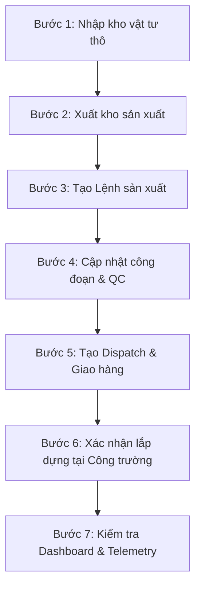

# Chính Sách Phát Hành Sản Phẩm Doanh Nghiệp (Enterprise Release Policy)

Tài liệu này quy định chính sách phát hành sản phẩm, điều kiện tiên quyết để deploy lên môi trường Production, quy trình chạy thử (Smoke Test) sau khi phát hành, và cách kích hoạt/giảm cấp (degradation)/rollback thông qua hệ thống Feature Flags của SteelTrack ERP/MES.

---

## 1. Điều Kiện Phát Hành (Release Criteria)

Trước khi thực hiện bất kỳ đợt phát hành (release/deploy) nào lên môi trường Production, phiên bản phát hành bắt buộc phải thỏa mãn đầy đủ các điều kiện sau:

### 1.1. Chất Lượng Mã Nguồn (Code Quality)
*   Được phê duyệt thông qua [Bảng Kiểm Phê Duyệt Mã Nguồn](file:///opt/projects/steeltrack/docs/architecture/enterprise-code-review-checklist.md), đảm bảo đủ 9/9 tiêu chí bắt buộc cho toàn bộ mã nguồn mới hoặc thay đổi.
*   Toàn bộ hệ thống Test tự động (Unit test, Integration test) phải vượt qua 100%.

### 1.2. Tính Tương Thích Cơ Sở Dữ Liệu (Database Migration Security)
*   Mọi thay đổi Schema trong file `schema.prisma` và các tệp migrations SQL phải đảm bảo tính tương thích ngược (Backward Compatibility). 
*   **Cấm kỵ**: Không được thực hiện các lệnh xóa bảng (Drop Table), xóa cột (Drop Column) hoặc đổi tên cột (Rename Column) trực tiếp trên database đang chạy. Mọi đợt tái cấu trúc dữ liệu phải đi qua quy trình 3 giai đoạn: *Thêm cột mới -> Đồng bộ dữ liệu cũ sang mới -> Xóa cột cũ ở bản release sau*.

### 1.3. Xác Thực Độ Chính Xác Dữ Liệu (Parity Check Staging)
*   Phiên bản release phải được triển khai trên môi trường Staging/Pre-production với cờ kiểm tra dữ liệu song song `SNAPSHOT_PARITY_CHECK = true` hoạt động liên tục trong tối thiểu 24 giờ.
*   Báo cáo log cảnh báo lệch dữ liệu (mismatch logs) từ [dashboard-reader.service.ts](file:///opt/projects/steeltrack/apps/backend-api/src/core/snapshots/dashboard-reader.service.ts) phải bằng 0.

### 1.4. Đảm Bảo SLOs Hiệu Năng (Performance Budgets)
*   Các endpoint của phiên bản mới phải chạy trong ngân sách hiệu năng quy định tại [enterprise-performance-gate.md](file:///opt/projects/steeltrack/docs/audit/enterprise-performance-gate.md) dưới tải giả lập tương đương 80% công suất Production cao điểm.

---

## 2. Quy Trình Smoke Test Sau Khi Phát Hành (Smoke Test Protocol)

Sau khi deploy lên Production thành công, Kỹ sư vận hành (DevOps/QA) bắt buộc phải thực thi quy trình chạy thử Smoke Test theo các bước nghiệp vụ liên kết dưới đây để đảm bảo luồng nghiệp vụ cốt lõi không bị gián đoạn:

### Chi tiết các bước thực hiện:

1.  **Bước 1: Nhập kho vật tư (Inbound Transaction)**
    *   Truy cập menu Nhập kho, tạo phiếu nhập vật tư thép hình thô mới.
    *   *Kỳ vọng*: Lưu phiếu thành công, tạo transaction `IMPORT`, số lượng tồn kho của vật tư tại vị trí (location) tăng tương ứng, tạo sự kiện outbox `inventory.transaction.created`.
2.  **Bước 2: Xuất kho sản xuất (Outbound Transaction)**
    *   Tạo phiếu xuất kho vật tư thép hình thô sang phân xưởng sản xuất `PRODUCTION`.
    *   *Kỳ vọng*: Tạo transaction `EXPORT`, giảm số lượng tồn kho ở `MAIN` và tăng số lượng ở `PRODUCTION`.
3.  **Bước 3: Tạo lệnh sản xuất (Work Order Creation)**
    *   Truy cập module Sản xuất, tạo Lệnh sản xuất (Work Order) liên kết với cấu kiện từ bản vẽ thiết kế.
    *   *Kỳ vọng*: Trạng thái lệnh sản xuất ghi nhận `RELEASED`.
4.  **Bước 4: Cập nhật công đoạn & Kiểm tra chất lượng (QC Inspections)**
    *   Cập nhật hoàn thành công đoạn hàn/sơn của Lệnh sản xuất, tiến hành tạo biên bản kiểm tra chất lượng QC đạt.
    *   *Kỳ vọng*: Cấu kiện chuyển sang trạng thái `READY` phục vụ xuất bãi. Ghi nhận nhật ký chất lượng thành công.
5.  **Bước 5: Tạo điều phối Logistics & Vận chuyển (Logistics Dispatch)**
    *   Tạo phiếu điều xe (Dispatch Order) vận chuyển cấu kiện `READY` từ nhà máy đến Công trường (Project site).
    *   *Kỳ vọng*: Hệ thống gợi ý tải trọng chính xác, chuyển trạng thái xe sang `DEPARTED`.
6.  **Bước 6: Nhận hàng & Lắp dựng tại Công trường (Site Site Mode & Returns)**
    *   Đăng nhập bằng tài khoản Site Operator, xác nhận xe hàng đã đến, nhận cấu kiện và cập nhật tiến độ lắp dựng tại công trường. Thực hiện hoàn trả vật tư thừa nếu có.
    *   *Kỳ vọng*: Giảm số lượng Pending Return trong Projects, tăng tồn kho hoàn trả trong kho WMS, cập nhật tiến độ lắp dựng trên biểu đồ Gantt.
7.  **Bước 7: Kiểm tra Dashboard & Telemetry hệ thống**
    *   Truy cập Trung tâm vận hành hệ thống tại `/operations-center`.
    *   *Kỳ vọng*: API `/operations-center/overview` hoạt động bình thường, không có cảnh báo nghiêm trọng (Critical alerts), bộ nhớ Heap nằm trong ngưỡng an toàn, tỉ lệ hit-ratio của snapshot/cache ổn định.

---

## 3. Kích Hoạt, Giảm Cấp & Rollback Qua Feature Flags

Hệ thống SteelTrack tích hợp sẵn cơ chế Feature Flags động tại lớp snapshots cho phép kích hoạt, cách ly lỗi, giảm cấp tính năng hoặc rollback nhanh mà không cần deploy lại mã nguồn hoặc khởi động lại hệ thống (zero-downtime).

### 3.1. Các tham số cấu hình Feature Flags
Cơ chế kiểm soát Feature Flags thông qua biến môi trường tại [snapshot-feature-flag.service.ts](file:///opt/projects/steeltrack/apps/backend-api/src/core/snapshots/snapshot-feature-flag.service.ts):

*   `USE_INVENTORY_SNAPSHOT`: Kích hoạt đọc từ Snapshot cho module Vật tư & Tồn kho (`true` / `false`).
*   `USE_PROJECT_SNAPSHOT`: Kích hoạt đọc từ Snapshot cho module Công trình & Dự án (`true` / `false`).
*   `USE_DISPATCH_SNAPSHOT`: Kích hoạt đọc từ Snapshot cho module Logistics (`true` / `false`).
*   `SNAPSHOT_MAX_AGE_SECONDS`: Thời gian tối đa snapshot được coi là hợp lệ trước khi bị đánh dấu hết hạn (stale) (mặc định: 900 giây).
*   `SNAPSHOT_PARITY_CHECK`: Kích hoạt so sánh song song dữ liệu snapshot với dữ liệu thực tế (`true` / `false`).

### 3.2. Kịch Bản Giảm Cấp Tự Động (Auto Degradation)
Khi có truy vấn yêu cầu thông tin Dashboard hoặc Read Model:
1.  Nếu flag `USE_<MODULE>_SNAPSHOT` được cấu hình là `true`: Hệ thống truy xuất dữ liệu từ bảng Snapshot.
2.  Nếu snapshot bị thiếu (`missing`), hết hạn (`stale`) vượt quá `SNAPSHOT_MAX_AGE_SECONDS`, hoặc phát hiện sai lệch dữ liệu khi `SNAPSHOT_PARITY_CHECK = true` (`mismatch`):
    *   [dashboard-reader.service.ts](file:///opt/projects/steeltrack/apps/backend-api/src/core/snapshots/dashboard-reader.service.ts) tự động chuyển hướng truy vấn đọc sang tính toán real-time từ cơ sở dữ liệu gốc (Runtime Aggregate).
    *   Ghi nhận sự kiện giảm cấp hiệu năng vào hệ thống Telemetry để Operations Center phát hiện và cảnh báo DevOps.

### 3.3. Quy Trình Rollback Thủ Công Khi Có Sự Cố (Manual Rollback Protocol)
Khi phát hiện lỗi rò rỉ bộ nhớ (memory leak), CPU spike, hoặc sai lệch số liệu nghiêm trọng trên môi trường Production sau khi phát hành:

1.  **Bước 1: Tắt Snapshot của Module bị lỗi**
    Cấu hình biến môi trường chuyển flag về `false` (ví dụ: `USE_INVENTORY_SNAPSHOT=false`). Hệ thống lập tức bỏ qua Snapshot và đọc trực tiếp từ DB.
2.  **Bước 2: Tắt Parity Check**
    Nếu việc so sánh dữ liệu thực tế gây tốn tài nguyên CPU, cấu hình `SNAPSHOT_PARITY_CHECK=false` để vô hiệu hóa parity check.
3.  **Bước 3: Thực thi Rebuild Snapshot thủ công**
    Nếu lỗi do bất đồng bộ dữ liệu (data sync lag), truy cập Trung tâm vận hành để trigger lại Background Job làm mới dữ liệu thông qua [snapshot-rebuilder.service.ts](file:///opt/projects/steeltrack/apps/backend-api/src/core/jobs/snapshot-rebuilder.service.ts).
4.  **Bước 4: Khắc phục lỗi gốc (Hotfix/Rollback Code)**
    *   Nếu lỗi nằm ở code nghiệp vụ mới, tiến hành revert PR hoặc deploy phiên bản ổn định trước đó.
    *   Tuyệt đối tuân thủ quy tắc an toàn Git: Không dùng `git reset --hard` trên nhánh chung `main` mà phải deploy commit rollback qua quy trình CI/CD tiêu chuẩn.
