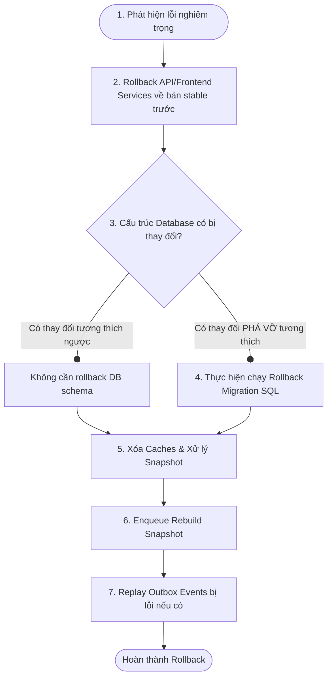

# Enterprise Versioning Policy (SteelTrack Core Platform)

Tài liệu này thiết lập chính sách quản lý phiên bản toàn diện đối với mã nguồn, API, cấu trúc cơ sở dữ liệu, lược đồ sự kiện (Event Schema), Read Model và Snapshot. Đồng thời quy định quy trình Rollback tiêu chuẩn khi xảy ra sự cố triển khai trong hệ thống SteelTrack.

---

## 1. Định dạng Phiên bản Phần mềm (Semantic Versioning - SemVer)

Mọi cấu phần của SteelTrack (Backend API, Frontend Web, Mobile Site App) đều tuân thủ quy chuẩn **Semantic Versioning 2.0.0**:

$$\text{Format: } \text{MAJOR}.\text{MINOR}.\text{PATCH}$$

*   **MAJOR**: Tăng khi có các thay đổi phá vỡ tính tương thích ngược (Breaking Changes) như: thay đổi lớn trong API Contract, cấu trúc database chính, xóa bỏ module.
*   **MINOR**: Tăng khi bổ sung chức năng mới tương thích ngược (ví dụ: bổ sung module mới, thêm tính năng báo cáo mới).
*   **PATCH**: Tăng khi sửa lỗi (Bug Fixes) tương thích ngược mà không thay đổi tính năng hay cấu trúc dữ liệu.

---

## 2. Quản lý Phiên bản API (API Versioning Strategy)

Để tránh gián đoạn dịch vụ cho các ứng dụng client (đặc biệt là ứng dụng mobile trên công trường vốn khó cập nhật liên tục), hệ thống áp dụng chiến lược phiên bản dựa trên URL:

### 2.1. Quy chuẩn Định tuyến (Routing Conventions)
*   Mọi API công khai hoặc nội bộ đều phải mang tiền tố phiên bản: `/api/v{version}/[module]/...`
    *   Ví dụ: `/api/v1/inventory/materials`, `/api/v2/production/work-orders`.
*   Phiên bản mặc định hiện tại là **v1**. Khi phát hành phiên bản **v2**, mã nguồn cũ của v1 phải được duy trì song song trong một khoảng thời gian chuyển tiếp (Grace Period) tối thiểu là **6 tháng**.

### 2.2. Chính sách Hủy bỏ Phiên bản (Deprecation Policy)
1.  **Đánh dấu**: Khi API cũ bị thay thế, Backend trả về HTTP Header `Warning: 299 - "Deprecated API"`.
2.  **Thông báo**: Tài liệu hóa API bị thay thế trong `CHANGELOG_AI.md`.
3.  **Tắt bỏ**: Sau 6 tháng Grace Period, API cũ sẽ trả về `410 Gone`.

---

## 3. Quản lý Phiên bản Cơ sở dữ liệu (Database Migrations Policy)

Hệ thống sử dụng Prisma cho thiết kế lược đồ quan hệ tại [schema.prisma](file:///opt/projects/steeltrack/apps/backend-api/prisma/schema.prisma). Để đảm bảo hệ thống có thể chạy liên tục trong lúc nâng cấp (Zero-Downtime Deployment), các quy tắc di chuyển cơ sở dữ liệu sau phải được áp dụng:

### 3.1. Quy tắc Đặt tên Migration
Mọi tệp migration SQL trong thư mục [migrations](file:///opt/projects/steeltrack/apps/backend-api/prisma/migrations/) bắt buộc tuân thủ định dạng:
$$\text{Format: } \text{YYYYMMDDHHMMSS\_[short\_descriptive\_name]}$$
Ví dụ: `20260630100000_project_task_domain.sql`.

### 3.2. Nguyên tắc Không Phá vỡ (Expand and Contract Pattern)
Nghiêm cấm việc đổi tên cột trực tiếp hoặc xóa cột đang hoạt động trong cùng một đợt release. Quy trình thay đổi cấu trúc bảng gồm 3 bước:
1.  **Giai đoạn 1 (Expand)**: Thêm cột mới hoặc bảng mới. Cả code cũ và code mới cùng hoạt động, ghi song song dữ liệu vào cả 2 cột nếu cần (Double-write).
2.  **Giai đoạn 2 (Migrate)**: Chạy một background job dịch chuyển dữ liệu lịch sử từ cột cũ sang cột mới.
3.  **Giai đoạn 3 (Contract)**: Chuyển toàn bộ luồng đọc/ghi sang cột mới. Tiến hành gỡ bỏ code liên quan đến cột cũ và chạy migration xóa cột cũ ở bản phát hành tiếp theo.

---

## 4. Quản lý Phiên bản Sự kiện (Event Schema Versioning)

Sự kiện được phát hành qua [OutboxService](file:///opt/projects/steeltrack/apps/backend-api/src/core/outbox/outbox.service.ts) và phân phối qua [EventBusService](file:///opt/projects/steeltrack/apps/backend-api/src/core/events/event-bus.service.ts) mang cấu trúc JSON.

### 4.1. Cấu trúc Payload Sự kiện
Mọi sự kiện bắt buộc chứa thông tin phiên bản lược đồ sự kiện (`eventVersion`):
```json
{
  "eventId": "evt_123456",
  "eventType": "inventory.transaction.created",
  "eventVersion": 1,
  "timestamp": "2026-07-08T16:40:00Z",
  "payload": {
    "transactionId": "tx_98765",
    "items": []
  }
}
```

### 4.2. Quy tắc Tương thích Sự kiện
*   **Tương thích ngược (Backward Compatible)**: Cho phép thêm các trường không bắt buộc (Optional/Nullable Fields). Không thay đổi kiểu dữ liệu của trường cũ.
*   **Khi có Breaking Change (Vd: xóa trường bắt buộc)**: Bắt buộc tăng `eventVersion` lên cấp số cộng (Version 2). Tạo Consumer mới để xử lý Version 2 song song với Consumer cũ xử lý Version 1.

---

## 5. Quản lý Phiên bản Snapshot & Read Model (Read Model & Snapshot Versioning)

Snapshot được lưu trữ dưới dạng JSON Payload để phục vụ truy vấn tốc độ cao (xem [persisted-snapshot-architecture.md](file:///opt/projects/steeltrack/docs/architecture/persisted-snapshot-architecture.md)). Do payload là phi cấu trúc đối với database, việc quản lý phiên bản cực kỳ quan trọng để tránh lỗi phân rã JSON (JSON Parsing Error) khi code ứng dụng thay đổi.

### 5.1. Quy định Phiên bản Snapshot
*   Mỗi bản ghi snapshot lưu trữ trong bảng (như `inventory_material_snapshots`) bắt buộc chứa trường `schemaVersion`.
*   Trường `schemaVersion` là số nguyên tự tăng đại diện cho cấu trúc JSON Payload của Snapshot đó.

### 5.2. Đồng bộ hóa Mã nguồn và Snapshot Lược đồ
*   Trong các lớp quản lý Snapshot như [InventorySnapshotRepository](file:///opt/projects/steeltrack/apps/backend-api/src/core/snapshots/inventory-snapshot.repository.ts), định nghĩa một hằng số phiên bản hiện tại:
    ```typescript
    export const CURRENT_INVENTORY_SNAPSHOT_VERSION = 2;
    ```
*   Khi ứng dụng đọc dữ liệu snapshot từ database:
    *   Nếu `schemaVersion == CURRENT_INVENTORY_SNAPSHOT_VERSION`: Trả về dữ liệu trực tiếp cho Client.
    *   Nếu `schemaVersion < CURRENT_INVENTORY_SNAPSHOT_VERSION`: Coi như snapshot bị **Stale (Lỗi thời)**. Kích hoạt luồng đọc fallback từ Transactional DB qua Repository gốc, đồng thời tự động enqueued một tác vụ nền [SnapshotRebuilder](file:///opt/projects/steeltrack/apps/backend-api/src/core/jobs/snapshot-rebuilder.service.ts) để dựng lại snapshot theo phiên bản mới nhất.

---

## 6. Quy trình Rollback khi có lỗi Triển khai (Deployment Rollback SOP)

Khi một bản phát hành ứng dụng (Release) gặp sự cố tại môi trường Staging/Production (được cảnh báo từ Operations Center hoặc phản hồi từ người dùng), đội ngũ vận hành thực hiện quy trình Rollback khẩn cấp theo các bước sau:

### Quy trình tổng quan dạng Mermaid:


### Chi tiết các bước thực hiện:

#### Bước 1: Rollback Lớp Ứng dụng (API & Frontend Services)
*   Lập tức hoàn nguyên container image (Docker) hoặc phiên bản triển khai dịch vụ Backend/Frontend về tag stable liền trước đó (ví dụ: hoàn nguyên từ `v2.1.0` về `v2.0.8`).
*   **Mục tiêu**: Nhanh chóng ngăn chặn người dùng tiếp xúc với luồng lỗi, đưa giao diện và logic ứng dụng về trạng thái ổn định.

#### Bước 2: Xử lý Lớp Cơ sở Dữ liệu (Database Migration Rollback)
*   **Trường hợp di chuyển tương thích ngược**: Giữ nguyên schema mới trong database. Do tuân thủ nguyên tắc *Expand and Contract*, code phiên bản cũ vẫn tương thích hoàn toàn với schema mới. Không cần rollback database migration nhằm tránh rủi ro mất mát dữ liệu mới phát sinh.
*   **Trường hợp bắt buộc phải rollback schema**:
    1.  Chạy script SQL hoàn nguyên tương ứng (Down Migration) để khôi phục cấu trúc.
    2.  *Lưu ý*: Chỉ thực hiện rollback schema khi đã sao lưu (backup) dữ liệu phát sinh trong thời gian lỗi để chạy đối soát (reconcile) lại sau.
    3.  Nghiêm cấm chạy `prisma migrate dev --force` trên môi trường Production.

#### Bước 3: Xử lý Lược đồ Snapshot & Clear Cache
*   Nếu đợt phát hành lỗi có thay đổi cấu trúc Snapshot hoặc Cache:
    1.  Thực hiện xóa (Flush/Clear) các khóa bộ nhớ đệm trong Redis liên quan thông qua [CacheService](file:///opt/projects/steeltrack/apps/backend-api/src/core/performance/cache.service.ts).
    2.  Đánh dấu toàn bộ các bản ghi snapshot có `schemaVersion` mới là `stale = true` trong database.
*   **Mục tiêu**: Ép ứng dụng phiên bản cũ (sau rollback) chạy luồng đọc fallback an toàn từ database giao dịch và tự động dựng lại snapshot tương thích với phiên bản cũ.

#### Bước 4: Tái xử lý và Tái phát Sự kiện (Event Replay & DLQ Repair)
1.  Nếu có sự kiện Outbox nào phát hành sai định dạng lược đồ cũ gây lỗi xử lý tại Consumer:
    *   Truy cập màn hình quản trị Operations Center hoặc bảng [BackgroundJob](file:///opt/projects/steeltrack/apps/backend-api/prisma/schema.prisma#L2431).
    *   Chuyển trạng thái các job xử lý sự kiện bị lỗi hoặc đang kẹt trong `DEAD_LETTER` về `PENDING`.
2.  Khởi động lại các worker để xử lý lại các sự kiện đó dưới logic ứng dụng ổn định đã rollback.
3.  Ghi nhật ký sự cố rollback vào [CHANGELOG_AI.md](file:///opt/projects/steeltrack/docs/ai-state/CHANGELOG_AI.md) phục vụ hậu kiểm (Post-mortem).
