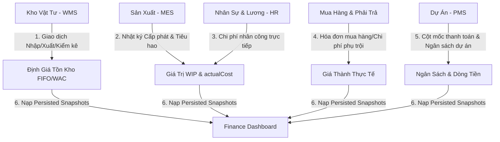
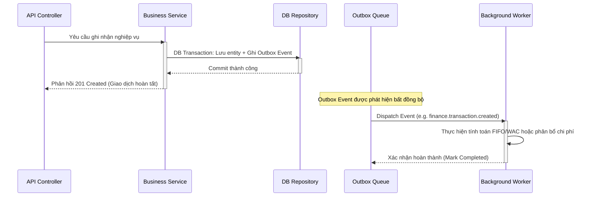
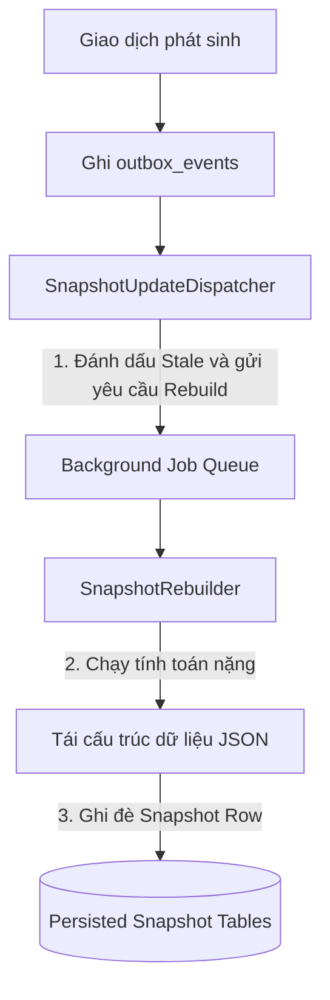
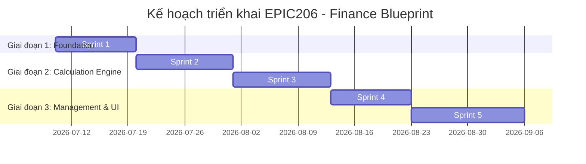

# EPIC206 – Finance Blueprint: Core Architecture & Specifications

Date: 2026-07-08
Status: APPROVED (Design Phase)

---

## 1. Executive Summary

Tài liệu này phác thảo thiết kế chi tiết cho phân hệ **Quản lý Tài chính Doanh nghiệp & Kế toán Quản trị (Finance Blueprint - EPIC206)** của SteelTrack. Phân hệ được thiết kế dựa trên kiến trúc Core Platform của SteelTrack nhằm đáp ứng các bài toán đặc thù của ngành chế tạo kết cấu thép quy mô lớn: định giá tồn kho chính xác (FIFO/WAC), tính toán giá trị bán thành phẩm (Work in Progress - WIP), kiểm soát giá thành thực tế sản xuất (Actual Costing), quản lý ngân sách dự án (Budget Control), dự báo dòng tiền (Cashflow Forecasting), và trực quan hóa dữ liệu qua tài chính dashboard.

Hệ thống tuân thủ chặt chẽ nguyên lý bất biến của sổ cái kế toán (Immutability of Ledger) và cơ chế xử lý nền không đồng bộ (Asynchronous Background Engine) qua Outbox Pattern để bảo toàn hiệu năng của hệ thống giao dịch thời gian thực (OLTP).

---

## 2. Bản Đồ Tích Hợp Hệ Thống (Integration Map)

Hệ thống tài chính là nơi hội tụ và xử lý các luồng nghiệp vụ kinh doanh và sản xuất:



---

## 3. Kiến Trúc Phân Lớp Kế Thừa (Core Architecture Integration)

Phân hệ Tài chính sử dụng lại toàn bộ cơ sở hạ tầng đã được kiểm chứng của SteelTrack:

### 3.1. Command Path (Ghi nhận Giao dịch)
Mọi bút toán tài chính đều là bất biến (immutable) và ghi nhận qua Repository Pattern để tránh race conditions.
```text
Client Transaction Request 
  -> Finance Controller (NestJS API, DTO Validation, RBAC Guard)
  -> Finance Service (Quy tắc kế toán, Kiểm tra hạn mức ngân sách)
  -> Finance Repository (Truy vấn database qua Prisma)
  -> DB Transaction (Lưu bút toán bất biến + Ghi Outbox Event atomically)
```

### 3.2. Event & Background Processing
Tính toán tài chính phức tạp (như tính lại giá FIFO ngược thời gian hoặc phân bổ chi phí khấu hao) được đẩy vào Background Engine để xử lý bất đồng bộ.
```text
Outbox Event (e.g. finance.transaction.created)
  -> EventPublisherService (Xử lý Outbox thực)
  -> JobSchedulerService (Đặt lịch công việc nền)
  -> JobWorkerService (Chạy công việc tính toán chi tiết)
  -> SnapshotRebuilder (Tính toán lại báo cáo tài chính, nạp lại snapshot)
  -> Update Snapshot Table (Bảng phẳng phục vụ đọc nhanh)
```

### 3.3. Query Path (Đọc dữ liệu báo cáo)
Dashboard và báo cáo tài chính đọc trực tiếp từ Persisted Snapshots với thời gian phản hồi cực nhanh (< 50ms), loại bỏ hoàn toàn việc tính toán tổng hợp (SUM, AVG) trên bảng lớn lúc runtime.
```text
Báo cáo / Dashboard Request
  -> Finance Controller
  -> Read Model Service
  -> Kiểm tra Finance Snapshots (Check freshness/TTL)
      -> NẾU Fresh: Trả về payload JSON ngay lập tức
      -> NẾU Stale/Missing: Fallback gọi Repository Query -> Trả về dữ liệu -> Enqueue Rebuild Job nền.
```

---

## 4. Domain Models & Database Schema Design

Đặc tả các bảng dữ liệu (tương thích với Prisma) được thiết kế phục vụ phân hệ tài chính quản trị và định giá.

```text
+------------------------------+         +------------------------------+
|     InventoryValuationLot    |         |    InventoryValuationLedger  |
|  (Theo dõi lô nhập kho FIFO) |1       *|  (Nhật ký định giá xuất kho) |
+------------------------------+         +------------------------------+
                                                ^
                                                |*
                                                |1
+------------------------------+         +------------------------------+
|          CostCenter          |1       *|       ActualCostLedger       |
|    (Trung tâm chi phí)       |-------->|   (Nhật ký giá thành thực tế)|
+------------------------------+         +------------------------------+
                                                ^
                                                |*
                                                |1
+------------------------------+         +------------------------------+
|            Budget            |1       *|          WipLedger           |
|      (Ngân sách dự án)       |-------->|   (Sổ chi tiết bán thành phẩm)|
+------------------------------+         +------------------------------+
```

### 4.1. InventoryValuationLot (Lô định giá vật tư - FIFO)
Mỗi giao dịch nhập kho tạo ra một lô định giá riêng biệt để theo dõi số lượng khả dụng và đơn giá gốc.
- `id`: String (UUID, Primary Key)
- `inventoryItemId`: String (FK liên kết với `inventory_items`)
- `warehouseId`: String (FK liên kết với `master_warehouses`)
- `transactionItemId`: String (FK liên kết với `inventory_transaction_items`, dùng để truy vết nguồn gốc)
- `receivedQty`: Decimal (Số lượng nhập gốc, độ chính xác cao)
- `remainingQty`: Decimal (Số lượng còn lại chưa bị xuất đi)
- `unitPrice`: Decimal (Đơn giá nhập kho chưa VAT)
- `totalAmount`: Decimal (Tổng giá trị lô nhập)
- `receivedAt`: DateTime (Thời điểm nhập kho, dùng để sắp xếp FIFO)
- `createdAt`: DateTime
- `updatedAt`: DateTime

### 4.2. InventoryValuationLedger (Nhật ký định giá xuất kho)
Mỗi khi phát sinh giao dịch xuất kho hoặc điều chuyển kho, hệ thống ghi nhận dòng nhật ký định giá tương ứng để làm cơ sở tính giá trị tồn kho tại bất kỳ thời điểm nào.
- `id`: String (UUID, Primary Key)
- `transactionItemId`: String (FK liên kết với `inventory_transaction_items`)
- `valuationLotId`: String (FK liên kết với `InventoryValuationLot`, nullable đối với WAC)
- `quantity`: Decimal (Số lượng xuất, giá trị âm đối với xuất kho)
- `unitPrice`: Decimal (Đơn giá áp dụng tại thời điểm xuất)
- `totalAmount`: Decimal (Tổng giá trị xuất = quantity * unitPrice)
- `method`: String (`FIFO` hoặc `WAC` tùy thuộc vào cấu hình của nhóm vật tư)
- `createdAt`: DateTime

### 4.3. CostCenter (Trung tâm chi phí)
Quản lý các bộ phận sản xuất và gián tiếp chịu trách nhiệm tích lũy chi phí.
- `id`: String (UUID, Primary Key)
- `code`: String (Unique, ví dụ: `CC-CUTTING`, `CC-WELDING`, `CC-ADMIN`)
- `name`: String (Tên trung tâm chi phí: "Tổ cắt CNC", "Tổ hàn", "Văn phòng quản lý")
- `type`: String (`PRODUCTION` - Sản xuất trực tiếp, `SUPPORT` - Hỗ trợ sản xuất, `OVERHEAD` - Gián tiếp hành chính)
- `managerId`: String (FK liên kết với `Employee`, quản lý trung tâm chi phí)
- `isActive`: Boolean (Trạng thái hoạt động)
- `createdAt`, `updatedAt`: DateTime

### 4.4. Budget (Ngân sách dự án)
Bảng quản lý kế hoạch ngân sách cho từng dự án thép.
- `id`: String (UUID, Primary Key)
- `projectId`: String (FK liên kết với `Project`)
- `code`: String (Unique, định dạng `BG-YYMMDD-XXXXX`)
- `title`: String (Tên ngân sách: "Ngân sách phần thô phân khu A")
- `totalLimit`: Decimal (Tổng hạn mức chi phí được duyệt)
- `materialLimit`: Decimal (Hạn mức cho vật tư thép)
- `laborLimit`: Decimal (Hạn mức chi phí nhân công trực tiếp)
- `subcontractLimit`: Decimal (Hạn mức gia công ngoài/thầu phụ)
- `overheadLimit`: Decimal (Hạn mức chi phí chung)
- `committedAmount`: Decimal (Chi phí đã cam kết thông qua PO đã duyệt)
- `actualSpent`: Decimal (Chi phí thực tế đã giải ngân)
- `status`: String (`DRAFT`, `PENDING_APPROVAL`, `APPROVED`, `REJECTED`, `CLOSED`)
- `tolerancePercent`: Decimal (Mức độ vượt trần cho phép trước khi cảnh báo, ví dụ: 5.0%)
- `createdAt`, `updatedAt`: DateTime

### 4.5. WipLedger (Sổ chi tiết bán thành phẩm - WIP)
Theo dõi chi tiết giá trị tích lũy của các bán thành phẩm đang nằm trên sàn sản xuất nhưng chưa đóng gói, nhập bãi hoặc qua nghiệm thu QC.
- `id`: String (UUID, Primary Key)
- `productionOrderId`: String (FK liên kết với `ProductionOrder`)
- `stageId`: String (FK liên kết với `ProductionStage`)
- `costType`: String (`MATERIAL` - Vật tư, `LABOR` - Nhân công, `MACHINE` - Giờ máy, `OVERHEAD` - Phân bổ chung)
- `referenceId`: String (ID tham chiếu đến dòng consumption hoặc bảng chấm công ca kíp)
- `debitAmount`: Decimal (Chi phí tích lũy tăng thêm)
- `creditAmount`: Decimal (Chi phí kết chuyển giảm đi khi hoàn thành/nghiệm thu nhập kho bãi)
- `balance`: Decimal (Số dư WIP tại thời điểm ghi nhận)
- `recordedAt`: DateTime

### 4.6. ActualCostLedger (Nhật ký giá thành thực tế cấu kiện)
Lưu trữ thông tin chi phí cuối cùng của cấu kiện đã hoàn thành làm cơ sở đối chiếu biên lợi nhuận.
- `id`: String (UUID, Primary Key)
- `componentId`: String (FK liên kết với `Component`, duy nhất cho mỗi cấu kiện thành phẩm)
- `productionOrderId`: String (FK liên kết với `ProductionOrder`)
- `materialCost`: Decimal (Chi phí thép thực tế tiêu hao)
- `laborCost`: Decimal (Chi phí nhân công phân bổ trực tiếp)
- `machineCost`: Decimal (Chi phí giờ máy sử dụng)
- `reworkCost`: Decimal (Chi phí sửa lỗi phát sinh từ QC NCR)
- `allocatedOverhead`: Decimal (Chi phí chung phân bổ từ Cost Center)
- `totalActualCost`: Decimal (Tổng giá thành thực tế = materialCost + laborCost + machineCost + reworkCost + allocatedOverhead)
- `unitCostPerKg`: Decimal (Đơn giá thành trên mỗi kg thép cấu kiện thành phẩm)
- `calculatedAt`: DateTime

### 4.7. CashflowForecast (Dự báo dòng tiền)
Lưu kết quả chạy phân tích và dự báo dòng tiền theo tuần/tháng.
- `id`: String (UUID, Primary Key)
- `forecastDate`: DateTime (Ngày thực hiện dự báo)
- `targetPeriod`: String (Ví dụ: "W28-2026", "2026-07")
- `type`: String (`INFLOW` - Dòng tiền vào, `OUTFLOW` - Dòng tiền ra)
- `sourceCategory`: String (`PROJECT_MILESTONE` - Thu tiền dự án, `PURCHASE_PAYMENT` - Trả nhà cung cấp, `PAYROLL` - Lương nhân viên, `OPEX` - Chi phí vận hành)
- `referenceId`: String (ID của hợp đồng, PO hoặc bảng lương liên quan)
- `predictedAmount`: Decimal (Giá trị dự báo)
- `confidenceLevel`: Decimal (Độ tin cậy: 0.0 đến 1.0)
- `createdAt`: DateTime

---

## 5. Aggregates (Mô hình Aggregate Root)

Để đảm bảo tính toàn vẹn dữ liệu trong các giao dịch tài chính lớn, hệ thống phân chia ranh giới nghiệp vụ thành 3 Aggregate chính:

```text
+------------------------------------------------------------+
| 1. InventoryValuation Aggregate (Root: InventoryValuation) |
|    - Quản lý các ValuationLot                              |
|    - Cập nhật số dư Ledger và áp đơn giá xuất kho          |
+------------------------------------------------------------+

+------------------------------------------------------------+
| 2. ActualCosting Aggregate (Root: ComponentCosting)        |
|    - Tích lũy chi phí từ WIP                               |
|    - Kết chuyển sang ActualCostLedger khi cấu kiện hoàn thành|
+------------------------------------------------------------+

+------------------------------------------------------------+
| 3. BudgetControl Aggregate (Root: ProjectBudget)            |
|    - Kiểm tra giới hạn ngân sách khi duyệt PO / xuất kho    |
|    - Ghi nhận chi phí cam kết (committed) và thực tế (spent)  |
+------------------------------------------------------------+
```

### 5.1. InventoryValuation Aggregate
- **Aggregate Root**: `InventoryValuation`
- **Chịu trách nhiệm**: Quản lý việc nạp các lô hàng có sẵn (`InventoryValuationLot`), thực hiện giải thuật trừ kho FIFO/WAC để tạo ra các bản ghi `InventoryValuationLedger` tương ứng với giao dịch xuất kho.
- **Quy tắc ràng buộc (Invariants)**:
  - Tổng số lượng khả dụng (`remainingQty`) trên tất cả các lô hoạt động của một `inventoryItemId` phải luôn khớp với số lượng tồn thực tế của vật tư đó tại thời điểm chốt.
  - Đơn giá của lô nhập (`unitPrice`) không được phép thay đổi sau khi lô đã được ghi nhận thành công.

### 5.2. ActualCosting Aggregate
- **Aggregate Root**: `ComponentCosting`
- **Chịu trách nhiệm**: Tổng hợp các khoản chi phí WIP từ lúc bắt đầu lệnh sản xuất cho đến khi QC dán tem nghiệm thu đạt chất lượng và chuyển bãi thành công.
- **Quy tắc ràng buộc (Invariants)**:
  - Chi phí kết chuyển giảm WIP (`creditAmount`) phải bằng đúng tổng chi phí đã ghi nhận tăng WIP (`debitAmount`) của lệnh sản xuất đó để đảm bảo WIP cân bằng về 0 sau khi hoàn thành sản phẩm.

### 5.3. BudgetControl Aggregate
- **Aggregate Root**: `ProjectBudget`
- **Chịu trách nhiệm**: Giám sát dòng chi của dự án. Khi một đơn mua hàng (Purchase Order) hoặc yêu cầu xuất vật tư cho dự án được tạo ra, Aggregate sẽ đối chiếu hạn mức ngân sách còn lại.
- **Quy tắc ràng buộc (Invariants)**:
  - Nếu `committedAmount + actualSpent + requestedAmount > (totalLimit * (1 + tolerancePercent))`, hệ thống sẽ chặn giao dịch và yêu cầu phê duyệt vượt cấp.

---

## 6. Event Flows (Luồng sự kiện Tài chính)

Các sự kiện tài chính được đẩy ra thông qua Outbox Pattern (bảng `outbox_events` được quản lý bởi [OutboxService](file:///opt/projects/steeltrack/apps/backend-api/src/core/outbox/outbox.service.ts)) đảm bảo không làm chậm giao dịch ghi nhận tại xưởng.



### 6.1. Danh sách sự kiện Outbox chính

#### 1. Sự kiện `inventory.transaction.completed`
Phát ra khi có một giao dịch kho (Inbound, Outbound, Transfer, Adjustment) được hoàn thành.
*   **Payload JSON mẫu**:
    ```json
    {
      "eventId": "evt-7a8b9c-12345",
      "eventType": "inventory.transaction.completed",
      "timestamp": "2026-07-08T09:30:00Z",
      "data": {
        "transactionId": "tx-260708-00045",
        "transactionType": "INBOUND",
        "warehouseId": "wh-main-01",
        "items": [
          {
            "transactionItemId": "txi-998877",
            "inventoryItemId": "item-steel-h300",
            "quantity": 12.5,
            "unitPrice": 18500000,
            "totalAmount": 231250000
          }
        ]
      }
    }
    ```

#### 2. Sự kiện `production.consumption.posted`
Phát ra khi xưởng báo cáo tiêu hao thép thực tế từ lệnh sản xuất.
*   **Payload JSON mẫu**:
    ```json
    {
      "eventId": "evt-7a8b9c-54321",
      "eventType": "production.consumption.posted",
      "timestamp": "2026-07-08T10:15:00Z",
      "data": {
        "consumptionId": "con-887766",
        "productionOrderId": "po-260708-00012",
        "stageCode": "WELDING",
        "inventoryItemId": "item-welding-wire-er70s",
        "quantity": 150.0,
        "operatorId": "emp-00456",
        "scrapQty": 5.2
      }
    }
    ```

#### 3. Sự kiện `hr.payroll.finalized`
Phát ra khi bảng lương tháng được kế toán trưởng phê duyệt để chốt chi phí nhân công.
*   **Payload JSON mẫu**:
    ```json
    {
      "eventId": "evt-7a8b9c-99999",
      "eventType": "hr.payroll.finalized",
      "timestamp": "2026-07-08T18:00:00Z",
      "data": {
        "payrollPeriodId": "prd-2026-06",
        "totalDirectLaborCost": 854500000,
        "totalIndirectLaborCost": 235000000,
        "costAllocations": [
          {
            "costCenterCode": "CC-WELDING",
            "allocatedAmount": 420000000
          },
          {
            "costCenterCode": "CC-CUTTING",
            "allocatedAmount": 310000000
          }
        ]
      }
    }
    ```

---

## 7. Read Models (Kiến trúc Đọc dữ liệu nhanh)

Để phục vụ hiển thị báo cáo tài chính ngay lập tức, phân hệ thiết kế các Read Models được đồng bộ từ nền tảng Snapshot của hệ thống:

### 7.1. Báo cáo Tồn Kho Giá Trị (`InventoryValuationSummary`)
Tối ưu hóa hiển thị giá trị tồn kho theo từng chủng loại thép và kho hàng.
- **Key**: `valuation:summary:warehouse:{warehouseId}`
- **Dữ liệu**:
  ```json
  {
    "warehouseId": "wh-main-01",
    "warehouseName": "Kho Chính 1",
    "totalValue": 15420000000,
    "lastUpdated": "2026-07-08T09:15:30Z",
    "materialBreakdown": [
      { "category": "Thép hình H", "weightTons": 450.2, "value": 8328700000 },
      { "category": "Thép tấm", "weightTons": 380.5, "value": 7091300000 }
    ]
  }
  ```

### 7.2. Tóm tắt Giá Trị Bán Thành Phẩm (`WipSummary`)
Giúp ban giám đốc biết được bao nhiêu tiền đang nằm trên sàn máy.
- **Key**: `wip:summary:project:{projectId}`
- **Dữ liệu**:
  ```json
  {
    "projectId": "proj-dong-nai-bridge",
    "projectName": "Cầu Đồng Nai",
    "totalWipValue": 4520000000,
    "breakdown": {
      "material": 3120000000,
      "labor": 850000000,
      "machine": 350000000,
      "overhead": 200000000
    },
    "stages": [
      { "stage": "CUTTING", "value": 1200000000 },
      { "stage": "ASSEMBLY", "value": 1820000000 },
      { "stage": "WELDING", "value": 1500000000 }
    ]
  }
  ```

---

## 8. Snapshot Architecture & Update Strategy

SteelTrack sử dụng bảng snapshot vật lý trong database để tăng tốc độ truy vấn báo cáo. Việc cập nhật snapshot được thực hiện bởi `SnapshotUpdateDispatcher` và `SnapshotRebuilder` độc lập với luồng transaction chính.

### 8.1. Các bảng Snapshot Tài chính
1.  `finance_dashboard_snapshots`: Lưu trữ toàn bộ dữ liệu KPI của Finance Dashboard.
2.  `wip_value_snapshots`: Lưu trữ trạng thái chi phí WIP phân rã theo dự án và công đoạn.
3.  `actual_cost_snapshots`: Lưu trữ giá thành chi tiết của cấu kiện đã hoàn thành.

### 8.2. Chiến lược cập nhật (Update Strategy)



- **Cơ chế hoạt động**:
  1. Khi nhận sự kiện `inventory.transaction.completed` hoặc `production.consumption.posted`, [SnapshotUpdateDispatcher](file:///opt/projects/steeltrack/apps/backend-api/src/core/background-engine/snapshot-update-dispatcher.ts) sẽ đánh dấu snapshot liên quan là `STALE` (lỗi thời) và đặt lịch một background job.
  2. [SnapshotRebuilder](file:///opt/projects/steeltrack/apps/backend-api/src/core/background-engine/snapshot-rebuilder.ts) lấy các dòng transaction chưa được đối chiếu trong kỳ, thực hiện cộng dồn, phân bổ chi phí, và ghi đè payload JSON mới vào bảng snapshot tương ứng.
  3. Báo cáo của người dùng sẽ luôn đọc từ Snapshot Table. Nếu Snapshot đang ở trạng thái `STALE` hoặc đang được rebuild, hệ thống sẽ trả về dữ liệu snapshot cũ kèm theo cờ thông báo `isStale: true` (độ trễ chấp nhận được trong báo cáo tài chính là dưới 5 phút).

---

## 9. Background Jobs (Tiến trình nền xử lý Tài chính)

Các background job được định nghĩa kế thừa từ `BackgroundJobManager` của hệ thống để chạy định kỳ hoặc theo sự kiện.

| Tên Job | Kích hoạt | Chu kỳ | Mô tả nghiệp vụ |
| :--- | :--- | :--- | :--- |
| `FifoValuationJob` | Sự kiện | Tức thời | Chạy ngay khi có giao dịch xuất kho để tìm lô nhập kho tương thích (FIFO), cập nhật đơn giá xuất và trừ số lượng khả dụng trên `InventoryValuationLot`. |
| `WacValuationJob` | Cron Job | Hàng đêm | Tính toán đơn giá bình quân gia quyền cuối kỳ (WAC) của toàn bộ vật tư trong tháng và cập nhật lại đơn giá xuất kho cho các giao dịch trong kỳ chốt. |
| `WipAggregationJob` | Cron Job | Mỗi 1 giờ | Quét nhật ký tiêu hao sản xuất và nhật ký ca kíp, tính tổng chi phí đã giải ngân vào sản phẩm chưa hoàn thành để cập nhật `wip_value_snapshots`. |
| `ActualCostCalculationJob` | Sự kiện | Tức thời | Khi nhận sự kiện `production.stage.completed` với công đoạn cuối cùng (`QC_PASS`), job này sẽ gom toàn bộ chi phí tích lũy từ WIP của cấu kiện đó để tính toán và chốt `ActualCostLedger`. |
| `CashflowForecastingJob` | Cron Job | 01:00 hàng ngày | Thu thập kế hoạch thanh toán từ PMS, hóa đơn mua hàng từ Supplier, và dữ liệu lương từ HR để tính toán dự báo dòng tiền 12 tuần kế tiếp. |

---

## 10. UI/UX Dashboards: Finance Command Center

Giao diện trực quan hóa dữ liệu tài chính dành cho Giám đốc Tài chính (CFO) và Kế toán trưởng, tuân thủ thiết kế tối giản, tông màu tối cao cấp (Sleek Dark Mode) và hệ thống khung KPI thống nhất của SteelTrack.

### 10.1. Sơ đồ bố cục giao diện (Layout Mockup)
```text
+-----------------------------------------------------------------------------------+
|  FINANCIAL COCKPIT                                                     [ LIVE ]   |
+-----------------------------------------------------------------------------------+
| [ KPI: Tổng Giá Trị Tồn ] [ KPI: Giá Trị WIP ] [ KPI: Chi Phí Thực Tế ] [ KPI... ] |
|   15.970,5 tr VND           4.520,0 tr VND       8.545,0 tr VND         ▲ 5,2%    |
+-----------------------------------------------------------------------------------+
|                                         |                                         |
|  BIẾN ĐỘNG NHẬP - XUẤT - TỒN KHO        |  DỰ BÁO DÒNG TIỀN 12 TUẦN TỚI           |
|  [Biểu đồ cột chồng - Grouped Bar]     |  [Biểu đồ đường - Line Chart]           |
|                                         |                                         |
+-----------------------------------------------------------------------------------+
|                                         |                                         |
|  CHI PHÍ THỰC TẾ THEO CẤU KIỆN (Top 5)  |  PHÂN BỔ CHI PHÍ THEO COST CENTER       |
|  [Bảng số liệu - Chi tiết Actual Cost]  |  [Biểu đồ tròn - Donut Chart]           |
|                                         |                                         |
+-----------------------------------------------------------------------------------+
```

### 10.2. Chi tiết các thành phần UI
1.  **KPI Strip (h-[108px])**:
    - *Tổng Giá Trị Tồn Kho*: Hiển thị giá trị tính theo VND. Delta note so sánh với đầu tháng.
    - *Giá Trị WIP (Bán thành phẩm)*: Cho biết tổng giá trị thép và nhân công đang nằm trên dây chuyền sản xuất.
    - *Chi Phí Thực Tế (COGS)*: Giá thành sản xuất tích lũy của các đơn hàng đã xuất bán hoặc nhập bãi trong tháng.
2.  **Biểu đồ Dòng tiền Dự báo**: Trực quan hóa đường thu và chi trong 12 tuần tới. Sử dụng màu xanh Cyan cho dòng tiền vào (Inflow) và màu hổ phách (Amber) cho dòng tiền ra (Outflow).
3.  **Bảng giám sát vượt ngân sách dự án (Budget Tolerance Alert)**: Hiển thị danh sách các dự án đang có chi phí cam kết vượt trên 90% hạn mức ngân sách được duyệt, có kèm nút click-through sang màn hình duyệt điều chỉnh ngân sách.

---

## 11. AI Integration (Tối ưu hóa & Dự báo bằng AI)

Phân hệ tài chính tích hợp 2 mô hình AI chạy nền phục vụ ra quyết định:

### 11.1. Dự báo dòng tiền tự động (Predictive Cashflow Modeling)
- **Thuật toán**: Tích hợp mô hình dự báo chuỗi thời gian (Prophet / LSTM) được huấn luyện từ:
  - Dữ liệu tiến độ thanh toán lịch sử của khách hàng từ PMS.
  - Lịch sử chậm trễ thanh toán của từng chủ đầu tư (độ trễ trung bình so với điều khoản hợp đồng).
  - Kế hoạch phát hành PO mua vật tư thép của phòng mua hàng.
- **Đầu ra**: Bản đồ dự báo dòng tiền thu chi kèm dải tin cậy 95%, giúp CFO phát hiện sớm các tuần có khả năng thâm hụt dòng tiền âm (Cash deficit) để chuẩn bị phương án tín dụng.

### 11.2. Phát hiện bất thường chi phí sản xuất (Cost Anomaly Detection)
- **Thuật toán**: Mô hình học máy không giám sát (Isolation Forest) giám sát dữ liệu từ `ActualCostLedger`.
- **Đầu ra**: Tự động phát hiện và cảnh báo các cấu kiện có chi phí thực tế vượt quá 1.5 lần độ lệch chuẩn so với định mức BOM (ví dụ: hao hụt thép tấm do cắt lỗi tăng vọt tại Tổ cắt CNC, hoặc công đoạn hàn tốn nhiều giờ máy hơn dự kiến). Giúp nhà quản lý phát hiện ngay sự cố kỹ thuật hoặc thất thoát vật tư tại xưởng.

---

## 12. Technical Risks & Mitigation Strategies

| Rủi ro kỹ thuật | Mức độ | Biện pháp giảm thiểu |
| :--- | :--- | :--- |
| **Nghẽn cổ chai khi tính toán lại FIFO** (FIFO recalculation storm) khi có hàng loạt giao dịch nhập xuất kho dồn dập. | Cao | Không tính toán trực tiếp trong transaction của API. Sự kiện được đẩy vào hàng đợi Outbox. Hệ thống sử dụng cơ chế gom lô (Batch Processing) để xử lý dồn dịch mỗi 5 phút hoặc khi hàng đợi đạt 100 giao dịch. |
| **Race condition khi tính WIP và Actual Cost** do dữ liệu tiêu hao từ MES gửi về liên tục cùng lúc với việc chốt bảng lương từ HR. | Trung bình | Sử dụng kỹ thuật khóa quan lạc (Optimistic Locking) dựa trên phiên bản (`version` field) của bảng `ProductionOrder` và thực hiện ghi nhận chi phí WIP dưới dạng các dòng nhật ký bất biến (`WipLedger`) thay vì cập nhật trực tiếp tổng số dư. |
| **Sai lệch giá trị tồn kho giữa sổ phụ kho (WMS) và sổ cái tài chính**. | Thấp | Thiết lập tác vụ đối chiếu tự động hàng đêm (`InventoryFinanceReconciliationJob`) kiểm tra sự khớp nhau giữa tổng tồn kho vật lý nhân đơn giá FIFO với số dư tài khoản hàng tồn kho. Nếu phát hiện chênh lệch > 0.01 VND, hệ thống sẽ đẩy cảnh báo khẩn cấp lên Operations Center. |

---

## 13. Sprint Roadmap & Implementation Plan

Quy trình phát triển phân hệ tài chính được chia nhỏ thành 5 Sprint đảm bảo bàn giao liên tục và giảm thiểu rủi ro:



### 13.1. Chi tiết các Sprint

#### Sprint 1: Database Schema & Valuation Lot Models
- **Mục tiêu**: Thiết lập các bảng cơ sở dữ liệu vật lý và viết các repository tương thích với Prisma.
- **Kết quả bàn giao**: Migration database thành công; [finance-blueprint.md](file:///opt/projects/steeltrack/docs/architecture/finance-blueprint.md) được cập nhật mã schema chính thức.

#### Sprint 2: FIFO & WAC Valuation Engine
- **Mục tiêu**: Xây dựng Core Valuation Engine xử lý giải thuật FIFO và WAC.
- **Kết quả bàn giao**: Viết xong `FifoValuationJob` và kiểm thử thành công việc tự động tính đơn giá xuất kho khi có giao dịch.

#### Sprint 3: WIP & Actual Costing Calculation
- **Mục tiêu**: Kết nối dữ liệu tiêu hao nguyên vật liệu thực tế từ MES để theo dõi số dư WIP và chốt giá thành thực tế cho cấu kiện.
- **Kết quả bàn giao**: Báo cáo WIP thời gian thực hoạt động chính xác; ghi nhận đầy đủ chi phí vật tư và nhân công cho cấu kiện.

#### Sprint 4: Budget Control & Cost Center Allocation
- **Mục tiêu**: Triển khai cơ chế kiểm soát ngân sách dự án và cấu hình phân bổ chi phí gián tiếp từ các trung tâm chi phí (Cost Center).
- **Kết quả bàn giao**: API kiểm tra hạn mức ngân sách hoạt động; giao dịch mua hàng PO tự động được đối chiếu ngân sách.

#### Sprint 5: Cashflow, Dashboards & AI Forecast
- **Mục tiêu**: Xây dựng giao diện Financial Cockpit cao cấp và tích hợp dịch vụ AI dự báo dòng tiền.
- **Kết quả bàn giao**: Báo cáo dashboard tải nhanh dưới 50ms nhờ Persisted Snapshots; cảnh báo thông minh Cost Anomaly hoạt động.
