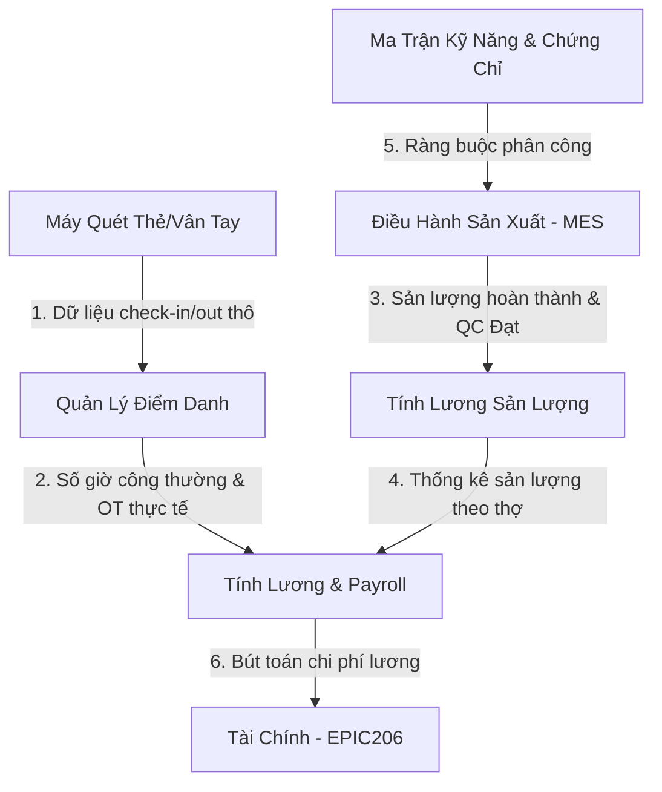
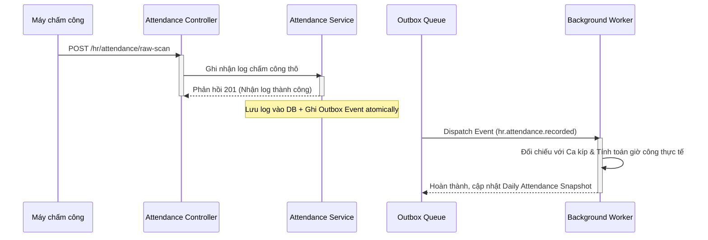
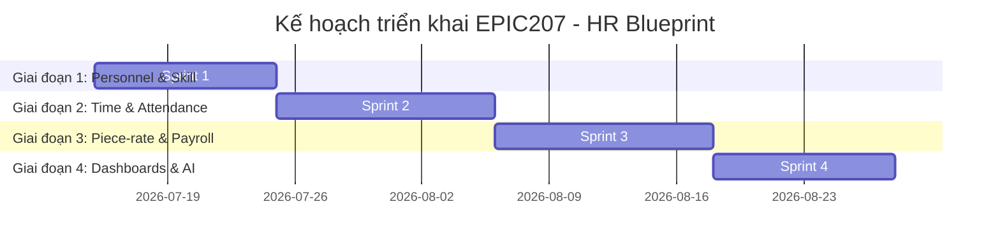

# EPIC207 – HR Blueprint: Core Architecture & Specifications

Date: 2026-07-08
Status: APPROVED (Design Phase)

---

## 1. Executive Summary

Tài liệu này phác thảo thiết kế chi tiết cho phân hệ **Quản lý Nhân sự, Ma trận Kỹ năng, Điểm danh & Lương Sản lượng (HR Blueprint - EPIC207)** của SteelTrack. Phân hệ này giải quyết bài toán đặc thù của nhà máy chế tạo kết cấu thép: quản lý thông tin nhân viên, theo dõi ma trận kỹ năng tay nghề của thợ gá/hàn, tự động đối chiếu dữ liệu điểm danh từ máy quét thẻ với ca kíp, giám sát hạn chứng chỉ vận hành thiết bị nặng, và đặc biệt là tính toán lương sản lượng (piece-rate) liên thông trực tiếp với kết quả sản xuất của phân hệ MES được QC nghiệm thu đạt chất lượng.

Hệ thống kế thừa toàn bộ kiến trúc nền tảng của SteelTrack (Repository Pattern, Outbox Pattern, Background Engine, Persisted Snapshot và Operations Center) để đảm bảo độ tin cậy, bảo mật và khả năng mở rộng tối đa.

---

## 2. Bản Đồ Tích Hợp Hệ Thống (Integration Map)

Phân hệ nhân sự kết nối trực tiếp với sản xuất và tài chính để tự động hóa dòng chảy chi phí nhân công:



---

## 3. Kiến Trúc Phân Lớp Kế Thừa (Core Architecture Integration)

Phân hệ HR tuân thủ các quy chuẩn kiến trúc của Core Platform:

### 3.1. Command Path (Ghi nhận nghiệp vụ)
Việc check-in/check-out của công nhân hoặc cập nhật Skill Matrix được ghi nhận thông qua Repository chuyên biệt để đảm bảo kiểm soát chặt chẽ các ràng buộc nghiệp vụ.
```text
Raw Scanner / Client Request
  -> HR Controller (API endpoint, Token validation, Guard)
  -> HR Service (Đối chiếu ca kíp, Validate chứng chỉ)
  -> HR Repository (Thực thi truy vấn thông qua Prisma)
  -> DB Transaction (Lưu bản ghi điểm danh + Ghi Outbox Event atomically)
```

### 3.2. Event & Background Processing
Các sự kiện điểm danh hoặc cập nhật kỹ năng sẽ kích hoạt các tiến trình nền tính toán số giờ làm việc, phát hiện đi trễ/về sớm, hoặc tái cấu trúc ma trận kỹ năng.
```text
Outbox Event (e.g. hr.attendance.recorded)
  -> EventPublisherService (Xử lý Outbox thực)
  -> JobSchedulerService (Đặt lịch chạy background job)
  -> JobWorkerService (Chạy công việc tính toán giờ công chi tiết)
  -> SnapshotRebuilder (Tái dựng snapshot điểm danh ngày, báo cáo kỹ năng)
  -> Update Snapshot Table (Payload JSON phục vụ đọc nhanh)
```

### 3.3. Query Path (Xem báo cáo & Bảng lương)
Màn hình Dashboard chấm công và theo dõi kỹ năng của xưởng sản xuất đọc trực tiếp từ Persisted Snapshots để tối ưu tốc độ phản hồi.
```text
Báo cáo chấm công / Skill Matrix Request
  -> HR Controller
  -> Read Model Service
  -> Kiểm tra HR Snapshots (Check freshness/TTL)
      -> NẾU Fresh: Trả về payload JSON ngay lập tức
      -> NẾU Stale/Missing: Fallback gọi Repository Query -> Trả về dữ liệu -> Enqueue Rebuild Job nền.
```

---

## 4. Domain Models & Database Schema Design

Đặc tả các bảng dữ liệu nhân sự, kỹ năng, chấm công, ca kíp và lương (tương thích với Prisma schema).

```text
+------------------------------+         +------------------------------+
|           Employee           |1       *|          SkillMatrix         |
|      (Thông tin nhân viên)   |-------->|   (Ma trận kỹ năng thợ)      |
+------------------------------+         +------------------------------+
        |1                                              ^
        |                                               |*
        |*                                              |1
+------------------------------+         +------------------------------+
|          Attendance          |1       *|          EmployeeSkill       |
|    (Nhật ký chấm công)       |        |   (Kỹ năng chi tiết của thợ) |
+------------------------------+         +------------------------------+
        |*                                              ^
        |                                               |*
        |1                                              |1
+------------------------------+         +------------------------------+
|            Shift             |1       *|     EmployeeCertification    |
|      (Lịch ca kíp nhà máy)   |-------->|    (Chứng chỉ nghề của thợ)  |
+------------------------------+         +------------------------------+
```

### 4.1. Employee (Thông tin Nhân viên)
Quản lý hồ sơ nhân sự, bao gồm lương cơ bản và hệ số lương sản phẩm.
- `id`: String (UUID, Primary Key)
- `employeeNo`: String (Unique, định dạng `EMP-YYMMDD-XXXXX`)
- `fullName`: String (Họ và tên nhân viên)
- `email`: String (Unique, nullable)
- `phone`: String (Số điện thoại)
- `department`: String (Bộ phận: "Sản xuất", "QC", "Văn phòng")
- `position`: String (Chức vụ: "Công nhân gá lắp", "Thợ hàn 6G", "Nhân viên kiểm tra QC")
- `employmentType`: String (`FULL_TIME` - Chính thức, `PART_TIME` - Bán thời gian, `SUBCONTRACTOR` - Lao động thầu phụ)
- `baseSalary`: Decimal (Lương cơ bản tháng phục vụ đóng BHXH và tính ngày công thường)
- `pieceRateCoefficient`: Decimal (Hệ số lương sản lượng cá nhân, ví dụ: 1.0 cho thợ chính, 0.8 cho thợ phụ)
- `status`: String (`ACTIVE`, `SUSPENDED`, `TERMINATED`)
- `hiredAt`: DateTime (Ngày vào làm)
- `createdAt`, `updatedAt`: DateTime

### 4.2. Skill (Danh mục kỹ năng sản xuất kết cấu thép)
Định nghĩa các kỹ năng nghiệp vụ có trong nhà máy.
- `id`: String (UUID, Primary Key)
- `code`: String (Unique, ví dụ: `SK-PLASMA-CUT`, `SK-FITUP`, `SK-CO2-WELD`, `SK-PAINT-EPOXY`)
- `name`: String (Tên kỹ năng: "Cắt thép tấm Plasma CNC", "Gá lắp dầm kết cấu", "Hàn khí bảo vệ CO2", "Sơn phủ epoxy chống rỉ")
- `description`: String (Mô tả chi tiết yêu cầu kỹ năng)

### 4.3. EmployeeSkill (Chi tiết trình độ kỹ năng của nhân viên)
Theo dõi cấp độ tay nghề hiện tại của từng nhân viên.
- `id`: String (UUID, Primary Key)
- `employeeId`: String (FK liên kết với `Employee`)
- `skillId`: String (FK liên kết với `Skill`)
- `level`: Int (Cấp độ: 1 - Học việc, 2 - Làm việc dưới giám sát, 3 - Độc lập, 4 - Chuyên gia/Hướng dẫn)
- `certifiedAt`: DateTime (Ngày đánh giá đạt trình độ)
- `evaluatorId`: String (FK liên kết với `Employee`, người đánh giá tay nghề)
- `createdAt`, `updatedAt`: DateTime

### 4.4. Shift (Ca sản xuất)
Bảng định nghĩa lịch ca kíp trong nhà máy.
- `id`: String (UUID, Primary Key)
- `code`: String (Unique, ví dụ: `SH-MORNING`, `SH-AFTERNOON`, `SH-NIGHT`, `SH-OFFICE`)
- `name`: String (Tên ca: "Ca Sáng", "Ca Chiều", "Ca Đêm", "Ca Hành Chính")
- `startTime`: String (Giờ bắt đầu, định dạng "HH:mm", ví dụ: "06:00")
- `endTime`: String (Giờ kết thúc, định dạng "HH:mm", ví dụ: "14:00")
- `gracePeriodMinutes`: Int (Thời gian đi trễ cho phép không trừ công, ví dụ: 10 phút)
- `overtimeRate`: Decimal (Hệ số tính OT của ca, ví dụ: 1.5 cho ngày thường, 2.0 cho ca đêm)
- `isActive`: Boolean

### 4.5. Attendance (Nhật ký Điểm danh)
Ghi nhận giờ công thực tế quét từ thiết bị phần cứng đầu cuối.
- `id`: String (UUID, Primary Key)
- `employeeId`: String (FK liên kết với `Employee`)
- `shiftId`: String (FK liên kết với `Shift`, nullable nếu đi làm không theo ca)
- `workDate`: DateTime (Ngày ghi nhận công)
- `checkIn`: DateTime (Thời điểm check-in thực tế)
- `checkOut`: DateTime (Thời điểm check-out thực tế, nullable khi đang trong ca)
- `standardHours`: Decimal (Số giờ làm việc thường đã đối chiếu)
- `overtimeHours`: Decimal (Số giờ tăng ca đã đối chiếu)
- `status`: String (`PRESENT` - Đi làm đủ, `LATE` - Đi trễ, `EARLY_LEAVE` - Về sớm, `ABSENT` - Vắng mặt, `NO_CHECKOUT` - Quên quét vân tay ra)
- `rawLogId`: String (ID tham chiếu log quét thẻ gốc để đối chiếu chéo)
- `createdAt`: DateTime

### 4.6. Certification & EmployeeCertification (Chứng chỉ nghề nghiệp)
Giám sát năng lực đặc thù và an toàn lao động.
- `Certification` (Danh mục chứng chỉ):
  - `id`: String (UUID, Primary Key)
  - `code`: String (Unique, ví dụ: `CERT-WELD-6G`, `CERT-FORKLIFT`, `CERT-CRANE`)
  - `name`: String (Chứng chỉ hàn áp lực 6G, Chứng chỉ vận hành xe nâng, Chứng chỉ chỉ huy cẩu trục)
  - `issuingAuthority`: String (Đơn vị cấp chứng chỉ)
- `EmployeeCertification` (Chứng chỉ của nhân viên):
  - `id`: String (UUID, Primary Key)
  - `employeeId`: String (FK liên kết với `Employee`)
  - `certificationId`: String (FK liên kết với `Certification`)
  - `certificateNo`: String (Số chứng chỉ vật lý)
  - `issuedDate`: DateTime (Ngày cấp)
  - `expiryDate`: DateTime (Ngày hết hạn, dùng để lập cảnh báo)
  - `attachmentUrl`: String (Đường dẫn lưu file đính kèm chứng chỉ scan)
  - `status`: String (`VALID` - Còn hạn, `EXPIRED` - Hết hạn, `SUSPENDED` - Tạm ngưng)

### 4.7. ProductionPieceRate (Định mức lương sản lượng theo công đoạn)
Thiết lập đơn giá nhân công cho mỗi kg thép cấu kiện được gia công thành công theo công đoạn.
- `id`: String (UUID, Primary Key)
- `stageCode`: String (Ví dụ: `CUTTING`, `ASSEMBLY`, `WELDING`, `PAINTING`)
- `componentType`: String (Loại cấu kiện: dầm chữ H, dầm hộp, giằng, bản mã)
- `ratePerKg`: Decimal (Đơn giá VND nhận được cho mỗi kg thép hoàn thành)
- `minRequiredLevel`: Int (Cấp độ kỹ năng tối thiểu yêu cầu để được phân công công việc này)
- `isActive`: Boolean

### 4.8. EmployeePayroll (Chi tiết bảng lương tháng của nhân viên)
Lưu trữ bảng lương chốt cuối kỳ.
- `id`: String (UUID, Primary Key)
- `employeeId`: String (FK liên kết với `Employee`)
- `payrollPeriod`: String (Ví dụ: "2026-06")
- `standardDaysCount`: Decimal (Số ngày công thường đạt được)
- `timeSalary`: Decimal (Lương tính theo thời gian làm việc thực tế = baseSalary * (ngày công thực tế / ngày công tiêu chuẩn))
- `pieceRateSalary`: Decimal (Lương sản lượng tích lũy từ kết quả sản xuất đã QC phê duyệt)
- `allowances`: Decimal (Các khoản phụ cấp: ăn trưa, độc hại, xăng xe)
- `insuranceDeduction`: Decimal (Khoản trừ bảo hiểm xã hội)
- `taxDeduction`: Decimal (Khoản trừ thuế TNCN)
- `netPayable`: Decimal (Thực lĩnh = timeSalary + pieceRateSalary + allowances - deductions)
- `status`: String (`DRAFT`, `PENDING_APPROVAL`, `APPROVED`, `PAID`)

---

## 5. Aggregates (Mô hình Aggregate Root)

Phân hệ Nhân sự & Chấm công chia làm 3 Aggregate chính:

```text
+------------------------------------------------------------+
| 1. EmployeeManagement Aggregate (Root: Employee)           |
|    - Quản lý thông tin hồ sơ nhân sự                       |
|    - Cập nhật EmployeeSkill và EmployeeCertification       |
+------------------------------------------------------------+

+------------------------------------------------------------+
| 2. TimeAndAttendance Aggregate (Root: DailyAttendance)     |
|    - Nhận dữ liệu chấm công từ thiết bị                    |
|    - Đối chiếu ca kíp tính Hours & OT                      |
+------------------------------------------------------------+

+------------------------------------------------------------+
| 3. Payroll Aggregate (Root: MonthlyPayroll)                |
|    - Tổng hợp giờ công thường & OT từ Attendance           |
|    - Thu thập sản lượng hoàn thành từ ProductionLog        |
|    - Áp đơn giá ProductionPieceRate để tính lương sản phẩm |
+------------------------------------------------------------+
```

### 5.1. EmployeeManagement Aggregate
- **Aggregate Root**: `Employee`
- **Chịu trách nhiệm**: Quản lý hồ sơ lý lịch, cập nhật nâng bậc kỹ năng (`EmployeeSkill`) và gia hạn chứng chỉ nghề nghiệp (`EmployeeCertification`).
- **Quy tắc ràng buộc (Invariants)**:
  - Một nhân viên không thể có hai bản ghi kỹ năng trùng lặp cho cùng một loại `Skill` tại một thời điểm. Cấp bậc kỹ năng sau khi cập nhật phải cao hơn hoặc bằng cấp bậc cũ.
  - Chứng chỉ hết hạn (`expiryDate < currentDate`) sẽ tự động chuyển trạng thái `EmployeeCertification.status` sang `EXPIRED`.

### 5.2. TimeAndAttendance Aggregate
- **Aggregate Root**: `DailyAttendance` (Đại diện cho bản ghi điểm danh trong một ngày của nhân viên)
- **Chịu trách nhiệm**: Đối chiếu thời gian quét thẻ thực tế `checkIn` / `checkOut` với cấu hình giờ làm việc của `Shift` được phân công.
- **Quy tắc ràng buộc (Invariants)**:
  - `checkOut` phải có mốc thời gian lớn hơn `checkIn`.
  - Số giờ tăng ca `overtimeHours` chỉ được tính sau khi số giờ công thường `standardHours` đã đạt mức tối đa của ca đó (ví dụ: 8 giờ).

### 5.3. Payroll Aggregate
- **Aggregate Root**: `MonthlyPayroll`
- **Chịu trách nhiệm**: Tập hợp toàn bộ dữ liệu chấm công và lịch sử gia công cấu kiện thực tế của công nhân trong tháng để tính toán lương sản lượng chốt sổ lương cuối kỳ.
- **Quy tắc ràng buộc (Invariants)**:
  - Lương sản lượng chỉ được tính đối với các cấu kiện đã có trạng thái QC là `PASSED` hoặc `APPROVED` trong phân hệ QMS. Những cấu kiện lỗi đang trong quá trình Rework sẽ bị treo lương sản lượng cho đến khi khắc phục xong.

---

## 6. Event Flows (Luồng sự kiện Nhân sự)

Ghi nhận điểm danh và cập nhật chứng chỉ kích hoạt Outbox events thông qua [OutboxService](file:///opt/projects/steeltrack/apps/backend-api/src/core/outbox/outbox.service.ts) phục vụ xử lý nền.



### 6.1. Danh sách sự kiện Outbox chính

#### 1. Sự kiện `hr.attendance.recorded`
Phát ra ngay khi máy chấm công gửi bản ghi check-in/out về hệ thống.
*   **Payload JSON mẫu**:
    ```json
    {
      "eventId": "evt-hr-11111",
      "eventType": "hr.attendance.recorded",
      "timestamp": "2026-07-08T06:05:22Z",
      "data": {
        "employeeId": "emp-weld-0012",
        "employeeNo": "EMP-260708-00045",
        "scanTime": "2026-07-08T06:01:00Z",
        "scanType": "CHECK_IN",
        "deviceCode": "DEVICE-GATE-02"
      }
    }
    ```

#### 2. Sự kiện `hr.certification.expired`
Phát ra bởi tiến trình nền quét tự động hàng tuần khi phát hiện chứng chỉ của công nhân hết hạn hiệu lực.
*   **Payload JSON mẫu**:
    ```json
    {
      "eventId": "evt-hr-22222",
      "eventType": "hr.certification.expired",
      "timestamp": "2026-07-08T00:00:05Z",
      "data": {
        "employeeId": "emp-crane-0033",
        "employeeNo": "EMP-240115-00012",
        "fullName": "Nguyễn Văn Hùng",
        "certificationCode": "CERT-CRANE",
        "certificationName": "Chứng chỉ vận hành cầu trục",
        "expiryDate": "2026-07-07T23:59:59Z"
      }
    }
    ```

---

## 7. Read Models & Snapshots

Hệ thống chấm công và ma trận kỹ năng đòi hỏi tốc độ truy xuất nhanh để phục vụ quản đốc phân xưởng phân công ca kíp hàng ngày.

### 7.1. Đọc nhanh Trạng thái Điểm danh Ngày (`DailyAttendanceReadModel`)
Dùng để quản đốc kiểm tra quân số đầu ca tại phân xưởng.
- **Key**: `attendance:daily:{workDate}:dept:{department}`
- **Dữ liệu**:
  ```json
  {
    "workDate": "2026-07-08",
    "department": "Sản xuất",
    "totalExpected": 120,
    "presentCount": 115,
    "lateCount": 3,
    "absentCount": 5,
    "workersPresent": [
      { "employeeId": "emp-weld-0012", "name": "Trần Văn Nam", "status": "PRESENT", "checkIn": "05:55:00" },
      { "employeeId": "emp-weld-0015", "name": "Lê Văn Tám", "status": "LATE", "checkIn": "06:12:00" }
    ]
  }
  ```

### 7.2. Snapshot Ma Trận Kỹ Năng Nhà Máy (`SkillMatrixSnapshot`)
Phục vụ màn hình trực quan hóa kỹ năng công nhân, hiển thị dạng lưới (Matrix Grid).
- **Cập nhật**: Khi có sự kiện nâng bậc kỹ năng (`hr.skill.updated`) hoặc chứng chỉ hết hạn (`hr.certification.expired`), [SnapshotUpdateDispatcher](file:///opt/projects/steeltrack/apps/backend-api/src/core/background-engine/snapshot-update-dispatcher.ts) kích hoạt [SnapshotRebuilder](file:///opt/projects/steeltrack/apps/backend-api/src/core/background-engine/snapshot-rebuilder.ts) vẽ lại ma trận và lưu vào bảng snapshot vật lý.

---

## 8. Background Jobs (Tiến trình nền xử lý Nhân sự)

Các tác vụ nền chạy bằng `BackgroundJobManager` của SteelTrack:

| Tên Job | Kích hoạt | Chu kỳ | Mô tả nghiệp vụ |
| :--- | :--- | :--- | :--- |
| `AttendanceReconciliationJob` | Cron Job | 23:30 hàng ngày | Quét toàn bộ log check-in/out thô của ngày, đối chiếu với lịch phân ca kíp để tính số giờ công tiêu chuẩn (`standardHours`), giờ tăng ca (`overtimeHours`) và chốt trạng thái đi làm (`status`). |
| `PayrollCalculationJob` | Sự kiện / Thủ công | Cuối kỳ chốt công | Tổng hợp công từ bảng điểm danh tháng và tổng lượng sản phẩm kết cấu thép hoàn thành được QC phê duyệt của từng công nhân để tính toán bảng lương `EmployeePayroll`. |
| `CertificationExpiryCheckerJob` | Cron Job | 00:00 thứ Hai hàng tuần | Quét bảng chứng chỉ nhân viên `EmployeeCertification` tìm các dòng có `expiryDate` nằm trong 30 ngày tiếp theo để gửi cảnh báo khẩn cấp lên màn hình Dashboard và gửi thông báo qua email/SMS cho phòng nhân sự. |

---

## 9. UI/UX Dashboards: HR & Skill Matrix Control Room

Giao diện quản trị nhân sự và ma trận kỹ năng dành cho Giám đốc nhân sự (CHRO) và Quản đốc phân xưởng, kế thừa triết lý thiết kế tối giản, trực quan cao cấp (Industrial Dark Theme) của SteelTrack.

### 9.1. Thiết kế Ma trận kỹ năng (Skill Matrix Grid Layout)
```text
+-----------------------------------------------------------------------------------+
|  SKILL MATRIX CONTROL CENTER                                           [ LIVE ]   |
+-----------------------------------------------------------------------------------+
| Bộ lọc: [Tất cả bộ phận]  [Kỹ năng: Hàn CO2]  [Trạng thái chứng chỉ: Còn hạn]    |
+-----------------------------------------------------------------------------------+
| CÔNG NHÂN         | CẮT PLASMA | GÁ LẮP CẤU KIỆN | HÀN CO2 (6G)   | SƠN PHỦ EPOXY |
+-------------------+------------+-----------------+----------------+---------------+
| Nguyễn Văn Hùng   | [ Lvl 4 ]  | [ Lvl 2 ]       | [ Lvl 1 ]      | [ --- ]       |
| Trần Văn Nam      | [ --- ]    | [ Lvl 4 ]       | [ Lvl 4 ] (📎) | [ Lvl 2 ]     |
| Lê Văn Tám        | [ Lvl 1 ]  | [ Lvl 3 ]       | [ Lvl 3 ]      | [ Lvl 4 ]     |
+-----------------------------------------------------------------------------------+
| Ghi chú: (📎) Kèm chứng chỉ số hiệu CERT-WELD-6G còn hiệu lực.                    |
+-----------------------------------------------------------------------------------+
```

### 9.2. Chi tiết các thành phần UI
1.  **Skill Grid Tab**: Hiển thị danh sách công nhân theo dòng và các loại kỹ năng sản xuất thép theo cột. Mỗi ô hiển thị Cấp độ kỹ năng (Level 1-4) có màu sắc trực quan (Lvl 1: Xanh nhạt, Lvl 4: Cyan rực rỡ đại diện cho tay nghề cao). Click vào ô để xem lịch sử nâng bậc và tải về chứng chỉ nghề đính kèm.
2.  **Attendance KPI Summary (h-[108px])**:
    - *Quân số hiện diện*: Tỷ lệ công nhân đã check-in thành công so với kế hoạch đầu ca.
    - *Đi trễ/Về sớm*: Số lượng công nhân ghi nhận đi trễ hoặc về sớm hôm nay.
    - *Cảnh báo chứng chỉ*: Số lượng chứng chỉ vận hành thiết bị/an toàn lao động sắp hết hạn trong 30 ngày tới.

---

## 10. AI Integration (Tích hợp Trí tuệ Nhân tạo)

Phân hệ nhân sự tích hợp 2 tính năng AI thông minh hỗ trợ vận hành nhà máy:

### 10.1. Tự động đề xuất phân ca và bố trí công việc (Smart Work Assignment AI)
- **Thuật toán**: Giải thuật tối ưu hóa ràng buộc kết hợp mạng nơ-ron gợi ý phân bổ.
- **Đầu ra**: Khi điều phối viên sản xuất tạo lệnh gia công cấu kiện thép phức tạp yêu cầu tay nghề hàn cao (ví dụ: hàn dầm hộp chịu lực lớn), AI sẽ quét cơ sở dữ liệu `SkillMatrixSnapshot` để gợi ý những công nhân có cấp độ kỹ năng `Level 3-4` và chứng chỉ `CERT-WELD-6G` đang trống lịch hoặc đang trong ca làm việc, đảm bảo chất lượng gia công cao nhất và hạn chế lỗi QC.

### 10.2. Dự báo rủi ro nghỉ việc và thiếu hụt nhân sự (Turnover & Resource Risk Predictor)
- **Thuật toán**: Mô hình học máy phân lớp (Random Forest / Gradient Boosting) phân tích:
  - Lịch sử số ngày nghỉ phép, đi trễ, số giờ tăng ca làm việc quá tải liên tục.
  - Biến động thu nhập từ lương sản lượng trong 3 tháng gần nhất.
- **Đầu ra**: Đánh giá chỉ số rủi ro nghỉ việc của nhân viên chủ chốt (thợ hàn lành nghề, quản đốc). Dự báo nhu cầu nhân sự trong 3 tháng tới dựa trên tiến độ dự án thép được ký mới từ PMS giúp phòng nhân sự chuẩn bị kế hoạch tuyển dụng và đào tạo thay thế kịp thời.

---

## 11. Technical Risks & Mitigation Strategies

| Rủi ro kỹ thuật | Mức độ | Biện pháp giảm thiểu |
| :--- | :--- | :--- |
| **Quá tải thiết bị chấm công đầu ca** (Check-in storm) khi hàng ngàn công nhân quét thẻ cùng lúc trong khoảng thời gian ngắn (10-15 phút trước giờ vào ca). | Cao | Thiết lập một dịch vụ đệm ghi nhận log thô siêu nhẹ bằng Redis (Ingestion Buffer). API Controller của thiết bị chấm công chỉ ghi dữ liệu thô vào hàng đợi Redis và trả về kết quả 201 ngay lập tức. Một Background Worker sẽ kéo dữ liệu từ Redis ra xử lý đối chiếu ca kíp bất đồng bộ, loại bỏ nguy cơ nghẽn cơ sở dữ liệu chính. |
| **Race condition khi tính lương sản lượng**. Nhiều công nhân cùng tham gia gá lắp hoặc hàn trên một cấu kiện lớn dẫn đến tranh chấp đóng góp sản lượng. | Trung bình | Định nghĩa rõ ràng quy tắc chia sẻ đóng góp trong `ProductionStage` (ví dụ: chia đều sản lượng dầm theo tỷ lệ phần trăm được xác nhận bởi tổ trưởng tổ sản xuất hoặc chia theo số giờ công đóng góp trực tiếp của từng người ghi nhận trong `ProductionLog`). |
| **Lỗi đồng bộ dữ liệu điểm danh khi mất kết nối mạng** tại thiết bị đầu cuối ở xưởng. | Trung bình | Thiết kế cơ chế ID duy nhất (`rawLogId`) do máy chấm công tự sinh theo thuật toán mã hóa thời gian để tránh trùng lặp bản ghi khi thiết bị tự động gửi lại (retry) dữ liệu cũ sau khi khôi phục kết nối mạng. |

---

## 12. Sprint Roadmap & Implementation Plan

Lộ trình phát triển phân hệ nhân sự được chia thành 4 Sprint chính:



### 12.1. Chi tiết các Sprint

#### Sprint 1: Employee Profiles & Skill Matrix
- **Mục tiêu**: Xây dựng hồ sơ nhân sự, bảng danh mục kỹ năng, ma trận năng lực và theo dõi chứng chỉ.
- **Kết quả bàn giao**: Quản lý hồ sơ nhân viên và xem ma trận kỹ năng hoạt động tốt trên môi trường staging.

#### Sprint 2: Shift, Attendance & Sync Engine
- **Mục tiêu**: Phát triển module quản lý ca kíp phức tạp, cổng tích hợp nhận dữ liệu điểm danh từ phần cứng và bộ máy đối chiếu giờ công nền.
- **Kết quả bàn giao**: Dữ liệu chấm công tự động đồng bộ và tính giờ công/OT chính xác hàng ngày.

#### Sprint 3: Piece-rate & Payroll Integration
- **Mục tiêu**: Xây dựng bảng định mức lương sản lượng theo kg thép, liên kết trực tiếp với dữ liệu nghiệm thu QC từ MES để tính lương sản phẩm tự động.
- **Kết quả bàn giao**: Chốt bảng lương cuối tháng chính xác, không còn sai sót hay tranh chấp về khối lượng sản lượng sản xuất của thợ.

#### Sprint 4: UI, Dashboards & AI Rostering
- **Mục tiêu**: Hoàn thiện giao diện HR Dashboard, bộ ma trận kỹ năng tương tác và tích hợp AI gợi ý phân công lao động thông minh.
- **Kết quả bàn giao**: Hệ thống vận hành trơn tru, hiển thị dữ liệu trực quan tức thì nhờ hệ thống Persisted Snapshots được tích hợp hoàn toàn.
