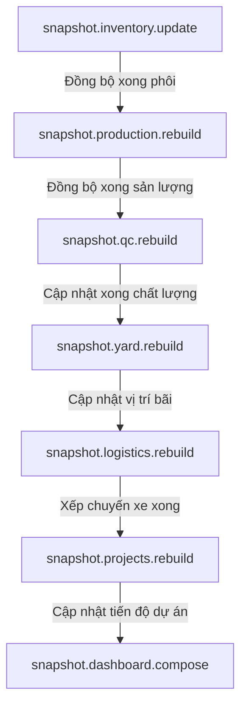

# EPIC209 – Enterprise Integration Blueprint

> **ADS001 precedence (2026-07-17):** This blueprint describes intended value
> flow. Aggregate, command, publisher, query and write ownership is governed by
> `domain-ownership-matrix.md`. Any example that implies a consumer can mutate
> another context's tables is non-normative. Exact event payloads and versions
> remain subject to ADS004.

Ngày: 2026-07-08
Trạng thái: ĐÃ PHÊ DUYỆT (Giai đoạn Thiết kế)

---

## 1. Bản Đồ Luồng Dữ Liệu Toàn Hệ Thống (System-Wide Data Flow)
Hệ thống SteelTrack quản lý chuỗi giá trị khép kín từ khi nhập thép nguyên liệu cho đến khi lắp dựng thành phẩm ngoài công trường. Dữ liệu dịch chuyển liên tục qua 7 phân hệ chính, liên thông cả ở cấp độ giao dịch ghi nhận (Command Path) lẫn cấp độ tổng hợp số liệu (Query Path):

```text
[Inventory] (Quản lý phôi thép, thép hình, phụ kiện)
     |
     +---> [Production] (Cắt CNC, Gá ráp, Hàn, Làm sạch, Sơn phủ)
                 |
                 +---> [QC] (Kiểm tra kích thước, siêu âm mối hàn, độ dày sơn)
                         |
                         +---> [Yard] (Phân khu xếp bãi cấu kiện thành phẩm)
                                 |
                                 +---> [Logistics] (Xếp xe 3D, vận chuyển ra công trường)
                                         |
                                         +---> [Projects] (Lắp dựng kết cấu tại hiện trường)
                                                 |
                                                 +---> [Finance] (Ghi nhận giá thành, hạch toán sổ cái)
```

---

## 2. Thiết Kế Chi Tiết Luồng Liên Thông 7 Phân Hệ

### 2.1. Inventory (WMS) -> Production (MES)
*   **Nghiệp vụ**: Cấp phát nguyên vật liệu từ kho chính vào khu vực sản xuất dựa trên Lệnh sản xuất (Manufacturing Order - MO).
*   **Cơ chế liên thông**:
    *   Khi MO chuyển sang trạng thái `ISSUED`, hệ thống tự động khóa (Lock) lượng vật tư tương ứng trong kho chính.
    *   Phát sinh sự kiện `inventory.material.allocated` để thông báo cho phân xưởng chuẩn bị nhận phôi.
    *   Khi công nhân quét nhận phôi tại trạm cắt CNC, hệ thống phát sinh giao dịch xuất kho loại `CONSUME` ghi nhận vào `inventory_transactions` ([inventory-snapshot.repository.ts](file:///opt/projects/steeltrack/apps/backend-api/src/core/snapshots/inventory-snapshot.repository.ts)), đồng thời ghi nhận hao hụt thực tế vào `ProductionMaterialLedger` ([production-domain.md](file:///opt/projects/steeltrack/docs/architecture/production-domain.md)).

### 2.2. Production (MES) -> QC (QMS)
*   **Nghiệp vụ**: Yêu cầu kiểm tra chất lượng sau mỗi công đoạn sản xuất quan trọng (như lắp gá, hàn hoàn thiện, sơn phủ).
*   **Cơ chế liên thông**:
    *   Khi một công đoạn sản xuất hoàn thành (ví dụ: hàn xong cấu kiện `VAL-COMP-001`), hệ thống tự động phát sinh sự kiện `production.stage.completed`.
    *   Trình xử lý sự kiện (Event Handler) bắt sự kiện này và tự động tạo một phiếu kiểm tra QC tương ứng trong bảng `QcInspection` ở trạng thái `PENDING`.
    *   Công đoạn tiếp theo (ví dụ: làm sạch bề mặt/sơn) sẽ bị khóa (Block) trên màn hình vận hành cho đến khi phiếu QC tương ứng chuyển sang trạng thái `PASSED`.

### 2.3. QC (QMS) -> Yard (YMS)
*   **Nghiệp vụ**: Bàn giao cấu kiện đạt chuẩn chất lượng vào bãi lưu trữ tạm thời chờ vận chuyển.
*   **Cơ chế liên thông**:
    *   Khi thanh tra QC xác nhận phiếu kiểm tra đạt (`qc.inspection.passed`), hệ thống phát đi Outbox event.
    *   Sự kiện này kích hoạt lệnh tạo phiếu bàn giao bãi (Yard Placement Ticket).
    *   Phân hệ Yard tự động đề xuất khu vực xếp bãi tối ưu (Zone/Slot) dựa trên kích thước và tải trọng cấu kiện thông qua thuật toán định vị bãi, giảm thiểu việc di chuyển cẩu trục không cần thiết.

### 2.4. Yard (YMS) -> Logistics (LMS)
*   **Nghiệp vụ**: Xuất bãi cấu kiện để xếp lên xe tải vận chuyển đi công trường.
*   **Cơ chế liên thông**:
    *   Logistics tạo Lệnh Điều Xe (`dispatch_orders`). Phiên bản này phát sinh sự kiện `logistics.dispatch.created`.
    *   Phân hệ Yard nhận sự kiện và đánh dấu các cấu kiện trong danh sách điều xe sang trạng thái `RESERVED_FOR_SHIPPING` để nhân viên cẩu bãi không xếp đè cấu kiện khác lên trên.
    *   Khi cấu kiện được cẩu lên xe tải thành công và quét mã QR xác nhận xuất bãi, hệ thống phát sinh sự kiện `yard.movement.completed` với loại di chuyển `SHIPPED`.

### 2.5. Logistics (LMS) -> Projects (PMS)
*   **Nghiệp vụ**: Giao nhận cấu kiện tại công trường lắp dựng.
*   **Cơ chế liên thông**:
    *   Xe tải rời nhà máy, hệ thống chuyển trạng thái chuyến hàng thành `SHIPPED`.
    *   Khi xe đến công trường, thủ kho công trường sử dụng thiết bị cầm tay quét mã QR để xác nhận giao hàng (`DELIVERED`).
    *   Sự kiện `logistics.delivery.completed` được phát đi, tự động cập nhật tiến độ lắp dựng của tác vụ WBS tương ứng trong phân hệ Projects sang trạng thái `READY_TO_INSTALL`.

### 2.6. Projects (PMS) -> Finance (FMS)
*   **Nghiệp vụ**: Nghiệm thu khối lượng lắp dựng hoàn thành ngoài công trường và ghi nhận giá thành thực tế của dự án.
*   **Cơ chế liên thông**:
    *   Khi giám sát công trường xác nhận cấu kiện đã được lắp đặt thành công (`projects.component.installed`), hệ thống tự động ghi nhận khối lượng hoàn thành của tác vụ WBS.
    *   Phân hệ Projects cập nhật giá trị nghiệm thu lũy kế.
    *   Phân hệ Finance lắng nghe sự kiện nghiệm thu để ghi nhận doanh thu tạm tính và đối chiếu giá thành thực tế tích lũy (bao gồm chi phí vật tư từ kho chính + chi phí nhân công sản xuất + chi phí vận chuyển) với ngân sách dự án ban đầu.

---

## 3. Kiến Trúc Domain Models & Aggregates Tích Hợp

Để quản lý dòng dữ liệu nhất quán và tránh xảy ra xung đột trạng thái giữa các phân hệ, chúng tôi định nghĩa các Aggregates và Models tích hợp liên chuỗi sau:

### 3.1. CrossModuleSagaState (Quản Lý Giao Dịch Dài Hạn Liên Phân Hệ)
Lưu trữ vết trạng thái thực thi của một luồng nghiệp vụ đi qua nhiều phân hệ:
```typescript
export interface CrossModuleSagaState {
  sagaId: string;
  sagaType: 'MATERIAL_TO_PRODUCTION' | 'COMP_PRODUCTION_TO_YARD' | 'DISPATCH_TO_INSTALL';
  status: 'PENDING' | 'RUNNING' | 'COMPLETED' | 'COMPENSATING' | 'FAILED';
  currentStep: string;
  payload: Record<string, any>;     // Dữ liệu luân chuyển giữa các bước
  errors: string[];
  createdAt: Date;
  updatedAt: Date;
}
```

### 3.2. DataLineageTrack (Theo Vết Nguồn Gốc Cấu Kiện - Material Traceability)
Bản ghi bất biến ghi lại toàn bộ hành trình của một mẻ thép từ kho đến công trường:
```typescript
export interface DataLineageTrack {
  id: string;
  materialId: string;           // Mã phôi gốc (ví dụ: cuộn thép hình VT-MAT-001)
  componentId?: string;          // Mã cấu kiện thành phẩm sau khi gia công (VAL-COMP-001)
  moId?: string;                 // Lệnh sản xuất liên quan
  qcInspectionId?: string;       // Phiên kiểm tra chất lượng
  yardLocation?: string;         // Vị trí lưu kho bãi
  dispatchOrderId?: string;      // Chuyến xe vận chuyển
  projectId?: string;            // Dự án lắp dựng
  taskId?: string;               // Tác vụ WBS lắp dựng ngoài công trường
  recordedAt: Date;
}
```

---

## 4. Danh Sách Sự Kiện Domain Liên Chuỗi (Cross-Chain Events)

Mọi sự kiện liên thông đều được xuất bản qua hệ thống Outbox của Core Platform ([outbox.service.ts](file:///opt/projects/steeltrack/apps/backend-api/src/core/outbox/outbox.service.ts)):

| Tên Sự Kiện | Phân Hệ Phát | Phân Hệ Nhận | Hành Động Kích Hoạt Tiếp Theo |
| --- | --- | --- | --- |
| `inventory.material.allocated` | Inventory | Production | Khóa vật tư tại kho, hiển thị phôi sẵn sàng trên màn hình cắt CNC. |
| `production.stage.completed` | Production | QC | Tự động tạo phiếu QC kiểm tra mối hàn/sơn ở trạng thái `PENDING`. |
| `qc.inspection.passed` | QC | Yard | Kích hoạt Yard Placement để chỉ định Zone/Slot lưu trữ tối ưu cấu kiện. |
| `yard.movement.completed` | Yard | Logistics | Cập nhật số lượng tồn bãi thực tế, giải phóng vị trí Slot cũ. |
| `logistics.dispatch.shipped` | Logistics | Projects | Đổi trạng thái cấu kiện thành `IN_TRANSIT`, cập nhật tiến độ vận chuyển trên PMS. |
| `logistics.delivery.completed` | Logistics | Projects | Cập nhật cấu kiện thành `DELIVERED`, cho phép bấm lắp dựng ngoài công trường. |
| `projects.component.installed` | Projects | Finance | Tự động cập nhật khối lượng nghiệm thu lắp dựng, kích hoạt hạch toán chi phí. |

---

## 5. Read Models & Snapshots Đồng Bộ (Synchronized Read Models)

Nhằm đảm bảo các màn hình báo cáo tổng hợp liên phân hệ không phải thực hiện các phép nối bảng (`JOIN`) phức tạp giữa 7 phân hệ, hệ thống xây dựng các Read Models đồng bộ sau:

### 5.1. ComponentProgressReadModel (Tiến Độ Chi Tiết Cấu Kiện)
*   **Mô tả**: Read model dạng bảng phẳng (Flat Table) ghi lại trạng thái hiện tại của từng cấu kiện từ khâu Thiết kế -> Sản xuất -> QC -> Bãi -> Giao hàng -> Lắp dựng.
*   **Cập nhật**: Đồng bộ qua Background Engine khi nhận bất kỳ sự kiện domain nào liên quan đến cấu kiện đó.
*   **Payload Schema**:
```json
{
  "componentId": "VAL-COMP-001",
  "componentName": "Dầm thép kèo mái H500",
  "projectId": "PRJ-2026-001",
  "projectName": "Nhà xưởng SteelTrack Vũng Tàu",
  "stage": "QC_PASSED", 
  "productionMachineId": "CNC-CUT-01",
  "qcInspector": "Nguyen Van A",
  "yardSlot": "Zone-A/Slot-05",
  "truckPlate": "72C-123.45",
  "installedAt": null,
  "updatedAt": "2026-07-08T09:15:00Z"
}
```

### 5.2. MaterialTraceabilityReadModel (Truy Xuất Nguồn Gốc Vật Tư)
*   **Mô tả**: Read model theo vết xuất xứ của một lô cấu kiện được sản xuất từ cuộn/tấm thép nguyên bản nào trong kho chính để phục vụ kiểm toán chất lượng khi có sự cố.
*   **Cập nhật**: Đồng bộ khi phát sinh giao dịch tiêu hao vật tư tại phân xưởng sản xuất.

---

## 6. Phụ Thuộc Hàng Đợi Nhiệm Vụ Nền (Background Jobs Dependencies)

Background Engine ([job-scheduler.service.ts](file:///opt/projects/steeltrack/apps/backend-api/src/core/jobs/job-scheduler.service.ts)) quản lý chuỗi phụ thuộc của các tác vụ xử lý nền để tránh xung đột dữ liệu:



Mỗi Job được cấu hình khóa phân tán (**Distributed Lock**) dựa trên mã cấu kiện hoặc mã dự án để đảm bảo tính tuần tự tuyệt đối, tránh hiện tượng Race Condition khi nhiều sự kiện của cùng một cấu kiện về dồn dập.

---

## 7. Thiết Kế UI/UX Dashboard Liên Thông (System-Wide Control Tower)

Màn hình điều khiển luồng tích hợp hệ thống thiết kế theo mô hình **Visual Lineage Graph** (Sơ đồ dòng dữ liệu trực quan):
*   **Giao diện**: Hiển thị chuỗi 7 hộp (Node) đại diện cho 7 phân hệ. Các Node nối với nhau bằng các đường liên kết (Edge) phát sáng thể hiện tốc độ truyền thông tin.
*   **Trạng thái Node**:
    *   `Màu Cyan`: Phân hệ hoạt động bình thường, không có hàng đợi ứ đọng.
    *   `Màu Amber`: Phát sinh độ trễ xử lý Outbox Event (Lag > 5 phút) giữa hai phân hệ.
    *   `Màu Red`: Phát sinh lỗi đồng bộ hóa dữ liệu (Reconciliation Error) hoặc có Job bị chuyển vào hàng đợi chết (`DEAD_LETTER`).
*   **Tương tác**: Người quản trị có thể nhấp chuột vào từng Node để phóng to xem chi tiết số lượng tài liệu đang xử lý dở dang (Work In Progress - WIP), ví dụ: "15 cấu kiện đã xong QC đang chờ cẩu bãi xếp Zone".

---

## 8. Tích Hợp Operations Center & Giám Sát Liên Thông

Hệ thống giám sát tại `/operations-center` ([operations-center.service.ts](file:///opt/projects/steeltrack/apps/backend-api/src/modules/operations-center/operations-center.service.ts)) thu thập 4 nhóm chỉ số giám sát tích hợp bắt buộc:

1.  **Outbox Processing Delay (Độ trễ xử lý sự kiện)**: Đo lường thời gian từ lúc sự kiện được ghi vào bảng `outbox_events` cho đến khi Job Worker xử lý thành công. Cảnh báo mức Amber nếu độ trễ > 60 giây, Red nếu > 5 phút.
2.  **Read Model Rebuild Freshness (Độ tươi của Read Model)**: Tỷ lệ phần trăm các Snapshot phục vụ API đạt trạng thái tươi (Fresh). Cảnh báo nếu tỷ lệ hit-rate của snapshot giảm dưới 90% (tức là hệ thống phải fallback gọi truy vấn trực tiếp DB quá nhiều).
3.  **Data Reconciliation Mismatch Rate (Tỷ lệ lệch số liệu)**: Tự động chạy đối soát hàng đêm giữa:
    *   Tổng lượng thép nguyên liệu đã xuất kho WMS làm dự án A.
    *   Tổng trọng lượng cấu kiện đã sản xuất thực tế tại MES cho dự án A.
    *   Báo cáo cảnh báo lập tức nếu có sai lệch âm vượt quá định mức hao hụt cho phép của dự án.
4.  **Dead Letter Queue (DLQ) Alert**: Số lượng tác vụ tích hợp bị thất bại hoàn toàn không thể tự động retry. Quản trị viên có nút `[Replay Event]` trực tiếp tại Operations Center sau khi đã sửa đổi dữ liệu sai lệch.

---

## 9. Rủi Ro Kỹ Thuật & Giải Pháp Khắc Phục (Technical Risks)

1.  **Sự cố Giao dịch Phân tán (Distributed Transaction Failures)**:
    *   *Rủi ro*: Hệ thống ghi nhận cấu kiện đã xong QC nhưng phân hệ Yard bị lỗi không lưu được vị trí xếp bãi, dẫn đến mất tính nhất quán dữ liệu.
    *   *Giải pháp*: Áp dụng mẫu thiết kế **Saga Pattern** với các bước bù trừ giao dịch (Compensating Transactions). Nếu bước xếp bãi thất bại, Saga Orchestrator sẽ tự động phát lệnh đảo ngược trạng thái cấu kiện về lại phân xưởng QC chờ xử lý lại.
2.  **Bão Sự Kiện Gây Quá Tải CPU (Event Storming)**:
    *   *Rủi ro*: Khi một dự án nhập hàng ngàn cấu kiện từ bản vẽ thiết kế Tekla, hàng ngàn sự kiện tạo tác vụ WBS đồng thời được phát ra làm nghẽn hàng đợi Background Job.
    *   *Giải pháp*: Áp dụng cơ chế **Debouncing & Batching** sự kiện. Gộp các sự kiện riêng lẻ của cùng một dự án trong vòng 5 giây thành một sự kiện gộp duy nhất trước khi đưa vào hàng đợi xử lý.
3.  **Mất Đồng Bộ Giữa Cơ Sở Dữ Liệu Và Cache (Cache Invalidation Failure)**:
    *   *Rủi ro*: Người dùng sửa đổi thông tin dự án ngoài hiện trường nhưng cache Redis của Dashboard chưa được xóa, dẫn đến báo cáo doanh thu nghiệm thu bị sai lệch.
    *   *Giải pháp*: Thiết lập cơ chế xóa cache chủ động (Active Invalidation) dựa trên Outbox Event thay vì chỉ dựa vào thời gian hết hạn tự động (TTL).

---

## 10. Lộ Trình Triển Khai Tích Hợp 8 Sprints (Sprint Roadmap)

*   **Sprint INT.1: Cấu hình Khung Sự kiện & Outbox Hardening (Integration Framework)**
    *   Tối ưu hóa bảng `outbox_events` với các composite indexes hỗ trợ quét nhanh theo trạng thái.
    *   Triển khai bộ thư viện xử lý Saga State chung cho toàn hệ thống.
*   **Sprint INT.2: Hiện thực luồng liên thông Inventory -> Production**
    *   Xây dựng cơ chế khóa vật tư tự động khi ban hành lệnh sản xuất.
    *   Triển khai đồng bộ dữ liệu Ledger hao hụt phôi cắt thực tế.
*   **Sprint INT.3: Hiện thực luồng liên thông Production -> QC**
    *   Tự động sinh phiếu kiểm tra chất lượng từ công đoạn sản xuất hoàn tất.
    *   Khóa chặn (Block) quy trình sơn phủ nếu công đoạn hàn chưa đạt chuẩn QC.
*   **Sprint INT.4: Hiện thực luồng liên thông QC -> Yard**
    *   Tự động giải phóng cấu kiện sang phân khu chờ xếp bãi.
    *   Triển khai thuật toán đề xuất vị trí xếp bãi Zone/Slot tự động.
*   **Sprint INT.5: Hiện thực luồng liên thông Yard -> Logistics**
    *   Đồng bộ trạng thái khóa cấu kiện phục vụ xếp xe vận chuyển.
    *   Xây dựng cơ chế quét QR xuất bãi cập nhật thời gian thực.
*   **Sprint INT.6: Hiện thực luồng liên thông Logistics -> Projects**
    *   Đồng bộ hóa luồng giao nhận cấu kiện tại công trường lắp dựng.
    *   Cập nhật trạng thái lắp dựng WBS thời gian thực từ hiện trường về văn phòng điều hành.
*   **Sprint INT.7: Hiện thực luồng liên thông Projects -> Finance**
    *   Tính toán lũy kế giá trị nghiệm thu dự án.
    *   Tự động đối soát chi phí thực tế (Vật tư + Nhân công + Vận chuyển) hạch toán sang sổ cái kế toán.
*   **Sprint INT.8: Tích hợp Toàn diện và Kiểm thử Tải (End-to-End Stress Test)**
    *   Kết nối toàn bộ các luồng giám sát liên phân hệ lên màn hình Operations Center.
    *   Giả lập bão sự kiện (Stress test 50.000 cấu kiện/giờ) để tối ưu hóa hiệu năng hàng đợi xử lý nền.
