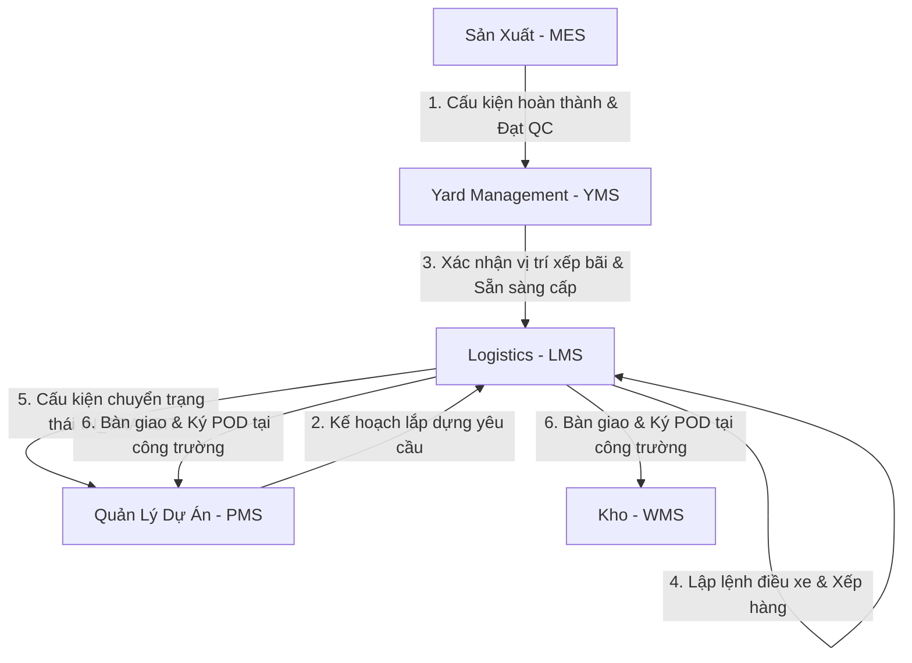

# EPIC203 – Logistics Master Blueprint

Date: 2026-07-08
Status: APPROVED (Design Phase)
Module: LMS (Logistics Management System)

---

## 1. Executive Summary

Tài liệu này phác thảo thiết kế kiến trúc chi tiết (Master Blueprint) cho phân hệ **Điều vận & Vận chuyển (Logistics - LMS)** của hệ thống SteelTrack. LMS chịu trách nhiệm điều phối hoạt động xếp dỡ tại bãi (Yard Staging), lập kế hoạch vận tải, theo dõi lộ trình vận chuyển từ nhà máy sản xuất đến công trường lắp dựng, thu thập bằng chứng bàn giao (Proof of Delivery - POD), giám sát hành trình bằng GPS thời gian thực và cung cấp bảng điều khiển trung tâm (Dispatch Cockpit).

Bản thiết kế này tích hợp chặt chẽ với Core Platform thông qua cơ chế CQRS (sử dụng Snapshots cập nhật qua Background Engine), ghi nhận giao dịch Outbox bất biến, liên kết đồng bộ với quản lý dự án (PMS) để cập nhật tiến độ lắp dựng, và kết nối với Kho vật tư (WMS) để tự động xuất kho khi xe xuất phát.



---

## 2. Domain Models & Aggregates

LMS xây dựng trên nền tảng các bảng Logistics hiện có trong [schema.prisma](file:///opt/projects/steeltrack/apps/backend-api/prisma/schema.prisma) (như `DispatchOrder`, `DispatchItem`, `DispatchEvent` và `DispatchDashboardSnapshot`), đồng thời bổ sung các thực thể mới để đáp ứng nghiệp vụ nâng cao.

```text
+----------------------+         +----------------------+         +----------------------+
|    DispatchOrder     |1       *|     DispatchItem     |*       1|      Component       |
|  (Lệnh điều xe tổng) |-------->| (Chi tiết hàng hóa)  |-------->| (Cấu kiện sản phẩm)  |
+----------------------+         +----------------------+         +----------------------+
           |1                               |1
           |                                |
           |1                               |*
+----------------------+         +----------------------+
|  ProofOfDelivery     |         |     GpsTracking      |
|  (Bằng chứng POD)    |         | (Tọa độ định vị xe)  |
+----------------------+         +----------------------+
```

### 2.1. Thực thể trong Cơ sở dữ liệu (Domain Entities)

#### 2.1.1. Driver (Tài xế)
Quản lý thông tin hồ sơ tài xế xe vận chuyển kết cấu thép siêu trường siêu trọng.
*   `id`: String (CUID, Primary Key)
*   `code`: String (Unique, định dạng `DRV-XXXX`)
*   `name`: String (Họ tên tài xế)
*   `licenseNumber`: String (Số giấy phép lái xe)
*   `licenseClass`: String (Hạng GPLX, ví dụ: `FC`, `E`)
*   `phoneNumber`: String (Số điện thoại)
*   `status`: Enum (`AVAILABLE`, `ON_TRIP`, `OFF_DUTY`, `INACTIVE`)
*   `createdAt`, `updatedAt`: DateTime

#### 2.1.2. Route (Lộ trình vận chuyển)
Định nghĩa cung đường vận chuyển mẫu từ nhà máy đến các công trường dự án để tính toán chi phí và thời gian dự kiến (ETA).
*   `id`: String (CUID, Primary Key)
*   `code`: String (Unique, định dạng `RTE-XXXX`)
*   `name`: String (Ví dụ: "Nhà máy Long An -> Dự án Depot Metro Quận 2")
*   `startAddress`: String (Địa chỉ kho đi)
*   `endAddress`: String (Địa chỉ công trường đến)
*   `distanceKm`: Float (Khoảng cách tính bằng kilomet)
*   `estimatedDurationMinutes`: Int (Thời gian chạy xe dự kiến tính bằng phút)
*   `waypoints`: Json (Mảng tọa độ GPS các trạm trung chuyển hoặc chốt kiểm soát hành trình)
*   `createdAt`, `updatedAt`: DateTime

#### 2.1.3. ProofOfDelivery (Bằng chứng bàn giao - POD)
Ghi nhận kết quả giao nhận thực tế tại công trường.
*   `id`: String (CUID, Primary Key)
*   `dispatchOrderId`: String (Foreign Key liên kết `DispatchOrder`, Unique)
*   `recipientName`: String (Tên người ký nhận phía nhà thầu/công trường)
*   `receivedAt`: DateTime (Thời điểm ký nhận)
*   `signatureAttachmentId`: String (Foreign Key liên kết với `Attachment` lưu chữ ký điện tử, nullable)
*   `photoAttachmentIds`: String[] (Mảng ID hình ảnh cấu kiện khi hạ tải tại công trường)
*   `deviationNotes`: String (Ghi nhận hư hỏng, trầy xước sơn hoặc thiếu hụt số lượng nếu có, nullable)
*   `status`: Enum (`PENDING`, `ACCEPTED`, `REJECTED_WITH_REWORK`, `PARTIALLY_RECEIVED`)
*   `createdAt`, `updatedAt`: DateTime

#### 2.1.4. GpsTracking (Nhật ký hành trình GPS)
Lưu trữ tọa độ GPS do thiết bị giám sát hành trình trên xe hoặc ứng dụng di động của tài xế phát đi định kỳ.
*   `id`: String (CUID, Primary Key)
*   `dispatchOrderId`: String (Foreign Key liên kết `DispatchOrder`)
*   `latitude`: Float (Vĩ độ)
*   `longitude`: Float (Kinh độ)
*   `speed`: Float (Tốc độ di chuyển km/h)
*   `recordedAt`: DateTime (Thời điểm ghi nhận tọa độ)
*   `metadata`: Json (Chứa thông tin pin thiết bị, cường độ sóng GPS, nullable)

### 2.2. Thiết kế Repository Layer

Toàn bộ các truy vấn phức tạp liên quan đến Điều vận và Vận chuyển được quản lý tập trung trong [logistics.repository.ts](file:///opt/projects/steeltrack/apps/backend-api/src/logistics/repositories/logistics.repository.ts).

```typescript
import { Injectable } from '@nestjs/common';
import { PrismaService } from '../../prisma/prisma.service';
import { DispatchOrderStatus, DispatchItemType } from '@prisma/client';

@Injectable()
export class LogisticsRepository {
  constructor(private prisma: PrismaService) {}

  // Xác nhận xuất xe (DEPARTED) và tự động tạo giao dịch xuất kho (EXPORT) trong cùng một Transaction
  async departDispatchOrder(
    dispatchOrderId: string,
    notes?: string
  ): Promise<any> {
    return this.prisma.$transaction(async (tx) => {
      // 1. Cập nhật trạng thái Lệnh điều vận sang IN_TRANSIT
      const order = await tx.dispatchOrder.update({
        where: { id: dispatchOrderId },
        data: {
          status: 'IN_TRANSIT',
          departedAt: new Date(),
        },
        include: { items: true },
      });

      // 2. Ghi nhận sự kiện xuất xe
      await tx.dispatchEvent.create({
        data: {
          dispatchOrderId,
          type: 'DEPARTED',
          message: notes || `Xe vận chuyển đã xuất phát từ Nhà máy.`,
        },
      });

      // 3. Quét các chi tiết hàng hóa dạng vật tư (MATERIAL) để tạo lệnh xuất kho tự động
      const materialItems = order.items.filter(
        (item) => item.type === 'MATERIAL' && item.inventoryItemId
      );

      if (materialItems.length > 0) {
        // Tạo Inventory Transaction tự động xuất kho
        const invTx = await tx.inventoryTransaction.create({
          data: {
            code: `OUT-${new Date().toISOString().slice(2,10).replace(/-/g,'')}-${Math.floor(10000 + Math.random() * 90000)}`,
            type: 'EXPORT',
            warehouseId: 'MAIN-WH-ID', // ID kho chính mặc định
            note: `Tự động xuất kho theo lệnh điều vận: ${order.code}`,
          },
        });

        for (const item of materialItems) {
          await tx.inventoryTransactionItem.create({
            data: {
              inventoryTransactionId: invTx.id,
              inventoryItemId: item.inventoryItemId!,
              quantity: item.quantity,
              unitPrice: 0, // Sẽ được bổ sung bởi giá trung bình của hệ thống
              totalAmount: 0,
            },
          });
        }
      }

      // 4. Cập nhật trạng thái các cấu kiện (COMPONENTS) sang IN_TRANSIT
      const componentIds = order.items
        .filter((item) => item.type === 'COMPONENT' && item.componentId)
        .map((item) => item.componentId!);

      if (componentIds.length > 0) {
        await tx.component.updateMany({
          where: { id: { in: componentIds } },
          data: { status: 'SHIPPED' }, // Trạng thái sẵn sàng di chuyển trên đường
        });
      }

      return order;
    });
  }

  // Ghi nhận tọa độ GPS hàng loạt (Batch insert) tối ưu hóa hiệu năng ghi
  async insertGpsPings(pings: Array<{
    dispatchOrderId: string;
    latitude: number;
    longitude: number;
    speed: number;
    recordedAt: Date;
  }>) {
    return this.prisma.gpsTracking.createMany({
      data: pings,
    });
  }
}
```

### 2.3. Ràng buộc nghiệp vụ Vận tải (Validation Gates)

Để tránh các sai sót và đảm bảo an toàn giao thông, hệ thống áp đặt 3 cổng xác thực logic:

1.  **Chốt Trọng Tải Thiết Bị (`Max Payload Gate`)**:
    *   Quy tắc: Không cho phép chuyển trạng thái Lệnh điều xe từ `DRAFT` sang `PLANNED` nếu tổng trọng lượng của tất cả cấu kiện/vật tư trong `DispatchItem` vượt quá **110%** tải trọng đăng kiểm tối đa của xe (`Vehicle.payloadMax`).
    *   Cảnh báo: Yêu cầu thủ kho kiểm tra lại phân bổ tải trọng trục xe.
2.  **Chốt Kiểm Checklist Xếp Hàng (`Loading Checklist Gate`)**:
    *   Quy tắc: Lệnh điều xe không được chuyển sang trạng thái `IN_TRANSIT` (Xuất phát) nếu JSON `loadingChecklist` chưa được tích chọn hoàn thành 100% các điều kiện an toàn (ví dụ: neo chằng xích chắc chắn, chiều cao xếp chồng đạt chuẩn, có phủ bạt che chắn).
3.  **Chốt Vị Trí Địa Lý Ký Nhận (`GPS Geofencing Gate`)**:
    *   Quy tắc: Tài xế chỉ có thể bấm nút "Bàn giao POD" trên ứng dụng di động nếu khoảng cách giữa tọa độ GPS hiện tại của điện thoại và tọa độ GPS của công trường dự án mục tiêu (`Project.latitude`, `Project.longitude`) nằm trong phạm vi sai số cho phép **200 mét**.

---

## 3. Event Flows (Outbox & Event-Driven Architecture)

Hệ thống Logistics phát đi các sự kiện bất biến để đồng bộ trạng thái cấu kiện trên PMS và Yard, đồng thời kích hoạt các Background Job tính toán lại thời gian xe đến dự kiến.

```text
+---------------------------------------------------------+
| NestJS Logistics Command Path                           |
|                                                         |
|  1. Cập nhật trạng thái Vận chuyển / GPS (Prisma Write)  |
|  2. Tạo dòng OutboxEvent (Prisma Write)                 |
+---------------------------------------------------------+
                            |
                            v (Commit Transaction)
+---------------------------------------------------------+
| Outbox Table (outbox_events)                            |
+---------------------------------------------------------+
                            |
                            v (EventPublisherService polls & publishes)
+---------------------------------------------------------+
| EventBusService (In-Process Broker)                     |
+---------------------------------------------------------+
        |                                           |
        v                                           v
+-----------------------------+             +-----------------------------+
| EventConsumerService        |             | Background Engine Worker    |
| (Đồng bộ PMS / Cập nhật Yard)|             | (Tái dựng snapshot, GPS Chk)|
+-----------------------------+             +-----------------------------+
```

### 3.1. Danh sách sự kiện Logistics (Canonical Events)

*   `logistics.dispatch.created`: Khởi tạo lệnh điều xe mới.
*   `logistics.dispatch.loading`: Bắt đầu xếp dỡ cấu kiện lên xe tại bãi Yard.
*   `logistics.dispatch.departed`: Xe xuất phát, rời khỏi cổng nhà máy.
*   `logistics.dispatch.arrived`: Xe đã đến công trình đích.
*   `logistics.dispatch.received`: Khách hàng đã ký nhận và nghiệm thu cấu kiện.
*   `logistics.dispatch.completed`: Lệnh hoàn thành, tài xế quay đầu xe về nhà máy.
*   `logistics.gps.pinged`: Cập nhật tọa độ GPS mới từ xe.

### 3.2. Cấu trúc hợp đồng sự kiện (Event Contracts)

#### 3.2.1. Sự kiện `logistics.dispatch.departed`
```typescript
export interface LogisticsDispatchDepartedEvent {
  eventId: string;
  eventType: 'logistics.dispatch.departed';
  timestamp: string;
  watermark: string;
  payload: {
    dispatchOrderId: string;
    dispatchOrderCode: string;
    projectId: string;
    vehiclePlate: string;
    driverCode: string;
    departedAt: string;
    totalWeightKg: number;
    componentCount: number;
  };
}
```

#### 3.2.2. Sự kiện `logistics.dispatch.received`
Gửi đi khi biên bản bàn giao điện tử được ký tại công trường.
```typescript
export interface LogisticsDispatchReceivedEvent {
  eventId: string;
  eventType: 'logistics.dispatch.received';
  timestamp: string;
  watermark: string;
  payload: {
    dispatchOrderId: string;
    dispatchOrderCode: string;
    podId: string;
    recipientName: string;
    receivedAt: string;
    status: 'ACCEPTED' | 'PARTIALLY_RECEIVED' | 'REJECTED_WITH_REWORK';
    deviationNotes?: string;
    receivedComponents: Array<{
      componentId: string;
      quantity: number;
      qualityStatus: 'OK' | 'SCRATCHED' | 'BENT';
    }>;
  };
}
```

### 3.3. Định tuyến sự kiện & Tác vụ nền (Event Consumer Routing)

```typescript
import { Injectable } from '@nestjs/common';
import { OnEvent } from '@nestjs/event-emitter';
import { JobSchedulerService } from '../../background-engine/services/job-scheduler.service';
import { LoggerService } from '../../core/logging/logger.service';

@Injectable()
export class LogisticsEventConsumer {
  constructor(
    private jobScheduler: JobSchedulerService,
    private logger: LoggerService
  ) {}

  @OnEvent('logistics.dispatch.departed')
  async handleDispatchDeparted(event: LogisticsDispatchDepartedEvent) {
    this.logger.info(`Xử lý sự kiện depart cho Lệnh: ${event.payload.dispatchOrderCode}`);

    // 1. Kích hoạt job cập nhật snapshot logistics cockpit ngay lập tức
    await this.jobScheduler.schedule({
      name: 'snapshot.logistics.update',
      queue: 'snapshots',
      priority: 90, // Ưu tiên cao để thay đổi hiển thị xe đang chạy trên bản đồ
      idempotencyKey: `snapshot:logistics:update:dispatch:${event.payload.dispatchOrderId}:${event.watermark}`,
      payload: {
        module: 'logistics',
        snapshotType: 'active-trip',
        scopeId: event.payload.dispatchOrderId,
      },
    });
  }

  @OnEvent('logistics.gps.pinged')
  async handleGpsPing(event: { payload: { dispatchOrderId: string; latitude: number; longitude: number } }) {
    // Đẩy job kiểm tra geofence để tự động phát hiện xe đến trạm hoặc công trường
    await this.jobScheduler.schedule({
      name: 'logistics.gps.geo-fence-check',
      queue: 'snapshots',
      priority: 50,
      idempotencyKey: `logistics:gps:geofence:${event.payload.dispatchOrderId}:${Date.now()}`,
      payload: event.payload,
    });
  }
}
```

---

## 4. Read Models & Snapshots

LMS thiết kế 2 loại snapshot được duy trì trong database để tăng tốc độ phản hồi cho trang Dispatch Cockpit.

### 4.1. Cấu trúc thực thế Snapshot (Persisted Snapshot Schema)

#### 4.1.1. LogisticsDashboardSnapshot (`logistics_dashboard_snapshots` / `DispatchDashboardSnapshot`)
Lưu trữ thông tin tổng hợp cho Dashboard Logistics.
*   `id`: String (CUID, Primary Key)
*   `loadingCount`: Int (Xe đang xếp hàng tại bãi)
*   `inTransitCount`: Int (Xe đang di chuyển trên đường)
*   `arrivedCount`: Int (Xe đã đến công trình)
*   `completedCount`: Int (Xe hoàn thành trong ngày)
*   `delayedCount`: Int (Số chuyến bị trễ ETA)
*   `activeDriversList`: Json (Danh sách tài xế đang trong chuyến đi kèm trạng thái)
*   `updatedAt`: DateTime

#### 4.1.2. VehicleLiveTrackingSnapshot (`vehicle_live_tracking_snapshots`)
Lưu trữ vị trí GPS mới nhất và trạng thái hiện tại của xe để vẽ lên bản đồ thời gian thực.
*   `id`: String (CUID, Primary Key)
*   `dispatchOrderId`: String (Unique)
*   `vehiclePlate`: String
*   `driverName`: String
*   `lastLatitude`: Float
*   `lastLongitude`: Float
*   `lastSpeed`: Float
*   `etaMinutesRemaining`: Int (Thời gian ước tính còn lại)
*   `currentStatus`: String (Trạng thái chuyến đi)
*   `lastPingedAt`: DateTime

### 4.2. Luồng đọc dữ liệu (Read Path) và Cơ chế Fallback

*   **Read Path**: Endpoint `GET /logistics/cockpit/live-tracking` sẽ đọc trực tiếp từ bảng `VehicleLiveTrackingSnapshot`. Toàn bộ dữ liệu của 50 xe đang chạy sẽ được trả về dưới dạng JSON trong < 20ms.
*   **Cơ chế Fallback**: Nếu snapshot của một xe bị thiếu hoặc hỏng, hệ thống sẽ thực hiện truy vấn ngược dòng về bảng `GpsTracking` để lấy ra tọa độ có `recordedAt` mới nhất của xe đó, đồng thời kích hoạt job dựng lại snapshot.

---

## 5. Background Jobs

Lập lịch các công việc chạy ẩn liên quan đến định vị địa lý và dự đoán lộ trình.

| Tên Job | Hàng Đợi (Queue) | Độ Ưu Tiên (Priority) | Mục Tiêu & Cơ Chế Xử Lý |
| --- | --- | --- | --- |
| `snapshot.logistics.update` | `snapshots` | 70 | Cập nhật tổng số lượng xe theo trạng thái trên dashboard điều vận khi có thay đổi lệnh. |
| `logistics.gps.geo-fence-check` | `snapshots` | 80 | Chạy mỗi khi nhận tọa độ GPS. So sánh tọa độ xe với vùng đa giác (Polygon) của công trường dự án. Nếu xe đi vào vùng công trường, tự động kích hoạt sự kiện `logistics.dispatch.arrived` và gửi thông báo cho kỹ sư công trường chuẩn bị cẩu hạ tải cấu kiện. |
| `logistics.eta.recalculate` | `maintenance` | 50 | Chạy định kỳ mỗi 5 phút cho các xe đang di chuyển. Sử dụng lịch sử hành trình để tính toán lại số phút còn lại (ETA). |

*   **Idempotency Key Pattern**: `snapshot:logistics:<job_name>:<dispatch_order_id>:<timestamp_marker>`.
*   **Retry Policy**: Tự động thử lại tối đa 3 lần bằng cơ chế Exponential Backoff. Nếu tiếp tục thất bại (do mạng chập chờn khi xe đi qua vùng núi mất sóng), giữ trạng thái lỗi nhẹ và không đưa vào DLQ ngay để tránh làm nhiễu hệ thống điều hành.

---

## 6. UI/UX Dashboards - Dispatch Cockpit

Bảng điều khiển Dispatch Cockpit là trung tâm chỉ huy của nhân viên điều phối vận tải kết cấu thép:

### 6.1. Thiết kế Giao diện tổng thể

Bản đồ chiếm 70% diện tích màn hình chính (tích hợp Leaflet/OpenStreetMap hoặc Google Maps):
*   **Vẽ tuyến đường (Routing)**: Đường nối màu xanh lục hiển thị lộ trình đề xuất từ nhà máy tới công trường.
*   **Các Marker xe chuyển động**: Xe hiển thị dạng icon xe tải nhỏ. Màu sắc icon thể hiện trạng thái:
    *   *Màu xanh dương*: Xe đang chạy đúng tiến độ.
    *   *Màu đỏ*: Xe đang bị dừng quá 15 phút hoặc bị trễ ETA.
    *   *Màu xám*: Xe mất kết nối GPS quá 10 phút.
*   **Sidebar trái (Chiều rộng 320px - h-full)**:
    *   Hộp tìm kiếm nhanh số xe hoặc tài xế.
    *   Danh sách chuyến xe đang chạy xếp theo thời gian trễ ETA giảm dần.
    *   Bảng thống kê nhanh số lượng xe ở các trạng thái.

### 6.2. Ứng dụng di động của Tài xế (Driver Mobile Web View)

Màn hình giao diện thiết kế gọn gàng, nút bấm to để thao tác trên cabin:
*   Màn hình 1: *Checklist xếp hàng*: Tài xế kiểm tra và tích chọn từng điều khoản an toàn trước khi đi.
*   Màn hình 2: *Lộ trình & Bản đồ*: Chỉ đường đi và gửi tọa độ GPS lên server tự động qua Web API Geolocation mỗi 30 giây.
*   Màn hình 3: *Ký nhận POD*: Chức năng chụp ảnh cấu kiện tại công trường và cho kỹ sư ký trực tiếp bằng tay trên màn hình cảm ứng để sinh chữ ký điện tử.

---

## 7. AI Integration (Tích hợp Trí tuệ Nhân tạo)

1.  **AI Route & Load Optimizer (Tối ưu hóa tải trọng và lộ trình)**:
    *   Nghiệp vụ kết cấu thép có đặc thù cấu kiện cồng kềnh, hình dạng phức tạp (dầm chữ I, cột hộp, vì kèo chữ V).
    *   AI sử dụng thuật toán xếp thùng 3 chiều (3D Bin Packing) để gợi ý cách sắp xếp các cấu kiện lên thùng xe tải sao cho tối ưu diện tích, không quá tải trọng trục xe, và đảm bảo thứ tự dỡ hàng tại công trình (cấu kiện lắp trước nằm ở trên/ngoài cùng).
2.  **AI Predictive ETA & Delay Warning (Dự báo trễ chuyến)**:
    *   AI liên tục phân tích dữ liệu lịch sử di chuyển của tài xế, thời gian chạy xe trung bình qua từng đoạn đường theo khung giờ, kết hợp dữ liệu thời tiết thực tế tại khu vực lộ trình.
    *   Hệ thống sẽ tự động đưa ra cảnh báo trễ chuyến: "Dự kiến xe 51C-999.99 sẽ trễ 45 phút do kẹt xe tại Nút giao An Phú. Đã tự động gửi SMS thông báo cho tổ trưởng cẩu tháp công trường."
3.  **AI Anomaly Behavior Alert (Cảnh báo hành vi bất thường)**:
    *   Phát hiện xe dừng đỗ sai quy định tại các vị trí không nằm trong waypoint của lộ trình mẫu (ví dụ: đỗ tại bãi phế liệu tự phát hoặc dừng quá lâu trên cao tốc), cảnh báo nguy cơ tráo đổi cấu kiện hoặc rút trộm dầu xe.

---

## 8. Technical Risks & Mitigations

| Rủi Ro Kỹ Thuật | Tác Động | Giải Pháp Khắc Phục (Mitigations) |
| --- | --- | --- |
| **Bão ghi dữ liệu (Write Storm) từ tọa độ GPS** khi hàng trăm xe gửi định vị liên tục mỗi 10 giây lên server, gây quá tải database giao dịch chính. | Cao. Làm chậm toàn bộ các chức năng khác của ERP. | 1. Sử dụng một Redis Cache hoặc bảng nhớ tạm thời trong RAM để nhận pings GPS.<br>2. Chạy Background Worker gộp dữ liệu (Batch write) từ bộ nhớ tạm vào Database chính mỗi 5 phút.<br>3. Áp dụng chính sách tự động xóa (Auto-cleanup policy): Chỉ giữ lại tọa độ chi tiết của các chuyến xe trong vòng 30 ngày, sau đó nén hành trình thành các vệt tóm tắt (Route Summary) để lưu trữ dài hạn. |
| **Mất mạng Internet di động (Offline Mode)** khi xe di chuyển qua khu vực vùng cao hoặc công trường đang thi công chưa lắp trạm sóng điện thoại. | Trung bình. Tài xế không thể cập nhật trạng thái chuyến đi hoặc ký nhận POD. | 1. Ứng dụng di động của tài xế được thiết kế chạy Offline-First.<br>2. Cho phép chụp ảnh POD, ký chữ ký và lưu trữ trong IndexedDB của trình duyệt điện thoại.<br>3. Khi thiết bị có sóng 3G/4G trở lại, hệ thống Service Worker ẩn sẽ tự động đẩy dữ liệu lên server theo trình tự kèm thời gian thực tế xảy ra sự kiện (Event Timestamp). |
| **Sai lệch GPS (GPS Drift)** do thời tiết xấu hoặc xe đi qua khu vực nhà cao tầng làm sai lệch geofencing cảnh báo tự động xe đến công trường. | Thấp. Gây kích hoạt nhầm sự kiện xe đã cập bến. | Áp dụng thuật toán lọc nhiễu Kalman Filter trên server để loại bỏ các tọa độ nhảy vọt bất thường. Đặt bán kính vùng Geofence linh hoạt dựa trên diện tích thực tế của công trường dự án thay vì đặt cứng 200m. |

---

## 9. Sprint Roadmap

Lộ trình triển khai phân hệ Vận chuyển & Điều vận:

### Sprint 1: Lập kế hoạch vận tải & Master Data Xe/Tài xế (Duration: 2 tuần)
*   **Mục tiêu**: Xây dựng danh mục phương tiện, tài xế, quản lý Lệnh điều xe và chi tiết hàng hóa vận chuyển.
*   **Kết quả đầu ra**:
    *   Tạo API CRUD cho Xe cộ (`Vehicle`), Tài xế (`Driver`), và Lộ trình (`Route`).
    *   Hoàn thành chức năng lập Lệnh điều xe `DispatchOrder` trên frontend.
    *   Triển khai bộ kiểm soát chốt chặn `Max Payload Gate` tại [logistics.repository.ts](file:///opt/projects/steeltrack/apps/backend-api/src/logistics/repositories/logistics.repository.ts).

### Sprint 2: Hệ thống GPS & Web App cho Tài xế (Duration: 2 tuần)
*   **Mục tiêu**: Phát triển giao diện web di động cho tài xế và hệ thống nhận ping GPS thời gian thực.
*   **Kết quả đầu ra**:
    *   Xây dựng Driver Web View hỗ trợ xem lộ trình và xác nhận bốc xếp hàng.
    *   Tích hợp API nhận GPS ping và lưu trữ tạm thời trên bộ nhớ đệm.
    *   Triển khai job nền chạy ẩn `logistics.gps.geo-fence-check` để tự động kích hoạt sự kiện Arrival.

### Sprint 3: Dispatch Cockpit, Ký POD & Tích Hợp AI (Duration: 2 tuần)
*   **Mục tiêu**: Hoàn thiện màn hình điều vận tổng hợp Dispatch Cockpit bản đồ tương tác, ký biên bản POD bàn giao điện tử và tích hợp AI gợi ý sắp xếp xe.
*   **Kết quả đầu ra**:
    *   Dispatch Cockpit hiển thị bản đồ trực quan với vị trí các xe di chuyển thời gian thực.
    *   Chức năng ký nhận POD lưu trữ chữ ký và hình ảnh bàn giao cấu kiện.
    *   Tích hợp thuật toán AI gợi ý sắp xếp tải trọng dỡ hàng và dự báo ETA trễ chuyến xe.
    *   Đạt hiệu năng tải trang Dashboard Logistics dưới 50ms nhờ sử dụng snapshot pre-computed.
