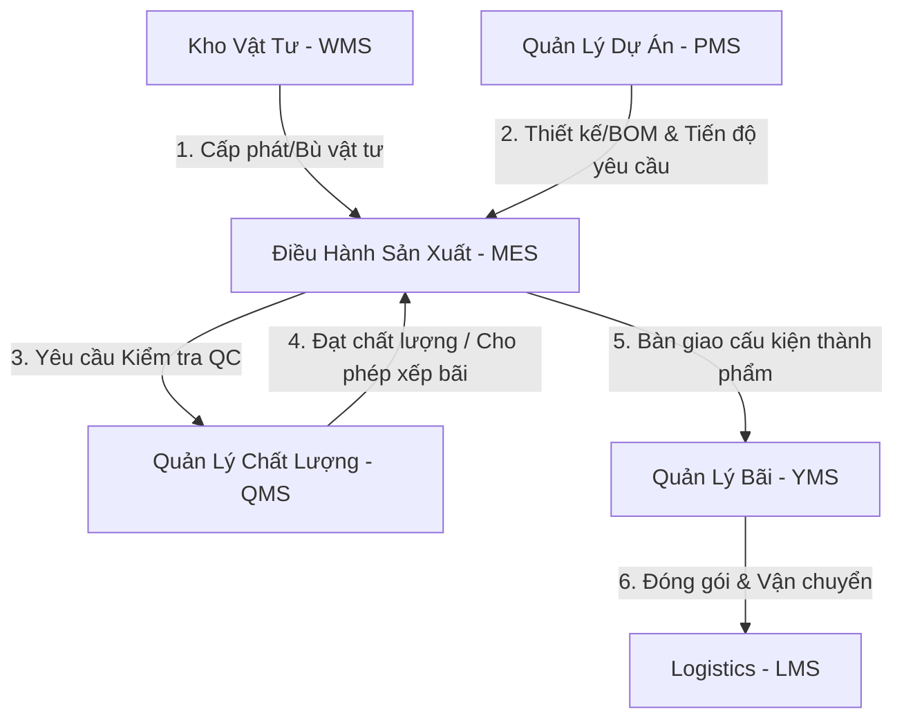

# EPIC114 – Production (MES) Blueprint

Date: 2026-07-08
Status: APPROVED (Design Phase)

---

## 1. Executive Summary

Tài liệu này phác thảo thiết kế tổng thể (Master Blueprint) cho phân hệ **Điều hành Sản xuất (Manufacturing Execution System - MES)** của hệ thống SteelTrack. Bản thiết kế kế thừa và tích hợp chặt chẽ với các nền tảng cốt lõi đã hoàn thành của Core Platform (bao gồm Repository Pattern, Runtime Metrics, Outbox Pattern, Background Engine, Snapshot Update Engine và Operations Center).

Mục tiêu chính là chuyển đổi hoạt động quản lý sản xuất kết cấu thép từ trạng thái ghi nhận thủ công sang điều hành thời gian thực (Real-time Shopfloor Control), kiểm soát chặt chẽ tỷ lệ hao hụt nguyên vật liệu, tối ưu hóa công suất máy móc/tổ đội (OEE), và tự động hóa các luồng nghiệp vụ liên thông giữa Vật tư (WMS), Quản lý Dự án (PMS), Quản lý Bãi (YMS) và Quản lý Chất lượng (QMS).

---

## 2. Bản Đồ Tích Hợp Hệ Thống (Integration Map)

Quy trình sản xuất kết cấu thép là trung tâm kết nối các luồng dữ liệu chính trong SteelTrack:



---

## 3. Kiến Trúc Phân Lớp (Architectural Layers)

Phân hệ MES tuân thủ nghiêm ngặt mô hình kiến trúc hiện tại của SteelTrack:

### 3.1. Command Path (Write Operation)
```text
Client Request 
  -> NestJS Controller (Validation, Guard, RBAC)
  -> Production Service (Nghiệp vụ cốt lõi, Tính toán hao hụt, Ghi log sản xuất)
  -> Production Repository (Bao bọc truy vấn Prisma)
  -> Database Transaction (Đảm bảo tính toàn vẹn dữ liệu)
  -> Save entity + Ghi Outbox Event atomically
```

### 3.2. Event & Background Processing
```text
Outbox Event (e.g. production.stage.completed)
  -> EventPublisherService (Quản lý Outbox thực)
  -> JobSchedulerService (Lập lịch background job)
  -> JobWorkerService (Xử lý tác vụ nền)
  -> SnapshotRebuilder (Tính toán lại OEE, Tiến độ, Nạp lại Snapshot)
  -> Update Snapshot Table (Payload JSON)
```

### 3.3. Query Path (Read Operation)
```text
Client Request
  -> NestJS Controller
  -> Read Model Service
  -> Kiểm tra Snapshot Table (Kiểm tra Freshness/TTL)
      -> NẾU Fresh: Trả về payload JSON ngay lập tức (Thời gian phản hồi < 50ms)
      -> NẾU Stale/Missing: Fallback gọi Repository Query -> Trả về dữ liệu -> Đồng thời enqueue Rebuild Job nền.
```

---

## 4. Các Nguyên Tắc Thiết Kế Cốt Lõi

1. **Transaction Isolation**: Không bao giờ thực hiện các phép tính OEE phức tạp hoặc cập nhật Snapshot trực tiếp trong Transaction ghi nhận sản xuất của công nhân. Tất cả các tác vụ này phải được đẩy vào Background Engine qua Outbox Event.
2. **Decimal Support**: Toàn bộ các trường số lượng (Quantity), trọng lượng (Weight), thời gian chạy máy (Downtime/Expected Hours) phải hỗ trợ số thập phân để đảm bảo độ chính xác cho ngành kết cấu thép (ví dụ: cấp phát `1.5` tấn thép hình, ghi nhận `0.125` giờ downtime).
3. **Immutability of Ledger**: Mọi biến động vật tư trong sản xuất (Cấp phát, Sử dụng thực tế, Rework, Scrap, Trả lại) đều phải đi qua `ProductionMaterialLedger` dưới dạng các dòng nhật ký bất biến. Tuyệt đối không cập nhật trực tiếp số dư tạm tính.
4. **Operations Center Transparency**: Mọi tác vụ nền liên quan đến tính toán OEE, cập nhật hàng đợi tại Work Center và tái dựng Snapshot sản xuất đều phải được đăng ký chỉ số giám sát lên Operations Center để theo dõi độ trễ (Lag) và tỷ lệ lỗi (Error rate).

---

## 5. Production Order Lifecycle Standard

EPIC134 Blueprint Alignment establishes one canonical lifecycle for
`ProductionOrder`:

```text
DRAFT -> RELEASED -> READY -> IN_PROGRESS <-> PAUSED -> COMPLETED -> CLOSED
   |
   +-> CANCELLED
```

Rules:

* `CLOSED` and `CANCELLED` are terminal states.
* `COMPLETED` cannot return to an execution state.
* `PAUSED` resumes only to `IN_PROGRESS`.
* `PLANNED` and `DELAYED` remain in the database enum for compatibility with
  existing rows and APIs, but are not canonical lifecycle targets for new
  Production Order commands. Delay is derived operational information, not a
  lifecycle command.
* Lifecycle mutations and their Outbox event must commit atomically in the same
  repository transaction.
* Snapshot updates remain asynchronous through Outbox and Background Engine.

Canonical lifecycle events use the `production.order.*` namespace. Legacy
`production.started`, `production.completed`, and `production.delayed` names
must be treated as compatibility inputs during rollout, not emitted by new
lifecycle commands.
