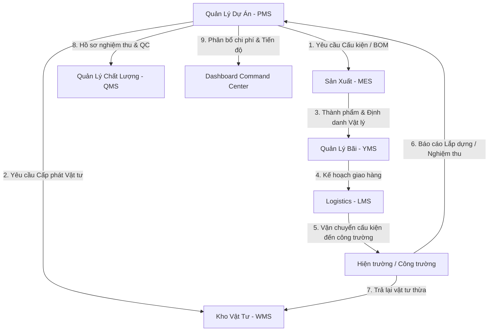
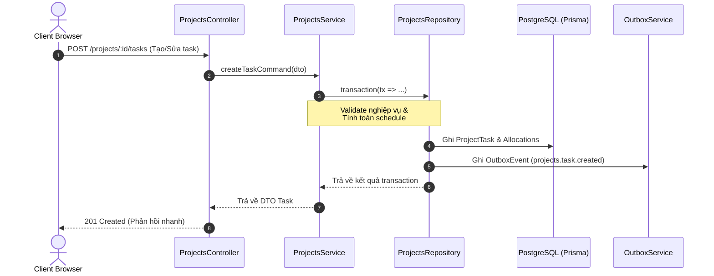
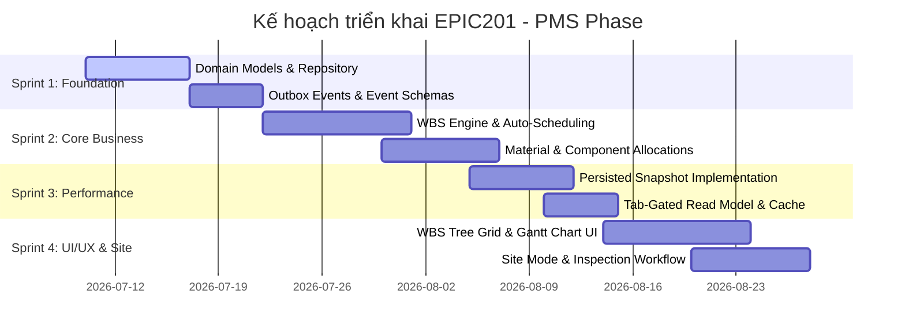

# EPIC201 – Projects (PMS) Blueprint

Date: 2026-07-08
Status: APPROVED (Design Phase)

---

## 1. Executive Summary

Tài liệu này phác thảo thiết kế kiến trúc tổng thể (Master Blueprint) cho phân hệ **Quản lý Dự án (Project Management System - PMS)** của hệ thống SteelTrack. Phân hệ PMS đóng vai trò trung tâm điều phối, theo dõi tiến độ, phân bổ nguồn lực, quản lý chi phí và kết nối các nghiệp vụ hiện trường (Site Operations) trong chu trình sản xuất và lắp dựng kết cấu thép.

Thiết kế này kế thừa và tích hợp chặt chẽ với các nền tảng cốt lõi của SteelTrack Core Platform:
- **Repository Pattern & Prisma Service** cho dữ liệu giao dịch sạch sẽ và an toàn.
- **Transactional Outbox Pattern** để phát hành sự kiện bất đồng bộ đáng tin cậy.
- **Background Job Engine** cho các tác vụ tính toán schedule, gánh nặng phân tích và đồng bộ.
- **Persisted Snapshot Strategy** để lưu trữ các dữ liệu tổng hợp phục vụ dashboard với độ trễ tối thiểu.
- **Operations Center** để giám sát sức khỏe runtime, độ trễ xử lý và các cảnh báo hệ thống.

---

## 2. Bản Đồ Tích Hợp Hệ Thống (Integration Map)

Phân hệ Quản lý Dự án kết nối các module của SteelTrack thành một chuỗi giá trị khép kín, từ vật tư đầu vào đến thành phẩm lắp dựng hoàn thiện trên công trường:

### Chi tiết các điểm tích hợp:
1. **PMS - WMS (Kho Vật Tư)**: PMS quản lý định mức vật tư dự án thông qua bảng `ProjectTaskMaterialAllocation`. Khi cần lắp dựng hoặc gia công, PMS gửi yêu cầu xuất kho. Ngược lại, vật tư thừa tại hiện trường được hoàn trả thông qua luồng `Material Return` liên kết trực tiếp với `/inventory/returns`.
2. **PMS - MES (Sản Xuất)**: PMS đồng bộ cấu trúc cây WBS (Work Breakdown Structure) và các yêu cầu kỹ thuật của cấu kiện (`Component`). Tiến độ gia công từ MES cập nhật trực tiếp trạng thái sẵn sàng của cấu kiện trong PMS.
3. **PMS - YMS (Quản Lý Bãi)**: Cấu kiện hoàn thành sản xuất được đưa ra bãi xếp dỡ. PMS theo dõi vị trí lưu bãi của cấu kiện trước khi được điều phối đi công trường.
4. **PMS - LMS (Logistics)**: Khi cấu kiện được điều xe vận chuyển qua phiếu `DispatchOrder`, PMS cập nhật trạng thái `Đang vận chuyển` cho cấu kiện và tự động giảm trừ phân bổ tại task tương ứng khi hiện trường ký nhận.
5. **PMS - QMS (Quản Lý Chất Lượng)**: Mỗi công việc lắp dựng hoặc chế tạo trên hiện trường đều gắn với một `ProjectTaskInspection`. QC hiện trường kiểm tra, ghi nhận đạt/không đạt để quyết định tiến độ thực tế (Progress %) và đủ điều kiện nghiệm thu bàn giao (Handover).

---

## 3. Kiến Trúc Phân Lớp (Architectural Layers)

Phân hệ PMS tuân thủ mô hình phân lớp chuẩn hóa của SteelTrack:

### 3.1. Command Path (Giao dịch ghi)
- **Controller**: Đón tiếp HTTP requests, thực hiện validation qua `Zod` hoặc `class-validator`, kiểm tra quyền hạn (RBAC) thông qua Guards.
- **Service**: Thực hiện logic nghiệp vụ như phân tích ngày bắt đầu/kết thúc dựa trên mối quan hệ phụ thuộc (dependencies), tính toán độ trễ lan truyền (`cascadeDelayDays`), kiểm tra tính khả dụng của vật tư cấp phát.
- **Repository**: Bọc các thao tác truy vấn cơ sở dữ liệu qua Prisma. Đảm bảo tất cả các thay đổi trạng thái và ghi nhận lịch sử được thực hiện trong cùng một Database Transaction.
- **Outbox Pattern**: Trong cùng transaction giao dịch, một dòng sự kiện `OutboxEvent` được chèn vào bảng `outbox_events`.

### 3.2. Query Path (Giao dịch đọc - CQRS tách biệt)
- **Tab-gated API Boundaries**: Client gọi `GET /projects/:id/detail/:tab` để lấy thông tin phân mảnh cho tab hiện tại.
- **Snapshot Integration**: Với các tab nặng như `overview`, `progress` hoặc `command`, Service sẽ đọc trước từ bảng `ProjectDashboardSnapshot` hoặc `ProjectRuntimeSnapshot`.
- **Fallback Mechanism**: Nếu snapshot bị hỏng (`stale = true` hoặc không tồn tại), hệ thống sẽ fallback gọi trực tiếp query gộp thông qua `ProjectsRepository.findProjectDetailSources(projectId, tab)` để trả về kết quả ngay lập tức, đồng thời đẩy một background job tái dựng snapshot vào hàng đợi.

---

## 4. Phân Tích Rủi Ro Kiến Trúc (Architectural Risk Analysis)

| Rủi Ro Kỹ Thuật | Tác Động | Giải Pháp Giảm Thiểu |
| :--- | :--- | :--- |
| **Cascade Update Storm** | Thay đổi ngày của một task gốc (root task) có thể gây cập nhật dây chuyền hàng ngàn task phụ thuộc, dẫn tới block database transaction. | Sử dụng **Background Engine** để tính toán lại lịch trình bất đồng bộ. Chỉ ghi nhận yêu cầu thay đổi ngày của task gốc vào database, sau đó phát sự kiện để Job Worker xử lý tính toán lại Gantt chart nền. |
| **Stale Snapshot Reads** | Người dùng xem dữ liệu cũ tại màn hình Command Center do background rebuild job bị trễ hoặc nghẽn. | Bổ sung trường `updatedAt` và `stale` trong bảng snapshot. Nếu dữ liệu snapshot cũ quá 5 phút (TTL), API tự động chuyển sang cơ chế fallback query live và ghi log cảnh báo lên Operations Center. |
| **Race Conditions in Allocations** | Cấp phát vật tư/cấu kiện trùng lặp cho nhiều task hoặc nhiều dự án khác nhau khi chạy đồng thời. | Sử dụng cơ chế khóa bi quan (Pessimistic Locking) bằng lệnh SQL `SELECT ... FOR UPDATE` thông qua repository trong transaction của tác vụ cấp phát. |
| **Gantt Chart Render Lag** | Cây WBS và Gantt Chart chứa > 10,000 dòng gây giật lag trình duyệt của người dùng. | Áp dụng kỹ thuật **Virtual Scrolling** trên frontend, chỉ render các node đang nằm trong khung nhìn (viewport), kết hợp lazy-load các sub-tree khi người dùng click mở rộng node cha. |

---

## 5. Chỉ Số Giám Sát Operations Center (Operations Cockpit Metrics)

Operations Center sẽ cấu hình các chỉ số đo lường đặc thù cho PMS:

- **`pms.snapshot.lag_seconds`**: Thời gian trễ trung bình từ lúc sự kiện thay đổi tiến độ/lịch trình xảy ra đến khi snapshot tương ứng được cập nhật thành công. (Ngưỡng cảnh báo: > 30 giây).
- **`pms.outbox.delivery_failure_rate`**: Tỷ lệ lỗi phát hành sự kiện Outbox liên quan đến PMS. (Ngưỡng cảnh báo: > 1%).
- **`pms.read_model.hit_ratio`**: Tỷ lệ các truy vấn chi tiết dự án được phục vụ thành công bởi Snapshot/Cache thay vì query trực tiếp database. (Mục tiêu: > 85%).
- **`pms.rebuild_jobs.retry_count`**: Số lần các job tái dựng snapshot lịch trình dự án phải thử lại do xung đột khóa hoặc lỗi database. (Ngưỡng cảnh báo: > 3 lần/job).

---

## 6. Chỉ Số Hiệu Năng Runtime (Runtime Metrics & Budgets)

Mỗi endpoint của PMS được áp đặt một "ngân sách hiệu năng" (Performance Budget) nghiêm ngặt:

- **`GET /projects/:id/detail/overview`**: Ngân sách < 80ms (đọc snapshot).
- **`GET /projects/:id/detail/progress`**: Ngân sách < 120ms (đọc snapshot).
- **`POST /projects/:id/tasks`**: Ngân sách < 250ms (ghi nhận command + outbox).
- **`POST /projects/:id/tasks/auto-schedule`**: Ngân sách < 500ms (tính toán lại lịch trình trên database).
- **Memory limit**: Mỗi tiến trình Job Worker chạy tính toán lại WBS cây phân cấp không được tiêu thụ vượt quá 150MB RAM.

---

## 7. Cơ Hội Tích Hợp AI (AI Integration & Intelligence)

1. **AI Smart WBS Scheduler**: Phân tích lịch sử thực tế của các dự án trước đó (thời gian thi công thực tế so với kế hoạch) để tự động đề xuất thời lượng (Duration) và số lượng tài nguyên lắp dựng tối ưu cho các công việc mới tạo trong WBS.
2. **Predictive Project Delay Detection**: Sử dụng mô hình học máy phân tích tiến độ gá lắp, sản xuất và vận chuyển cấu kiện để dự báo xác suất chậm trễ của các mốc cột mốc quan trọng (Milestones) trước 14 ngày, đưa ra cảnh báo sớm cho Giám đốc Dự án.
3. **Automatic Erection Resource Optimization**: Đề xuất phân bổ xe cẩu, tổ đội lắp dựng dựa trên tiến độ thực tế tại công trường và kế hoạch giao nhận cấu kiện từ Logistics để giảm thiểu thời gian chờ (idle time) của thiết bị đắt tiền.

---

## 8. Sprint Roadmap - EPIC201 PMS Implementation

