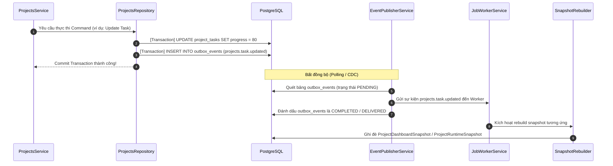

# Projects Event Flow & Outbox Integration

Bản thiết kế này chi tiết hóa cách thức phân hệ Quản lý Dự án (PMS) áp dụng mô hình **Transactional Outbox Pattern** để đảm bảo tính nhất quán dữ liệu cuối cùng (Eventual Consistency) giữa PMS với các phân hệ Kho (WMS), Sản xuất (MES), Logistics (LMS) và Dashboard.

---

## 1. Kiến Trúc Luồng Sự Kiện Outbox (Outbox Flow)

Để tránh hiện tượng mất mát sự kiện (lost updates) và không nhất quán giữa cơ sở dữ liệu với Message Bus, SteelTrack áp dụng Transactional Outbox Pattern:



---

## 2. Đặc Tả Chi Tiết Event Schemas (JSON Payload)

Mọi payload sự kiện phát ra từ PMS đều phải ghi nhận đầy đủ thông tin định danh, ngữ cảnh nghiệp vụ và dấu thời gian.

### 2.1. Sự kiện `projects.task.created`
Phát ra khi một task mới được tạo trong WBS.
```json
{
  "eventId": "evt_proj_task_created_cuid12345678_1784910200",
  "eventType": "projects.task.created",
  "aggregateType": "ProjectTask",
  "aggregateId": "clx1234567890task",
  "timestamp": "2026-07-08T09:15:00.000Z",
  "payload": {
    "taskId": "clx1234567890task",
    "projectId": "clx1234567890proj",
    "parentTaskId": "clx1234567890parent",
    "name": "Lắp dựng dầm trục 1-A",
    "plannedStartAt": "2026-07-10T07:00:00.000Z",
    "plannedFinishAt": "2026-07-15T17:00:00.000Z",
    "scheduledStartAt": "2026-07-10T07:00:00.000Z",
    "scheduledFinishAt": "2026-07-15T17:00:00.000Z"
  }
}
```

### 2.2. Sự kiện `projects.task.updated`
Phát ra khi có thay đổi tiến độ, ngày tháng hoặc trạng thái của một task.
```json
{
  "eventId": "evt_proj_task_updated_cuid12345678_1784910350",
  "eventType": "projects.task.updated",
  "aggregateType": "ProjectTask",
  "aggregateId": "clx1234567890task",
  "timestamp": "2026-07-08T09:17:30.000Z",
  "payload": {
    "taskId": "clx1234567890task",
    "projectId": "clx1234567890proj",
    "name": "Lắp dựng dầm trục 1-A",
    "status": "IN_PROGRESS",
    "progress": 45.5,
    "scheduledStartAt": "2026-07-10T07:00:00.000Z",
    "scheduledFinishAt": "2026-07-16T17:00:00.000Z",
    "actualStartAt": "2026-07-10T07:30:00.000Z",
    "cascadeDelayDays": 1,
    "triggerRebuild": true
  }
}
```

### 2.3. Sự kiện `projects.allocation.material.updated`
Phát ra khi có thay đổi về tình trạng xuất kho/cấp phát vật tư cho task (ví dụ: kho xuất vật tư đi dự án).
```json
{
  "eventId": "evt_proj_mat_alloc_cuid12345678_1784910400",
  "eventType": "projects.allocation.material.updated",
  "aggregateType": "ProjectTaskMaterialAllocation",
  "aggregateId": "clx1234567890alloc",
  "timestamp": "2026-07-08T09:20:00.000Z",
  "payload": {
    "allocationId": "clx1234567890alloc",
    "taskId": "clx1234567890task",
    "projectId": "clx1234567890proj",
    "inventoryItemId": "clx1234567890item",
    "materialCode": "PL-SS400-12x1500x6000",
    "plannedQty": 10.0,
    "issuedQty": 8.0,
    "usedQty": 5.0,
    "returnedQty": 0.0,
    "remainingQty": 2.0,
    "unitCost": 18500000.0,
    "totalCost": 185000000.0
  }
}
```

### 2.4. Sự kiện `projects.allocation.component.updated`
Phát ra khi cấu kiện được thay đổi trạng thái tại công trường (ví dụ: giao xe nhận hàng, lắp đặt xong).
```json
{
  "eventId": "evt_proj_comp_alloc_cuid12345678_1784910450",
  "eventType": "projects.allocation.component.updated",
  "aggregateType": "ProjectTaskComponentAllocation",
  "aggregateId": "clx1234567890compalloc",
  "timestamp": "2026-07-08T09:22:15.000Z",
  "payload": {
    "allocationId": "clx1234567890compalloc",
    "taskId": "clx1234567890task",
    "projectId": "clx1234567890proj",
    "componentId": "clx1234567890comp",
    "componentCode": "COL-H300-T1-A1",
    "status": "INSTALLED",
    "installedAt": "2026-07-08T09:20:00.000Z",
    "cost": 42000000.0
  }
}
```

### 2.5. Sự kiện `projects.inspection.completed`
Phát ra khi QC hoàn thành việc kiểm tra nghiệm thu một hạng mục tại công trường.
```json
{
  "eventId": "evt_proj_inspect_cuid12345678_1784910500",
  "eventType": "projects.inspection.completed",
  "aggregateType": "ProjectTaskInspection",
  "aggregateId": "clx1234567890inspect",
  "timestamp": "2026-07-08T09:25:00.000Z",
  "payload": {
    "inspectionId": "clx1234567890inspect",
    "taskId": "clx1234567890task",
    "projectId": "clx1234567890proj",
    "status": "PASSED",
    "acceptedDate": "2026-07-08T09:24:30.000Z",
    "handoverDate": null,
    "inspectorId": "clx1234567890user",
    "remarks": "Bề mặt mối hàn lắp dựng đạt yêu cầu thử siêu âm UT."
  }
}
```

---

## 3. Consumer Routing & Background Processing

Hệ thống điều hướng (Routing) các sự kiện PMS đến các Job Worker tương ứng trong Background Engine:

| Event Type (Sự kiện) | Target Consumer (Người nhận) | Business Logic (Xử lý nghiệp vụ) |
| :--- | :--- | :--- |
| `projects.task.created` | `SnapshotRebuilder` | Tái dựng snapshot cây cấu trúc WBS và cập nhật thông tin dự án mới. |
| `projects.task.updated` | `ScheduleAdjustmentEngine` | Kiểm tra nếu có thay đổi ngày hoàn thành, tự động tính toán lại ngày bắt đầu/kết thúc cho toàn bộ các công việc phụ thuộc phía sau (Cascading Scheduling). |
| | `SnapshotRebuilder` | Đánh dấu hỏng snapshot dự án và OEE liên đới để cập nhật Dashboard. |
| `projects.allocation.material.updated` | `ProjectCostCalculator` | Tính toán lại chi phí vật tư thực tế (`actualCost`) trong bảng `ProjectTaskCost` của task liên quan và cập nhật tiến độ vật tư dự án. |
| `projects.allocation.component.updated` | `ProjectCostCalculator` | Cập nhật chi phí cấu kiện và đồng bộ tiến độ lắp dựng cấu kiện dự án. |
| `projects.inspection.completed` | `DashboardSnapshotRebuilder` | Tái tính toán chỉ số sức khỏe dự án (`healthScore`) và tỷ lệ hoàn thành công việc. |
| `logistics.dispatch.received` | `ProjectsAllocationReconciler`| Khi Logistics báo đã giao nhận hàng tại công trường, tự động chuyển đổi trạng thái phân bổ cấu kiện sang `DELIVERED`, đồng thời trừ hao lượng vật tư tồn kho tạm ứng. |

---

## 4. Phân Tích Rủi Ro & Giải Pháp An Toàn (Event Flow Risks)

- **Out-of-Order Events (Sự kiện đến sai thứ tự)**:
  - *Rủi ro*: Một sự kiện `projects.task.updated` có progress 80% có thể đến sau sự kiện progress 100% do sự cố mạng, gây giảm lùi tiến độ một cách vô lý.
  - *Giải pháp*: Mỗi payload sự kiện đều chứa `timestamp` và version của thực thể. Khi consumer ghi nhận tiến độ, chỉ cập nhật nếu `timestamp` của sự kiện mới lớn hơn `timestamp` cập nhật gần nhất trong bảng snapshot.
- **Duplicate Events (Sự kiện lặp)**:
  - *Rủi ro*: Hệ thống phát hành gửi lại sự kiện do chưa nhận được ACK (At-least-once delivery), dẫn tới cộng dồn hoặc tính toán chi phí hai lần.
  - *Giải pháp*: Consumer lưu trữ vết các `eventId` đã xử lý thành công trong bảng `processed_events` để bỏ qua các sự kiện trùng lặp (Idempotency).
- **Outbox Table Bloat (Phình to bảng Outbox)**:
  - *Rủi ro*: Hàng triệu sự kiện ghi nhận tiến độ gây phình to bảng `outbox_events`, làm chậm cơ sở dữ liệu.
  - *Giải pháp*: Chạy một cron job dọn dẹp (Cleanup job) vào lúc **02:00 sáng hàng ngày** để xóa toàn bộ các sự kiện Outbox ở trạng thái `COMPLETED` có tuổi thọ lớn hơn 7 ngày.

---

## 5. Chỉ Số Giám Sát Operations Center

- **`pms.event.queue_size`**: Số lượng sự kiện liên quan đến dự án đang nằm chờ xử lý trong hàng đợi. (Cảnh báo đỏ: > 5,000 sự kiện).
- **`pms.event.dead_letter_count`**: Số lượng sự kiện PMS bị lỗi xử lý và rơi vào hàng đợi lỗi Dead Letter Queue (DLQ). (Cảnh báo đỏ: > 0).

---

## 6. Cơ Hội Tích Hợp AI

- **AI Event-Stream Anomaly Detector**: AI liên tục phân tích chuỗi sự kiện được phát ra. Nếu phát hiện một chuỗi sự kiện bất thường (ví dụ: QC nghiệm thu `PASSED` trước khi Logistics báo cấu kiện `DELIVERED` đến hiện trường), AI sẽ ngay lập tức phát tín hiệu cảnh báo gian lận tiến độ lên Operations Center.

---

## 7. Sprint Roadmap

- **Sprint 1**: Cài đặt routing các sự kiện PMS trong `EventConsumerService` và đăng ký các queues giám sát lên Operations Center.
- **Sprint 2**: Triển khai cơ chế lưu vết idempotency chống xử lý lặp và cấu hình cron job tự động dọn dẹp bảng Outbox.
