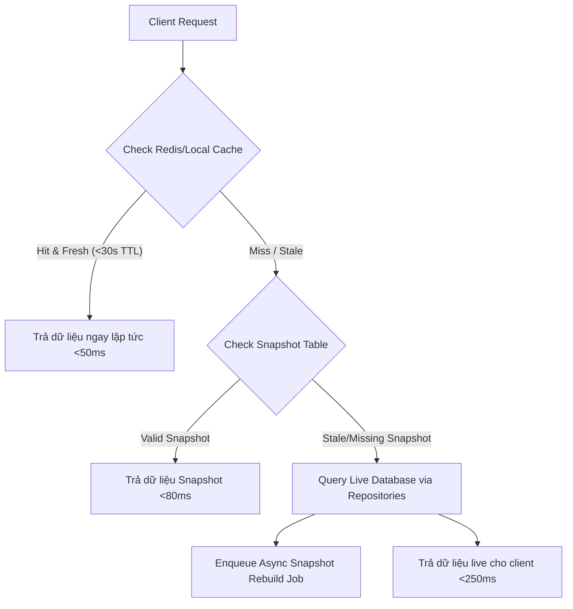

# Projects Read Model & Tab-Gated APIs

Bản thiết kế này chi tiết hóa cấu trúc **Read Model** tối ưu hóa cho phân hệ Quản lý Dự án (PMS) nhằm tăng tốc độ tải dữ liệu, giảm thiểu số lượng truy vấn lặp và phân tách ranh giới dữ liệu thông qua cơ chế Tab-Gated API.

---

## 1. Tab-Gated API Boundary Design

Màn hình chi tiết dự án chứa lượng thông tin khổng lồ. Để tránh việc tải toàn bộ cấu trúc dữ liệu nặng trong một request đơn lẻ, hệ thống áp dụng cơ chế phân chia API theo tab tại:

```text
GET /projects/:id/detail/:tab
```

Khi người dùng chuyển đổi giữa các tab trên frontend, hệ thống chỉ kích hoạt truy vấn dữ liệu dành riêng cho tab đó. Dưới đây là đặc tả ranh giới dữ liệu của từng tab:

| Tab Name | Scope & Data Returned (Phạm vi dữ liệu trả về) | Source Database & Snapshots |
| :--- | :--- | :--- |
| **`overview`** | Thông tin chung dự án, tiến độ tổng thể, sức khỏe dự án, cảnh báo chính. | `ProjectDashboardSnapshot` |
| **`progress`** | Cấu trúc cây WBS (gồm tiến độ và thời gian chạy thực tế của từng task). | `ProjectRuntimeSnapshot` (WBS Tree Section) |
| **`materials`**| Danh sách vật tư định mức, lượng đã cấp phát, lượng tiêu hao thực tế, lượng chờ trả lại. | `ProjectTaskMaterialAllocation` + `inventory_transactions` |
| **`components`**| Danh sách cấu kiện gán cho dự án, vị trí mặt bằng (Floor/Zone), trạng thái lắp dựng. | `ProjectTaskComponentAllocation` + `components` |
| **`costs`** | Chi tiết chi phí dự toán (Budget), chi phí thực tế (Actual), chênh lệch (Variance) phân rã theo vật tư, nhân công, thiết bị. | `ProjectTaskCost` |
| **`documents`**| Hồ sơ dự án, bản vẽ thiết kế, biện pháp thi công, biên bản nghiệm thu (phân nhóm theo loại file). | `attachments` + `attachment_links` |
| **`logs`** | Lịch sử hoạt động, nhật ký thay đổi WBS, lịch sử xuất nhập vật tư hiện trường. | `activity_logs` |
| **`site`** | Giao diện thu gọn cho hiện trường: các công việc cần làm hôm nay, form cập nhật nhanh tiến độ kèm ảnh. | `ProjectTask` (status = `READY` / `IN_PROGRESS`) |
| **`command`** | Trung tâm chỉ huy cho Giám đốc Dự án: cảnh báo chậm tiến độ, dự báo ngày hoàn thành, kiến nghị điều phối. | `ProjectDashboardSnapshot` + AI Insights payload |

---

## 2. Thiết Kế Composite Indexes (Database Indexes)

Để hỗ trợ truy vấn hiệu năng cao cho các màn hình danh sách, báo cáo và các tab-gated API, cơ sở dữ liệu PostgreSQL của SteelTrack được cấu hình các composite indexes tối ưu sau:

```prisma
// Cấu hình Composite Indexes đề xuất cho Projects trong prisma.schema (Đã được EPIC104 tối ưu)

model ProjectTask {
  // ... các trường của model
  
  // Index 1: Tối ưu hóa render cây WBS phân cấp theo thứ tự sắp xếp của từng cấp
  @@index([projectId, parentTaskId, sortOrder])
  
  // Index 2: Tối ưu cho màn hình Site Mode (Lấy các task đang trễ hoặc cần làm theo lịch)
  @@index([projectId, status, scheduledFinishAt])
  
  @@map("project_tasks")
}

model ProjectTaskMaterialAllocation {
  // ... các trường của model
  
  // Index 3: Tối ưu cho tab vật tư và truy vấn đối soát kho
  @@index([projectTaskId, inventoryItemId])
  
  @@map("project_task_material_allocations")
}

model ProjectTaskComponentAllocation {
  // ... các trường của model
  
  // Index 4: Tối ưu cho việc quét vị trí cấu kiện theo cây công việc
  @@index([projectTaskId, componentId])
  
  @@map("project_task_component_allocations")
}
```

### Giải thích vai trò kỹ thuật:
- **`[projectId, parentTaskId, sortOrder]`**: Tránh việc PostgreSQL phải thực hiện phép quét toàn bộ bảng (Seq Scan) kèm phân loại sắp xếp (Sort Operation) khi người dùng mở rộng một Summary Task trong cây WBS.
- **`[projectId, status, scheduledFinishAt]`**: Tối ưu hóa truy vấn lọc các công việc đang bị nghẽn (`BLOCKED`) hoặc sắp đến hạn hoàn thành tại công trường, tăng tốc độ phản hồi của tab `site` xuống < 30ms.

---

## 3. Cơ Chế Fallback & Cache TTL

Để đạt được mục tiêu tải trang tức thời (Instant Loading), SteelTrack sử dụng giải pháp bộ nhớ đệm kết hợp Fallback thông minh:



### Đặc tả cấu hình Cache:
- **Local Memory Cache TTL**: 30 giây (áp dụng cho các tabs tĩnh như `documents`, `overview`).
- **Snapshot TTL**: 5 phút. Nếu snapshot cũ quá 5 phút, background worker sẽ tự động được kích hoạt để làm mới snapshot.
- **Frontend Cache**: React Query (TanStack Query) lưu cache theo key `['projects', projectId, 'detail', tab]`. Khi có tín hiệu realtime qua WebSockets (e.g. `projects.task.updated`), frontend chỉ đánh dấu cache key tương ứng là stale để kích hoạt refetch ngầm, không reload toàn bộ trang.

---

## 4. Phân Tích Rủi Ro & Giải Pháp An Toàn (Read Model Risks)

- **Cache Stampede (Hiệu ứng bầy đàn)**:
  - *Rủi ro*: Khi cache của một tab nặng (ví dụ: `progress` chứa cây WBS lớn) hết hạn đồng thời lúc có hàng trăm người dùng truy cập, hệ thống sẽ thực hiện hàng trăm truy vấn SQL nặng cùng lúc xuống database, gây treo hệ thống.
  - *Giải pháp*: Áp dụng thuật toán **XFetch (Probabilistic Early Expiration)** hoặc cơ chế khóa một phần (Mutex Locking). Chỉ cho phép tiến trình đầu tiên truy cập database để nạp lại cache, các tiến trình sau tiếp tục đọc dữ liệu cũ (stale-while-revalidate) cho đến khi cache mới sẵn sàng.
- **Stale Document Permissions**:
  - *Rủi ro*: Bản vẽ kỹ thuật trong tab `documents` bị thay đổi quyền hạn hoặc bị xóa nhưng cache vẫn hiển thị cho công nhân hiện trường.
  - *Giải pháp*: Không lưu trữ URL hoặc chữ ký phân quyền (signed URLs) của tài liệu trong cache lâu dài. Chỉ cache cấu trúc danh mục tài liệu; link tải file thực tế bắt buộc phải đi qua một API kiểm tra quyền trực tiếp (Direct permission authorization check) với TTL = 0.

---

## 5. Chỉ Số Giám Sát Operations Center

- **`pms.read_model.cache_hit_rate`**: Tỷ lệ hit cache của các API tab-gated. (Mục tiêu: > 90%).
- **`pms.read_model.average_latency_ms`**: Thời gian phản hồi trung bình của API `GET /projects/:id/detail/:tab` phân rã theo từng tab. (Cảnh báo: > 300ms đối với tab bất kỳ).

---

## 6. Cơ Hội Tích Hợp AI

- **AI Smart Pre-fetching**: AI theo dõi thói quen chuyển đổi tab của các vai trò (ví dụ: Giám đốc dự án thường mở tab `command` đầu tiên, sau đó đến `costs`; Kỹ sư hiện trường thường mở `site` rồi đến `documents`). AI sẽ tự động kích hoạt pre-fetch dữ liệu của tab tiếp theo trong luồng hành vi ngay khi tab đầu tiên đang tải, tạo cảm giác không có độ trễ.

---

## 7. Sprint Roadmap

- **Sprint 1**: Triển khai API tab-gated endpoint `/projects/:id/detail/:tab` tại backend, tích hợp cache quản lý bởi `ProjectsRepository.findProjectDetailSources`.
- **Sprint 2**: Cấu hình các composite indexes trên PostgreSQL và chạy kiểm tra hiệu năng (EXPLAIN / ANALYZE) dưới tải mô phỏng 10,000 tasks.
