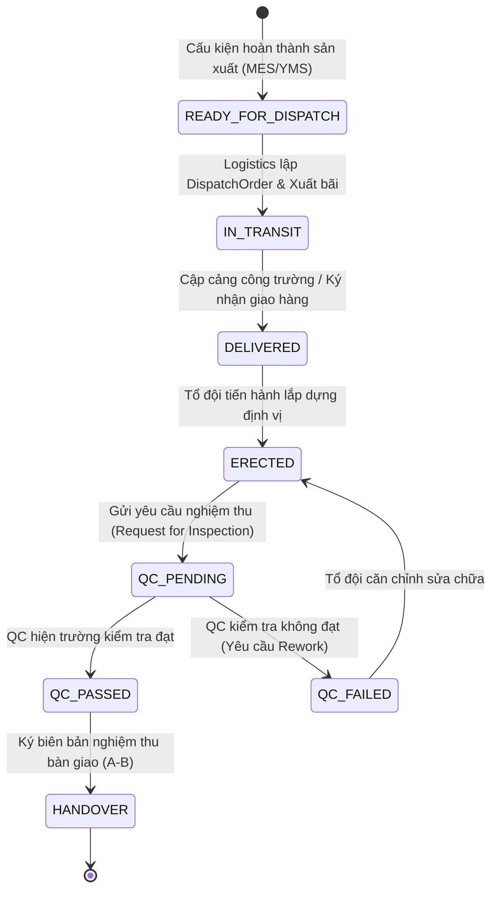
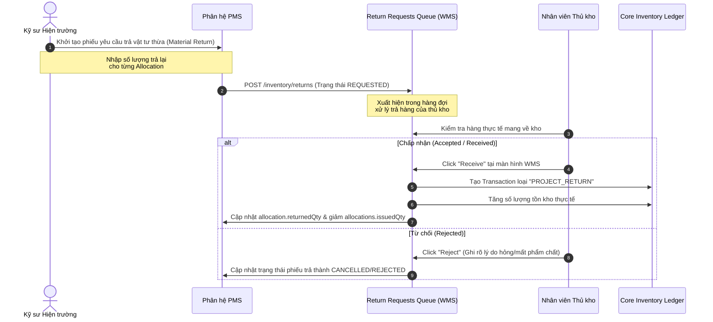

# Projects Site Workflows & Material Returns

Bản thiết kế này chi tiết hóa các quy trình nghiệp vụ hiện trường (Site Operations), bao gồm quy trình lắp dựng cấu kiện, kiểm tra chất lượng (QC), nghiệm thu bàn giao và chu trình trả lại vật tư thừa (Material Returns Lifecycle).

---

## 1. Quy Trình Lắp Dựng & Nghiệm Thu Công Trường (Erection & QC Workflow)

Chu trình quản lý cấu kiện thép từ khi xuất xưởng đến khi nghiệm thu bàn giao đưa vào sử dụng:

### 1.1. Gá Lắp & Lắp Dựng (Erection)
- Cấu kiện sau khi vận chuyển đến công trường (trạng thái `DELIVERED`) được phân bổ về các vị trí trục/tầng tương ứng trên bản vẽ.
- Tổ đội lắp dựng sử dụng thiết bị nâng hạ (xe cẩu) gá lắp cấu kiện vào vị trí thiết kế, siết bulong liên kết tạm thời.
- Trạng thái cấu kiện chuyển từ `DELIVERED` sang `ERECTED`. Hệ thống ghi nhận thời gian thực tế lắp dựng để đối soát hiệu suất tổ đội.

### 1.2. Kiểm Tra & QC Công Trường (Site QC)
- Sau khi lắp dựng hoàn chỉnh hệ khung hoặc cấu kiện, kỹ sư gửi yêu cầu nghiệm thu. Hệ thống kích hoạt tạo một `ProjectTaskInspection` ở trạng thái `PENDING_INSPECTION`.
- Kỹ sư QC hiện trường kiểm tra độ thẳng đứng, độ xiên, độ siết bulong và chất lượng mối hàn hiện trường (siêu âm UT hoặc chụp phim nếu có yêu cầu).
- Kết quả kiểm tra được ghi nhận:
  - **PASSED**: Công việc chuyển sang trạng thái `COMPLETED`. Tiến độ task tự động đạt 100%.
  - **FAILED**: Ghi nhận lỗi, tạo báo cáo CAPA hiện trường. Task bị chuyển sang trạng thái `BLOCKED` để tổ đội lắp dựng sửa chữa.

### 1.3. Nghiệm Thu Bàn Giao (Handover)
- Gom nhóm các task hoàn thành theo phân khu hoặc tầng để thực hiện ký biên bản nghiệm thu bàn giao đưa vào sử dụng giữa Nhà thầu và Chủ đầu tư. Trạng thái chuyển sang `HANDOVER_COMPLETED`.

---

## 2. Quy Trình Trả Lại Vật Tư Thừa (Material Returns Lifecycle)

Trong quá trình thi công lắp dựng, lượng vật tư cấp phát thừa (bulong, bản mã phụ, vữa rót cổ móng) phải được hoàn trả chặt chẽ về kho để quản lý hao hụt. Quy trình này tích hợp trực tiếp với phân hệ Kho (WMS):

### Các trạng thái kiểm soát:
- **`REQUESTED`**: Phiếu trả hàng được tạo từ hiện trường, vật tư vẫn nằm ngoài công trường. Tiến độ dự án hiển thị lượng vật tư này là `Pending Return` để tránh cấp phát trùng lặp.
- **`RECEIVED` (Thành công)**: Thủ kho kiểm đếm, xác nhận chất lượng vật tư đạt yêu cầu nhập kho. Hệ thống tự động:
  - Tạo một giao dịch tồn kho loại `RETURN` với ghi chú "Trả từ công trình".
  - Giảm trừ chi phí thực tế (`actualCost`) của task tương ứng dựa trên giá trị vật tư thu hồi.
- **`REJECTED` (Hủy/Từ chối)**: Vật tư bị hỏng không tái sử dụng được. Số lượng này được chuyển sang ghi nhận phế liệu (`Scrap`) hoặc tính vào hao hụt trượt định mức của dự án.

---

## 3. Phân Tích Rủi Ro Nghiệp Vụ (Workflow Risks)

- **Vật tư hao hụt vô hình (Unreported Loss)**:
  - *Rủi ro*: Kỹ sư hiện trường không báo cáo vật tư hỏng/mất mà tự ý lấy vật tư của task khác thay thế, gây sai lệch dữ liệu chi phí và làm trễ các task sau do thiếu vật tư.
  - *Giải pháp*: Quy định mỗi lần cấp phát bù vật tư vượt định mức kế hoạch (`issuedQty` > `plannedQty`) đều bắt buộc phải nhập mã lý do (Reason Code) và yêu cầu phê duyệt từ Giám đốc Dự án.
- **Nghiệm thu khống (Paper Progress)**:
  - *Rủi ro*: Kỹ sư hiện trường báo cáo nghiệm thu đạt `PASSED` trên phần mềm để lấy thành tích tiến độ nhưng thực tế cấu kiện chưa được lắp dựng hoặc chưa đạt chất lượng.
  - *Giải pháp*: Bắt buộc phải đính kèm ảnh chụp hiện trường có chứa metadata GPS tọa độ và thời gian thực (Geotagging & Timestamping) trong phiếu yêu cầu nghiệm thu. Hệ thống sẽ đối chiếu GPS điện thoại của kỹ sư với tọa độ ranh giới công trường đã cấu hình trong dự án.

---

## 4. Chỉ Số Giám Sát Operations Center

- **`pms.workflow.return_processing_days`**: Thời gian trung bình từ lúc hiện trường tạo yêu cầu trả vật tư (`REQUESTED`) đến khi thủ kho xác nhận nhập kho (`RECEIVED`). (Cảnh báo: > 3 ngày).
- **`pms.workflow.qc_rejection_rate`**: Tỷ lệ các yêu cầu nghiệm thu công việc bị QC từ chối (`FAILED`). (Cảnh báo nếu tăng đột biến: > 15%).

---

## 5. Cơ Hội Tích Hợp AI

- **AI Photo Inspector**: Khi kỹ sư tải ảnh nghiệm thu lắp dựng lên, AI tự động quét hình ảnh để nhận diện cấu kiện (ví dụ: đếm số lượng bulong đã lắp, kiểm tra màu sơn phủ) để tự động xác minh tính trung thực của báo cáo tiến độ trước khi chuyển thông tin cho kỹ sư QC kiểm tra thực tế.

---

## 6. Sprint Roadmap

- **Sprint 1**: Triển khai luồng API kết nối phiếu trả vật tư hiện trường sang cổng `/inventory/returns` của phân hệ Kho.
- **Sprint 2**: Thiết lập quy trình tạo biên bản nghiệm thu QC công trường và liên kết tự động nâng tiến độ task hoàn thành.
