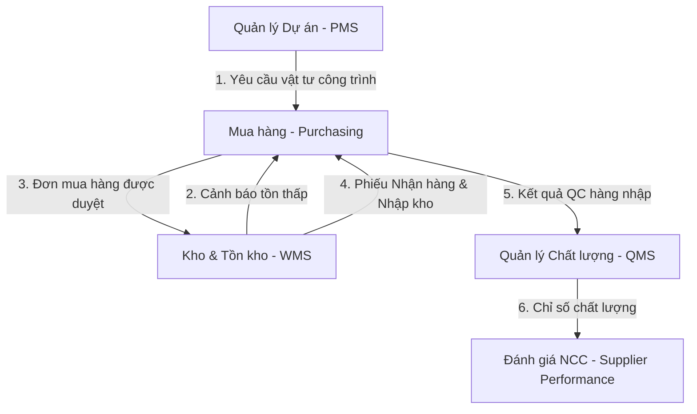
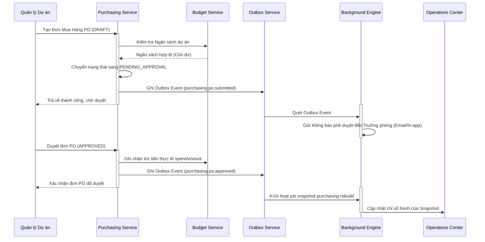

# EPIC205 – Purchasing & Procurement (Purchasing) Blueprint

**Ngày:** 2026-07-08  
**Trạng thái:** DRAFT (Design Phase)  

---

## 1. Executive Summary

Bản thiết kế này phác thảo chi tiết kiến trúc kỹ thuật của phân hệ **Quản lý Mua Hàng & Cung Ứng (Purchasing & Procurement)** thuộc hệ thống SteelTrack. Bản thiết kế kế thừa và tích hợp chặt chẽ với các nền tảng cốt lõi của Core Platform (bao gồm Outbox Pattern, Background Engine, Snapshot Update Engine, và Operations Center), đảm bảo luồng phê duyệt đơn hàng và ghi nhận công nợ, nhận hàng diễn ra an toàn, có tính năng kiểm soát ngân sách thời gian thực.

Mục tiêu chính của phân hệ Mua hàng là tự động hóa luồng từ Yêu cầu mua hàng (Purchase Requisition), Yêu cầu báo giá (RFQ), Báo giá nhà cung cấp (Supplier Quotation), Đơn mua hàng (Purchase Order), Nhận hàng (Goods Receipt), đến Đánh giá nhà cung cấp (Supplier Performance). Hệ thống tích hợp cơ chế Phê duyệt đa cấp (Approval Workflow) động và Kiểm soát ngân sách dự án (Project Budget Control) chặt chẽ để chống thất thoát.

---

## 2. Bản Đồ Tích Hợp Hệ Thống (Integration Map)

Quy trình Mua hàng là cầu nối quan trọng giữa lập kế hoạch sản xuất, quản trị kho và quản trị tài chính dự án:



1. **Từ PMS/WMS sang Purchasing**: Khi dự án thiếu thép theo thiết kế hoặc lượng thép tấm tại Kho chính xuống dưới định mức an toàn, hệ thống tự động sinh Yêu cầu mua hàng (Purchase Request).
2. **Từ Purchasing sang WMS**: Đơn mua hàng (PO) sau khi được duyệt sẽ kích hoạt luồng chuẩn bị vị trí bãi nhận hàng trong WMS. Khi hàng về, thủ kho thực hiện Nhận hàng (Goods Receipt) tự động tạo giao dịch `RECEIVE` trong WMS.
3. **Từ QMS sang Purchasing**: QC kiểm tra chất lượng thép tấm đầu vào (độ dày, chứng chỉ CO/CQ). Kết quả đạt hay lỗi (NCR) được chuyển sang phân hệ Purchasing để tính điểm Đánh giá nhà cung cấp (Supplier Scorecard).

---

## 3. Domain Models (Prisma Schema Notation)

Dưới đây là đặc tả chi tiết cơ sở dữ liệu cho phân hệ Mua hàng được thiết kế tương thích với Prisma.

```prisma
// Yêu cầu mua hàng (Purchase Request - PR)
model PurchaseRequest {
  id              String                @id @default(cuid())
  code            String                @unique // Định dạng PR-YYMMDD-XXXXX
  projectId       String?               // Liên kết dự án nếu mua cho dự án cụ thể
  requesterId     String                // Người lập yêu cầu
  status          PurchaseRequestStatus @default(DRAFT)
  totalEstAmount  Decimal               @default(0) // Giá trị ước tính tổng cộng
  createdAt       DateTime              @default(now())
  updatedAt       DateTime              @updatedAt

  items           PurchaseRequestItem[]
  rfqs            RFQ[]                 @relation("RFQToRequest")

  @@index([projectId])
  @@map("purchase_requests")
}

enum PurchaseRequestStatus {
  DRAFT
  PENDING_REVIEW
  APPROVED
  REJECTED
  RFQ_CREATED
  PO_CREATED
}

// Chi tiết từng dòng vật tư yêu cầu mua
model PurchaseRequestItem {
  id                String          @id @default(cuid())
  requestId         String
  request           PurchaseRequest @relation(fields: [requestId], references: [id], onDelete: Cascade)
  materialId        String          // Vật tư cần mua (Thép tấm, thép hình...)
  quantity          Decimal         // Số lượng thập phân
  expectedDate      DateTime        // Ngày mong muốn nhận hàng
  status            String          @default("PENDING") // PENDING, ORDERED, CANCELLED

  @@index([requestId])
  @@map("purchase_request_items")
}

// Yêu cầu báo giá (Request for Quotation - RFQ)
model RFQ {
  id              String                @id @default(cuid())
  code            String                @unique // Định dạng RFQ-YYMMDD-XXXXX
  title           String
  description     String?
  deadline        DateTime              // Hạn chót nộp báo giá
  status          RFQStatus             @default(DRAFT)
  purchaseRequestId String?
  purchaseRequest   PurchaseRequest?    @relation("RFQToRequest", fields: [purchaseRequestId], references: [id])
  createdAt       DateTime              @default(now())
  updatedAt       DateTime              @updatedAt

  quotations      SupplierQuotation[]

  @@map("rfqs")
}

enum RFQStatus {
  DRAFT
  SENT
  CLOSED
  CANCELLED
}

// Báo giá từ nhà cung cấp cho RFQ
model SupplierQuotation {
  id                String              @id @default(cuid())
  code              String              @unique // Định dạng QUOT-YYMMDD-XXXXX
  rfqId             String
  rfq               RFQ                 @relation(fields: [rfqId], references: [id])
  supplierId        String              // ID Nhà cung cấp từ Supplier Master
  quoteDate         DateTime            @default(now())
  deliveryLeadTimeDays Int              // Thời gian giao hàng cam kết (ngày)
  validUntil        DateTime            // Ngày hết hạn báo giá
  totalQuoteAmount  Decimal             // Tổng giá trị báo giá
  status            QuotationStatus     @default(SUBMITTED)
  createdAt         DateTime            @default(now())
  updatedAt         DateTime            @updatedAt

  items             SupplierQuotationItem[]

  @@index([rfqId])
  @@index([supplierId])
  @@map("supplier_quotations")
}

enum QuotationStatus {
  SUBMITTED
  ACCEPTED
  REJECTED
}

// Chi tiết giá và vật tư trong Báo giá
model SupplierQuotationItem {
  id                String            @id @default(cuid())
  quotationId       String
  quotation         SupplierQuotation @relation(fields: [quotationId], references: [id], onDelete: Cascade)
  materialId        String
  quantity          Decimal
  unitPrice         Decimal           // Đơn giá đề xuất
  totalAmount       Decimal           // Thành tiền dòng

  @@index([quotationId])
  @@map("supplier_quotation_items")
}

// Đơn mua hàng chính thức (Purchase Order - PO)
model PurchaseOrder {
  id                String            @id @default(cuid())
  code              String            @unique // Định dạng PO-YYMMDD-XXXXX
  supplierId        String
  totalAmount       Decimal
  currency          String            @default("VND")
  status            PurchaseOrderStatus @default(DRAFT)
  paymentStatus     PaymentStatus     @default(UNPAID)
  projectId         String?           // Dự án liên kết chịu chi phí
  budgetId          String?           // Ngân sách dự án áp vào
  budget            PurchaseBudget?   @relation(fields: [budgetId], references: [id])
  createdAt         DateTime          @default(now())
  updatedAt         DateTime          @updatedAt

  items             PurchaseOrderItem[]
  goodsReceipts     GoodsReceipt[]
  approvalSteps     ApprovalStep[]

  @@index([supplierId])
  @@index([projectId])
  @@index([budgetId])
  @@map("purchase_orders")
}

enum PurchaseOrderStatus {
  DRAFT
  PENDING_APPROVAL
  APPROVED
  REJECTED
  SENT
  COMPLETED
  CANCELLED
}

enum PaymentStatus {
  UNPAID
  PARTIALLY_PAID
  PAID
}

// Chi tiết dòng đơn mua hàng
model PurchaseOrderItem {
  id                String            @id @default(cuid())
  purchaseOrderId   String
  purchaseOrder     PurchaseOrder     @relation(fields: [purchaseOrderId], references: [id], onDelete: Cascade)
  materialId        String
  quantity          Decimal
  unitPrice         Decimal
  totalAmount       Decimal
  receivedQty       Decimal           @default(0) // Số lượng thực tế đã nhận về kho

  @@index([purchaseOrderId])
  @@map("purchase_order_items")
}

// Giao dịch Nhận hàng đầu vào (Goods Receipt - GR)
model GoodsReceipt {
  id                String            @id @default(cuid())
  code              String            @unique // Định dạng GR-YYMMDD-XXXXX
  purchaseOrderId   String
  purchaseOrder     PurchaseOrder     @relation(fields: [purchaseOrderId], references: [id])
  warehouseId       String            // Nhập vào kho nào (Ví dụ: Kho MAIN)
  receivedAt        DateTime          @default(now())
  operatorId        String            // Thủ kho nhận hàng
  status            ReceiptStatus     @default(RECEIVED)
  createdAt         DateTime          @default(now())
  updatedAt         DateTime          @updatedAt

  items             GoodsReceiptItem[]
  performanceReview SupplierPerformance?

  @@index([purchaseOrderId])
  @@map("goods_receipts")
}

enum ReceiptStatus {
  RECEIVED
  RECONCILED // Đã đối soát hóa đơn/chất lượng đạt
  CANCELLED
}

// Chi tiết nhận hàng thực tế
model GoodsReceiptItem {
  id                String            @id @default(cuid())
  goodsReceiptId    String
  goodsReceipt      GoodsReceipt      @relation(fields: [goodsReceiptId], references: [id], onDelete: Cascade)
  materialId        String
  receivedQty       Decimal
  acceptedQty       Decimal           @default(0) // Số lượng đạt QC đầu vào
  rejectedQty       Decimal           @default(0) // Số lượng hỏng/lỗi trả lại NCC
  unitPrice         Decimal           // Giá tại thời điểm nhận (để cập nhật giá trung bình tồn kho)

  @@index([goodsReceiptId])
  @@map("goods_receipt_items")
}

// Ngân sách danh mục mua hàng của dự án (Budget)
model PurchaseBudget {
  id                String            @id @default(cuid())
  projectId         String
  materialCategory  String            // Loại thép: THÉP TẤM, THÉP HÌNH...
  allocatedAmount   Decimal           // Số tiền ngân sách được duyệt
  spentAmount       Decimal           @default(0) // Đã chi tiêu (từ PO APPROVED)
  remainingAmount   Decimal           // Còn lại = allocatedAmount - spentAmount
  fiscalYear        Int
  createdAt         DateTime          @default(now())
  updatedAt         DateTime          @updatedAt

  purchaseOrders    PurchaseOrder[]

  @@unique([projectId, materialCategory, fiscalYear])
  @@map("purchase_budgets")
}

// Bước phê duyệt động (Approval Workflow)
model ApprovalStep {
  id                String            @id @default(cuid())
  purchaseOrderId   String
  purchaseOrder     PurchaseOrder     @relation(fields: [purchaseOrderId], references: [id], onDelete: Cascade)
  stepNumber        Int               // Thứ tự duyệt (1, 2, 3...)
  approverId        String            // ID User phê duyệt (Trưởng phòng, Giám đốc, Kế toán...)
  status            ApprovalStatus    @default(PENDING)
  signedAt          DateTime?
  comments          String?
  updatedAt         DateTime          @updatedAt

  @@index([purchaseOrderId])
  @@index([approverId])
  @@map("approval_steps")
}

enum ApprovalStatus {
  PENDING
  APPROVED
  REJECTED
}

// Đánh giá hiệu suất Nhà cung cấp cho từng Đơn hàng
model SupplierPerformance {
  id                String            @id @default(cuid())
  supplierId        String
  purchaseOrderId   String
  goodsReceiptId    String            @unique
  goodsReceipt      GoodsReceipt      @relation(fields: [goodsReceiptId], references: [id])
  qualityScore      Decimal           // Điểm chất lượng (Dựa trên tỷ lệ đạt QC đầu vào)
  deliveryScore     Decimal           // Điểm thời gian giao hàng (So với cam kết trong PO)
  priceScore        Decimal           // Điểm cạnh tranh giá
  overallScore      Decimal           // Điểm tổng hợp
  reviewedBy        String
  comments          String?
  createdAt         DateTime          @default(now())

  @@index([supplierId])
  @@index([purchaseOrderId])
  @@map("supplier_performances")
}
```

---

## 4. Aggregates & Consistency Rules

### 4.1. PurchaseOrder (PO) Aggregate
*   **Aggregate Root**: `PurchaseOrder`
*   **Boundary**: Quản lý thông tin PO và các dòng chi tiết `PurchaseOrderItem`, kèm quy trình duyệt `ApprovalStep`.
*   **Consistency Rules**:
    1. Tổng số tiền `totalAmount` của PO phải bằng tổng giá trị của các dòng chi tiết (`quantity` * `unitPrice`).
    2. Một PO chỉ được gửi đi (`SENT`) khi trạng thái phê duyệt là `APPROVED`.
    3. Ngăn chặn sửa đổi: Không cho phép sửa đổi số lượng hoặc đơn giá của PO khi trạng thái đã chuyển sang `PENDING_APPROVAL` hoặc `APPROVED`.

### 4.2. PurchaseBudget (Ngân sách) Aggregate
*   **Aggregate Root**: `PurchaseBudget`
*   **Boundary**: Kiểm soát chi tiêu của dự án theo danh mục vật tư.
*   **Consistency Rules**:
    1. Trước khi duyệt PO (`APPROVED`), hệ thống bắt buộc kiểm tra số dư ngân sách còn lại (`remainingAmount`). Nếu giá trị PO vượt quá số dư, hệ thống sẽ chặn hành động duyệt và yêu cầu quy trình điều chỉnh ngân sách đặc biệt.
    2. `remainingAmount` phải luôn bằng `allocatedAmount` trừ đi `spentAmount` của tất cả các PO đã ở trạng thái `APPROVED` hoặc `COMPLETED`.

### 4.3. GoodsReceipt & Reconciliation Aggregate
*   **Aggregate Root**: `GoodsReceipt`
*   **Boundary**: Đối soát lượng nhận thực tế so với PO.
*   **Consistency Rules**:
    1. Số lượng nhận thực tế (`receivedQty`) của một mặt hàng không được vượt quá số lượng đặt mua trong PO (`PurchaseOrderItem.quantity`) cộng thêm sai số cho phép (Tolerance - mặc định 5% cho nguyên liệu thép cân kg).
    2. Khi lưu phiếu `GoodsReceipt` ở trạng thái `RECEIVED`, hệ thống phải tự động cập nhật số lượng đã nhận (`receivedQty`) trên dòng PO tương ứng.

---

## 5. Event Flows (Sự Kiện Nghiệp Vụ)

Quy trình phê duyệt và mua hàng tương tác liên thông thông qua các sự kiện Outbox chuẩn hóa.



### 5.1. Danh Sách Các Sự Kiện Core Purchasing
1.  `purchasing.pr.created`: Phát ra khi yêu cầu mua hàng được lập từ hệ thống cảnh báo hoặc dự án.
2.  `purchasing.rfq.sent`: Phát ra khi đóng gói và gửi yêu cầu báo giá tới các nhà cung cấp được mời.
3.  `purchasing.quotation.submitted`: Phát ra khi nhà cung cấp cập nhật bảng giá chào hàng lên cổng thông tin.
4.  `purchasing.po.approved`: Phát ra khi đơn mua hàng được phê duyệt ở cấp cuối cùng.
5.  `purchasing.receipt.created`: Phát ra khi thủ kho hoàn tất lập phiếu nhận hàng nhập kho.
6.  `purchasing.performance.evaluated`: Phát ra khi đơn hàng được đánh giá hiệu suất giao hàng và chất lượng của NCC.

### 5.2. Cấu Trúc Payload Ví Dụ (Lightweight Event Payload)
Sự kiện duyệt đơn PO:
```json
{
  "eventId": "evt_p982374ad987123",
  "eventType": "purchasing.po.approved",
  "timestamp": "2026-07-08T16:45:00.000Z",
  "idempotencyKey": "po_approve_12938b",
  "data": {
    "purchaseOrderId": "po_98237198a87",
    "supplierId": "sup_hoa_phat_steel",
    "totalAmount": 1500000000.00,
    "currency": "VND",
    "projectId": "proj_viet_tin_tower",
    "approvedBy": "mgr_le_van_b"
  }
}
```

---

## 6. Read Models & Performance Optimization

Mua hàng là phân hệ có tần suất truy vấn báo cáo và phân tích giá cao. Các Read Model được xây dựng để giảm thiểu truy vấn trực tiếp vào bảng giao dịch.

### 6.1. Thiết Kế Read Model Phân Tích Giá Cả (`MaterialPriceHistoryReadModel`)
Read Model lưu trữ lịch sử biến động giá của từng mã vật tư:
*   Mã vật tư (`materialId`), Tên vật tư.
*   Giá trị giao dịch gần nhất, Giá trị trung bình 30/90/180 ngày.
*   Danh sách 3 nhà cung cấp có mức giá tốt nhất được ghi nhận gần đây.

### 6.2. Chiến Lược Caching & Tải Chỉ Mục (Indexing)
*   **Query Path**: Giao diện Purchasing Cockpit khi lập PO mới sẽ gọi API gợi ý giá mua `GET /purchasing/price-recommendation?materialId=xxx`. API này sẽ đọc từ `MaterialPriceHistoryReadModel` được cache trong Redis với thời gian TTL là **1 giờ** (vì giá thép công nghiệp biến động theo ngày, không cần realtime theo giây).
*   **Database Indexing**:
    ```sql
    CREATE INDEX po_status_date_idx ON purchase_orders (status, created_at DESC);
    CREATE INDEX receipt_po_idx ON goods_receipts (purchase_order_id);
    CREATE UNIQUE INDEX budget_proj_cat_yr_idx ON purchase_budgets (project_id, material_category, fiscal_year);
    ```

---

## 7. Persisted Snapshots & Background Rebuilder Jobs

### 7.1. Bảng Snapshot Cơ Sở Dữ Liệu (`purchasing_overview_snapshots`)
Bảng này lưu trữ tổng hợp tình trạng mua sắm và sử dụng ngân sách của toàn bộ các dự án đang chạy:
*   `id`: String (Primary Key)
*   `fiscalYear`: Int
*   `payload`: JSON (Chứa thông tin: Tổng số tiền đã chi mua hàng theo tháng, tỷ lệ giải ngân ngân sách từng dự án, danh sách các PO đang chờ duyệt gấp, cảnh báo chậm giao hàng từ NCC)
*   `freshness`: DateTime (Thời điểm cập nhật cuối cùng)

### 7.2. Tác Vụ Tái Dựng Snapshot (`snapshot.purchasing.rebuild`)
*   Khi có sự kiện `purchasing.po.approved` hoặc `purchasing.receipt.created` phát sinh, hệ thống đẩy job `snapshot.purchasing.rebuild` vào Background Engine.
*   **Fallback Logic**: Nếu dữ liệu snapshot không tồn tại hoặc hết hạn (quá 24 giờ không cập nhật), hệ thống tự động gọi `PurchasingRepository.findLiveOverviewState()` để tính toán động trực tiếp từ database, đồng thời kích hoạt job tái dựng nền để cập nhật lại snapshot.

---

## 8. Background Jobs

Phân hệ Mua hàng quản lý các Background Jobs để tự động hóa việc kiểm soát tiến độ cung ứng:

1.  **Job Đóng Hạn Nhận Báo Giá (`purchasing.rfq.deadline_watcher`)**:
    *   **Tần suất**: Chạy mỗi 1 giờ.
    *   **Nhiệm vụ**: Quét các `RFQ` có trạng thái `SENT` và `deadline < now()`. Tự động chuyển trạng thái RFQ sang `CLOSED`, khóa không cho nhà cung cấp nộp thêm báo giá mới, và gửi thông báo cho nhân viên mua hàng vào xem xét báo giá.
2.  **Job Cảnh Báo Trễ Hạn Giao Hàng (`purchasing.po.delivery_sla_checker`)**:
    *   **Tần suất**: Chạy vào 07:00 sáng hàng ngày.
    *   **Nhiệm vụ**: Đối soát chéo giữa ngày cam kết trên PO với các phiếu `GoodsReceipt` đã nhận. Nếu đơn hàng đã quá hạn cam kết nhưng chưa nhận đủ số lượng, chuyển trạng thái PO sang cảnh báo trễ và gửi thông báo nhắc nhở nhà cung cấp.
3.  **Job Đối Soát & Dự Báo Ngân Sách (`purchasing.budget.threshold_monitor`)**:
    *   **Tần suất**: Chạy mỗi 12 giờ.
    *   **Nhiệm vụ**: Phân tích tỷ lệ tiêu hao ngân sách. Nếu `spentAmount` vượt quá **85%** `allocatedAmount` của một dự án, gửi cảnh báo mức độ cao (Critical Alert) về Operations Center để quản lý dự án có phương án chuẩn bị điều chỉnh dòng tiền.

---

## 9. UI/UX Dashboards & Purchasing Cockpit Layout Specs

Giao diện Purchasing Cockpit được xây dựng theo tiêu chuẩn bảng điều khiển chỉ huy công nghiệp tối giản, tập trung vào số liệu thực tế.

### 9.1. Bố Cục 5 Hàng (Manufacturing Command Center Layout)
*   **Hàng 1: Thanh KPI Đỉnh (`h-[108px]`)**
    *   Sử dụng `<CockpitKpiCard />` hiển thị: Tổng ngân sách mua hàng năm nay, Tỷ lệ ngân sách đã chi (%), Số lượng PO đang chờ duyệt, Giá trị PO đã xuất xưởng hôm nay, Số nhà cung cấp giao hàng trễ hạn.
*   **Hàng 2: Bảng Điều Phối Mua Hàng & Phê Duyệt (`h-[560px]`)**
    *   Thiết kế lưới 12 cột fluid:
        *   **Danh sách Đơn mua hàng PO & RFQ (col-span-8)**: Bảng danh sách PO phân loại theo trạng thái (Nháp, Chờ duyệt, Đã duyệt, Đang giao, Đã hoàn thành). Hỗ trợ nhấp chuột mở Drawer chi tiết từ bên phải.
        *   **Bảng Phê duyệt nhanh & Ngân sách dự án (col-span-4)**: Hiển thị các đơn hàng đang chờ User hiện tại ký duyệt số. Phía dưới hiển thị biểu đồ đo lường hạn mức sử dụng ngân sách của các dự án trọng điểm.
*   **Hàng 3: Phân Tích Hiệu Suất Nhà Cung Cấp (`h-[320px]`)**
    *   *Trái (xl:col-span-6)*: Biểu đồ phân tích chất lượng NCC (SLA và tỷ lệ đạt QC vật tư đầu vào) dạng biểu đồ mạng nhện (Radar Chart).
    *   *Phải (xl:col-span-6)*: Biểu đồ xu hướng giá thép xây dựng nhập kho trung bình qua các tháng.
*   **Hàng 4: Nhật Ký Mua Hàng & Lịch Sử Nhận Hàng (`h-[220px]`)**
    *   Bảng hiển thị các phiếu nhập kho `GoodsReceipt` gần đây và lịch sử duyệt đơn hàng, tích hợp `<DataTablePagination />`.

### 9.2. Tiêu Chuẩn Visual Theme
*   Màu nền tối: `bg-slate-950/60`, viền `border-slate-800`.
*   Trạng thái phê duyệt đơn PO:
    *   Nháp (Draft): Màu xám.
    *   Chờ duyệt (Pending): Màu vàng hổ phách có nhấp nháy chậm.
    *   Đã duyệt (Approved): Xanh emerald.
    *   Bị từ chối (Rejected): Đỏ thẫm.

---

## 10. Operations Center Integration

Các chỉ số vận hành mua hàng được liên kết trực tiếp vào Operations Center:

| Metric Code | Metric Name | Target Threshold | Description |
| :--- | :--- | :--- | :--- |
| `purchasing.approval.latency_hours` | Thời gian trung bình duyệt đơn hàng | < 4.0 giờ | Đo khoảng thời gian từ lúc PO được gửi duyệt đến khi hoàn thành bước phê duyệt cuối cùng. |
| `purchasing.budget.breach_count` | Số vụ cảnh báo vượt ngân sách chặn lại | 0 vụ | Số lần hệ thống tự động chặn giao dịch PO do vượt hạn mức ngân sách dự án. |
| `purchasing.snapshot.lag_seconds` | Độ trễ đồng bộ Snapshot Mua hàng | < 30 giây | Đo lường độ trễ cập nhật của background job rebuild snapshot mua sắm. |
| `purchasing.quotation.encryption_health` | Trạng thái mã hóa báo giá NCC | 100% OK | Giám sát tính bảo mật của cơ sở dữ liệu báo giá trước thời điểm mở thầu (RFQ deadline). |

---

## 11. AI Integration: Smart Quotation Scorer & Anomaly Detector

### 11.1. Mục Tiêu Nghiệp Vụ
Tự động chấm điểm các bản báo giá của nhà cung cấp và phát hiện các báo giá bất thường (quá cao, quá thấp hoặc có dấu hiệu bắt tay thông thầu) để hỗ trợ nhân viên mua hàng chọn nhà thầu tối ưu.

### 11.2. Đặc Tả Kỹ Thuật AI
*   **Model**: Thuật toán xếp hạng đa tiêu chí (MCDM) kết hợp mạng thần kinh truyền thẳng (MLP Classifier) chạy trên dịch vụ Python Sidecar.
*   **Inputs**:
    *   Báo giá hiện tại: Đơn giá từng mặt hàng, thời gian giao hàng cam kết, điều khoản thanh toán.
    *   Dữ liệu lịch sử: Giá mua lịch sử của chính vật tư đó trong 6 tháng qua, điểm uy tín lịch sử của nhà cung cấp (`SupplierPerformance`).
    *   Chỉ số giá thị trường thép (Steel Market Index - cập nhật từ nguồn ngoài).
*   **Outputs**:
    *   Điểm số đề xuất cho báo giá (Thang điểm 100).
    *   Cờ cảnh báo bất thường (`isAnomaly: true/false`) kèm theo mô tả nguyên nhân (Ví dụ: "Đơn giá thép hình cao hơn 35% so với giá thị trường trung bình").
*   **Latency Budget**: Kết quả phân tích phải hiển thị trong vòng **200ms** khi mở tab so sánh báo giá.

---

## 12. Technical Risks & Mitigations

### 12.1. Concurrency ở Kiểm Tra Số Dư Ngân Sách (Double-Spending)
*   **Nguy cơ**: Hai đơn hàng PO lớn của cùng một dự án được duyệt đồng thời ở 2 trình duyệt khác nhau. Nếu kiểm tra ngân sách chạy song song, cả hai đều thấy số dư đủ, dẫn đến khi lưu cả hai đơn PO thì tổng số tiền chi vượt quá ngân sách thực tế.
*   **Biện pháp**: Sử dụng cơ chế khóa phân tán (Distributed Lock) qua Redis dựa trên `projectId + materialCategory` trong quá trình thực hiện giao dịch duyệt PO. Đảm bảo bước trừ tiền ngân sách chạy tuần tự (Atomic).

### 12.2. Bảo Mật Báo Giá Nhà Cung Cấp (Confidentiality)
*   **Nguy cơ**: Nhân viên mua hàng xem trước báo giá của nhà cung cấp A trước khi hết hạn nộp thầu để rò rỉ cho nhà cung cấp B.
*   **Biện pháp**: Sử dụng mã hóa khóa công khai (Asymmetric Encryption). Giá trị báo giá của NCC được mã hóa tại trình duyệt của họ trước khi gửi lên server. Khóa giải mã chỉ được kích hoạt giải phóng tự động bởi Background Engine sau khi thời gian `deadline` của RFQ chính thức kết thúc.

### 12.3. Tròn Số & Lệch Tỷ Giá (Currency Rounding)
*   **Nguy cơ**: Hệ thống SteelTrack sử dụng đơn vị tiền tệ VND cho thị trường nội địa nhưng các đơn mua hàng nhập khẩu thép phôi sử dụng USD, EUR dẫn đến sai lệch phần thập phân khi quy đổi và cộng dồn kế toán.
*   **Biện pháp**: Toàn bộ đơn giá ngoại tệ phải được lưu trữ song song với tỷ giá quy đổi tại thời điểm lập PO (`exchangeRate`). Mọi phép cộng dồn tính toán tổng tiền PO đều thực hiện trên giá trị VND làm tròn về đơn vị Đồng, phần chênh lệch tỷ giá khi thanh toán thực tế sẽ được hạch toán vào tài khoản chênh lệch tỷ giá riêng.

---

## 13. Sprint Roadmap & Implementation Plan

Quy trình phát triển phân hệ Mua hàng được chia làm 5 Sprint:

### 13.1. Sprint 1: Mô Hình Dữ Liệu & Thiết Lập Tầng Nghiệp Vụ Ngân Sách (Budget Master)
*   **Nhiệm vụ**:
    *   Tích hợp các bảng cơ sở dữ liệu mua hàng vào `schema.prisma`.
    *   Xây dựng `PurchasingRepository` và dịch vụ kiểm soát ngân sách `PurchaseBudgetService`.
    *   Viết API quản lý hạn mức ngân sách dự án.
*   **Kết quả bàn giao**:
    *   API khởi tạo và cập nhật ngân sách hoạt động đúng logic.
    *   Chạy lệnh kiểm tra build thành công: `pnpm -C apps/backend-api build`.

### 13.2. Sprint 2: Thiết Lập Yêu Cầu Mua Hàng & Quy Trình Báo Giá (RFQ & Quotations)
*   **Nhiệm vụ**:
    *   Xây dựng luồng tạo Yêu cầu mua hàng (PR) tự động và thủ công.
    *   Xây dựng API tạo yêu cầu báo giá RFQ và cổng cập nhật báo giá cho nhà cung cấp.
*   **Kết quả bàn giao**:
    *   API `POST /purchasing/rfqs` và `POST /purchasing/quotations` hoạt động ổn định.

### 13.3. Sprint 3: Lập Đơn Mua Hàng & Trình Duyệt Đa Cấp (PO & Approval Workflow)
*   **Nhiệm vụ**:
    *   Xây dựng logic tạo PO từ báo giá được chọn.
    *   Thiết lập bảng phê duyệt động `ApprovalStep` với kiểm tra điều kiện ngân sách thời gian thực.
*   **Kết quả bàn giao**:
    *   Luồng phê duyệt PO đa cấp được mã hóa an toàn, ghi nhận log phê duyệt đầy đủ.

### 13.4. Sprint 4: Nhận Hàng & Đối Soát Kho Bãi (Goods Receipt & QC Handoff)
*   **Nhiệm vụ**:
    *   Tích hợp phiếu nhận hàng Goods Receipt kết nối với giao dịch `RECEIVE` của WMS.
    *   Viết logic đánh giá nhà cung cấp tự động dựa trên kết quả QC đầu vào và SLA giao hàng.
*   **Kết quả bàn giao**:
    *   Hàng nhập kho tự động cộng dồn số lượng đã nhận trên PO và cập nhật giá trị tồn kho bình quân gia quyền.

### 13.5. Sprint 5: Giao Diện Purchasing Cockpit & Công Cụ Snapshot
*   **Nhiệm vụ**:
    *   Xây dựng UI Purchasing Cockpit tuân thủ chuẩn Core Platform.
    *   Tạo background job `snapshot.purchasing.rebuild` và tích hợp số liệu lên Operations Center.
    *   Kết nối thuật toán AI chấm điểm báo giá thông minh.
*   **Kết quả bàn giao**:
    *   Hệ thống chạy tích hợp mượt mà. Đạt yêu cầu build dự án toàn diện:
        *   `pnpm -C apps/frontend build`
        *   `pnpm -C apps/backend-api build`
