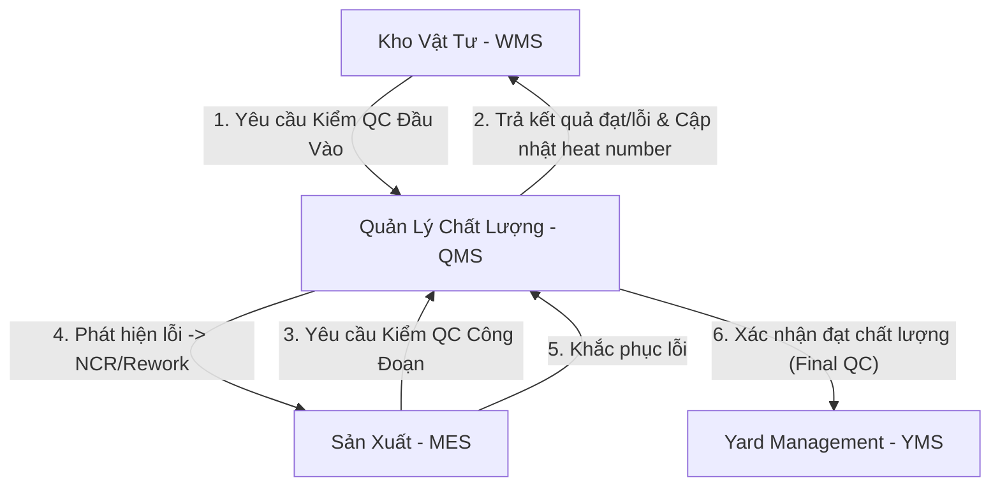

# EPIC202 – Quality Control (QC) Master Blueprint

Date: 2026-07-08
Status: APPROVED (Design Phase)
Module: QMS (Quality Management System)

---

## 1. Executive Summary

Tài liệu này đặc tả thiết kế chi tiết (Master Blueprint) cho phân hệ **Quản lý Chất lượng (Quality Control - QC)** thuộc hệ thống SteelTrack. Bản thiết kế này thiết lập quy trình kiểm soát chất lượng khép kín từ vật tư đầu vào, quá trình gia công chế tạo, công đoạn sơn phủ hoàn thiện cho đến khi bàn giao cấu kiện. Nó cũng định nghĩa cơ chế xử lý không phù hợp thông qua Báo cáo không phù hợp (NCR) và Hành động khắc phục phòng ngừa (CAPA), cùng việc truy xuất nguồn gốc (Traceability) xuyên suốt chuỗi cung ứng sản xuất thép.

QMS tích hợp sâu với Core Platform của SteelTrack thông qua việc kế thừa kiến trúc Repository Pattern, Event-driven Outbox Pattern, Background Engine, và Snapshot Update Engine nhằm đảm bảo dữ liệu chất lượng được xử lý phi đồng bộ, tối ưu hóa tốc độ truy vấn ở mức < 50ms cho các dashboard điều hành.



---

## 2. Domain Models & Aggregates

Phân hệ QC mở rộng các thực thể hiện có trong database schema tại [schema.prisma](file:///opt/projects/steeltrack/apps/backend-api/prisma/schema.prisma) để hỗ trợ đầy đủ quy trình chất lượng nâng cao, bao gồm CAPA, Quality Ledger và cây Traceability.

```text
+----------------------+         +----------------------+         +----------------------+
|     QcInspection     |1       *|       QcResult       |1       *|       QcIssue        |
|  (Kiểm tra chất lượng|-------->|   (Kết quả chi tiết) |-------->| (Vấn đề phát hiện)   |
+----------------------+         +----------------------+         +----------------------+
           |1                                                                |1
           |                                                                 |
           |1                                                                |*
+----------------------+                                          +----------------------+
| NonConformanceReport |1                                        *|      CapaAction      |
|  (Báo cáo lỗi - NCR) |----------------------------------------->| (Hành động CAPA)     |
+----------------------+                                          +----------------------+
```

### 2.1. Các thực thể chính (Domain Entities)

#### 2.1.1. CapaAction (Hành động khắc phục và phòng ngừa)
Quản lý các hành động được đưa ra để sửa chữa lỗi phát sinh hoặc ngăn ngừa lỗi lặp lại trong hệ thống sản xuất.
*   `id`: String (CUID, Primary Key)
*   `code`: String (Unique, định dạng `CAPA-YYMMDD-XXXXX`)
*   `ncrId`: String (Foreign Key liên kết với `NonConformanceReport`, nullable)
*   `type`: Enum (`CORRECTIVE`, `PREVENTIVE`)
*   `rootCauseCategory`: String (Ví dụ: `MACHINE_MALFUNCTION`, `OPERATOR_ERROR`, `MATERIAL_DEFECT`, `PROCESS_DEVIATION`)
*   `description`: String (Mô tả hành động cần thực hiện)
*   `actionPlan`: String (Kế hoạch hành động chi tiết)
*   `assignedToId`: String (Foreign Key liên kết với User thực hiện)
*   `createdById`: String (Foreign Key liên kết với User tạo)
*   `status`: Enum (`DRAFT`, `OPEN`, `IN_PROGRESS`, `UNDER_VERIFICATION`, `COMPLETED`, `CLOSED`)
*   `targetDate`: DateTime (Hạn chót hoàn thành)
*   `resolvedAt`: DateTime (Thời điểm hoàn thành thực tế, nullable)
*   `verificationDetails`: String (Chi tiết xác minh tính hiệu quả của CAPA, nullable)
*   `verifiedAt`: DateTime (Thời điểm xác minh, nullable)
*   `verifiedById`: String (Foreign Key liên kết với User xác minh, nullable)
*   `createdAt`, `updatedAt`: DateTime

#### 2.1.2. QualityLedgerEntry (Sổ nhật ký chất lượng)
Bảng ghi chép bất biến (Immutable Ledger) ghi nhận toàn bộ lịch sử biến động chất lượng của mọi vật tư/cấu kiện. Tuyệt đối không cho phép cập nhật hay xóa các dòng ghi sổ này.
*   `id`: String (CUID, Primary Key)
*   `entityType`: Enum (`COMPONENT`, `MATERIAL_BATCH`)
*   `entityId`: String (Foreign Key liên kết với ID của cấu kiện hoặc lô vật tư tương ứng)
*   `actionType`: Enum (`INSPECTION_PASS`, `INSPECTION_FAIL`, `NCR_RAISED`, `NCR_CLOSED`, `REWORK_STARTED`, `REWORK_COMPLETED`, `CAPA_ASSIGNED`)
*   `referenceNo`: String (Ví dụ: Số QC Inspection, Số NCR, Số CAPA)
*   `previousStatus`: String (Trạng thái chất lượng trước đó)
*   `newStatus`: String (Trạng thái chất lượng mới)
*   `recordedById`: String (Foreign Key liên kết với User ghi nhận)
*   `notes`: String (Ghi chú chi tiết, nullable)
*   `createdAt`: DateTime

#### 2.1.3. TraceabilityNode (Nút cây truy xuất nguồn gốc)
Đại diện cho một đối tượng vật lý hoặc một công đoạn sản xuất trong chuỗi cung ứng vật tư - cấu kiện.
*   `id`: String (CUID, Primary Key)
*   `type`: Enum (`MATERIAL_RECEIPT`, `MATERIAL_ITEM`, `PRODUCTION_STAGE`, `COMPONENT`, `SHIPMENT`, `PROJECT_TASK`)
*   `referenceId`: String (Ví dụ: `inventoryItemId`, `componentId`, `productionStageId`, `dispatchOrderId`)
*   `code`: String (Unique định danh vật lý hiển thị: Heat Number, Lệnh sản xuất, Số Serial Cấu kiện, Mã vận chuyển)
*   `metadata`: Json (Chứa thông tin trọng lượng, kích thước, nhà cung cấp, chứng chỉ CO/CQ)
*   `createdAt`: DateTime

#### 2.1.4. TraceabilityEdge (Liên kết truy xuất)
Định nghĩa mối quan hệ định hướng (Directed Acyclic Graph - DAG) giữa các nút trong cây truy xuất nguồn gốc.
*   `id`: String (CUID, Primary Key)
*   `fromNodeId`: String (Foreign Key liên kết với `TraceabilityNode`)
*   `toNodeId`: String (Foreign Key liên kết với `TraceabilityNode`)
*   `relationType`: Enum (`CONSUMED_BY`, `PRODUCED_FROM`, `INSPECTED_BY`, `SHIPPED_IN`, `INSTALLED_AT`)
*   `quantity`: Float (Số lượng/khối lượng liên kết)
*   `createdAt`: DateTime

### 2.2. Thiết kế Repository Layer

Toàn bộ các truy vấn liên quan đến QC và Traceability được bọc trong các lớp Repository dưới đây để đảm bảo an toàn truy vấn và phân tách lớp dữ liệu.

#### 2.2.1. QcRepository (`apps/backend-api/src/qc/repositories/qc.repository.ts`)
```typescript
import { Injectable } from '@nestjs/common';
import { PrismaService } from '../../prisma/prisma.service';
import { NcrStatus, CapaAction, QualityLedgerEntry } from '@prisma/client';

@Injectable()
export class QcRepository {
  constructor(private prisma: PrismaService) {}

  // Tạo NCR và ghi log vào sổ nhật ký chất lượng (Quality Ledger) trong cùng một Transaction
  async createNcrWithLedger(data: {
    ncrNo: string;
    inspectionId: string;
    issueId?: string;
    productionOrderId?: string;
    componentId?: string;
    title: string;
    description: string;
    raisedById: string;
  }): Promise<any> {
    return this.prisma.$transaction(async (tx) => {
      // 1. Tạo NCR mới
      const ncr = await tx.nonConformanceReport.create({
        data: {
          ncrNo: data.ncrNo,
          inspectionId: data.inspectionId,
          issueId: data.issueId,
          productionOrderId: data.productionOrderId,
          componentId: data.componentId,
          status: 'OPEN',
          title: data.title,
          description: data.description,
          raisedById: data.raisedById,
        },
      });

      // 2. Cập nhật trạng thái của QcInspection sang FAILED
      await tx.qcInspection.update({
        where: { id: data.inspectionId },
        data: { status: 'FAILED' },
      });

      // 3. Ghi vào Quality Ledger nếu kiểm tra này liên quan đến một cấu kiện cụ thể
      if (data.componentId) {
        await tx.qualityLedgerEntry.create({
          data: {
            entityType: 'COMPONENT',
            entityId: data.componentId,
            actionType: 'NCR_RAISED',
            referenceNo: data.ncrNo,
            previousStatus: 'IN_INSPECTION',
            newStatus: 'FAILED_QC',
            recordedById: data.raisedById,
            notes: `NCR được tạo tự động từ QC Inspection: ${data.inspectionId}`,
          },
        });
      }

      return ncr;
    });
  }

  // Cập nhật trạng thái CAPA và ghi nhận nhật ký
  async transitionCapaStatus(
    capaId: string,
    toStatus: string,
    userId: string,
    notes?: string
  ): Promise<CapaAction> {
    return this.prisma.$transaction(async (tx) => {
      const capa = await tx.capaAction.update({
        where: { id: capaId },
        data: {
          status: toStatus as any,
          resolvedAt: toStatus === 'COMPLETED' ? new Date() : undefined,
          verifiedAt: toStatus === 'CLOSED' ? new Date() : undefined,
          verifiedById: toStatus === 'CLOSED' ? userId : undefined,
        },
      });

      return capa;
    });
  }
}
```

#### 2.2.2. TraceabilityRepository (`apps/backend-api/src/qc/repositories/traceability.repository.ts`)
```typescript
import { Injectable } from '@nestjs/common';
import { PrismaService } from '../../prisma/prisma.service';

@Injectable()
export class TraceabilityRepository {
  constructor(private prisma: PrismaService) {}

  // Đăng ký một Node trong cây Traceability
  async registerNode(type: string, referenceId: string, code: string, metadata: any) {
    return this.prisma.traceabilityNode.upsert({
      where: { id: `${type}:${referenceId}` }, // Khóa tự sinh hoặc composite
      create: { type: type as any, referenceId, code, metadata },
      update: { metadata },
    });
  }

  // Kết nối 2 node bằng một Edge có trọng số
  async linkNodes(fromNodeId: string, toNodeId: string, relationType: string, quantity: number) {
    return this.prisma.traceabilityEdge.create({
      data: {
        fromNodeId,
        toNodeId,
        relationType: relationType as any,
        quantity,
      },
    });
  }

  // Sử dụng Recursive CTE để lấy toàn bộ phả hệ nguồn gốc đầu vào (Upstream Genealogy) của cấu kiện
  async getUpstreamLineage(componentNodeId: string): Promise<any[]> {
    return this.prisma.$queryRaw`
      WITH RECURSIVE lineage AS (
        SELECT id, "fromNodeId", "toNodeId", "relationType", 1 as lvl
        FROM qc_traceability_edges
        WHERE "toNodeId" = ${componentNodeId}
        
        UNION ALL
        
        SELECT e.id, e."fromNodeId", e."toNodeId", e."relationType", l.lvl + 1
        FROM qc_traceability_edges e
        INNER JOIN lineage l ON e."toNodeId" = l."fromNodeId"
      )
      SELECT l.*, n.code, n.type, n.metadata
      FROM lineage l
      INNER JOIN qc_traceability_nodes n ON l."fromNodeId" = n.id
      ORDER BY l.lvl ASC;
    `;
  }
}
```

### 2.3. Ràng buộc nghiệp vụ chất lượng (Validation Gates)

Để đảm bảo chất lượng công trình kết cấu thép, hệ thống áp đặt 3 chốt kiểm soát chặn cứng (Hard Validation Gates) tại cơ sở dữ liệu và mã nghiệp vụ:

1.  **Chốt Vật Tư Nhập Kho (`Incoming CQ Gate`)**:
    *   Quy tắc: Không cho phép thủ kho bấm duyệt nhập kho vật tư thép tấm/thép hình (trạng thái `RECEIVE`) nếu chứng chỉ CO/CQ (Mill Certificate) chưa được tải lên và số hiệu Lô đúc (Heat Number/Cast Number) chưa được nhập.
    *   Hành động: Ném lỗi `400 Bad Request` "Thiếu chứng chỉ chất lượng CO/CQ cho lô vật tư".
2.  **Chốt Công Đoạn Chế Tạo (`In-Process Production Gate`)**:
    *   Quy tắc: Một lệnh sản xuất cấu kiện (`ProductionOrder`) tại công đoạn Hàn (`WELDING`) không thể bắt đầu nếu công đoạn Gá Lắp (`ASSEMBLY`) trước đó bị đánh giá chất lượng là `FAILED` tại `QcInspection` và NCR liên quan chưa được chuyển sang trạng thái `RESOLVED` hoặc `APPROVED` (Cho chấp nhận sai số).
3.  **Chốt Xuất Xưởng & Xếp Bãi (`Final QC Shipment Gate`)**:
    *   Quy tắc: Cấu kiện thép không được phép gán trạng thái `READY_TO_SHIP` trong hệ thống Yard Management (YMS) hoặc đưa vào danh sách xếp hàng (`DispatchOrder`) nếu kiểm tra thành phẩm (`FINAL` QC) chưa đạt trạng thái `PASSED`.

---

## 3. Event Flows (Outbox & Event-Driven Architecture)

Hệ thống QC sử dụng cơ chế xử lý phi đồng bộ dựa trên sự kiện thông qua Outbox Pattern hiện có để tính toán OEE sản xuất, cập nhật trạng thái bãi và tái dựng các báo cáo chất lượng thời gian thực.

```text
+---------------------------------------------------------+
| NestJS Business Transaction                             |
|                                                         |
|  1. Cập nhật kết quả QC / NCR (Prisma Write)            |
|  2. Tạo dòng OutboxEvent (Prisma Write)                 |
+---------------------------------------------------------+
                            |
                            v (Commit Transaction)
+---------------------------------------------------------+
| Outbox Table (outbox_events)                            |
+---------------------------------------------------------+
                            |
                            v (EventPublisherService polls & publishes)
+---------------------------------------------------------+
| EventBusService (In-Process Broker)                     |
+---------------------------------------------------------+
        |                                           |
        v                                           v
+-----------------------------+             +-----------------------------+
| EventConsumerService        |             | Background Engine Worker    |
| (Tự động cập nhật YMS/MES)  |             | (Tái dựng snapshot, Trace)  |
+-----------------------------+             +-----------------------------+
```

### 3.1. Danh sách các sự kiện chất lượng (Canonical Events)

Toàn bộ các sự kiện trong phân hệ này bắt đầu bằng tiền tố `qc.*`:

*   `qc.inspection.started`: Bắt đầu quá trình kiểm tra.
*   `qc.inspection.completed`: Hoàn thành kiểm tra QC (có thể Pass hoặc Fail).
*   `qc.issue.raised`: Phát hiện lỗi chất lượng nhỏ cần xử lý tại chỗ.
*   `qc.ncr.raised`: Báo cáo không phù hợp chính thức được khởi tạo.
*   `qc.ncr.resolved`: Lỗi NCR đã được khắc phục (qua rework) và nghiệm thu lại.
*   `qc.capa.created`: Khởi tạo kế hoạch hành động khắc phục phòng ngừa.
*   `qc.capa.verified`: Xác minh hiệu quả CAPA và đóng hồ sơ.
*   `qc.rework.scheduled`: Lịch trình rework được MES phê duyệt từ đề xuất NCR.

### 3.2. Cấu trúc hợp đồng sự kiện (Event Contracts)

#### 3.2.1. Sự kiện `qc.inspection.completed`
```typescript
export interface QcInspectionCompletedEvent {
  eventId: string;          // UUID duy nhất của sự kiện
  eventType: 'qc.inspection.completed';
  timestamp: string;        // Định dạng ISO 8601
  watermark: string;        // Sequence marker phục vụ chống trùng lắp
  payload: {
    inspectionId: string;
    inspectionNo: string;
    type: 'MATERIAL' | 'DIMENSIONAL' | 'WELDING' | 'PAINTING' | 'FINAL';
    productionOrderId?: string;
    componentId?: string;
    inspectorId: string;
    status: 'PASSED' | 'FAILED' | 'REWORK_REQUIRED';
    defectCount: number;
    scrapWeightEstimated?: number;
    metadata: {
      heatNumber?: string;
      dftMicronsAverage?: number; // Độ dày màng sơn khô (Dry Film Thickness)
    };
  };
}
```

#### 3.2.2. Sự kiện `qc.ncr.raised`
```typescript
export interface QcNcrRaisedEvent {
  eventId: string;
  eventType: 'qc.ncr.raised';
  timestamp: string;
  watermark: string;
  payload: {
    ncrId: string;
    ncrNo: string;
    inspectionId: string;
    productionOrderId?: string;
    componentId?: string;
    severity: 'MEDIUM' | 'HIGH' | 'CRITICAL';
    title: string;
    raisedById: string;
    dispositionRequired: 'REWORK' | 'SCRAP' | 'USE_AS_IS' | 'RE_GRADE';
  };
}
```

### 3.3. Định tuyến sự kiện & Tác vụ nền (Event Consumer Routing)

Khi `EventConsumerService` nhận được sự kiện QC, nó sẽ điều phối tạo các Background Job để xử lý dữ liệu nặng mà không ảnh hưởng tới luồng ghi nhận trực tiếp của kỹ sư QC trên hiện trường.

```typescript
import { Injectable } from '@nestjs/common';
import { OnEvent } from '@nestjs/event-emitter';
import { JobSchedulerService } from '../../background-engine/services/job-scheduler.service';
import { LoggerService } from '../../core/logging/logger.service';

@Injectable()
export class QcEventConsumer {
  constructor(
    private jobScheduler: JobSchedulerService,
    private logger: LoggerService
  ) {}

  @OnEvent('qc.inspection.completed')
  async handleQcInspectionCompleted(event: QcInspectionCompletedEvent) {
    this.logger.info(`Đang xử lý sự kiện QC hoàn thành: ${event.payload.inspectionNo}`);

    // 1. Đẩy job tái dựng snapshot chất lượng dự án và dashboard QC
    await this.jobScheduler.schedule({
      name: 'snapshot.qc.update',
      queue: 'snapshots',
      priority: 70,
      idempotencyKey: `snapshot:qc:update:inspection:${event.payload.inspectionId}:${event.watermark}`,
      payload: {
        module: 'qc',
        snapshotType: 'qc-dashboard',
        scopeId: event.payload.inspectionId,
        reason: 'inspection-completed',
      },
    });

    // 2. Nếu QC kiểm tra đạt (PASSED) ở công đoạn FINAL, kích hoạt cập nhật trạng thái bãi Yard
    if (event.payload.type === 'FINAL' && event.payload.status === 'PASSED' && event.payload.componentId) {
      await this.jobScheduler.schedule({
        name: 'snapshot.yard.update',
        queue: 'snapshots',
        priority: 90, // Mức ưu tiên rất cao
        idempotencyKey: `snapshot:yard:update:component:${event.payload.componentId}`,
        payload: {
          module: 'yard',
          snapshotType: 'staging-readiness',
          scopeId: event.payload.componentId,
        },
      });
    }
  }
}
```

---

## 4. Read Models & Snapshots

Đọc trực tiếp từ các bảng giao dịch QC (`qc_inspections`, `qc_results`, `qc_issues`, `non_conformance_reports`) để vẽ biểu đồ dashboard rất tốn kém hiệu năng do số lượng bản ghi kiểm tra của hàng vạn cấu kiện là rất lớn. Do đó, hệ thống ứng dụng mô hình Persisted Snapshot.

### 4.1. Cấu trúc thực thể Snapshot (Persisted Snapshot Schema)

#### 4.1.1. QcDashboardSnapshot (`qc_dashboard_snapshots`)
Bảng lưu trữ snapshot JSON đã tổng hợp sẵn các chỉ số vận hành QC.
*   `id`: String (CUID, Primary Key)
*   `generatedAt`: DateTime
*   `stale`: Boolean (Đánh dấu dữ liệu đã lỗi thời cần tính toán lại)
*   `passRateIncoming`: Float (Tỷ lệ đạt QC vật tư đầu vào)
*   `passRateInProcess`: Float (Tỷ lệ đạt QC gia công)
*   `passRateFinal`: Float (Tỷ lệ đạt QC sơn/hoàn thiện)
*   `openNcrCount`: Int (Số lượng NCR đang mở)
*   `overdueCapaCount`: Int (Số lượng CAPA bị trễ hạn)
*   `defectCategoriesDistribution`: Json (Phân bố các loại lỗi dạng biểu đồ tròn)
*   `welderDefectRankings`: Json (Bảng xếp hạng tỷ lệ lỗi của thợ hàn phục vụ AI)

#### 4.1.2. ComponentTraceabilitySnapshot (`component_traceability_snapshots`)
Lưu trữ cây phả hệ đầy đủ của một cấu kiện dưới dạng JSON đã nén để phục vụ render tức thì trên UI.
*   `id`: String (CUID, Primary Key)
*   `componentId`: String (Unique)
*   `componentCode`: String
*   `generatedAt`: DateTime
*   `serializedGraph`: Json (Chứa toàn bộ mảng Nodes và Edges thượng nguồn của cấu kiện này)

### 4.2. Luồng đọc dữ liệu (Read Path) và Cơ chế Fallback

Khi client gửi request xem dashboard hoặc truy xuất nguồn gốc cấu kiện, dịch vụ sẽ thực hiện theo mô hình sau:

```text
Client Request
  -> NestJS QC Controller
  -> Read Model Service
  -> Kiểm tra bảng Snapshot tương ứng (e.g. ComponentTraceabilitySnapshot)
      -> NẾU tìm thấy và stale == false: Trả về payload JSON (Thời gian phản hồi < 10ms)
      -> NẾU không tìm thấy hoặc stale == true:
          -> Thực hiện truy vấn live (Fallback) bằng recursive CTE thông qua Repository
          -> Trả dữ liệu cho client ngay lập tức
          -> Enqueue một Background Job chạy ẩn để dựng lại Snapshot và cập nhật vào DB
```

---

## 5. Background Jobs

Hàng đợi tác vụ chất lượng được quản lý bởi Background Engine để cô lập các phép tính toán đồ thị truy xuất nguồn gốc phức tạp.

| Tên Job | Hàng Đợi (Queue) | Độ Ưu Tiên (Priority) | Mục Tiêu & Cơ Chế Xử Lý |
| --- | --- | --- | --- |
| `snapshot.qc.update` | `snapshots` | 70 | Cập nhật các chỉ số thống kê trên `QcDashboardSnapshot` khi có sự kiện QC mới. Chạy gia tăng (Incremental update). |
| `snapshot.qc.rebuild` | `snapshot-rebuild` | 10 | Tái dựng toàn bộ snapshot từ đầu. Thường chạy định kỳ lúc 2:00 sáng hoặc khi có yêu cầu bảo trì thủ công. |
| `qc.traceability.generate-graph` | `snapshots` | 80 | Chạy khi cấu kiện hoàn thành hoặc thay đổi công đoạn để dựng lại graph và cập nhật `ComponentTraceabilitySnapshot`. |
| `qc.anomaly.defect-rate-monitor` | `maintenance` | 30 | Chạy định kỳ hàng ca sản xuất (mỗi 8 giờ). Quét toàn bộ dữ liệu kiểm tra để phát hiện bất thường về chất lượng của một tổ đội hoặc nhà cung cấp. |

*   **Idempotency Key Pattern**: Mọi job nền phải tuân thủ định dạng: `snapshot:qc:<job_name>:<scope_id>:<watermark>`.
    *   Ví dụ: `snapshot:qc:generate-graph:component:cmp_123456:2026-07-08T09:30:00Z`
*   **Retry Policy**: Thử lại tối đa 5 lần. Sử dụng Exponential Backoff với công thức $T = \text{baseDelay} \times 2^{\text{retryCount}}$ (với `baseDelay = 10s`). Nếu lỗi tiếp diễn, chuyển vào Dead Letter Queue (DLQ) để thông báo cho Admin trên Operations Center.

---

## 6. UI/UX Dashboards & Operations Center

### 6.1. QC Control Tower (Trung tâm giám sát chất lượng)

Giao diện điều hành chính của Trưởng bộ phận QC được thiết kế theo phong cách tối giản, trực quan hóa dòng chảy chất lượng:

1.  **KPI Cards (Hàng trên cùng - h-[108px])**:
    *   Card 1: *Tỷ lệ đạt Incoming QC* (Mục tiêu > 98.5%, hiển thị màu Xanh/Đỏ tương ứng).
    *   Card 2: *Tỷ lệ đạt In-Process QC* (Mục tiêu > 95.0%).
    *   Card 3: *NCR đang mở* (Tổng số lượng báo cáo chưa được giải quyết).
    *   Card 4: *CAPA trễ hạn* (Số lượng hành động cần xử lý gấp).
2.  **QC Line-Series Trend (Row 2 - h-[260px])**:
    *   Biểu đồ đường thể hiện tỷ lệ lỗi phát hiện theo ngày chia theo 3 công đoạn chính: Vật tư đầu vào, Chế tạo kết cấu, Sơn bảo vệ.
3.  **NCR & CAPA Kanban Board (Row 3 - h-[380px])**:
    *   Bảng Kanban trực quan hóa luồng giải quyết NCR:
        *   `DRAFT` (Mới ghi nhận) -> `UNDER_REVIEW` (Đang phân tích nguyên nhân) -> `REWORK_REQUIRED` (Chờ MES thực hiện sửa chữa) -> `VERIFYING` (QC kiểm tra lại) -> `CLOSED` (Đóng hồ sơ).

### 6.2. Interactive Traceability Viewer (Màn hình truy xuất nguồn gốc)

Cho phép gõ mã cấu kiện (ví dụ: `ST-A1-COL-001`) để hiển thị cây phả hệ đầy đủ:

*   **Trái sang phải (Timeline-flow)**: Lô thép nhập kho (Heat Number + Nhà cung cấp) -> Kết quả Incoming QC -> Công đoạn Cắt tấm -> Gá ráp bản mã -> Hàn liên kết -> Kết quả QC Hàn -> Sơn phủ hoàn thiện -> Kết quả QC Sơn -> Xếp bãi -> Vận chuyển -> Lắp dựng tại công trường.
*   **Màu sắc chỉ thị**: Node đạt QC hiển thị viền xanh lá, node có phát hiện lỗi NCR hiển thị viền đỏ kèm icon cảnh báo nhấp nháy, bấm vào node để mở Drawer chi tiết kết quả kiểm tra.

### 6.3. Giám sát tại Operations Center

Tích hợp chỉ số vận hành QC vào Dashboard hệ thống tại [/operations-center](file:///opt/projects/steeltrack/apps/backend-api/src/operations-center/):
*   Theo dõi tốc độ xử lý tác vụ dựng lại Graph Traceability (thời gian trung bình phải < 200ms).
*   Đo lường độ trễ (Lag) của hàng đợi cập nhật `QcDashboardSnapshot`.
*   Cảnh báo hệ thống khi số lượng lỗi ghi nhận trong Outbox vượt ngưỡng 5 lỗi liên tục trên queue `snapshots`.

---

## 7. AI Integration (Tích hợp Trí tuệ Nhân tạo)

SteelTrack ứng dụng mô hình ngôn ngữ lớn (LLM) và thuật toán phân tích dữ liệu để tự động hóa các tác vụ chất lượng:

1.  **AI Checklist Generator (Tự động tạo danh mục kiểm tra)**:
    *   Hoạt động: Đọc bản vẽ chi tiết cấu kiện (dữ liệu CAD/BOM truyền sang từ PMS) kết hợp với tiêu chuẩn chất lượng (ví dụ: AWS D1.1 cho hàn kết cấu thép, ISO 8501 cho chuẩn bị bề mặt sơn).
    *   Kết quả: AI tự động sinh ra các điểm kiểm tra (`QcChecklistItem`) phù hợp cho từng loại cấu kiện. Ví dụ: Cấu kiện dầm hộp (Box Girder) sẽ tự động có thêm danh mục kiểm tra độ phẳng bề mặt tấm và kiểm tra siêu âm mối hàn góc (UT welding).
2.  **AI Root-Cause Analyzer & CAPA Recommender (Phân tích nguyên nhân & Gợi ý khắc phục)**:
    *   Hoạt động: Khi kỹ sư QC tạo NCR mới và mô tả lỗi (ví dụ: "Độ dày màng sơn lót không đồng đều, xuất hiện bọt khí bề mặt"), AI sẽ quét cơ sở dữ liệu lịch sử các NCR cũ cùng kết quả CAPA tương ứng.
    *   Kết quả: Đưa ra 3 gợi ý hàng đầu về nguyên nhân gốc rễ (ví dụ: "Do súng sơn bị tắc béc phun hoặc độ ẩm môi trường sơn vượt 85%") kèm theo dự thảo kế hoạch hành động khắc phục CAPA tối ưu nhất.
3.  **AI Scrap-Quality Anomaly Detector (Phát hiện dị thường chất lượng)**:
    *   Hoạt động: Chạy ngầm trong Background Engine. Phân tích tương quan giữa khối lượng phế liệu phát sinh (`scrapWeight`) tại các máy cắt CNC và tỷ lệ lỗi QC tại công đoạn tiếp theo.
    *   Kết quả: Cảnh báo sớm nếu phát hiện một lô thép tấm có độ giòn cao hoặc máy cắt CNC-02 đang bị lệch trục lưỡi cắt dẫn đến lỗi kích thước hàng loạt.

---

## 8. Technical Risks & Mitigations

| Rủi Ro Kỹ Thuật | Tác Động | Giải Pháp Khắc Phục (Mitigations) |
| --- | --- | --- |
| **Độ trễ truy vấn đồ thị Traceability** khi hệ thống vận hành 5 năm với hàng triệu cấu kiện và hàng chục triệu mối liên kết (Edges). | Rất cao. Việc dùng SQL đệ quy trực tiếp sẽ làm nghẽn DB chính. | 1. Sử dụng Persisted Snapshot JSON lưu sẵn đồ thị đã dựng của mỗi cấu kiện.<br>2. Áp dụng cơ chế phân vùng bảng (Partitioning) cho bảng `qc_traceability_edges` theo `createdAt` (mỗi quý một vùng).<br>3. Tạo chỉ mục phức hợp (Composite Index) trên `[fromNodeId, toNodeId]` và `[toNodeId, relationType]`. |
| **Dual-write failure** khi QC cập nhật kết quả kiểm tra thành công nhưng ứng dụng bị sập trước khi ghi nhận sự kiện Outbox. | Trung bình. Làm sai lệch thông tin bãi Yard và OEE của MES. | Đảm bảo 100% logic thay đổi trạng thái chất lượng phải chạy trong Prisma Transaction (`$transaction`) có chứa thao tác ghi sự kiện vào bảng `outbox_events`. |
| **Xử lý ngoại tuyến (Offline sync)** khi kỹ sư QC đi kiểm tra dưới hầm công trình hoặc trong phân xưởng tôn lợp sóng yếu không có mạng Internet. | Cao. Công việc kiểm tra hiện trường bị gián đoạn. | 1. Xây dựng cơ chế Local Storage trên Web App để lưu tạm kết quả đánh giá QC của checklist.<br>2. Sử dụng Offline Sync Service: Khi có mạng, tự động đồng bộ hóa tuần tự các bản ghi theo thời gian thực (FIFO), giải quyết xung đột dữ liệu bằng chiến lược "Last-write-wins" kèm theo ghi nhận lịch sử thay đổi (Audit Log). |

---

## 9. Sprint Roadmap

Lộ trình triển khai phân hệ QC được chia làm 3 Sprint cụ thể:

### Sprint 1: Thiết kế Cơ sở dữ liệu, API & Chốt chặn chất lượng (Duration: 2 tuần)
*   **Mục tiêu**: Hoàn thành cấu trúc bảng trong DB (Prisma), triển khai Repository, Service và Controller phục vụ tạo mới QC Inspection và NCR.
*   **Kết quả đầu ra**:
    *   Triển khai thực thể `CapaAction` và `QualityLedgerEntry` trong code.
    *   Xây dựng [qc.repository.ts](file:///opt/projects/steeltrack/apps/backend-api/src/qc/repositories/qc.repository.ts) kiểm soát 3 chốt chặn Validation Gates.
    *   Hoàn tất API POST/GET cho `/qc/inspections` và `/qc/ncrs`.

### Sprint 2: Kiến trúc sự kiện, Tác vụ nền & Snapshot (Duration: 2 tuần)
*   **Mục tiêu**: Tích hợp Outbox Pattern, cấu hình Background Engine để xử lý phi đồng bộ các sự kiện chất lượng và lưu trữ Snapshot.
*   **Kết quả đầu ra**:
    *   Triển khai lớp `QcEventConsumer` xử lý sự kiện `qc.inspection.completed` và `qc.ncr.raised`.
    *   Cấu hình các Background Jobs: `snapshot.qc.update` và `qc.traceability.generate-graph`.
    *   Dựng cơ chế Fallback Read-Path và lưu trữ snapshot `QcDashboardSnapshot`.

### Sprint 3: UI/UX Cockpit, AI Integration & Chạy thử nghiệm (Duration: 2 tuần)
*   **Mục tiêu**: Phát triển giao diện người dùng QC Control Tower, màn hình Traceability tương tác và tích hợp các tính năng AI gợi ý lỗi.
*   **Kết quả đầu ra**:
    *   Frontend QC Dashboard với các chỉ số KPI, Kanban Board cho NCR/CAPA.
    *   Giao diện Traceability hiển thị cây liên kết dạng đồ thị 2D.
    *   Tích hợp API LLM gợi ý nguyên nhân gốc rễ và kế hoạch khắc phục CAPA tự động.
    *   Đo lường hiệu năng: Thời gian tải dashboard < 50ms khi có tải mô phỏng.
