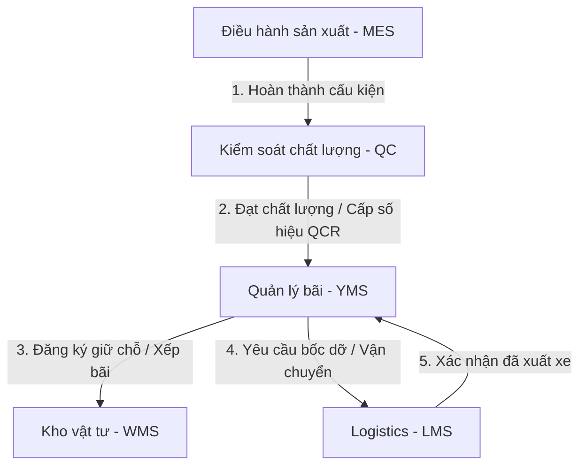
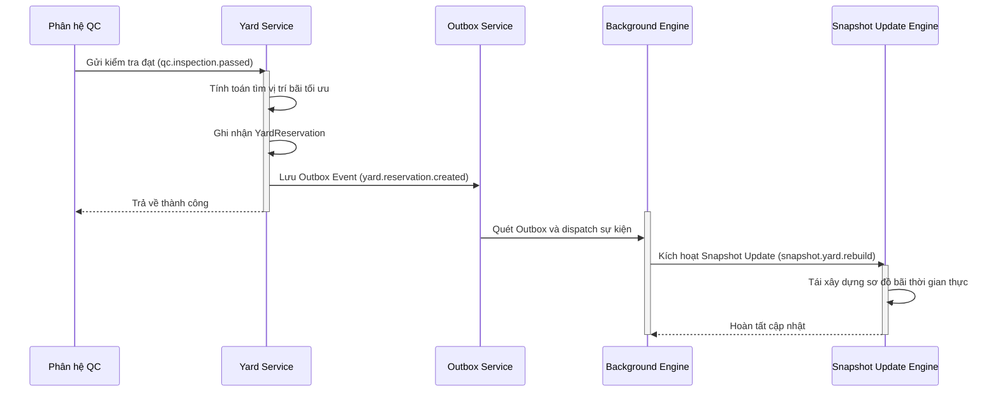

# EPIC204 – Yard Management (YMS) Blueprint

**Ngày:** 2026-07-08  
**Trạng thái:** DRAFT (Design Phase)  

---

## 1. Executive Summary

Bản thiết kế này phác thảo chi tiết kiến trúc kỹ thuật của phân hệ **Quản lý Bãi Thành Phẩm (Yard Management System - YMS)** thuộc hệ thống SteelTrack. Thiết kế này tuân thủ các nguyên tắc thiết kế cốt lõi của Core Platform (bao gồm Outbox Pattern, Background Engine, Snapshot Update Engine, và Operations Center), đảm bảo khả năng xử lý lượng lớn dữ liệu vị trí bãi và tích hợp thời gian thực.

Mục tiêu chính của YMS là cung cấp khả năng hiển thị thời gian thực về vị trí cấu kiện thành phẩm, tối ưu hóa không gian xếp bãi bằng thuật toán xếp chồng (Stacking) thông minh, giám sát hoạt động của thiết bị nâng hạ (Crane), tự động hóa quy trình giữ chỗ (Reservation), dịch chuyển nội bộ (Movement), và bốc dỡ xe (Loading/Unloading). Phân hệ này liên thông chặt chẽ với điều phối sản xuất (MES), kiểm soát chất lượng (QC), và vận chuyển (Logistics).

---

## 2. Bản Đồ Tích Hợp Hệ Thống (Integration Map)

Quy trình quản lý bãi chứa thành phẩm tương tác trực tiếp với các phân hệ khác thông qua luồng sự kiện bất đồng bộ:



1. **Từ MES/QC sang YMS**: Cấu kiện hoàn thành sơn/hoàn thiện và đạt QC nghiệm thu sẽ phát ra sự kiện `qc.inspection.passed`, kích hoạt luồng giữ chỗ tự động của YMS.
2. **Từ YMS sang LMS**: Khi lập kế hoạch giao hàng, YMS cung cấp thông tin vị trí chính xác (Zone, Slot, Stack, Level) của cấu kiện cho LMS để chuẩn bị sơ đồ chất hàng lên xe (Loading Plan).
3. **Từ LMS sang YMS**: Khi xe vận chuyển vào bãi để bốc hàng, tài xế quét mã phiếu giao hàng, kích hoạt nhiệm vụ bốc hạ cẩu (Craning Task) trong YMS.

---

## 3. Domain Models (Prisma Schema Notation)

Dưới đây là thiết kế chi tiết cơ sở dữ liệu cho phân hệ YMS dưới dạng cú pháp Prisma. Các mô hình này sẽ được tích hợp vào `schema.prisma` khi được triển khai chính thức.

```prisma
// Định nghĩa phân khu trong bãi thành phẩm
model YardZone {
  id              String      @id @default(cuid())
  code            String      @unique // Ví dụ: ZONE-A, ZONE-B
  name            String
  type            String      // STANDARD (Thường), HEAVY (Cấu kiện siêu trường), TEMP (Khu tạm)
  maxWeight       Decimal     // Trọng tải tối đa tính bằng Tấn (Decimal hỗ trợ số thập phân)
  currentWeight   Decimal     @default(0)
  maxCapacity     Int         // Sức chứa tối đa theo số lượng cấu kiện
  currentCapacity Int         @default(0)
  createdAt       DateTime    @default(now())
  updatedAt       DateTime    @updatedAt

  slots           YardSlot[]

  @@map("yard_zones")
}

// Định nghĩa ô vị trí cụ thể trong một Phân khu
model YardSlot {
  id              String             @id @default(cuid())
  code            String             @unique // Ví dụ: ZA-ROW01-COL02
  zoneId          String
  zone            YardZone           @relation(fields: [zoneId], references: [id])
  coordinateX     Int                // Tọa độ X trên sơ đồ lưới 2D/3D
  coordinateY     Int                // Tọa độ Y trên sơ đồ lưới 2D/3D
  coordinateZ     Int                // Cao độ Z (tầng) phục vụ vẽ 3D
  maxWeight       Decimal            // Trọng tải tối đa của ô
  maxStackHeight  Int                @default(4) // Số lượng lớp cấu kiện tối đa được xếp chồng
  status          YardSlotStatus     @default(AVAILABLE)
  createdAt       DateTime           @default(now())
  updatedAt       DateTime           @updatedAt

  placements      YardItemPlacement[]
  reservations    YardReservation[]
  movementsFrom   YardMovement[]      @relation("FromSlot")
  movementsTo     YardMovement[]      @relation("ToSlot")

  @@index([zoneId])
  @@index([coordinateX, coordinateY])
  @@map("yard_slots")
}

enum YardSlotStatus {
  AVAILABLE
  OCCUPIED
  RESERVED
  MAINTENANCE
}

// Vị trí đặt vật lý hiện tại hoặc lịch sử của cấu kiện trên bãi
model YardItemPlacement {
  id              String            @id @default(cuid())
  componentId     String            @unique // ID của Component
  slotId          String
  slot            YardSlot          @relation(fields: [slotId], references: [id])
  stackLevel      Int               @default(1) // Vị trí tầng trong chồng cấu kiện (1 = Dưới cùng)
  status          PlacementStatus   @default(STAGED)
  placedAt        DateTime          @default(now())
  removedAt       DateTime?
  operatorId      String            // ID người vận hành xác nhận đặt
  projectId       String            // ID dự án liên kết (để gom hàng theo dự án)
  productionOrderId String?         // ID lệnh sản xuất nguồn

  createdAt       DateTime          @default(now())
  updatedAt       DateTime          @updatedAt

  @@index([slotId])
  @@index([projectId])
  @@map("yard_item_placements")
}

enum PlacementStatus {
  STAGED
  SHIPPED
  RESERVED_FOR_DISPATCH
}

// Cẩu và thiết bị nâng hạ vật lý trên bãi
model YardCrane {
  id              String            @id @default(cuid())
  code            String            @unique // Ví dụ: CRANE-01, CRANE-02
  name            String
  type            CraneType         @default(GANTRY) // Cẩu cổng, cẩu tháp, cẩu bánh xích
  status          CraneStatus       @default(IDLE)
  currentX        Decimal?          // Tọa độ GPS/cảm biến hiện tại X
  currentY        Decimal?          // Tọa độ GPS/cảm biến hiện tại Y
  ipAddress       String?           // Địa chỉ IP của thiết bị IoT kết nối cẩu
  createdAt       DateTime          @default(now())
  updatedAt       DateTime          @updatedAt

  loadTasks       YardLoadUnloadTask[]

  @@map("yard_cranes")
}

enum CraneType {
  GANTRY
  TOWER
  CRAWLER
  FORKLIFT
}

enum CraneStatus {
  IDLE
  BUSY
  MAINTENANCE
  OFFLINE
}

// Đăng ký giữ chỗ vị trí bãi trước khi hạ bãi hoặc xuất bãi
model YardReservation {
  id              String            @id @default(cuid())
  code            String            @unique // Định dạng YRES-YYMMDD-XXXXX
  projectId       String
  componentId     String
  slotId          String
  slot            YardSlot          @relation(fields: [slotId], references: [id])
  reservedAt      DateTime          @default(now())
  expiresAt       DateTime          // Thời điểm hết hạn giữ chỗ (ví dụ: sau 24h)
  status          ReservationStatus @default(PENDING)
  createdAt       DateTime          @default(now())
  updatedAt       DateTime          @updatedAt

  @@index([slotId])
  @@index([componentId])
  @@map("yard_reservations")
}

enum ReservationStatus {
  PENDING
  FULFILLED
  EXPIRED
  CANCELLED
}

// Nhật ký dịch chuyển nội bộ cấu kiện trên bãi
model YardMovement {
  id              String            @id @default(cuid())
  code            String            @unique // Định dạng YMOV-YYMMDD-XXXXX
  componentId     String
  fromSlotId      String
  fromSlot        YardSlot          @relation("FromSlot", fields: [fromSlotId], references: [id])
  toSlotId        String
  toSlot          YardSlot          @relation("ToSlot", fields: [toSlotId], references: [id])
  craneId         String?
  operatorId      String
  movedAt         DateTime          @default(now())
  reason          String            // Ví dụ: REORGANIZATION, QC_RECHECK, LOAD_OUT
  createdAt       DateTime          @default(now())

  @@index([componentId])
  @@index([fromSlotId])
  @@index([toSlotId])
  @@map("yard_movements")
}

// Nhiệm vụ bốc dỡ chi tiết cho cẩu
model YardLoadUnloadTask {
  id              String            @id @default(cuid())
  code            String            @unique // Định dạng YJOB-YYMMDD-XXXXX
  craneId         String
  crane           YardCrane         @relation(fields: [craneId], references: [id])
  taskType        LoadUnloadType
  componentId     String
  sourceLocation  String            // Ví dụ: "TRUCK-30C1234", "ZA-ROW01-COL02"
  targetLocation  String            // Ví dụ: "ZB-ROW03-COL05", "TRUCK-30C1234"
  status          JobStatus         @default(PENDING)
  startedAt       DateTime?
  completedAt     DateTime?
  createdAt       DateTime          @default(now())
  updatedAt       DateTime          @updatedAt

  @@index([craneId])
  @@index([componentId])
  @@map("yard_load_unload_tasks")
}

enum LoadUnloadType {
  LOAD    // Bốc hàng lên xe xuất bãi
  UNLOAD  // Hạ hàng sản xuất vào bãi
  SHIFT   // Đảo bãi nội bộ
}

enum JobStatus {
  PENDING
  IN_PROGRESS
  COMPLETED
  FAILED
  CANCELLED
}
```

---

## 4. Aggregates & Consistency Rules

### 4.1. YardZone & YardSlot Aggregate
*   **Aggregate Root**: `YardZone`
*   **Boundary**: Quản lý tập hợp các `YardSlot` trực thuộc. Mọi thay đổi về sức chứa của `YardSlot` đều ảnh hưởng trực tiếp đến chỉ số tổng hợp của `YardZone`.
*   **Consistency Rules**:
    1. Tổng trọng lượng hiện tại của tất cả các ô trên thực tế (`currentWeight`) không được vượt quá tải trọng khai báo tối đa của Phân khu (`maxWeight`).
    2. Trạng thái của `YardSlot` phải tự động đồng bộ: nếu có `YardItemPlacement` đang hoạt động, trạng thái ô là `OCCUPIED`. Nếu có giữ chỗ còn hạn, trạng thái là `RESERVED`.

### 4.2. YardItemPlacement & Stacking Aggregate
*   **Aggregate Root**: `YardItemPlacement`
*   **Boundary**: Quản lý vị trí cụ thể của một Cấu kiện và quan hệ xếp chồng của nó với các cấu kiện khác trong cùng một `YardSlot`.
*   **Consistency Rules**:
    1. Quy tắc trọng lượng xếp chồng: Không cho phép đặt cấu kiện có khối lượng lớn hơn lên trên cấu kiện có khối lượng nhỏ hơn trong cùng một ô đứng (Stack).
    2. Quy tắc giới hạn độ cao: `stackLevel` tối đa của một placement mới không được vượt quá `maxStackHeight` cấu hình của `YardSlot` đó.
    3. Trọng lượng tổng trong ô đứng không được vượt quá `maxWeight` của ô đó.

### 4.3. YardMovement Aggregate
*   **Aggregate Root**: `YardMovement`
*   **Boundary**: Nhật ký bất biến ghi nhận sự chuyển dịch cấu kiện.
*   **Consistency Rules**:
    1. Khi thực hiện một di chuyển (`YardMovement`), giao dịch database phải cập nhật trạng thái `YardItemPlacement` của nguồn thành `removedAt = movedAt` và tạo một bản ghi `YardItemPlacement` mới tại đích.
    2. Tránh ghi đè: Không cho phép tạo di chuyển đến ô đích đang có trạng thái là `OCCUPIED` hoặc `RESERVED` bởi một cấu kiện khác.

---

## 5. Event Flows (Sự Kiện Nghiệp Vụ)

Toàn bộ hoạt động bãi hoạt động dựa trên các sự kiện bất đồng bộ theo chuẩn đặt tên `domain.entity.action` của hệ thống.



### 5.1. Danh Sách Các Sự Kiện Core YMS
1.  `yard.reservation.created`: Phát ra khi vị trí bãi được giữ chỗ thành công cho cấu kiện vừa sản xuất xong hoặc sắp nhập bãi.
2.  `yard.placement.created`: Phát ra khi cấu kiện thực tế đã được đặt vào ô bãi.
3.  `yard.movement.completed`: Phát ra khi hoàn thành di chuyển một cấu kiện từ ô này sang ô khác.
4.  `yard.loadtask.started`: Phát ra khi cẩu bắt đầu thực hiện nhiệm vụ bốc/hạ hàng.
5.  `yard.loadtask.completed`: Phát ra khi cẩu hoàn tất bốc hàng lên xe hoặc hạ bãi.

### 5.2. Cấu Trúc Payload Ví Dụ (Lightweight Event Payload)
Sự kiện di chuyển cấu kiện:
```json
{
  "eventId": "evt_y12837ad87q123b",
  "eventType": "yard.movement.completed",
  "timestamp": "2026-07-08T16:30:00.000Z",
  "idempotencyKey": "ymov_reorg_982347b",
  "data": {
    "movementId": "ymov_871239ad89",
    "componentId": "comp_steel_h_beam_001",
    "fromSlotId": "za-row01-col02",
    "toSlotId": "za-row02-col05",
    "craneId": "crane_01",
    "operatorId": "op_nguyen_van_a"
  }
}
```

---

## 6. Read Models & Performance Optimization

Để hiển thị sơ đồ bãi 2D/3D mượt mà cho điều phối viên, hệ thống thiết kế các Read Model tối ưu hóa để loại bỏ các câu truy vấn kết nối (JOIN) phức tạp khi kết xuất sơ đồ bãi.

### 6.1. Thiết Kế Read Model Bãi (`YardMapReadModel`)
Read Model trả về cấu trúc phân cấp bãi dưới dạng JSON phẳng để phía giao diện Render 2D/3D nhanh chóng:
*   Mã phân khu (`zoneCode`), Loại Phân khu (`type`), Công suất chiếm dụng (`occupancyPercent`).
*   Mảng các ô (`slots`): Tọa độ (X, Y, Z), Trạng thái (`status`), Chi tiết cấu kiện nằm trong ô (Mã cấu kiện, Dự án liên kết, Lớp xếp chồng hiện tại).

### 6.2. Chiến Lược Caching & Tải Chỉ Mục (Indexing)
*   **Query Path**: API `GET /yard/layout-state` sẽ đọc trực tiếp từ `YardMapReadModel` đã được cache trong Redis với thời gian sống (TTL) là **10 giây**.
*   **Database Indexing**: Để tăng tốc độ truy vấn cơ sở dữ liệu khi cache hết hạn, thiết lập các chỉ mục phức hợp:
    ```sql
    CREATE INDEX yard_slots_coord_idx ON yard_slots (zone_id, coordinate_x, coordinate_y);
    CREATE INDEX yard_placement_active_idx ON yard_item_placements (slot_id, status) WHERE removed_at IS NULL;
    ```

---

## 7. Persisted Snapshots & Background Rebuilder Jobs

Tương tự phân hệ Inventory, phân hệ YMS sử dụng kiến trúc **Persisted Snapshot Table** để lưu trữ trạng thái bãi được tái dựng hoàn chỉnh bởi Background Engine từ nhật ký biến động.

### 7.1. Bảng Snapshot Cơ Sở Dữ Liệu (`yard_layout_snapshots`)
Bảng này lưu trữ toàn bộ trạng thái sơ đồ bãi của một phân khu dưới dạng một payload JSON lớn:
*   `id`: String (Primary Key)
*   `zoneId`: String (FK liên kết với `YardZone`)
*   `freshness`: DateTime (Thời điểm cập nhật cuối cùng)
*   `idempotencyKey`: String (Mã kiểm tra trùng lặp sự kiện)
*   `payload`: JSON (Chi tiết cấu hình sơ đồ bãi toàn phân khu bao gồm tất cả các ô, vị trí cấu kiện và độ cao xếp chồng)

### 7.2. Tác Vụ Tái Dựng Snapshot (`snapshot.yard.rebuild`)
*   Khi có sự kiện `yard.placement.created` hoặc `yard.movement.completed` được đẩy vào hàng đợi, `BackgroundJobManager` sẽ kích hoạt job `snapshot.yard.rebuild` cho `zoneId` liên quan.
*   **Thuật toán**:
    1. Đọc trạng thái snapshot hiện tại trong bảng `yard_layout_snapshots`.
    2. Áp dụng sự kiện di chuyển/xếp bãi mới để cập nhật tọa độ ô đích và giải phóng ô nguồn trong JSON payload.
    3. Lưu lại bản ghi Snapshot với `freshness` mới.
*   **Fallback Logic**: Nếu truy cập bãi gặp lỗi cache hoặc dữ liệu Snapshot quá hạn (Lag > 5 phút), hệ thống sẽ kích hoạt truy vấn trực tiếp từ `YardRepository.findLiveLayoutState(zoneId)` để đảm bảo độ chính xác tuyệt đối ngoài công trường, đồng thời enqueue một job rebuild nền để sửa lỗi đồng bộ.

---

## 8. Background Jobs

Phân hệ YMS vận hành các Background Jobs định kỳ để tự động hóa việc dọn dẹp bãi và quản lý thiết bị:

1.  **Job Dọn Dẹp Giữ Chỗ Quá Hạn (`yard.reservation.expiry_cleanup`)**:
    *   **Tần suất**: Chạy mỗi 15 phút.
    *   **Nhiệm vụ**: Tìm tất cả các bản ghi `YardReservation` có trạng thái `PENDING` và `expiresAt < now()`. Chuyển trạng thái sang `EXPIRED`, giải phóng trạng thái của `YardSlot` liên quan từ `RESERVED` về `AVAILABLE`, và phát ra sự kiện `yard.reservation.expired` để thông báo cho MES/Logistics.
2.  **Job Cảnh Báo Sức Chứa Bãi (`yard.capacity.anomaly_monitor`)**:
    *   **Tần suất**: Chạy mỗi 1 giờ.
    *   **Nhiệm vụ**: Quét toàn bộ các `YardZone`. Nếu tỷ lệ chiếm dụng vượt quá **90%** sức chứa định mức hoặc tải trọng hiện tại vượt quá **95%** `maxWeight`, tạo một cảnh báo hệ thống (System Warning Alert) gửi đến Operations Center.
3.  **Job Tối Ưu Hóa Sắp Xếp Bãi (`yard.layout.defragmenter`)**:
    *   **Tần suất**: Chạy vào lúc 01:00 sáng hàng ngày.
    *   **Nhiệm vụ**: Phân tích tần suất dịch chuyển và trình tự xuất hàng dự án (PMS) để đưa ra đề xuất gom nhóm cấu kiện (Defragmentation Proposals) giúp giảm số lần đảo cẩu khi bốc hàng lên xe.

---

## 9. UI/UX Dashboards & Cockpit Layout Specs

Giao diện Yard Cockpit tuân thủ tiêu chuẩn giao diện điều hành sản xuất công nghiệp cao cấp của SteelTrack.

### 9.1. Phân Bổ Bố Cục 5 Hàng (Manufacturing Command Center Layout)
*   **Hàng 1: Thanh KPI Đỉnh (`h-[108px]`)**
    *   Sử dụng `<CockpitKpiCard />` hiển thị: Tổng số cấu kiện trên bãi, Tỷ lệ chiếm dụng bãi (%), Số lượng giữ chỗ chờ hạ bãi, Số lượt dịch chuyển trong ngày, Số cẩu đang hoạt động.
*   **Hàng 2: Không Gian Sơ Đồ Bãi (`h-[560px]`)**
    *   Thiết kế lưới 12 cột fluid:
        *   **Khu sơ đồ 2D/3D (col-span-8)**: Cho phép chuyển đổi linh hoạt giữa bản đồ 2D tương tác dạng lưới (SVG) và bản đồ 3D thời gian thực (ThreeJS / React Three Fiber). Hiển thị trực quan độ cao của các stack cấu kiện.
        *   **Khu thông tin cẩu & Di chuyển (col-span-4)**: Danh sách lệnh bốc dỡ của cẩu (`YardLoadUnloadTask`) đang thực hiện, biểu đồ đo lường hiệu suất cẩu trong ca.
*   **Hàng 3: Biểu Đồ & Thống Kê Phân Phối (`h-[320px]`)**
    *   *Trái (xl:col-span-6)*: Biểu đồ biến động nhập bãi / xuất bãi 7 ngày qua.
    *   *Phải (xl:col-span-6)*: Phân bố cấu kiện theo dự án (Project Distribution Share) dạng biểu đồ thanh ngang.
*   **Hàng 4: Nhật Ký Di Chuyển & QC Bãi (`h-[220px]`)**
    *   Bảng hiển thị lịch sử di chuyển nội bộ cấu kiện và nhật ký kiểm tra QC ngoài bãi. Hỗ trợ phân trang bằng `<DataTablePagination />`.

### 9.2. Tiêu Chuẩn Visual Theme
*   Màu nền tối đặc trưng: `bg-slate-950/60`, viền `border-slate-800` với hiệu ứng phát sáng nhẹ màu xanh Cyan đặc trưng cho bãi chứa.
*   Trạng thái ô bãi:
    *   Trống (Available): Xám đen nhạt.
    *   Đang chứa hàng (Occupied): Xanh dương đậm.
    *   Giữ chỗ (Reserved): Vàng hổ phách.
    *   Bảo trì/Khóa (Maintenance): Đỏ/Gạch chéo.

---

## 10. Operations Center Integration

Các chỉ số kỹ thuật và vận hành của phân hệ YMS được đăng ký trực tiếp vào **Operations Center** để giám sát sức khỏe hệ thống:

| Metric Code | Metric Name | Target Threshold | Description |
| :--- | :--- | :--- | :--- |
| `yms.snapshot.lag_seconds` | Độ trễ đồng bộ Snapshot Bãi | < 15 giây | Đo khoảng thời gian từ lúc phát sinh di chuyển bãi đến khi Snapshot được rebuild hoàn tất. |
| `yms.crane.offline_rate` | Tỷ lệ mất kết nối thiết bị IoT cẩu | < 1.0% | Đo tỷ lệ thời gian các cẩu cổng bị mất tín hiệu kết nối IP với server. |
| `yms.rebuild.failure_count` | Số lỗi rebuild sơ đồ bãi nền | 0 lỗi | Đếm số lượng tác vụ rebuild bị ném vào Dead Letter Queue (DLQ) trong 24 giờ. |
| `yms.query.fallback_rate` | Tỷ lệ truy cập database bỏ qua Snapshot | < 5.0% | Đo lường hiệu quả hoạt động của tầng Snapshot Caching. |

---

## 11. AI Integration: Smart Stacking Optimizer

### 11.1. Mục Tiêu Nghiệp Vụ
Tránh lãng phí thời gian di chuyển cẩu bằng cách loại bỏ hiện tượng "đảo cẩu" (phải nhấc cấu kiện bên trên ra để lấy cấu kiện bên dưới). AI tự động tính toán vị trí đặt cấu kiện tối ưu khi hạ bãi dựa trên trình tự xuất hàng dự kiến của dự án.

### 11.2. Đặc Tả Kỹ Thuật AI
*   **Model**: Cây quyết định phối hợp Học tăng cường (Reinforcement Learning - PPO Agent) chạy trên dịch vụ Python Sidecar.
*   **Inputs**:
    *   Thông tin cấu kiện cần hạ bãi: Trọng lượng, kích thước, mã dự án, tiến độ yêu cầu tại công trình (PMS).
    *   Trạng thái bãi hiện tại: Tất cả các slot khả dụng trong khu vực, thông tin xếp chồng hiện tại (các cấu kiện bên dưới của từng ô và mã dự án của chúng).
    *   Lịch trình xe Logistics đến nhận hàng (LMS).
*   **Outputs**: Đề xuất top 3 vị trí đặt bãi tối ưu kèm theo điểm số đánh giá hiệu quả (ví dụ: `[ { "slotId": "ZA-ROW01-COL02", "confidence": 0.95, "reason": "Cùng dự án và cùng tiến độ lắp dựng đợt 1" } ]`).
*   **Latency Budget**: Quyết định gợi ý phải được tính toán dưới **150ms** để đảm bảo tài xế cẩu không phải chờ đợi trên màn hình tablet cầm tay.

---

## 12. Technical Risks & Mitigations

### 12.1. Concurrency (Xung đột ghi nhận vị trí đồng thời)
*   **Nguy cơ**: Nhiều tài xế cẩu cùng xác nhận hạ hàng vào một ô bãi trống tại cùng một thời điểm, dẫn đến xung đột ghi nhận trong cơ sở dữ liệu.
*   **Biện pháp**: Sử dụng cơ chế khóa quan quan (Optimistic Locking) bằng trường `version` hoặc `updatedAt` trên `YardSlot`. Giao dịch ghi nhận placement phải được chạy trong mức cô lập giao dịch **Serializable** của database.

### 12.2. Dung Lượng Payload Snapshot Quá Lớn
*   **Nguy cơ**: Một phân khu lớn có thể chứa hàng ngàn ô bãi, dẫn đến JSON payload của Snapshot cực kỳ lớn, gây chậm mạng khi truyền tải dữ liệu.
*   **Biện pháp**: Thực hiện phân chia Snapshot theo lớp phân vùng vật lý (Zone-level Snapshots thay vì Yard-level Snapshot). Sử dụng thuật toán nén JSON hoặc chỉ lưu trữ danh sách các ô có biến động (Delta) thay vì gửi toàn bộ lưới ô trống.

### 12.3. Mất Đồng Bộ Thiết Bị IoT Cẩu
*   **Nguy cơ**: Cảm biến vị trí hoặc kết nối mạng của cẩu bị mất liên lạc, dẫn đến tọa độ của cẩu (`YardCrane.currentX`, `currentY`) bị sai lệch so với vị trí cẩu thực tế.
*   **Biện pháp**: Xây dựng cơ chế chuẩn hóa dữ liệu (Dead Reckoning) kết hợp quét mã QR vị trí cột mốc bãi mỗi khi cẩu hạ container/cấu kiện để hiệu chỉnh lại vị trí tương đối.

---

## 13. Sprint Roadmap & Implementation Plan

Quy trình phát triển YMS được chia làm 5 Sprint cụ thể:

### 13.1. Sprint 1: Thiết Lập Mô Hình Domain & Tầng Dữ Liệu (Prisma Setup)
*   **Nhiệm vụ**:
    *   Tích hợp các bảng cơ sở dữ liệu YMS vào `schema.prisma`.
    *   Xây dựng `YardRepository` bao bọc các câu lệnh truy vấn vị trí bãi.
    *   Viết API tạo bãi, phân khu (`YardZone`) và tạo ô bãi (`YardSlot`).
*   **Kết quả bàn giao**:
    *   Mã nguồn backend cho quản lý danh mục bãi chứa.
    *   Build thành công backend: `pnpm -C apps/backend-api build`.

### 13.2. Sprint 2: Thiết Kế Luồng Nghiệp Vụ Hạ Bãi & Giữ Chỗ (Reservation Workflow)
*   **Nhiệm vụ**:
    *   Xây dựng nghiệp vụ Đăng ký vị trí bãi (`YardReservation`) cho cấu kiện hoàn thành.
    *   Viết logic cho các Cổng kiểm soát (Validation Gates) cấm đặt sai vị trí hoặc đặt quá tải ô bãi.
    *   Tạo Outbox Events cho toàn bộ thao tác đặt vị trí.
*   **Kết quả bàn giao**:
    *   API `POST /yard/reservations` và `POST /yard/placements` hoạt động ổn định.

### 13.3. Sprint 3: Tác Vụ Dịch Chuyển & Điều Hành Cẩu (Crane Operations)
*   **Nhiệm vụ**:
    *   Viết logic dịch chuyển nội bộ bãi (`YardMovement`) có kiểm tra điều kiện xếp chồng.
    *   Xây dựng API quản lý hàng công việc cẩu (`YardLoadUnloadTask`) thời gian thực.
*   **Kết quả bàn giao**:
    *   API `POST /yard/movements` và giao thức đẩy lệnh công việc xuống máy tính bảng trên cẩu.

### 13.4. Sprint 4: Công Cụ Tạo Snapshot Sơ Đồ Bãi & Kết Nối Operations Center
*   **Nhiệm vụ**:
    *   Hiện thực hóa `snapshot.yard.rebuild` thông qua Background Engine.
    *   Tối ưu hóa các API đọc trạng thái bãi sử dụng Snapshot Cache.
    *   Đăng ký các chỉ số giám sát lên Operations Center.
*   **Kết quả bàn giao**:
    *   Tốc độ phản hồi API sơ đồ bãi đạt dưới 50ms khi có tải lớn.

### 13.5. Sprint 5: Tích Hợp UI/UX Cockpit 2D/3D & Gợi Ý AI
*   **Nhiệm vụ**:
    *   Tích hợp giao diện Yard Cockpit hoàn chỉnh sử dụng thiết kế tối giản, hiện đại.
    *   Kết nối bản đồ 2D/3D trực quan với dữ liệu Snapshot bãi.
    *   Nhúng API gợi ý vị trí xếp chồng thông minh từ dịch vụ AI.
*   **Kết quả bàn giao**:
    *   Hệ thống chạy thử nghiệm hoàn chỉnh (End-to-End). Toàn bộ dự án vượt qua kiểm tra chất lượng build:
        *   `pnpm -C apps/frontend build`
        *   `pnpm -C apps/backend-api build`
