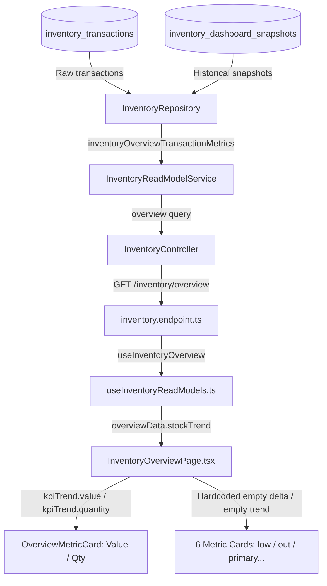

# Bản đồ Luồng Dữ liệu Lịch sử Kho Vật tư (Inventory Historical Data Flow)

Tài liệu này đặc tả chi tiết sơ đồ truyền dẫn dữ liệu (data lineage) của biểu đồ lịch sử và các thẻ chỉ số trên trang **Tổng quan kho**, phân tích các liên kết hoạt động và các điểm đứt gãy khiến dữ liệu bị trống.

---

## 1. Sơ đồ Kiến trúc Luồng Dữ liệu Tổng quát



---

## 2. Chi tiết Luồng Dữ liệu của Từng Nhóm Biểu đồ

### A. Luồng Dữ liệu Hoạt động (Tổng giá trị & Tổng khối lượng tồn kho)
Đây là luồng dữ liệu chuẩn từ database lên giao diện, thể hiện đầy đủ 4 điểm dữ liệu lịch sử thực tế:

1. **Database Truth**: 
   * Bảng `inventory_dashboard_snapshots` lưu giữ trạng thái tổng thể mỗi ngày (MAIN và PRODUCTION).
2. **Repository Layer**:
   * Lệnh `this.prisma.inventoryDashboardSnapshot.groupBy` nhóm dữ liệu theo ngày `snapshotDate` và tính tổng cột `inventoryValue` và `totalStock`.
3. **Read Model Layer (`InventoryReadModelService.overview`)**:
   * Gom các bản ghi snapshot nhận được thành mảng `stockTrend`.
   * So sánh phần tử cuối cùng với ngày hiện tại (hôm nay). Nếu hôm nay chưa có snapshot, tự động lấy dữ liệu realtime từ `InventoryMaterialSnapshot` ghép thêm vào cuối mảng để tạo điểm realtime hôm nay.
4. **API Endpoint (`GET /inventory/overview`)**:
   * Trả về payload chứa `stockTrend: Array<{ date: Date, value: number, quantity: number }>`
5. **Frontend Binding (`InventoryOverviewPage.tsx`)**:
   * Hook `useInventoryOverview` nạp dữ liệu.
   * `kpiTrend.value` và `kpiTrend.quantity` nhận mảng các giá trị tương ứng.
   * `kpiDeltas.value` và `kpiDeltas.quantity` tính toán delta thông qua hàm helper `deltaText()` (Ví dụ: `▲5.203,5 tấn (+48,3%)`).
   * Các thẻ `Tổng giá trị tồn kho` và `Tổng khối lượng` vẽ biểu đồ sparkline bình thường và hiển thị delta note đầy đủ.

### B. Luồng Dữ liệu Đứt gãy (Mã vật tư, Sắp hết, Hết hàng, Nhóm nghiệp vụ)
Dưới đây là các điểm nghẽn khiến 6 thẻ chỉ số này không thể hiển thị dữ liệu lịch sử:

```
[Bảng inventory_dashboard_snapshots]
       │
       ├─► (Có cột totalMaterials & lowStockCount nhưng Repository groupBy KHÔNG LẤY) ──► [Đứt gãy tại Repository]
       │
       ├─► (Hoàn toàn KHÔNG CÓ cột outOfStockCount & phân loại Primary/Secondary/Consumable) ──► [Đứt gãy tại Schema]
       │
                                                                                                    │
[FE: InventoryOverviewPage.tsx] ◄─── (Bypass bằng hardcode dòng 610) ◄─── (API không trả về xu hướng) ◄─────┘
```

1. **Đứt gãy tại Database Schema**:
   * Bảng `inventory_dashboard_snapshots` hoàn toàn không có trường lưu trữ lịch sử cho số lượng hết hàng (`outOfStockCount`), hoặc phân loại khối lượng/mã theo loại vật tư nghiệp vụ (`PRIMARY`, `SECONDARY`, `CONSUMABLE`).
2. **Đứt gãy tại Repository**:
   * Mặc dù bảng `inventory_dashboard_snapshots` có cột `totalMaterials` và `lowStockCount`, hàm `inventoryOverviewTransactionMetrics()` trong `InventoryRepository` chỉ thực hiện `groupBy` và lấy tổng cho `inventoryValue` và `totalStock`.
3. **Đứt gãy tại Frontend**:
   * Tại [InventoryOverviewPage.tsx](file:///opt/projects/steeltrack/apps/frontend/src/modules/inventory/pages/tabs/InventoryOverviewPage.tsx#L610), do nhận thấy API backend không cung cấp dữ liệu xu hướng cho 6 chỉ số này, FE đã thực hiện gán trực tiếp mảng xu hướng rỗng `[]` và delta text là `"Chưa có dữ liệu lịch sử"`.
   * Việc này cô lập hoàn toàn khối mã tính toán cuộn ngược số dư (rollback) bằng cách duyệt qua 78 giao dịch trước đó ở client-side (vốn không an toàn và gây tải cao cho trình duyệt).

---

## 3. Bản đồ Ánh xạ endpoints & fields chi tiết

| Frontend Hook | API Endpoint | API Response Field | Frontend State Memo | Target Component | Trạng thái hiển thị |
| :--- | :--- | :--- | :--- | :--- | :--- |
| `useInventoryOverview` | `/inventory/overview` | `stockTrend` | `kpiTrend.value`, `kpiDeltas.value` | Thẻ KPI Tổng giá trị | **Đầy đủ dữ liệu** (4 điểm) |
| `useInventoryOverview` | `/inventory/overview` | `stockTrend` | `kpiTrend.quantity`, `kpiDeltas.quantity` | Thẻ KPI Tổng khối lượng | **Đầy đủ dữ liệu** (4 điểm) |
| `useInventoryOverview` | `/inventory/overview` | `stockTrend` | `valueTrend` | Sparkline Biến động tồn kho | **Đầy đủ dữ liệu** (4 điểm) |
| `useInventoryOverview` | `/inventory/overview` | Không có | `kpiTrend.items = []`, `kpiDeltas.items = "Chưa có..."` | Thẻ KPI Mã vật tư | **Trống (Chưa có dữ liệu...)** |
| `useInventoryOverview` | `/inventory/overview` | Không có | `kpiTrend.primary = []`, `kpiDeltas.primary = "Chưa có..."` | Thẻ KPI Vật tư chính | **Trống (Chưa có dữ liệu...)** |
| `useInventoryOverview` | `/inventory/overview` | Không có | `kpiTrend.secondary = []`, `kpiDeltas.secondary = "Chưa có..."` | Thẻ KPI Vật tư phụ | **Trống (Chưa có dữ liệu...)** |
| `useInventoryOverview` | `/inventory/overview` | Không có | `kpiTrend.consumable = []`, `kpiDeltas.consumable = "Chưa có..."` | Thẻ KPI Vật tư tiêu hao | **Trống (Chưa có dữ liệu...)** |
| `useInventoryOverview` | `/inventory/overview` | Không có | `kpiTrend.low = []`, `kpiDeltas.low = "Chưa có..."` | Thẻ KPI Sắp hết hàng | **Trống (Chưa có dữ liệu...)** |
| `useInventoryOverview` | `/inventory/overview` | Không có | `kpiTrend.out = []`, `kpiDeltas.out = "Chưa có..."` | Thẻ KPI Hết hàng | **Trống (Chưa có dữ liệu...)** |
